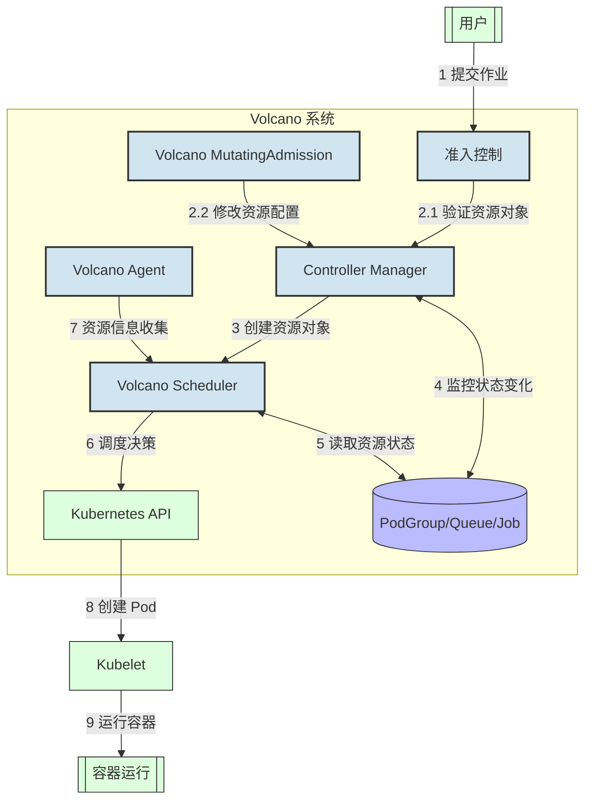
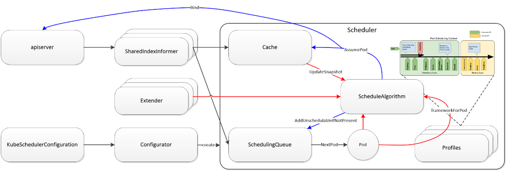
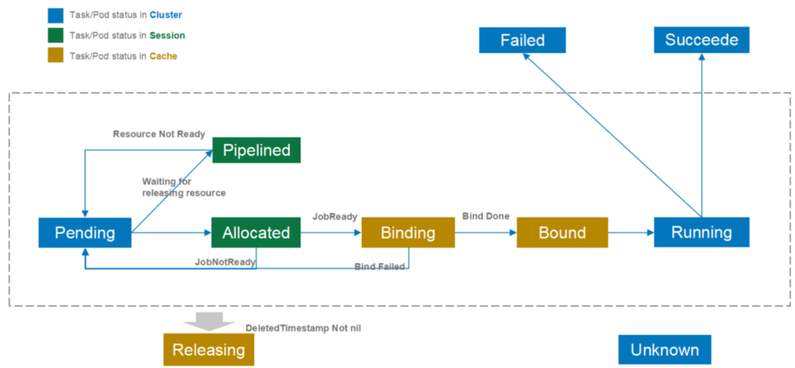
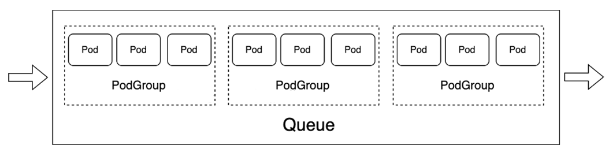

## 基本介绍

[Volcano](https://volcano.sh/zh/docs/) 是一个基于`Kubernetes`的批处理平台，提供了机器学习、深度学习、生物信息学、基因组学及其他大数据应用所需要而`Kubernetes`当前缺失的一系列特性，提供了高性能任务调度引擎、高性能异构芯片管理、高性能任务运行管理等通用计算能力。


相较于`Kubernetes`原生的调度器，`Volcano`具有的显著特点有：

- **支持 `Gang Scheduling`**

  对于批量作业的调度，容易碰到死锁的问题，比如两个作业都需要同时运行`10`个`Pod`才能启动，当两个作业同时提交时，可能都只有部分`Pod`被调度，两个作业都无法正常运行，而处于互相等待状态。`Gang Scheduling` 就是为了解决这个问题。

- **调度队列**

  配置不同的调度队列，能够实现对资源的抢占、配额的控制等。

- **硬件感知**

  `Numa`、`GPU`等硬件资源的感知，能够让`Pod`对硬件资源更高效的使用。

`Volcano`是在 `Kubernetes`原生调度能力的基础上进行的扩展和优化，因此，对于基本的 `nodeSelector`、`nodeAffinity`等也是支持的。同时也支持 `Extended Resource`，这点对于`GPU`、`IB`网卡等资源的在调度层面的感知非常重要。

`Volcano`是业界首个云原生批量计算项目，`2019`年由华为云捐献给云原生计算基金会（`CNCF`），也是`CNCF`首个和唯一的孵化级容器批量计算项目。它源自于华为云`AI`容器，在支撑华为云一站式`AI`开发平台`ModelArts`、容器服务`CCI`等服务稳定运行中发挥重要作用。
`Volcano`作为`CNCF`云原生计算基金会的沙箱项目，在国内众多知名企业得到了广泛应用，以下是部分知名企业应用案例：

- **华为云**：作为`Volcano`的初始开发者，华为在其云平台上采用`Volcano`管理`AI`训练和高性能计算工作负载。华为云的`CCE`和`CCI`产品以及容器批量计算解决方案都已应用`Volcano`。

- **百度**：百度飞桨团队与`Volcano`团队联合发布了"`PaddlePaddle on Volcano`"方案，用于提升飞桨框架的计算效率。百度利用`Volcano`解决了机器学习、深度学习、`HPC`和大数据计算等多个场景的问题。

- **360**：使用`Volcano`弥补了`Kubernetes`原生调度在机器学习、大数据计算任务上的能力缺失，通过丰富的调度插件解决不同场景下的任务调度问题，极大提升了集群整体利用率。

- **唯品会**：构建了基于`Volcano`的`AI`训练平台，利用队列动态资源共享、`gang-scheduling`等高阶调度能力，支持系统`10`多万核的节点调度，加速了业务创新步伐。

### 核心组件

`Volcano`由以下几个核心组件组成，各自承担不同的功能职责：

1. **`Volcano Controller Manager`**：负责管理`Volcano`自定义资源的生命周期，监控和处理`Job`、`Queue`、`PodGroup`等资源的状态变化。

2. **`Volcano Scheduler`**：实现高级调度功能，如`Gang Scheduling`（组调度）、队列调度和优先级调度，通过插件化架构提供灵活的调度策略配置。

3. **`Volcano Admission`**：验证`Volcano`资源对象的合法性，为资源对象设置默认值，实现准入控制，确保提交的作业符合系统策略。

4. **`Volcano MutatingAdmission`**：修改资源对象的配置，如添加标签、注解等，自动注入环境变量和配置信息。

5. **`Volcano Agent`**（可选组件）：在节点上收集资源使用情况和硬件信息，为调度器提供更精确的节点资源信息，支持`GPU`、`FPGA`等异构资源的管理。

### 组件交互关系

下图展示了`Volcano`各组件之间的交互关系及数据流向：



`Volcano`的各个组件之间通过清晰的职责划分和有效的协作实现了完整的调度系统：

1. **用户提交流程**：用户提交作业→`Admission`验证 →`Controller`处理 →`Scheduler`调度 →`Kubelet`执行

2. **状态监控与管理**：
   - `Controller Manager`监控所有`Volcano`自定义资源的状态变化
   - 根据资源状态变化，触发相应的事件处理
   - 当需要重调度或清理资源时，通知`Scheduler`进行相应操作

3. **调度决策过程**：
   - `Scheduler`根据`Queue`配置和系统状态，为`PodGroup`分配资源
   - 通过插件化架构，实现不同的调度策略和算法
   - 支持`Gang Scheduling`，确保相关联的`Pod`要么全部调度成功，要么全部失败

4. **资源信息收集**：
   - `Agent`(如果启用) 提供节点资源信息，辅助调度决策
   - 特别是对于`GPU`、`FPGA`等异构资源，提供更精确的资源状态

5. **资源对象之间的关系**：
   - `Job`包含多个`Task`，每个`Task`对应一组相同角色的`Pod`
   - `PodGroup`作为调度的基本单位，表示一组需要同时调度的`Pod`
   - `Queue`容纳多个`PodGroup`，并控制这些`PodGroup`的资源分配和调度策略

这种组件化设计使`Volcano`能够灵活应对不同的工作负载需求，并且可以通过扩展插件来增强系统能力。

## Scheduler

### Kubernetes Scheduler
`kubernetes`当然有默认的`pod`调度器，但是其并不适应`AI`作业任务需求。在多机训练任务中，一个`AI`作业可能需要同时创建数十个甚至数百个`pod`，而只有当所有`pod`当创建完成后，`AI`作业才能开始运行，而如果有几个`pod`创建失败，已经创建成功的`pod`就应该退出并释放资源，否则便会产生资源浪费的情况。因此`AI`作业的`pod`调度应该遵循`All or nothing`的理念，即要不全部调度成功，否则应一个也不调度。这便是`Volcano`项目的由来（前身是`kube-batch`项目），接下来便来介绍`Volcano`的调度。




### Volcano Scheduler

值得注意的是，原生 `Kubernetes` 调度器（`kube-scheduler`）没有内置提供完整的 `Gang Scheduling`（组调度）能力。`Gang Scheduling` 是指将一组相关的任务作为一个整体进行调度，要么全部调度成功，要么全部不调度。

`Kubernetes` 默认调度器主要关注单个 `Pod` 的调度，它会逐个处理 `Pod`，而不会考虑 `Pod` 之间的相互依赖关系或者需要同时调度的需求。这种设计对于无状态应用和独立工作负载很有效，但对于需要多个 `Pod` 协同工作的场景（如分布式机器学习、大数据处理等）就显得不足。

`Volcano` 通过实现 `Gang Scheduling` 能力，确保一组相关的 `Pod` 要么全部被调度成功，要么全部不被调度，避免资源浪费和死锁情况。这是 `Volcano` 相对于原生 `Kubernetes` 调度器的一个关键优势。


`Volcano Scheduler`是负责`Pod`调度的组件，它由一系列`action`和`plugin`组成。`action`定义了调度各环节中需要执行的动作；`plugin`根据不同场景提供了`action`中算法的具体实现细节。`Volcano Scheduler`具有高度的可扩展性，您可以根据需要实现自己的`action`和`plugin`。


`Volcano Scheduler`的工作流程如下：

1.  客户端提交的`Job`被调度器识别到并缓存起来。
2.  周期性开启会话（`Session`），一个调度周期开始。
3.  将没有被调度的`Job`发送到会话的待调度队列中。
4.  遍历所有的待调度`Job`，按照定义的次序依次执行`enqueue`、`allocate`、`preempt`、`reclaim`、`backfill`等动作，为每个`Job`找到一个最合适的节点。将该`Job`绑定到这个节点。`action`中执行的具体算法逻辑取决于注册的`plugin`中各函数的实现。
5.  关闭本次会话。

具体流程、`Actions`和`Plugins`介绍请参考：
- https://volcano.sh/zh/docs/schduler_introduction
- https://volcano.sh/zh/docs/actions
- https://volcano.sh/zh/docs/plugins


### Task/Pod状态转换




`Volcano`在`Kubernetes`原生`Pod`状态的基础上，增加了更多的状态来优化调度性能。这些状态可以分为三类：

1. **Kubernetes原生状态**（图中蓝色部分）
   - 包括`Pending`、`Running`、`Succeeded`、`Failed`等
   - 这些状态由`Kubernetes`系统维护，持久化存储在`etcd`中

2. **调度会话状态**（图中绿色部分）
   - 这些状态只在调度周期内有效
   - 当`Volcano Scheduler`开始一个新的调度周期时，会创建一个新的会话（`session`）
   - 会话结束后，这些状态就会失效
   - 主要用于优化调度过程中的临时状态管理

3. **缓存状态**（图中黄色部分）
   - 这些状态存储在`Volcano`调度器的缓存中
   - 用于减少与`Kubernetes API Server`的通信次数
   - 提高调度性能

这些额外的状态设计带来以下好处：

1. **性能优化**：
   - 减少与`Kubernetes API Server`的通信
   - 降低调度延迟
   - 提高调度效率

2. **更精细的调度控制**：
   - 可以根据不同状态采取不同的调度策略
   - 例如，驱逐`Binding`或`Bound`状态的`Pod`比驱逐`Running`状态的`Pod`代价更小

3. **状态管理优化**：
   - 通过缓存机制减少状态同步开销
   - 提高系统整体性能

需要注意的是，目前`Volcano`调度器对某些状态的使用还比较保守。例如，在`preemption`（抢占）和`reclaim`（回收）操作中，只会驱逐`Running`状态的`Pod`。这是因为在分布式系统中，完全的状态同步比较困难，如果处理`Binding`和`Bound`状态的`Pod`，可能会遇到状态竞争问题。

## Volcano自定义资源


* `Queue`：容纳一组`PodGroup`的队列，也是该组`PodGroup`获取集群资源的划分依据。它允许用户根据业务需求或优先级，将作业分组到不同的队列中。
  

*  `Volcano Job`(`vcjob`）：`Volcano`自定义的`Job`资源类型，它扩展了`Kubernetes`的`Job`资源。区别于`Kubernetes Job`，`vcjob`提供了更多高级功能，如可指定调度器、支持最小运行`Pod`数、支持`task`、支持生命周期管理、支持指定队列、支持优先级调度等。`Volcano Job`更加适用于机器学习、大数据、科学计算等高性能计算场景。

* `PodGroup`：`Pod`组是`Volcano`自定义资源类型，代表一组强关联`Pod`的集合，主要用于批处理工作负载场景，比如`Tensorflow`中的一组`ps`和`worker`。这主要解决了`Kubernetes`原生调度器中单个`Pod`调度的限制。


### Queue 资源队列

`Queue`是`Volcano`调度系统中的核心概念，用于管理和分配集群资源。
它充当了**资源池**的角色，允许管理员将集群资源划分给不同的用户组或应用场景。该自定义资源可以很好地用于多租户场景下的资源隔离。


#### Queue 的作用

1. **资源隔离与划分**
   - 将集群资源划分给不同的用户组或业务线
   - 防止一个应用或用户组消耗过多资源影响其他应用

2. **资源配额与限制**
   - 为队列设置资源上限（`capability`）
   - 控制队列可以使用的最大`CPU`、内存、`GPU`等资源量

3. **优先级和权重管理**
   - 通过`weight`属性设置队列的相对重要性
   - 当资源竞争时，根据权重比例分配资源

4. **资源回收策略**
   - 通过`reclaimable`属性控制队列资源是否可被回收（被其他队列借用）
   - 当集群资源紧张时，决定哪些队列的资源可以被抢占

#### Queue 配置示例

下面是一个定义三个不同队列的示例，分别用于生产、开发和测试环境：

```yaml
apiVersion: scheduling.volcano.sh/v1beta1
kind: Queue
metadata:
  name: production
spec:
  weight: 10       # 高权重，资源竞争时获得更多资源
  reclaimable: false  # 资源不可被回收
  capability:
    cpu: 100       # 最多使用 100 核 CPU
    memory: 500Gi  # 最多使用 500Gi 内存
    nvidia.com/gpu: 10  # 最多使用 10 个 GPU

---

apiVersion: scheduling.volcano.sh/v1beta1
kind: Queue
metadata:
  name: development
spec:
  weight: 5         # 中等权重
  reclaimable: true # 资源可被回收
  capability:
    cpu: 50        # 最多使用 50 核 CPU
    memory: 200Gi  # 最多使用 200Gi 内存

---

apiVersion: scheduling.volcano.sh/v1beta1
kind: Queue
metadata:
  name: testing
spec:
  weight: 2         # 低权重
  reclaimable: true # 资源可被回收
  capability:
    cpu: 20        # 最多使用 20 核 CPU
    memory: 100Gi  # 最多使用 100Gi 内存
```

#### 使用 Queue 的方法

1. **在 Pod 中指定队列**

   通过注解指定：
   ```yaml
   metadata:
     annotations:
      volcano.sh/queue-name: "production"
   ```

2. **在 PodGroup 中指定队列**

   直接在`spec`中指定：
   ```yaml
   apiVersion: scheduling.volcano.sh/v1beta1
   kind: PodGroup
   metadata:
     name: ml-training
   spec:
     minMember: 5
     queue: production  # 指定使用 production 队列
   ```

3. **在 Job 中指定队列**

   ```yaml
   apiVersion: batch.volcano.sh/v1alpha1
   kind: Job
   metadata:
     name: tensorflow-training
   spec:
     minAvailable: 3
     schedulerName: volcano
     queue: production  # 指定使用 production 队列
   ```

#### Queue 的实际应用场景

1. **多租户环境**
   - 为不同部门或团队创建独立队列
   - 确保每个部门都有公平的资源分配

2. **优先级划分**
   - 为关键业务创建高权重队列
   - 为非关键任务创建可回收队列

3. **资源限制**
   - 防止单个应用消耗过多集群资源
   - 为不同类型的工作负载设置适当的资源上限

`Queue`机制是`Volcano`实现多租户资源管理和公平调度的关键组件，它使得集群管理员可以更精细地控制资源分配策略，提高集群资源利用率和用户满意度。


### Job 资源任务

`Volcano Job`（简称 `vcjob`）是 `Volcano` 提供的一种高级作业资源类型，扩展了 `Kubernetes` 原生的 `Job` 资源，为高性能计算和批处理场景提供了更丰富的功能。


#### Job 的作用

1. **多任务类型支持**
   - 支持在一个作业中定义多种不同类型的任务（`task`）
   - 每种任务类型可以有不同的镜像、资源需求和副本数

2. **生命周期管理**
   - 支持在作业生命周期的不同阶段执行特定命令
   - 包括启动前、运行中、完成后等阶段

3. **高级调度策略**
   - 支持指定最小可用数量（`minAvailable`）
   - 支持指定队列、优先级和调度策略

4. **容错和恢复机制**
   - 提供多种重启策略（`RestartPolicy`）
   - 支持在任务失败时的不同处理方式

#### Volcano Job 配置示例

下面是一个`TensorFlow`分布式训练任务的`Volcano Job`配置示例：

```yaml
apiVersion: batch.volcano.sh/v1alpha1
kind: Job
metadata:
  name: tensorflow-training
spec:
  minAvailable: 3
  schedulerName: volcano
  queue: ml-jobs
  policies:
  - event: PodEvicted
    action: RestartJob
  - event: PodFailed
    action: RestartJob
  tasks:
  - replicas: 1
    name: ps
    template:
      spec:
        containers:
        - image: tensorflow/tensorflow:latest
          name: tensorflow
          command: ["python", "/app/ps.py"]
          resources:
            requests:
              cpu: 2
              memory: 4Gi
  - replicas: 2
    name: worker
    template:
      spec:
        containers:
        - image: tensorflow/tensorflow:latest-gpu
          name: tensorflow
          command: ["python", "/app/worker.py"]
          resources:
            requests:
              cpu: 4
              memory: 8Gi
              nvidia.com/gpu: 2
```

#### Volcano Job 的特性

1. **多任务类型**
   - 在上面的示例中，定义了两种任务类型：`ps`（参数服务器）和 `worker`（工作节点）
   - 每种类型有不同的副本数和资源需求

2. **事件处理策略**
   - 定义了当 `Pod` 被驱逐或失败时重启整个作业的策略
   - 可以根据不同事件类型执行不同的操作

3. **队列和调度器指定**
   - 指定使用 `volcano` 调度器和 `ml-jobs` 队列
   - 确保作业在正确的资源池中运行

#### Volcano Job 的实际应用场景

1. **分布式机器学习**
   - `TensorFlow`、`PyTorch` 等分布式训练任务
   - 支持参数服务器和工作节点的协调调度

2. **大数据处理**
   - `Spark`、`Flink` 等大数据处理框架
   - 支持`Master`和`Worker`节点的组织管理

3. **MPI 并行计算**
   - 高性能计算和科学模拟
   - 支持多节点协同计算

`Volcano Job` 为复杂的分布式工作负载提供了完整的生命周期管理和调度能力，是 `Volcano` 系统中最强大的资源类型之一。


### PodGroup 资源组

`PodGroup` 是 `Volcano` 中实现`Gang Scheduling`的核心资源对象，它将一组相关的 `Pod` 视为一个整体进行调度。


#### PodGroup 的作用

1. **整体调度**
   - 确保一组相关的 `Pod` 要么全部调度成功，要么全部不调度
   - 防止部分 `Pod` 调度成功而其他失败导致资源浪费

2. **资源预留**
   - 可以为 `PodGroup` 设置最小成员数（`minMember`）
   - 当可用资源不足以调度最小成员数时，整个组将等待而不是部分调度

3. **状态跟踪**
   - 提供 `PodGroup` 的整体状态信息
   - 包括已调度数量、运行状态等

#### PodGroup 配置示例

下面是一个基本的 `PodGroup` 定义示例：

```yaml
apiVersion: scheduling.volcano.sh/v1beta1
kind: PodGroup
metadata:
  name: tf-training-group
spec:
  minMember: 4    # 最小需要 4 个 Pod 同时调度
  queue: ml-jobs  # 指定队列
  priorityClassName: high-priority  # 指定优先级
  minResources:  # 最小资源需求
    cpu: 8
    memory: 16Gi
    nvidia.com/gpu: 2
```

#### 使用 PodGroup 的方法

1. **直接创建 PodGroup 资源**

   先创建 `PodGroup`，然后在 `Pod` 中引用它：
   ```yaml
   apiVersion: v1
   kind: Pod
   metadata:
     name: tf-worker-1
     annotations:
       volcano.sh/pod-group: "tf-training-group"  # 引用 PodGroup 名称
   spec:
     schedulerName: volcano  # 使用 Volcano 调度器
     containers:
     - name: tensorflow
       image: tensorflow/tensorflow:latest-gpu
   ```

2. **通过 Volcano Job 自动创建**

   `Volcano Job` 会自动创建并管理 `PodGroup`：
   ```yaml
   apiVersion: batch.volcano.sh/v1alpha1
   kind: Job
   metadata:
     name: tensorflow-training
   spec:
     minAvailable: 4
     schedulerName: volcano
     queue: ml-jobs
   ```

#### PodGroup 的实际应用场景

1. **分布式机器学习**
   - 确保参数服务器和工作节点同时启动
   - 避免资源浪费和训练任务失败

2. **大数据处理**
   - 确保`Spark`或`Flink`集群的所有组件同时启动
   - 提高数据处理效率

3. **高性能计算**
   - 为`MPI`等高性能计算任务提供同步启动能力
   - 确保计算节点的一致性

`PodGroup` 是 `Volcano` 实现`Gang Scheduling`的基础，它使得复杂的分布式工作负载可以更可靠地运行在 `Kubernetes` 集群上。


## 参考资料
- https://volcano.sh/
- https://ericam.top/posts/understand-volcano-scheduler-from-zero/