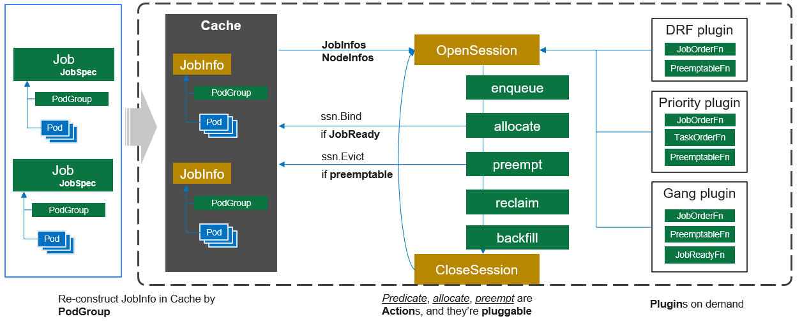
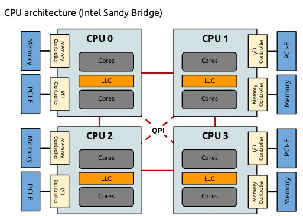

`Volcano`调度器是一个为高性能计算、机器学习和批处理工作负载设计的`Kubernetes`调度器。它的核心功能之一是通过可插拔的`Actions`和`Plugins`机制来实现灵活的调度策略。本文将详细地介绍这些机制，帮助你更好地理解和使用`Volcano`调度器。



## 调度器配置示例

以下是一个典型的`Volcano`调度器配置示例：

```yaml
actions: "enqueue,allocate,backfill,preempt,reclaim"
tiers:
- plugins:
  - name: priority
  - name: gang
  - name: conformance
- plugins:
  - name: drf
  - name: predicates
  - name: proportion
  - name: resourcequota
  - name: nodeorder
  - name: binpack
```

这个配置定义了调度器的工作流程（`Actions`）和决策机制（`Plugins`）。


### 多层级(tiers)数组结构

为什么使用多层级(`tiers`)数组结构来配置`Plugins`？

1. **优先级分层执行**：
   - 不同层级（`tier`）的插件有着严格的优先级顺序
   - 高层级（第一个数组）中的插件会先执行，其决策结果会影响或限制低层级插件的决策空间
   - 只有当高层级的所有插件都允许一个调度决策时，才会继续执行低层级的插件

2. **决策流程的过滤机制**：
   - 第一层级的插件（如 `priority`、`gang`、`conformance`）主要负责基本的筛选和约束
   - 第二层级的插件（如 `drf`、`predicates`、`proportion` 等）负责更细粒度的资源分配和优化
   - 这种分层设计形成了一种"**粗筛-细筛**"的决策流水线

3. **解决冲突的明确机制**：
   - 当不同插件之间可能产生冲突决策时，层级结构提供了明确的优先级规则
   - 例如，如果 `gang` 插件（第一层）决定某个任务不能被调度（因为它的所有成员无法同时运行），那么即使 `binpack` 插件（第二层）认为该任务可以被有效打包，该任务也不会被调度

### 与单一数组相比的优势

如果所有插件都放在一个扁平的数组中，调度器将面临以下问题：

1. **无法表达优先级关系**：
   - 所有插件将被视为同等重要，难以表达某些基本约束（如成组调度）应该优先于优化决策（如资源打包）
   
2. **决策冲突难以解决**：
   - 没有明确的机制来解决插件之间的冲突，可能导致不一致或不可预测的调度行为
   
3. **调度效率降低**：
   - 分层执行允许在早期阶段快速过滤掉不符合基本条件的调度决策，避免不必要的计算

### Actions配置顺序的重要性

`Volcano`中的`actions`顺序配置非常重要，因为它决定了调度器执行各种调度操作的顺序，这直接影响调度决策和性能。

`actions`的执行是按照配置中指定的顺序依次进行的，不同的顺序配置会产生以下影响：

1. **效率影响**：
   - 如果将`backfill`放在`allocate`之前，可能会导致资源碎片化，降低整体资源利用率
   - 如果将`preempt`放在最前面，可能会导致过度抢占，增加系统波动

2. **公平性影响**：
   - 如果将资源公平相关的`action`放在较后位置，可能会影响资源分配的公平性

3. **性能影响**：
   - 某些`action`计算复杂度较高，如果频繁执行可能会影响调度器性能
   - 合理的顺序可以减少不必要的计算和资源重分配

推荐的顺序通常是：`enqueue,allocate,backfill,preempt,reclaim`。这个顺序确保了：
1. 首先将任务入队(`enqueue`)
2. 然后尝试正常分配资源(`allocate`)
3. 接着利用剩余资源(`backfill`)
4. 如果仍有高优先级任务未得到满足，考虑抢占(`preempt`)
5. 最后尝试回收利用率低的资源(`reclaim`)

在特定场景下，您可能需要根据工作负载特点调整顺序。例如，在高优先级任务较多的环境中，可能希望提前执行`preempt`；在资源紧张的环境中，可能希望提前执行`reclaim`。

## Volcano 中的 Actions

`Actions`定义了调度器的工作流程和执行顺序。
在上面的配置中，我们定义了五个动作：`enqueue`、`allocate`、`backfill`、`preempt`和`reclaim`。这些动作将按照定义的顺序执行。

让我们逐一解释各个动作的作用：

### 1. enqueue（入队）

**作用**：将新提交的任务放入调度队列，并检查任务是否满足调度条件。

**工作原理**：
- 检查`PodGroup`是否满足最小成员数要求
- 检查队列是否有足够的配额
- 将符合条件的任务标记为“可调度”状态

**示例**：当一个要求至少三个`Pod`同时运行的`TensorFlow`训练任务被提交时，`enqueue`动作会检查是否有足够的资源来运行这些`Pod`，如果有，则将其标记为可调度。


**注意**：`enqueue action` 是不可省略的核心组件，原因如下：

1. **调度流程的入口点**：
- `enqueue`是整个调度流程的第一步，负责将任务从"未调度"状态转移到"可调度"状态
- 如果没有`enqueue`，新提交的任务将无法进入调度队列，调度器将无法感知这些任务的存在

2. **基础验证机制**：
- `enqueue` 执行关键的前置检查，如验证`PodGroup`是否满足最小成员数要求
- 它确保只有满足基本条件的任务才能进入调度流程，避免无效调度

3. **默认配置的一部分**：
- 在 `Volcano` 的默认配置中，`enqueue`总是作为第一个 `action`存在
- 即使在自定义配置中不显式指定，系统也会使用内置的`enqueue`逻辑


### 2. allocate（分配）

**作用**：为队列中的任务分配资源，并将它们调度到合适的节点上。

**工作原理**：
- 根据队列权重和任务优先级对任务进行排序
- 使用插件对任务进行过滤和打分
- 为符合条件的任务分配资源并绑定到节点

**示例**：当多个队列中有多个任务时，`allocate`动作会首先将资源分配给高权重队列中的高优先级任务，然后再考虑低权重队列中的任务。


**注意**：在 `Volcano` 调度器中，`allocate` `action`也是**不可省略**的核心组件，原因如下：

1. **核心调度功能的实现者**：
   - `allocate` 是实际执行资源分配和`Pod`绑定的关键`action`
   - 它负责将已入队的任务分配到具体的节点上，是调度过程的核心步骤
   - 如果没有 `allocate`，任务会停留在队列中而不会被实际调度执行

2. **调度决策的执行者**：
   - 虽然其他`actions`（如`backfill`、`preempt`）也可以执行调度，但它们都是针对特殊场景的补充
   - `allocate` 处理常规的资源分配，是最基本的调度机制
   - 其他`actions`通常在`allocate`无法满足需求时才会被触发

3. **插件系统的主要应用点**：
   - 大多数调度插件（如`drf`、`predicates`、`nodeorder`等）主要在`allocate`阶段发挥作用
   - 这些插件通过过滤和打分机制帮助`allocate`做出最优的调度决策

4. **调度流程的核心环节**：
   - 在典型的调度流程中，`enqueue`将任务放入队列，而`allocate`则负责实际分配资源
   - 这两个`action`构成了调度的基本闭环，缺一不可


### 3. backfill（回填）

**作用**：利用集群中的空闲资源来运行小型或低优先级的任务，提高资源利用率。

**工作原理**：
- 在主要的资源分配完成后执行
- 寻找集群中的碎片资源（小块未使用的资源）
- 将这些资源分配给可以快速完成的小任务

**示例**：当集群中有一些节点只剩下少量的CPU和内存时，这些资源可能不足以运行大型任务，但`backfill`动作可以将这些资源分配给小型的批处理任务。

### 4. preempt（抢占）

**作用**：当高优先级任务无法获得足够资源时，从低优先级任务中抢占资源。

**工作原理**：
- 识别高优先级但无法调度的任务
- 查找可以被抢占的低优先级任务
- 终止被选中的低优先级任务，释放其资源
- 将释放的资源分配给高优先级任务

**示例**：当一个生产环境的关键任务（高优先级）需要运行，但集群资源已被开发环境的任务（低优先级）占用时，`preempt`动作会终止部分开发环境的任务，将资源让给生产环境的关键任务。

### 5. reclaim（回收）

**作用**：从超出其公平份额的队列中回收资源，并将其重新分配给其他队列。

**工作原理**：
- 计算每个队列的公平份额和实际使用情况
- 识别超额使用资源的队列
- 从这些队列中选择可回收的任务
- 终止这些任务以释放资源

**示例**：当集群中有多个队列，每个队列都有权重设置（如生产队列权重为`60%`，开发队列为`30%`，测试队列为`10%`）。如果开发队列使用了超过`50%`的集群资源，而生产队列需要更多资源时，`reclaim`动作会从开发队列中回收资源。


## Volcano 中的 Plugins

`Plugins`是`Volcano`调度器的决策模块，它们在不同的调度阶段提供特定的功能。
在上面的配置中，插件被组织成两个层级（`tiers`），每个层级包含多个插件。
层级的概念允许插件按照优先级顺序执行，高层级的插件优先级高于低层级的插件。

让我们逐一解释这些插件的作用：


### 1. priority（优先级）

**作用**：根据任务的优先级对其进行排序，确保高优先级任务先被调度。


**工作原理**：
- 读取任务的`PriorityClass`或优先级注解
- 根据优先级值对任务进行排序
- 高优先级任务在资源分配时会被优先考虑

**示例**：
```yaml
apiVersion: scheduling.k8s.io/v1
kind: PriorityClass
metadata:
  name: high-priority
value: 1000000
globalDefault: false
description: "This priority class is used for critical production jobs"
---
apiVersion: batch.volcano.sh/v1alpha1
kind: Job
metadata:
  name: critical-job
spec:
  priorityClassName: high-priority
  # 其他配置...
```

这个配置将使`critical-job`获得高优先级，在资源竞争时优先被调度。

### 2. gang（成组）

**作用**：实现成组调度，确保任务的所有成员（Pod）可以同时运行。

**工作原理**：
- 读取任务的`minAvailable`设置
- 检查是否有足够的资源来运行最小所需的Pod数量
- 只有当所有必要的`Pod`都能被调度时，才会进行调度

**示例**：
```yaml
apiVersion: batch.volcano.sh/v1alpha1
kind: Job
metadata:
  name: distributed-training
spec:
  minAvailable: 4
  tasks:
    - replicas: 1
      name: ps
      template: # Pod模板...
    - replicas: 3
      name: worker
      template: # Pod模板...
```

这个配置要求至少`4`个`Pod`（1个ps和3个worker）同时可用才会开始调度。这对于分布式训练等需要多个组件协同工作的任务非常重要。

### 3. conformance（一致性）

> 官网介绍链接：[https://volcano.sh/en/docs/schduler_introduction/#conformance](https://volcano.sh/en/docs/schduler_introduction/#conformance)

**作用**：`conformance`插件就像`Kubernetes`的"规则检查员"，确保`Volcano`的调度决策符合`Kubernetes`的标准和约定。

**工作原理**：
- 检查`Pod`的配置是否符合`Kubernetes`的规则（比如不能设置无效的资源请求）
- 验证调度决策不会违反`Kubernetes`的基本原则（比如不会将`Pod`调度到资源不足的节点）
- 确保`Volcano`的行为与标准`Kubernetes`调度器保持一致，避免冲突

**示例**：
假设有一个任务请求了以下资源：
```yaml
apiVersion: batch.volcano.sh/v1alpha1
kind: Job
metadata:
  name: example-job
spec:
  tasks:
    - replicas: 2
      name: example-task
      template:
        spec:
          containers:
            - name: main-container
              image: nginx
              resources:
                requests:
                  memory: "2Gi"
                  cpu: "500m"
```

`conformance`插件会执行以下检查：
1. 验证资源请求格式是否正确（如"`500m`" `CPU`是有效格式）
2. 确保`Pod`不会被调度到无法满足`2GB`内存和`0.5CPU`需求的节点上
3. 如果该`Pod`有特殊的调度约束（如污点容忍），确保这些约束被正确处理

如果`Volcano`尝试做出不符合`Kubernetes`规则的调度决策（例如，将`Pod`调度到资源已满的节点），`conformance`插件会阻止这种行为，确保系统稳定性和一致性。

这个插件对用户来说是"无形"的，它在后台默默工作，确保所有调度决策都符合`Kubernetes`的标准，不需要用户进行特殊配置。


**是否可以不使用`conformance`插件？**

从技术上讲，可以不使用`conformance`插件，因为`Volcano`允许用户自定义启用哪些插件。但这样做会带来一些潜在风险：

- **调度不一致性**：没有`conformance`插件，`Volcano`可能会做出与`Kubernetes`标准不兼容的调度决策，导致系统行为不可预测。
- **资源冲突**：可能会出现资源分配冲突，例如`Pod`被调度到不满足其资源需求的节点上。
- **API兼容性问题**：可能会接受一些不符合`Kubernetes` API约定的配置，导致后续操作失败。
- **系统稳定性降低**：`conformance`插件是`Volcano`的核心插件之一，它确保调度系统的基础稳定性。禁用它可能会导致一些难以排查的问题。

在`Volcano`的默认配置中，`conformance`通常是作为必要插件启用的。如果您有特殊的调度需求，建议保留`conformance`插件，同时通过配置其他插件来满足您的特定需求，而不是禁用这个基础的一致性保障机制。

### 4. drf（主导资源公平性）


**作用**：实现主导资源公平性（`Dominant Resource Fairness`）算法，确保资源在不同队列和任务之间公平分配。


**工作原理**：
- 计算每个任务的主导资源（即任务所需的最多的资源类型）
- 根据主导资源的使用比例对任务进行排序
- 确保所有用户或队列都能获得公平的资源份额

**示例**：

假设集群中有两个队列（A和B）和两种资源（CPU和内存），总资源为`100`个CPU核心和`200`GB内存。

队列A中的任务主要需要CPU资源：
```yaml
apiVersion: batch.volcano.sh/v1alpha1
kind: Job
metadata:
  name: cpu-intensive-job
  namespace: queue-a
spec:
  tasks:
    - replicas: 4
      name: cpu-task
      template:
        spec:
          containers:
            - name: cpu-container
              image: cpu-workload:latest
              resources:
                requests:
                  cpu: "10"    # 每个Pod请求10个CPU核心
                  memory: "5Gi"  # 每个Pod请求5GB内存
```

队列B中的任务主要需要内存资源：
```yaml
apiVersion: batch.volcano.sh/v1alpha1
kind: Job
metadata:
  name: memory-intensive-job
  namespace: queue-b
spec:
  tasks:
    - replicas: 4
      name: memory-task
      template:
        spec:
          containers:
            - name: memory-container
              image: memory-workload:latest
              resources:
                requests:
                  cpu: "2"     # 每个Pod请求2个CPU核心
                  memory: "20Gi" # 每个Pod请求20GB内存
```

**DRF如何工作**：

1. **计算主导资源**：
   - 队列A：CPU是主导资源（每个Pod需要`10%`的集群CPU和`2.5%`的集群内存）
   - 队列B：内存是主导资源（每个Pod需要`2%`的集群CPU和`10%`的集群内存）

2. **公平分配**：
   - 如果没有DRF，调度器可能会简单地平均分配资源（每个队列各获`50%`的CPU和`50%`的内存）。
     这种分配方式会导致队列A的CPU密集型任务只能使用一半的CPU资源，而队列B却无法充分利用其分配到的CPU资源，造成资源浪费
   - 使用DRF后，调度器会考虑每个队列的主导资源需求
   - 例如，队列A可能获得`60%`的CPU和`30%`的内存，队列B获得`40%`的CPU和`70%`的内存

3. **实际效果**：
   - 队列A可以运行4个Pod（使用`40`个CPU和`20`GB内存）
   - 队列B可以运行4个Pod（使用`8`个CPU和`80`GB内存）
   - 总体资源利用率更高，且两个队列都能公平地获得其主导资源的份额

这种分配方式比简单地平均分配每种资源更加公平和高效，因为它考虑了不同任务的资源需求特点。

**是否可以不使用`DRF`插件？**

从技术上讲，可以不使用`DRF`插件，因为`Volcano`允许用户自定义启用哪些插件。
但在以下场景中，`DRF`插件几乎是必不可少的：

- **多队列环境**：当集群中有多个队列竞争资源时
- **异构工作负载**：当不同队列的任务有显著不同的资源需求特点（如CPU密集型与内存密集型）
- **资源紧张场景**：当集群资源紧张，需要更公平高效的资源分配时

如果您的集群资源充足，或者只有单一队列，或者所有任务的资源需求特点相似，那么可能不需要`DRF`插件。
但在大多数生产环境中，`DRF`插件提供的公平性保障是非常有价值的。

### 5. predicates（断言）

**作用**：检查节点是否满足运行特定任务的条件，类似于标准`Kubernetes`调度器的断言。

**工作原理**：
- 检查节点资源是否满足任务需求
- 检查节点是否满足任务的亲和性、反亲和性要求
- 检查节点标签是否符合任务要求

**示例**：
```yaml
apiVersion: batch.volcano.sh/v1alpha1
kind: Job
metadata:
  name: gpu-job
spec:
  tasks:
    - replicas: 2
      name: gpu-task
      template:
        spec:
          nodeSelector:
            gpu: "true"
          containers:
            - name: gpu-container
              image: nvidia/cuda:latest
              resources:
                limits:
                  nvidia.com/gpu: 1
```

这个配置要求任务只能运行在标记为`gpu=true`的节点上，并且需要GPU资源。`predicates`插件会确保只有满足这些条件的节点才会被选中。

### 6. proportion（比例）

**作用**：根据队列的权重按比例分配资源，确保资源分配符合预定的比例。

**工作原理**：
- 计算每个队列的目标资源份额（根据权重）
- 监控实际资源使用情况
- 调整资源分配以符合目标比例

**示例**：
```yaml
apiVersion: scheduling.volcano.sh/v1beta1
kind: Queue
metadata:
  name: production
spec:
  weight: 6
---
apiVersion: scheduling.volcano.sh/v1beta1
kind: Queue
metadata:
  name: development
spec:
  weight: 3
---
apiVersion: scheduling.volcano.sh/v1beta1
kind: Queue
metadata:
  name: testing
spec:
  weight: 1
```

这个配置定义了三个队列，权重比例为`6:3:1`。`proportion`插件会确保资源分配大致符合这个比例，
即生产队列获得`60%`的资源，开发队列获得`30%`，测试队列获得`10%`。

### 7. nodeorder（节点排序）

**作用**：为任务选择最适合的节点，基于多种因素对节点进行打分和排序。

**工作原理**：
- 考虑节点的资源利用率
- 考虑任务的亲和性和反亲和性要求
- 考虑节点的标签和条件
- 为每个节点计算分数，选择分数最高的节点

**示例**：
当一个任务需要调度到集群中的节点时，`nodeorder`插件会考虑多种因素，
如节点的当前负载、资源利用率、与其他任务的亲和性等，然后选择最适合的节点。


### 8. binpack（装箱）

**作用**：将任务紧密地打包到尽可能少的节点上，提高资源利用率。

**工作原理**：
- 优先选择已经有高资源利用率的节点
- 尽量将任务集中在少数节点上
- 减少空闲节点的数量，提高能源效率

**示例**：
当集群中有多个小型任务需要调度时，`binpack`插件会尽量将它们调度到同一个或少数几个节点上，而不是分散到多个节点。
这样可以保持更多的节点处于空闲状态，可以关闭这些节点以节省能源，或者用于运行大型任务。


### 9. numaaware（NUMA感知）

**NUMA简介**：
`NUMA`（`Non-Uniform Memory Access`，非统一内存访问）是一种计算机内存架构，在这种架构中，内存访问时间取决于内存相对于处理器的位置。在`NUMA`系统中，处理器访问其本地内存（同一`NUMA`节点上的内存）比访问非本地内存（其他`NUMA`节点上的内存）要快。这种架构在现代多处理器服务器中非常常见，对于高性能计算工作负载来说至关重要。



**作用**：优化对`NUMA`（非统一内存访问）架构的支持，提高计算密集型任务的性能。

**工作原理**：
- 识别节点的`NUMA`拓扑结构
- 尽量将任务的所有资源（CPU、内存、设备）分配在同一`NUMA`节点上
- 减少跨`NUMA`节点的内存访问，降低延迟

**示例**：
对于高性能计算或AI训练等对内存访问延迟敏感的工作负载，
`numaaware`插件可以确保任务的CPU和内存资源分配在同一`NUMA`节点上，避免跨节点访问导致的性能下降。

### 10. task-topology（任务拓扑）

**作用**：基于任务之间的亲和性和反亲和性配置，计算任务和节点的优先级，优化任务分布。

**工作原理**：
- 分析任务之间的亲和性和反亲和性设置
- 将有亲和性配置的任务优先调度到同一节点
- 将有反亲和性配置的任务调度到不同节点

**示例**：
在深度学习计算场景中，任务拓扑对提高计算效率非常重要。以`TensorFlow`分布式训练为例，我们可以定义如下任务拓扑关系：

```yaml
apiVersion: batch.volcano.sh/v1alpha1
kind: Job
metadata:
  name: tensorflow-training
spec:
  minAvailable: 5
  schedulerName: volcano
  plugins:
    ssh: []
    svc: []
  policies:
    - event: PodEvicted
      action: RestartJob
  queue: default
  tasks:
    - replicas: 1
      name: ps
      template:
        spec:
          containers:
            - name: tensorflow
              image: tensorflow/tensorflow:2.4.0
              command: ["python", "/app/train.py", "--job_name=ps", "--task_index=0"]
              ports:
                - containerPort: 2222
                  name: tfjob-port
              resources:
                limits:
                  cpu: 4000m
                  memory: 8Gi
                requests:
                  cpu: 2000m
                  memory: 4Gi
    - replicas: 4
      name: worker
      policies:
        - event: TaskCompleted
          action: CompleteJob
      template:
        spec:
          containers:
            - name: tensorflow
              image: tensorflow/tensorflow:2.4.0-gpu
              command: ["python", "/app/train.py", "--job_name=worker", "--task_index=${VK_TASK_INDEX}"]
              resources:
                limits:
                  cpu: 4000m
                  memory: 8Gi
                  nvidia.com/gpu: 1
                requests:
                  cpu: 2000m
                  memory: 4Gi
                  nvidia.com/gpu: 1
  topologyPolicy:
    affinity:
      - {"taskA": "ps", "taskB": "worker", "weight": 10}  # ps和worker之间的亲和性，权重为10
    antiAffinity:
      - {"taskA": "worker", "taskB": "worker", "weight": 5}  # worker之间的反亲和性，权重为5
```

在这个配置中：

1. **亲和性配置**：
   - `ps`和`worker`任务之间设置了亲和性，权重为`10`
   - 这意味着调度器将尽量将`ps`和`worker`调度到同一节点或者物理上接近的节点
   - 这样可以显著减少参数服务器（PS）和工作节点之间的网络延迟，提高训练效率

2. **反亲和性配置**：
   - `worker`之间设置了反亲和性，权重为`5`
   - 这意味着调度器将尽量将不同的`worker`调度到不同的节点
   - 这样可以提高系统的容错性（单个节点失效不会导致所有worker都下线），并充分利用集群中的分布式计算能力

3. **权重设置**：
   - 亲和性的权重为`10`
   - 反亲和性的权重为`5`
   - 这意味着在决策过程中，如果出现冲突，调度器会优先考虑`ps`和`worker`的亲和性需求

通过这种配置，`task-topology`插件可以显著提高分布式训练的效率和可靠性。在实际应用中，可以根据具体工作负载的特点和集群的结构来调整亲和性和反亲和性的配置及其权重。

### 11. sla（服务级别协议）

**作用**：实现服务级别协议（`Service Level Agreement`）的管理，确保任务的调度符合特定的服务质量要求。

**工作原理**：
- 监控任务的等待时间和调度状态
- 根据`sla`策略调整任务的优先级
- 防止任务长时间处于等待状态，避免资源饥饿

**示例**：
下面是一个完整的`sla`插件配置示例，展示了如何为不同类型的任务设置不同的`sla`策略：

```yaml
apiVersion: v1
kind: ConfigMap
metadata:
  name: volcano-scheduler-configmap
  namespace: volcano-system
data:
  volcano-scheduler.conf: |
    actions: "enqueue, allocate, backfill"
    tiers:
    - plugins:
      - name: priority
      - name: gang
      - name: conformance
    - plugins:
      - name: drf
      - name: predicates
      - name: proportion
      - name: nodeorder
      - name: binpack
      - name: sla
        arguments:
          sla-waiting-time: true
          job-waiting-time.high-priority: 60s     # 高优先级任务的等待时间阈值
          job-waiting-time.medium-priority: 120s  # 中优先级任务的等待时间阈值
          job-waiting-time.low-priority: 300s     # 低优先级任务的等待时间阈值
          job-starvation-timeout: 900s            # 任务饥饿超时时间
```

在这个配置中，我们为`sla`插件设置了以下参数：

1. **等待时间策略**：
   - 启用了`sla-waiting-time`功能，允许基于任务等待时间调整优先级
   - 为不同优先级的任务设置了不同的等待时间阈值：
     - 高优先级任务：`60`秒
     - 中优先级任务：`120`秒
     - 低优先级任务：`300`秒

2. **饥饿防止机制**：
   - 设置了`job-starvation-timeout`为`900`秒，即如果任何任务等待超过`15`分钟仍未被调度，将触发饥饿防止机制

现在，让我们看一个具体的任务配置示例，展示如何为任务设置优先级以便于与`sla`插件配合使用：

```yaml
apiVersion: batch.volcano.sh/v1alpha1
kind: Job
metadata:
  name: real-time-analytics
spec:
  schedulerName: volcano
  priorityClassName: high-priority  # 使用高优先级类别
  minAvailable: 3
  queue: default
  tasks:
    - replicas: 3
      name: analytics
      template:
        spec:
          containers:
            - name: analytics-container
              image: analytics:v1.0
              resources:
                requests:
                  cpu: 2000m
                  memory: 4Gi
---
apiVersion: batch.volcano.sh/v1alpha1
kind: Job
metadata:
  name: batch-processing
spec:
  schedulerName: volcano
  priorityClassName: low-priority  # 使用低优先级类别
  minAvailable: 2
  queue: default
  tasks:
    - replicas: 5
      name: batch
      template:
        spec:
          containers:
            - name: batch-container
              image: batch:v1.0
              resources:
                requests:
                  cpu: 1000m
                  memory: 2Gi
```

在这个示例中，我们定义了两个任务：

1. **实时分析任务**：
   - 设置为`high-priority`优先级
   - 根据`sla`插件配置，如果该任务等待超过`60`秒，其优先级将被提升
   - 这确保了实时分析任务能快速获得调度，满足其实时性需求

2. **批处理任务**：
   - 设置为`low-priority`优先级
   - 根据`sla`插件配置，该任务可以等待长达`300`秒才会被提升优先级
   - 这适合于不需要实时响应的批量计算任务

当集群资源紧张时，`sla`插件将确保：

1. 高优先级的实时分析任务优先获得资源
2. 如果低优先级的批处理任务等待时间过长（超过`300`秒），其优先级会被提升，以避免资源饥饿
3. 如果任何任务等待时间超过`900`秒（饥饿超时），将触发特殊的饥饿防止机制，确保其能尽快获得调度

通过这种方式，`sla`插件在保证高优先级任务快速响应的同时，也避免了低优先级任务的资源饥饿问题，实现了集群资源的合理分配和服务质量保证。

### 12. tdm（时分复用）

**作用**：实现时分复用（`Time Division Multiplexing`）机制，允许不同系统在不同时间段共享同一节点的资源。

**工作原理**：
- 将特定节点标记为可撤销节点（`revocable nodes`）
- 在节点的可用时间段内，将可抢占任务调度到这些节点
- 在非可用时间段，将这些任务从节点上驱逐

**示例**：
下面是一个完整的`tdm`插件配置示例，展示了如何在混合计算环境中实现资源的时分复用：

```yaml
apiVersion: v1
kind: ConfigMap
metadata:
  name: volcano-scheduler-configmap
  namespace: volcano-system
data:
  volcano-scheduler.conf: |
    actions: "enqueue, allocate, backfill"
    tiers:
    - plugins:
      - name: priority
      - name: gang
      - name: conformance
    - plugins:
      - name: drf
      - name: predicates
      - name: proportion
      - name: nodeorder
      - name: binpack
      - name: tdm
        arguments:
          tdm-scheduler-name: "volcano-tdm"
          tdm-revocable-node-label: "volcano.sh/revocable-node"
          tdm-time-ranges: |
            [
              {
                "name": "working-hours",
                "start": "09:00",
                "end": "18:00",
                "days": ["Monday", "Tuesday", "Wednesday", "Thursday", "Friday"],
                "locations": ["Asia/Shanghai"]
              },
              {
                "name": "non-working-hours",
                "start": "18:00",
                "end": "09:00",
                "days": ["Monday", "Tuesday", "Wednesday", "Thursday", "Friday"],
                "locations": ["Asia/Shanghai"]
              },
              {
                "name": "weekend",
                "days": ["Saturday", "Sunday"],
                "locations": ["Asia/Shanghai"]
              }
            ]
```

在这个配置中，我们为`tdm`插件设置了以下参数：

1. **调度器名称**：
   - `tdm-scheduler-name: "volcano-tdm"`指定了负责时分复用的调度器名称

2. **可收回节点标签**：
   - `tdm-revocable-node-label: "volcano.sh/revocable-node"`指定了标记可收回节点的标签
   - 只有带有这个标签的节点才会参与时分复用

3. **时间段配置**：
   - `tdm-time-ranges`定义了不同的时间段，每个时间段都有自己的名称、开始时间、结束时间、适用的星期和时区
   - 这里定义了三个时间段：工作时间（工作日的9:00-18:00）、非工作时间（工作日的18:00-次日9:00）和周末时间

现在，让我们看一个具体的节点和任务配置示例，展示如何使用`tdm`插件进行时分复用：

```yaml
# 首先，我们需要标记可收回的节点
---
apiVersion: v1
kind: Node
metadata:
  name: worker-node-01
  labels:
    volcano.sh/revocable-node: "true"  # 标记该节点为可收回节点
    node-role.kubernetes.io/worker: ""
spec:
  # ...

# 然后，我们可以创建一个交互式服务任务，它将在工作时间运行
---
apiVersion: batch.volcano.sh/v1alpha1
kind: Job
metadata:
  name: interactive-service
spec:
  schedulerName: volcano
  queue: default
  minAvailable: 1
  tasks:
    - replicas: 3
      name: service
      template:
        metadata:
          labels:
            app: interactive-service
        spec:
          containers:
            - name: service-container
              image: nginx:latest
              resources:
                requests:
                  cpu: 2000m
                  memory: 4Gi
  plugins:
    tdm: 
      revocable: false  # 这个任务不是可收回的，它将在工作时间运行

# 最后，我们创建一个批处理任务，它将在非工作时间运行
---
apiVersion: batch.volcano.sh/v1alpha1
kind: Job
metadata:
  name: batch-processing
spec:
  schedulerName: volcano
  queue: default
  minAvailable: 2
  tasks:
    - replicas: 5
      name: batch
      template:
        metadata:
          labels:
            app: batch-processing
        spec:
          containers:
            - name: batch-container
              image: batch-processor:v1.0
              command: ["python", "/app/process.py"]
              resources:
                requests:
                  cpu: 1000m
                  memory: 2Gi
  plugins:
    tdm: 
      revocable: true  # 这个任务是可收回的，它将在非工作时间运行
      timeRanges: ["non-working-hours", "weekend"]  # 指定这个任务可以运行的时间段
```

在这个示例中，我们实现了以下功能：

1. **节点配置**：
   - 我们将`worker-node-01`标记为可收回节点，这意味着它将参与时分复用

2. **交互式服务任务**：
   - 这个任务不是可收回的（`revocable: false`）
   - 它将在工作时间（工作日的9:00-18:00）运行
   - 在这个时间段，它将优先使用集群资源

3. **批处理任务**：
   - 这个任务是可收回的（`revocable: true`）
   - 它被配置为在非工作时间和周末运行（`timeRanges: ["non-working-hours", "weekend"]`）
   - 当工作时间开始时，这个任务将被驱逐，以便交互式服务可以使用这些资源

通过这种配置，`tdm`插件实现了以下效果：

1. **资源利用率提高**：
   - 同一组节点在不同时间段被不同类型的任务使用
   - 在工作时间，资源用于交互式服务，确保用户体验
   - 在非工作时间，资源用于批处理任务，提高计算效率

2. **成本降低**：
   - 不需要为不同类型的工作负载维护独立的集群
   - 减少了闲置资源，降低了硬件和运维成本

3. **灵活的时间管理**：
   - 可以根据实际需求灵活调整时间段定义
   - 支持多个时区，适用于全球分布式集群

这种方式特别适用于以下场景：

1. **企业混合工作负载**：在工作时间运行交互式服务，在非工作时间运行数据分析和批处理任务

2. **云服务提供商**：为不同客户在不同时间段提供资源，最大化资源利用率

3. **混合系统集成**：允许`Kubernetes`和其他系统（如`Hadoop/Yarn`）在不同时间段共享同一组物理资源


## 总结

`Volcano`调度器的`Actions`和`Plugins`机制提供了强大的灵活性，可以满足各种复杂场景的调度需求。通过合理配置这些机制，可以实现：

1. **公平的资源分配**：确保不同团队和任务类型获得合理的资源份额
2. **高效的资源利用**：通过回填和装箱策略提高集群资源利用率
3. **智能的优先级处理**：确保关键任务在资源紧张时优先获得服务
4. **特殊工作负载的支持**：如机器学习、高性能计算等需要成组调度的任务

对于不同的应用场景，可以通过调整`Actions`的顺序和启用不同的`Plugins`来定制调度器的行为，以满足特定的需求。这种灵活性使`Volcano`成为在Kubernetes上运行复杂工作负载的理想选择。


## 参考资料

- https://volcano.sh/zh/docs/actions
- https://volcano.sh/zh/docs/plugins


