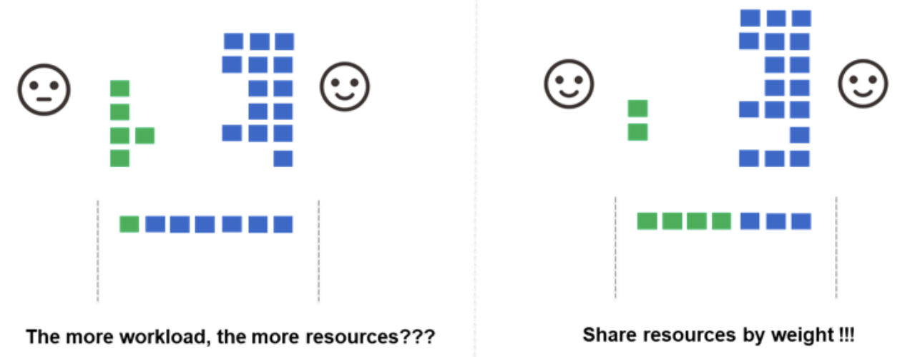

`Volcano`调度器是一个为高性能计算、机器学习和批处理工作负载设计的`Kubernetes`调度器。它的核心功能之一是通过可插拔的`Actions`和`Plugins`机制来实现灵活的调度策略。本文将详细地介绍这些机制，帮助你更好地理解和使用`Volcano`调度器。


## 调度器配置示例

`Volcano`默认调度器配置：
```yaml
actions: "enqueue, allocate, backfill"
tiers:
- plugins:
  - name: priority
  - name: gang
  - name: conformance
- plugins:
  - name: overcommit
  - name: drf
  - name: predicates
  - name: proportion
  - name: nodeorder
```


一个典型的`Volcano`调度器配置示例：

```yaml
actions: "enqueue,allocate,backfill,preempt,reclaim"
tiers:
- plugins:
  - name: priority
  - name: gang
  - name: conformance
- plugins:
  - name: drf
  - name: predicates
  - name: proportion
  - name: resourcequota
  - name: nodeorder
  - name: binpack
```

这个配置定义了调度器的工作流程（`Actions`）和决策机制（`Plugins`）。

### 可插拔的插件功能管理

需要注意：
- 当您提供自定义配置时，Volcano不会将其与默认配置合并
- 自定义配置会完全替换默认配置，而不是与默认配置合并

这种设计意味着：
1. **必须明确指定所有需要的插件**：
  - 如果您提供自定义配置，必须在配置中明确列出所有需要的插件，包括那些在默认配置中已经存在的插件
  - 例如，如果您需要使用conformance插件（默认已启用），但在自定义配置中没有包含它，那么它将不会被启用
2. **完整性要求**：
  - 您的自定义配置必须是完整的，包含所有必要的actions和plugins
  - 不能只指定您想要更改的部分，因为整个配置会被替换
3. **默认配置的作用**：
  - 默认配置仅在没有提供自定义配置时使用
  - 或者在自定义配置解析失败时作为备选方案


### 多层级(tiers)数组结构

为什么使用多层级(`tiers`)数组结构来配置`Plugins`？

1. **优先级分层执行**：
   - 不同层级（`tier`）的插件有着严格的优先级顺序
   - 高层级（第一个数组）中的插件会先执行，其决策结果会影响或限制低层级插件的决策空间
   - 只有当高层级的所有插件都允许一个调度决策时，才会继续执行低层级的插件

2. **决策流程的过滤机制**：
   - 第一层级的插件（如 `priority`、`gang`、`conformance`）主要负责基本的筛选和约束
   - 第二层级的插件（如 `drf`、`predicates`、`proportion` 等）负责更细粒度的资源分配和优化
   - 这种分层设计形成了一种"**粗筛-细筛**"的决策流水线

3. **解决冲突的明确机制**：
   - 当不同插件之间可能产生冲突决策时，层级结构提供了明确的优先级规则
   - 例如，如果 `gang` 插件（第一层）决定某个任务不能被调度（因为它的所有成员无法同时运行），那么即使 `binpack` 插件（第二层）认为该任务可以被有效打包，该任务也不会被调度

### 与单一数组相比的优势

如果所有插件都放在一个扁平的数组中，调度器将面临以下问题：

1. **无法表达优先级关系**：
   - 所有插件将被视为同等重要，难以表达某些基本约束（如成组调度）应该优先于优化决策（如资源打包）
   
2. **决策冲突难以解决**：
   - 没有明确的机制来解决插件之间的冲突，可能导致不一致或不可预测的调度行为
   
3. **调度效率降低**：
   - 分层执行允许在早期阶段快速过滤掉不符合基本条件的调度决策，避免不必要的计算

### Actions配置顺序的重要性

`Volcano`中的`actions`顺序配置非常重要，因为它决定了调度器执行各种调度操作的顺序，这直接影响调度决策和性能。

`actions`的执行是按照配置中指定的顺序依次进行的，不同的顺序配置会产生以下影响：

1. **效率影响**：
   - 如果将`backfill`放在`allocate`之前，可能会导致资源碎片化，降低整体资源利用率
   - 如果将`preempt`放在最前面，可能会导致过度抢占，增加系统波动

2. **公平性影响**：
   - 如果将资源公平相关的`action`放在较后位置，可能会影响资源分配的公平性

3. **性能影响**：
   - 某些`action`计算复杂度较高，如果频繁执行可能会影响调度器性能
   - 合理的顺序可以减少不必要的计算和资源重分配

推荐的顺序通常是：`enqueue,allocate,backfill,preempt,reclaim`。这个顺序确保了：
1. 首先将任务入队(`enqueue`)
2. 然后尝试正常分配资源(`allocate`)
3. 接着利用剩余资源(`backfill`)
4. 如果仍有高优先级任务未得到满足，考虑抢占(`preempt`)
5. 最后尝试回收利用率低的资源(`reclaim`)

在特定场景下，你可能需要根据工作负载特点调整顺序。例如，在高优先级任务较多的环境中，可能希望提前执行`preempt`；在资源紧张的环境中，可能希望提前执行`reclaim`。

## Volcano中的Job和PodGroup状态流转

在深入了解`Volcano`调度器的`Actions`和`Plugins`之前，我们需要先理解`Job`和`PodGroup`的状态以及它们之间的转换流程，这有助于我们更好地理解调度器的工作原理。

### PodGroup状态

`PodGroup`是`Volcano`中的一个重要概念，它代表一组需要一起调度的`Pod`。`PodGroup`有以下几种状态：

1. **Pending（等待中）**：`PodGroup`已被系统接受，但调度器无法为其分配足够的资源。这是`PodGroup`的初始状态。

2. **Inqueue（入队）**：控制器可以开始创建`Pod`，这是`PodGroup`从`Pending`到`Running`之间的一个中间状态。当`enqueue` action执行成功后，`PodGroup`会从`Pending`转变为`Inqueue`状态。

3. **Running（运行中）**：`PodGroup`中的`spec.minMember`数量的`Pod`已经处于运行状态。

4. **Unknown（未知）**：部分`spec.minMember`的`Pod`正在运行，但其他部分无法被调度，例如资源不足；调度器将等待相关控制器恢复它。

5. **Completed（已完成）**：`PodGroup`中的所有`Pod`都已完成。

### Job状态

`Volcano Job`是一个更高级别的抽象，它包含一个或多个`Task`，每个`Task`可以有多个`Pod`副本。`Job`有以下几种状态：

1. **Pending（等待中）**：`Job`正在队列中等待，等待调度决策。

2. **Inqueue（入队）**：`Job`已入队，等待调度。

3. **Aborting（中止中）**：`Job`正在被中止，等待释放`Pod`。

3. **Aborted（已中止）**：`Job`已被中止，所有`Pod`已被释放。

4. **Running（运行中）**：`Job`中的`Pod`正在运行。

5. **Restarting（重启中）**：`Job`正在重启，等待`Pod`终止。

6. **Completing（完成中）**：`Job`正在完成，等待`Pod`终止。

7. **Completed（已完成）**：`Job`已成功完成，所有`Pod`都已成功运行并终止。

8. **Terminating（终止中）**：`Job`正在终止，等待`Pod`终止。

9. **Terminated（已终止）**：`Job`已终止，所有`Pod`已被终止。

10. **Failed（失败）**：`Job`已失败，无法继续运行。


### 状态转换流程

`Job`和`PodGroup`的状态转换是紧密相关的，它们共同反映了任务在`Volcano`调度系统中的生命周期。以下是一个典型的状态转换流程：

1. **提交阶段**：
   - 用户创建一个`Volcano Job`
   - 系统自动为该`Job`创建一个对应的`PodGroup`
   - `Job`和`PodGroup`初始状态均为`Pending`

2. **入队阶段**：
   - 调度器的`enqueue action`检查`PodGroup`是否满足最小成员数要求
   - 如果满足条件，将`PodGroup`状态更新为`Inqueue`
   - 相应地，`Job`状态也会更新为`Inqueue`

3. **调度阶段**：
   - 调度器的`allocate action`为`Inqueue`状态的`PodGroup`中的`Pod`分配资源
   - 当足够数量的`Pod`被成功调度并运行后，`PodGroup`状态更新为`Running`
   - 相应地，`Job`状态也会更新为`Running`

4. **执行阶段**：
   - `Pod`在分配的节点上执行任务
   - 如果出现资源不足或其他问题，可能触发`preempt`或`reclaim action`
   - 这些`action`可能导致某些`Pod`被抢占或资源被回收

5. **完成阶段**：
   - 当所有`Pod`成功完成任务后，`PodGroup`状态更新为`Completed`
   - 相应地，`Job`状态更新为`Completed`

6. **异常处理**：
   - 如果任务执行过程中出现错误，`Job`可能转为`Failed`、`Aborted`或其他状态
   - 根据配置的生命周期策略，系统可能尝试重启任务（`Restarting`）或直接终止（`Terminating`）

理解这些状态和转换流程对于理解`Volcano`调度器的`Actions`工作原理至关重要，因为每个`Action`都是在特定的状态下对`Job`和`PodGroup`进行操作，以推动它们在生命周期中前进。

## Volcano 中的 Actions

动作（`Actions`）定义了调度器的工作流程和执行顺序。
在上面的配置中，我们定义了五个动作：`enqueue`、`allocate`、`backfill`、`preempt`和`reclaim`。这些动作将按照定义的顺序执行。

在`Volcano`的新版本中，可能会有增加新的动作，让我们逐一解释各个动作的作用：

### 1. enqueue（入队）

**主要功能**：将新提交的任务放入调度队列，并检查任务是否满足调度条件。

**工作原理**：
- 创建任务和队列的优先级队列，按照调度策略中定义的顺序处理
- 检查`PodGroup`是否满足最小成员数要求
- 将符合条件的`Job`状态从`Pending`更新为`Inqueue`
- 更新`PodGroup`的状态为`PodGroupInqueue`，表示已准备好被调度

**示例场景**：

当一个要求至少三个`Pod`同时运行的`TensorFlow`训练任务被提交时，`enqueue`动作会检查是否有足够的资源来运行这些`Pod`，如果有，则将其标记为可调度。


**注意事项**：`enqueue action` 是不可省略的核心组件，原因如下：

1. **调度流程的入口点**：
- `enqueue`是整个调度流程的第一步，负责将任务从"未调度"状态转移到"可调度"状态
- 如果没有`enqueue`，新提交的任务将无法进入调度队列，调度器将无法感知这些任务的存在

2. **基础验证机制**：
- `enqueue` 执行关键的前置检查，如验证`PodGroup`是否满足最小成员数要求
- 它确保只有满足基本条件的任务才能进入调度流程，避免无效调度

3. **默认配置的一部分**：
- 在 `Volcano` 的默认配置中，`enqueue`总是作为第一个 `action`存在
- 即使在自定义配置中不显式指定，系统也会使用内置的`enqueue`逻辑


### 2. allocate（分配）

**主要功能**：为队列中的任务分配资源，并将它们调度到合适的节点上。

**工作原理**：
- 根据队列权重和任务优先级对任务进行排序
- 使用插件对任务进行过滤和打分
  - **过滤策略（Predicates）**：
    - 资源匹配过滤：检查节点是否有足够的`CPU`、内存、`GPU`等资源
    - 节点亲和性过滤：根据`Pod`的`nodeAffinity`设置过滤节点
    - 污点容忍过滤：检查任务是否能容忍节点上的污点（`Taints`）
    - `PodGroup`约束过滤：检查是否有足够的资源同时运行`PodGroup`中的所有`Pod`
    - 自定义过滤器：通过`predicates`插件实现的特定过滤逻辑
  - **打分策略（Scoring）**：
    - 节点资源打分：包括`leastrequested`（选择资源使用率低的节点）、`mostrequested`（选择资源使用率高的节点）和`balancedresource`（平衡各类资源使用）
    - 节点亲和性打分（`nodeaffinity`）：根据节点亲和性规则给节点打分
    - `Pod`间亲和性打分（`podaffinity`）：考虑`Pod`之间的亲和性和反亲和性
    - 污点容忍打分（`tainttoleration`）：根据`Pod`对节点污点的容忍度打分
    - 镜像本地性打分（`imagelocality`）：优先选择已经有所需镜像的节点
    - `Pod`拓扑分布打分（`podtopologyspread`）：实现`Pod`在拓扑域之间的均匀分布
    - 任务拓扑打分（`task-topology`）：通过注解定义任务间的亲和性和反亲和性，优化分布式任务的调度
- 为符合条件的任务分配资源并绑定到得分最高的节点

**示例场景**：

当多个队列中有多个任务时，`allocate`动作会首先将资源分配给高权重队列中的高优先级任务，然后再考虑低权重队列中的任务。


**参数说明**：

| 参数名 | 默认值 | 说明 |
| --- | --- | --- |
| `predicateErrorCacheEnable` | `true` | 是否启用谓词错误缓存。启用后，调度器会缓存节点过滤阶段的错误信息，避免重复计算，提高调度效率。 |

**参数示例**：

`allocate`动作的参数需要在`Volcano`调度器的`ConfigMap`中配置。具体来说，这些参数应该在`volcano-scheduler.conf`文件的`actions.allocate`部分中配置。以下是一个配置示例：

```yaml
# volcano-scheduler-configmap.yaml
apiVersion: v1
kind: ConfigMap
metadata:
  name: volcano-scheduler-configmap
  namespace: volcano-system
data:
  volcano-scheduler.conf: |
    actions: "enqueue,allocate,backfill,preempt,reclaim"
    tiers:
    - plugins:
      - name: priority
      - name: gang
      - name: conformance
    - plugins:
      - name: drf
      - name: predicates
      - name: proportion
      - name: nodeorder
    configurations:
    - name: allocate
      arguments:
        predicateErrorCacheEnable: true
```


**注意事项**：

1. 谓词错误缓存（`Predicate Error Cache`）是一种优化机制，可以避免对已知不满足条件的节点重复执行过滤操作，从而提高调度效率。
2. 在大规模集群中，启用此功能可以显著减少调度延迟，特别是当集群中有大量节点且调度频繁时。
3. 在某些特殊场景下（如节点状态快速变化的环境），可能需要禁用此功能以确保调度决策基于最新状态。

**最佳实践**：

1. 在大多数情况下，建议保持谓词错误缓存启用（默认设置）。
2. 如果观察到由于缓存导致的调度异常（例如，节点状态变化后调度决策不准确），可以考虑禁用此功能。
3. 在调试调度问题时，临时禁用此功能可能有助于排查问题。


**注意事项**：在 `Volcano` 调度器中，`allocate` `action`也是**不可省略**的核心组件，原因如下：

1. **核心调度功能的实现者**：
   - `allocate` 是实际执行资源分配和`Pod`绑定的关键`action`
   - 它负责将已入队的任务分配到具体的节点上，是调度过程的核心步骤
   - 如果没有 `allocate`，任务会停留在队列中而不会被实际调度执行

2. **调度决策的执行者**：
   - 虽然其他`actions`（如`backfill`、`preempt`）也可以执行调度，但它们都是针对特殊场景的补充
   - `allocate` 处理常规的资源分配，是最基本的调度机制
   - 其他`actions`通常在`allocate`无法满足需求时才会被触发

3. **插件系统的主要应用点**：
   - 大多数调度插件（如`drf`、`predicates`、`nodeorder`等）主要在`allocate`阶段发挥作用
   - 这些插件通过**过滤**和**打分**机制帮助`allocate`做出最优的调度决策

4. **调度流程的核心环节**：
   - 在典型的调度流程中，`enqueue`将任务放入队列，而`allocate`则负责实际分配资源
   - 这两个`action`构成了调度的基本闭环，缺一不可


### 3. backfill（回填）

`backfill`（回填）是 `Volcano` 调度流程中非常重要的一个补充环节，其主要作用是在 `allocate` 完成主资源分配后，进一步挖掘和利用集群中的碎片资源。通常情况下，`allocate`负责为大部分高优先级或核心任务分配资源，而 `backfill` 主要针对那些由于资源碎片化而无法被 `allocate` 充分利用的节点，调度小型或低优先级任务，从而提升整体资源利用率。

**backfill 在调度流程中的定位**：
- `Volcano`的调度流程并不是“一次性”分配完所有资源、所有任务就结束。调度器会不断循环执行`actions`，每一轮都会尝试调度新的任务和处理资源变化。
- `enqueue` 负责将任务放入调度队列，`allocate` 负责进行主要的资源分配。
- 当 `allocate` 无法满足所有任务需求，或集群中出现大量碎片资源时，`backfill` 会被触发，专门调度适合这些碎片资源的小任务。
- 这使得调度流程形成了“主分配 + 回填补充”的高效闭环。

**插件系统与 backfill 的配合**：
- 大多数调度插件（如 `drf`、`predicates`、`nodeorder` 等）虽然主要在 `allocate` 阶段发挥作用，但 `backfill` 阶段同样会复用这些插件的过滤和打分机制，确保回填任务的调度决策依然科学合理。
- 某些插件参数（如谓词错误缓存）可以显著提升 `backfill` 的调度效率。

**典型应用场景**：
- 当集群中有节点仅剩少量 `CPU` 和内存时，这些资源不足以运行大型任务，但通过 `backfill`，可以将这些资源分配给小型批处理任务或低优先级作业，避免资源浪费。

**主要功能**：利用集群中的空闲资源来运行小型或低优先级的任务，提高资源利用率。

**工作原理**：
- 在主要的资源分配完成后执行
- 寻找集群中的碎片资源（小块未使用的资源）
- 将这些资源分配给可以快速完成的小任务

**示例场景**：

当集群中有一些节点只剩下少量的`CPU`和内存时，这些资源可能不足以运行大型任务，但`backfill`动作可以将这些资源分配给小型的批处理任务。

**参数说明**：

| 参数名 | 默认值 | 说明 |
| --- | --- | --- |
| `predicateErrorCacheEnable` | `true` | 是否启用谓词错误缓存。启用后，调度器会缓存节点过滤阶段的错误信息，避免重复计算，提高调度效率。 |

**参数示例**：

`backfill`动作的参数需要在`Volcano`调度器的`ConfigMap`中配置。具体来说，这些参数应该在`volcano-scheduler.conf`文件的`actions.backfill`部分中配置。以下是一个配置示例：

```yaml
# volcano-scheduler-configmap.yaml
apiVersion: v1
kind: ConfigMap
metadata:
  name: volcano-scheduler-configmap
  namespace: volcano-system
data:
  volcano-scheduler.conf: |
    actions: "enqueue,allocate,backfill,preempt,reclaim"
    tiers:
    - plugins:
      - name: priority
      - name: gang
      - name: conformance
    - plugins:
      - name: drf
      - name: predicates
      - name: proportion
      - name: nodeorder
    configurations:
    - name: backfill
      arguments:
        predicateErrorCacheEnable: true
```

**注意事项**：

1. `backfill`动作与`allocate`动作类似，也支持谓词错误缓存功能，但它专注于利用集群的**碎片资源**。
2. 在资源紧张的集群中，启用此功能可以提高资源利用率，尤其是当有大量小型任务需要调度时。
3. 如果集群中的节点状态频繁变化，禁用此功能可能会带来更准确的调度结果，但代价是调度效率的降低。

**最佳实践**：

1. 在资源利用率需要提高的场景中，建议保持`backfill`动作启用。
2. 对于具有大量小型任务（如数据处理、批量任务）的工作负载，`backfill`可以显著提高资源利用率。
3. 对于需要精确资源预留的关键应用，可能需要谨慎使用`backfill`，以避免资源碎片化影响主要工作负载的性能。

### 4. preempt（抢占）

**主要功能**：当高优先级任务无法获得足够资源时，从低优先级任务中抢占资源。

**工作原理**：
- 识别高优先级但无法调度的任务
- 查找可以被抢占的低优先级任务
- 终止被选中的低优先级任务，释放其资源
- 将释放的资源分配给高优先级任务

**示例场景**：

当一个生产环境的关键任务（高优先级）需要运行，但集群资源已被开发环境的任务（低优先级）占用时，`preempt`动作会终止部分开发环境的任务，将资源让给生产环境的关键任务。


**参数说明**：

| 参数名 | 默认值 | 说明 |
| --- | --- | --- |
| `preemptable` | `true` | 是否允许抢占操作。设置为`false`将禁用抢占功能。 |
| `preemptablePriority` | `0` | 可被抢占的任务优先级阈值，低于此优先级的任务可被抢占。例如设置为`100`意味着优先级低于`100`的任务可被抢占。默认值为`0`意味着不启用强占功能。 |
| `preemptPriority` | `0` | 可执行抢占的任务优先级阈值，高于此优先级的任务可执行抢占。例如设置为`1000`意味着优先级高于`1000`的任务可以抢占其他任务的资源。 |
| `preemptPolicy` | `Arbitrary` | 抢占策略，决定如何选择被抢占的任务。可选值为`Arbitrary`（随机选择）或`PriorityBased`（基于优先级选择）。 |

如果任务之间存在不同的优先级，理论上应该优先选择优先级最低的任务作为被抢占对象，这样才能体现“高优先级任务优先保障”的调度原则。

但在 `Volcano` 的 `preemptPolicy` 配置中，即使任务存在不同的优先级，如果你设置为 `Arbitrary`，调度器依然可能不是优先抢占最低优先级的任务，而是从所有符合条件的任务中随机选择一个进行抢占。这种策略通常只在某些特殊场景下使用（比如你希望打散负载、避免长时间抢占同一批任务等），但**并不推荐在有明确优先级需求的场景下使用**。


**参数示例**：

`preempt`动作的参数需要在`Volcano`调度器的`ConfigMap`中配置。具体来说，这些参数应该在`volcano-scheduler.conf`文件的`configurations`部分中配置。以下是一个完整的配置示例：

```yaml
# volcano-scheduler-configmap.yaml
apiVersion: v1
kind: ConfigMap
metadata:
  name: volcano-scheduler-configmap
  namespace: volcano-system
data:
  volcano-scheduler.conf: |
    actions: "enqueue,allocate,backfill,preempt,reclaim"
    tiers:
    - plugins:
      - name: priority
      - name: gang
      - name: conformance
    - plugins:
      - name: drf
      - name: predicates
      - name: proportion
      - name: nodeorder
    configurations:
    - name: preempt
      arguments:
        preemptable: true
        preemptablePriority: 100
        preemptPriority: 1000
        preemptPolicy: PriorityBased
```


**如何配置preempt动作**：

1. **在调度器配置中启用preempt动作，并配置参数**：

   推荐在配置文件的 `configurations` 部分为 preempt 动作增加参数，避免默认 `preemptablePriority=0` 导致抢占不生效。例如：
   
   ```yaml
   actions: "enqueue,allocate,backfill,preempt,reclaim"
   configurations:
   - name: preempt
     arguments:
       preemptable: true
       preemptablePriority: 100      # 低于100的任务可被抢占
       preemptPriority: 1000         # 高于1000的任务可以抢占
       preemptPolicy: PriorityBased  # 基于优先级选择被抢占对象
   ```

2. **为Pod标记是否可被抢占**：

   通过在`Pod`上添加`volcano.sh/preemptable`注解来标记`Pod`是否可被抢占：
   
   ```yaml
   apiVersion: v1
   kind: Pod
   metadata:
     name: low-priority-pod
     annotations:
       volcano.sh/preemptable: "true"  # 标记此Pod可被抢占
   spec:
     schedulerName: volcano
     containers:
     - name: container
       image: nginx
   ```

3. **使用优先级类定义任务优先级**：

   创建优先级类（`PriorityClass`）来定义不同优先级的任务：
   
   ```yaml
   apiVersion: scheduling.k8s.io/v1
   kind: PriorityClass
   metadata:
     name: high-priority
   value: 1000
   globalDefault: false
   description: "高优先级任务，可以抢占低优先级任务"
   ---
   apiVersion: scheduling.k8s.io/v1
   kind: PriorityClass
   metadata:
     name: low-priority
   value: 100
   globalDefault: false
   description: "低优先级任务，可被高优先级任务抢占"
   ```

4. **在PodGroup中使用优先级类**：

   ```yaml
   apiVersion: scheduling.volcano.sh/v1beta1
   kind: PodGroup
   metadata:
     name: high-priority-job
   spec:
     minMember: 3
     priorityClassName: high-priority  # 使用高优先级类
     queue: default
   ```

**preempt动作的工作流程**：

1. 调度器识别出因资源不足而无法调度的高优先级任务
2. 根据`preemptPolicy`策略，在集群中寻找可被抢占的低优先级任务
3. 对于标记为`volcano.sh/preemptable: "true"`的Pod，优先考虑抢占
4. 根据优先级差异，选择优先级最低的任务进行抢占
5. 终止被选中的低优先级任务，释放其资源
6. 将释放的资源分配给高优先级任务

**最佳实践**：

1. 明确标记哪些`Pod`可被抢占，避免关键服务被意外终止
2. 为不同类型的工作负载设置合理的优先级类
3. 对于可能被抢占的工作负载，实现适当的检查点机制或任务恢复能力
4. 在资源紧张的环境中，合理使用`preempt`动作可以提高关键任务的响应速度和集群资源利用率

### 5. reclaim（回收）

**主要功能**：从超出其公平份额的队列中回收资源，并将其重新分配给其他队列。


**工作原理**：
- 计算每个队列的公平份额和实际使用情况
- 识别超额使用资源的队列
- 从这些队列中选择可回收的任务
- 终止这些任务以释放资源

**示例场景**：

当集群中有多个队列，每个队列都有权重设置（如生产队列权重为`60%`，开发队列为`30%`，测试队列为`10%`）。如果开发队列使用了超过`50%`的集群资源，而生产队列需要更多资源时，`reclaim`动作会从开发队列中回收资源。

**注意事项**：

为什么队列设置了 `Quota` 还会出现超额使用的情况？

`Volcano` 的资源分配和回收机制采用了“宽松分配+周期性回收”的设计，主要原因有：

- **宽松分配**：在实际调度时，为了提升资源利用率和调度灵活性，调度器可能允许某些队列临时超出其配额（`Quota`）使用资源，尤其是在集群资源充足、其他队列没有资源需求时。
- **动态变化**：集群资源和队列需求是动态变化的，某一时刻资源分配合理，但随着新任务加入或资源需求变化，某些队列可能会暂时超额。
- **周期性回收**：`reclaim` 动作就是为了解决上述问题而设计的。它会定期检查所有队列的资源使用情况，一旦发现某队列超出其公平份额，就会触发资源回收，将多占用的资源释放出来，分配给资源不足的队列。

`Volcano` 的 `reclaim`（回收）操作本质上就是强制终止（`Evict/Kill`）超额队列中的部分任务的 `Pod`，以释放资源并将其分配给其他资源不足或高优先级的队列。被回收的任务如果有重试或重调度机制，后续可能会被重新调度到集群中。

### 6. shuffle（重新分配）

**主要功能**：选择并驱逐正在运行的任务，以实现资源重新分配或负载均衡。

**工作原理**：
- 收集所有正在运行的任务
- 通过插件定义的策略选择需要驱逐的任务
- 驱逐选中的任务，释放其资源
- 这些任务将在后续调度周期中被重新调度

**示例场景**：

当集群中的负载分布不均衡时，例如某些节点资源利用率非常高而其他节点却相对空闲，`shuffle`动作可以驱逐部分任务，让它们在下一个调度周期重新分配到资源利用率较低的节点上，从而实现负载均衡。

**注意事项**：

1. `shuffle`动作会导致任务被驱逐并重新调度，这可能会对应用程序造成短暂的中断。
2. **需要配合相应的插件（如`victimtasks`）来定义驱逐策略，决定哪些任务应该被驱逐。**
3. 对于状态敏感或需要长时间运行的应用，应谨慎使用`shuffle`动作，或者确保这些应用有适当的状态保存和恢复机制。

**最佳实践**：

1. 将`shuffle`动作放在调度器配置的后面，确保它只在其他调度策略（如`allocate`、`backfill`）无法解决问题时才会被触发。
2. 为需要保护的关键任务添加适当的标签或注解，确保它们不会被`shuffle`动作驱逐。
3. 在资源利用率不均衡或需要定期重新平衡集群负载的场景中，`shuffle`动作可以提供显著的效益。


## Volcano 中的 Plugins

`Plugins`是`Volcano`调度器的决策模块，它们在不同的调度阶段提供特定的功能。
在上面的配置中，插件被组织成两个层级（`tiers`），每个层级包含多个插件。
层级的概念允许插件按照优先级顺序执行，高层级的插件优先级高于低层级的插件。

**注意事项**：部分插件支持在`Job`的`spec.plugins`中设置插件参数，但是只有在`Volcano`的全局配置中启用了该插件，在`Job`的`spec.plugins`中该插件才能起作用，否则无效。

让我们逐一解释这些插件的作用：


### 1. priority（优先级）

**主要功能**：根据任务的优先级对其进行排序，确保高优先级任务先被调度。



**工作原理**：
- 读取任务的`PriorityClass`或优先级注解
- 根据优先级值对任务进行排序
- 高优先级任务在资源分配时会被优先考虑

**使用示例**：
```yaml
apiVersion: scheduling.k8s.io/v1
kind: PriorityClass
metadata:
  name: high-priority
value: 1000000
globalDefault: false
description: "This priority class is used for critical production jobs"
---
apiVersion: batch.volcano.sh/v1alpha1
kind: Job
metadata:
  name: critical-job
spec:
  priorityClassName: high-priority
  # 其他配置...
```

这个配置将使`critical-job`获得高优先级，在资源竞争时优先被调度。

### 2. gang（成组）

**主要功能**：实现成组调度，确保任务的所有成员（`Pod`）可以同时运行。

**工作原理**：
- 读取任务的`minAvailable`设置
- 检查是否有足够的资源来运行最小所需的`Pod`数量
- 只有当所有必要的`Pod`都能被调度时，才会进行调度

**使用示例**：
```yaml
apiVersion: batch.volcano.sh/v1alpha1
kind: Job
metadata:
  name: distributed-training
spec:
  minAvailable: 4
  tasks:
    - replicas: 1
      name: ps
      template: # Pod模板...
    - replicas: 3
      name: worker
      template: # Pod模板...
```

这个配置要求至少`4`个`Pod`（`1`个`ps`和`3`个`worker`）同时可用才会开始调度。这对于分布式训练等需要多个组件协同工作的任务非常重要。

### 3. conformance（一致性）

> 官网介绍链接：[https://volcano.sh/en/docs/schduler_introduction/#conformance](https://volcano.sh/en/docs/schduler_introduction/#conformance)

**主要功能**：`conformance`插件就像`Kubernetes`的"规则检查员"，确保`Volcano`的调度决策符合`Kubernetes`的标准和约定。

**工作原理**：
- 检查`Pod`的配置是否符合`Kubernetes`的规则（比如不能设置无效的资源请求）
- 验证调度决策不会违反`Kubernetes`的基本原则（比如不会将`Pod`调度到资源不足的节点）
- 确保`Volcano`的行为与标准`Kubernetes`调度器保持一致，避免冲突

**使用示例**：
假设有一个任务请求了以下资源：
```yaml
apiVersion: batch.volcano.sh/v1alpha1
kind: Job
metadata:
  name: example-job
spec:
  tasks:
    - replicas: 2
      name: example-task
      template:
        spec:
          containers:
            - name: main-container
              image: nginx
              resources:
                requests:
                  memory: "2Gi"
                  cpu: "500m"
```

`conformance`插件会执行以下检查：
1. 验证资源请求格式是否正确（如"`500m`" `CPU`是有效格式）
2. 确保`Pod`不会被调度到无法满足`2GB`内存和`0.5CPU`需求的节点上
3. 如果该`Pod`有特殊的调度约束（如污点容忍），确保这些约束被正确处理

如果`Volcano`尝试做出不符合`Kubernetes`规则的调度决策（例如，将`Pod`调度到资源已满的节点），`conformance`插件会阻止这种行为，确保系统稳定性和一致性。

这个插件对用户来说是"无形"的，它在后台默默工作，确保所有调度决策都符合`Kubernetes`的标准，不需要用户进行特殊配置。


**是否可以不使用`conformance`插件？**

从技术上讲，可以不使用`conformance`插件，因为`Volcano`允许用户自定义启用哪些插件。但这样做会带来一些潜在风险：

- **调度不一致性**：没有`conformance`插件，`Volcano`可能会做出与`Kubernetes`标准不兼容的调度决策，导致系统行为不可预测。
- **资源冲突**：可能会出现资源分配冲突，例如`Pod`被调度到不满足其资源需求的节点上。
- **API兼容性问题**：可能会接受一些不符合`Kubernetes` API约定的配置，导致后续操作失败。
- **系统稳定性降低**：`conformance`插件是`Volcano`的核心插件之一，它确保调度系统的基础稳定性。禁用它可能会导致一些难以排查的问题。

**注意事项**：

在`Volcano`的默认配置中，`conformance`通常是作为必要插件启用的。如果你有特殊的调度需求，建议保留`conformance`插件，同时通过配置其他插件来满足你的特定需求，而不是禁用这个基础的一致性保障机制。

### 4. drf（主导资源公平性）


**主要功能**：实现主导资源公平性（`Dominant Resource Fairness`）算法，确保资源在不同队列和任务之间公平分配。


**工作原理**：
- 计算每个任务的主导资源（即任务所需的最多的资源类型）
- 根据主导资源的使用比例对任务进行排序
- 确保所有用户或队列都能获得公平的资源份额

**使用示例**：

假设集群中有两个队列（`A`和`B`）和两种资源（`CPU`和`内存`），总资源为`100`个`CPU`核心和`200GB`内存。

队列`A`中的任务主要需要`CPU`资源：
```yaml
apiVersion: batch.volcano.sh/v1alpha1
kind: Job
metadata:
  name: cpu-intensive-job
  namespace: queue-a
spec:
  tasks:
    - replicas: 4
      name: cpu-task
      template:
        spec:
          containers:
            - name: cpu-container
              image: cpu-workload:latest
              resources:
                requests:
                  cpu: "10"    # 每个Pod请求10个CPU核心
                  memory: "5Gi"  # 每个Pod请求5GB内存
```

队列`B`中的任务主要需要内存资源：
```yaml
apiVersion: batch.volcano.sh/v1alpha1
kind: Job
metadata:
  name: memory-intensive-job
  namespace: queue-b
spec:
  tasks:
    - replicas: 4
      name: memory-task
      template:
        spec:
          containers:
            - name: memory-container
              image: memory-workload:latest
              resources:
                requests:
                  cpu: "2"     # 每个Pod请求2个CPU核心
                  memory: "20Gi" # 每个Pod请求20GB内存
```

**DRF如何工作**：

1. **计算主导资源**：
   - 队列`A`：`CPU`是主导资源（每个`Pod`需要`10%`的集群`CPU`和`2.5%`的集群内存）
   - 队列`B`：`内存`是主导资源（每个`Pod`需要`2%`的集群`CPU`和`10%`的集群内存）

2. **公平分配**：
   - 如果没有`DRF`，调度器可能会简单地平均分配资源（每个队列各获`50%`的`CPU`和`50%`的内存，注意这只是举例，并不是`Kubernetes`默认调度策略）。
     这种分配方式会导致队列`A`的`CPU`密集型任务只能使用一半的`CPU`资源，而队列`B`却无法充分利用其分配到的`CPU`资源，造成资源浪费
   - 使用`DRF`后，调度器会考虑每个队列的主导资源需求
   - 例如，队列`A`可能获得`60%`的`CPU`和`30%`的内存，队列`B`获得`40%`的`CPU`和`70%`的内存

3. **实际效果**：
   - 队列A可以运行`4`个`Pod`（使用`40`个`CPU`和`20GB`内存）
   - 队列B可以运行`4`个`Pod`（使用`8`个`CPU`和`80GB`内存）
   - 总体资源利用率更高，且两个队列都能公平地获得其主导资源的份额

这种分配方式比简单地平均分配每种资源更加公平和高效，因为它考虑了不同任务的资源需求特点。

**是否可以不使用`DRF`插件？**

从技术上讲，可以不使用`DRF`插件，因为`Volcano`允许用户自定义启用哪些插件。
但在以下场景中，`DRF`插件几乎是必不可少的：

- **多队列环境**：当集群中有多个队列竞争资源时
- **异构工作负载**：当不同队列的任务有显著不同的资源需求特点（如CPU密集型与内存密集型）
- **资源紧张场景**：当集群资源紧张，需要更公平高效的资源分配时

如果你的集群资源充足，或者只有单一队列，或者所有任务的资源需求特点相似，那么可能不需要`DRF`插件。
但在大多数生产环境中，`DRF`插件提供的公平性保障是非常有价值的。

### 5. predicates（断言）

**主要功能**：检查节点是否满足运行特定任务的条件，类似于标准`Kubernetes`调度器的断言。

**工作原理**：
- 检查节点资源是否满足任务需求
- 检查节点是否满足任务的亲和性、反亲和性要求
- 检查节点标签是否符合任务要求

**参数说明**：

| 参数名                      | 类型    | 默认值   | 说明                                 |
|-----------------------------|---------|---------|--------------------------------------|
| `predicates.enableNodeSelectorPredicate` | `bool` | `true`  | 是否启用节点标签断言                 |
| `predicates.enablePodAffinityPredicate`  | `bool` | `false` | 是否启用`Pod`亲和性断言                |
| `predicates.enablePodTolerationPredicate`| `bool` | `true`  | 是否启用污点容忍断言                 |
| `predicates.enableResourcePredicate`     | `bool` | `true`  | 是否启用资源断言                     |
| `predicates.enableNodePortsPredicate`    | `bool` | `true`  | 是否启用端口冲突断言                 |
| `predicates.enableVolumePredicate`       | `bool` | `true`  | 是否启用存储卷断言                   |
| `predicates.resourceThresholds`          | `map`  | `{}`    | 自定义资源阈值（如`cpu`、`memory`等）     |

**参数说明补充**：

- `predicates.resourceThresholds` 用于自定义节点资源的可用阈值，影响调度器在断言节点资源是否满足任务需求时的判定标准。默认情况下，调度器会根据节点的实际可用资源与 `Pod` 的 `requests` 进行对比，判断节点是否有足够资源来承载任务。通过配置该参数，可以为如 `cpu`、`memory` 等资源设置阈值，只有当节点的可用资源大于等于该阈值时，才会被认为可调度。
- 典型用途包括保护节点资源，防止节点被调度到极限，提升集群稳定性。例如：

  ```yaml
  - name: predicates
    arguments:
      predicates.resourceThresholds:
        cpu: 2000m
        memory: 8Gi
  ```
  上述配置表示：只有当节点剩余 `CPU≥2000m`、`内存≥8Gi` 时，才会被断言为“可用节点”。

如不配置该参数，默认 `{}`，即不额外限制，由调度器按实际资源判断。

**参数示例**：
```yaml
- name: predicates
  arguments:
    predicates.enableNodeSelectorPredicate: true
    predicates.enablePodAffinityPredicate: true
    predicates.enablePodTolerationPredicate: true
    predicates.enableResourcePredicate: true
    predicates.enableNodePortsPredicate: true
    predicates.enableVolumePredicate: false
    predicates.resourceThresholds:
      cpu: 2000m
      memory: 8Gi
```


**使用示例**：
```yaml
apiVersion: batch.volcano.sh/v1alpha1
kind: Job
metadata:
  name: gpu-job
spec:
  tasks:
    - replicas: 2
      name: gpu-task
      template:
        spec:
          nodeSelector:
            gpu: "true"
          containers:
            - name: gpu-container
              image: nvidia/cuda:latest
              resources:
                limits:
                  nvidia.com/gpu: 1
```

这个配置要求任务只能运行在标记为`gpu=true`的节点上，并且需要`GPU`资源。`predicates`插件会确保只有满足这些条件的节点才会被选中。

**注意事项**：

- `predicates` 插件并不是 `Volcano` 调度器中的“强制必选”插件，但在绝大多数实际生产场景下，它是非常推荐启用的核心插件之一。

- `predicates` 插件实现了节点资源、亲和性、污点容忍、端口冲突等一系列基础调度断言，类似于 `Kubernetes` 默认调度器的核心功能。如果关闭该插件，调度器将无法正确判断节点是否真正满足任务的各种约束条件，可能导致任务被调度到不合适的节点，带来资源冲突、调度失败或业务异常等问题。

- `Volcano` 支持插件化调度框架，允许用户通过配置 `tiers/plugins` 灵活启用或禁用插件。如果你明确了解自己的业务场景、节点环境和调度需求，也可以选择不启用 `predicates` 插件，但需自行确保不会引入调度安全隐患。
结论：

- 对于大多数生产集群和常规批量计算场景，建议始终启用 `predicates` 插件，以保障调度的正确性与安全性。
只有在非常特殊、可控的实验性场景下，且明确知道后果时，才可以选择不启用该插件。

### 6. proportion（比例）

**主要功能**：根据队列的权重按比例分配资源，确保资源分配符合预定的比例。

**工作原理**：
- 计算每个队列的目标资源份额（根据`weight`权重）
- 监控实际资源使用情况
- 调整资源分配以符合目标比例

**Job插件参数**：

- `proportion` 插件在 Job 层级无需配置参数，仅需在 `spec.plugins` 中声明启用即可。
- 仅对当前 Job 生效，不影响其它 Job 和全局调度策略。

**Job插件参数示例**：
```yaml
spec:
  plugins:
    proportion: [] # 启用比例插件，无需额外参数
```

**Job插件参数与全局参数关系**

- `Job` 层级的 `proportion` 配置不会覆盖全局设置，仅影响当前 Job。

**使用示例**：
```yaml
apiVersion: scheduling.volcano.sh/v1beta1
kind: Queue
metadata:
  name: production
spec:
  weight: 6
---
apiVersion: scheduling.volcano.sh/v1beta1
kind: Queue
metadata:
  name: development
spec:
  weight: 3
---
apiVersion: scheduling.volcano.sh/v1beta1
kind: Queue
metadata:
  name: testing
spec:
  weight: 1
```

这个配置定义了三个队列，权重比例为`6:3:1`。`proportion`插件会确保资源分配大致符合这个比例，
即生产队列获得`60%`的资源，开发队列获得`30%`，测试队列获得`10%`。

### 7. nodeorder（节点排序）

**主要功能**：为任务选择最适合的节点，基于多种因素对节点进行打分和排序。

**工作原理**：
- 考虑节点的资源利用率
- 考虑任务的亲和性和反亲和性要求
- 考虑节点的标签和条件
- 为每个节点计算分数，选择分数最高的节点

**参数说明**：

| 参数名                        | 类型   | 默认值 | 说明                            |
|-------------------------------|--------|--------|---------------------------------|
| `nodeaffinity.weight`           | `int`    | `1`      | 节点亲和性优先级权重            |
| `podaffinity.weight`            | `int`    | `1`      | `Pod` 亲和性优先级权重            |
| `leastrequested.weight`         | `int`    | `1`      | 最少资源使用优先级权重          |
| `balancedresource.weight`       | `int`    | `1`      | 资源均衡优先级权重              |
| `mostrequested.weight`          | `int`    | `1`      | 最大资源使用优先级权重          |
| `tainttoleration.weight`        | `int`    | `1`      | 污点容忍优先级权重              |
| `imagelocality.weight`          | `int`    | `1`      | 镜像本地性优先级权重            |
| `podtopologyspread.weight`      | `int`    | `1`      | `Pod` 拓扑分布优先级权重          |

> **说明：**
> - 所有权重参数的默认值均为 `1`，如未配置则调度器采用默认权重。
> - 权重越大，相关因素在节点排序中的影响越大。
> - 可根据实际业务场景灵活调整权重，实现资源利用、亲和性、分布均衡等多目标优化。


**参数示例**：
```yaml
- name: nodeorder
  arguments:
    nodeaffinity.weight: 1
    podaffinity.weight: 1
    leastrequested.weight: 1
    balancedresource.weight: 1
    mostrequested.weight: 1
    tainttoleration.weight: 1
    imagelocality.weight: 1
    podtopologyspread.weight: 1
```

**使用示例**：

下面是一个典型的 `nodeorder` 插件配置与任务调度示例：

```yaml
# volcano-scheduler.conf 片段
- name: nodeorder
  arguments:
    nodeaffinity.weight: 5
    podaffinity.weight: 10
    leastrequested.weight: 1
    balancedresource.weight: 2
    mostrequested.weight: 1
    tainttoleration.weight: 1
    imagelocality.weight: 1
    podtopologyspread.weight: 1
```

```yaml
# Job 示例
apiVersion: batch.volcano.sh/v1alpha1
kind: Job
metadata:
  name: affinity-job
spec:
  minAvailable: 2
  tasks:
    - replicas: 2
      name: worker
      template:
        spec:
          affinity:
            nodeAffinity:
              requiredDuringSchedulingIgnoredDuringExecution:
                nodeSelectorTerms:
                  - matchExpressions:
                      - key: disktype
                        operator: In
                        values: [ssd]
            podAffinity:
              requiredDuringSchedulingIgnoredDuringExecution:
                - labelSelector:
                    matchLabels:
                      app: myapp
                  topologyKey: kubernetes.io/hostname
          containers:
            - name: main
              image: busybox
              command: ["sleep", "3600"]
```

在上述配置中：
- `nodeorder` 插件通过不同权重综合考虑节点亲和性、`Pod` 亲和性、资源利用率等因素，为每个节点打分。
- 任务通过 `affinity` 字段表达了节点和 `Pod` 亲和性需求。
- 调度器最终会选择分数最高、最符合业务需求的节点进行任务调度。


**注意事项**：

- `nodeorder` 插件并不是 `Volcano` 调度器中的“强制必选”插件，但在实际生产环境中，它也是非常常用且推荐启用的插件之一。

- `nodeorder` 插件负责为所有可用节点打分排序，帮助调度器选择最适合任务的节点。它支持多种打分策略（如资源利用率、亲和性、污点容忍等），极大提升了调度的灵活性和智能性。

- 如果不启用 `nodeorder` 插件，调度器将无法对节点进行综合打分排序，可能只能采用简单的随机或轮询等方式分配任务，容易导致资源利用率低下或调度结果不理想。

- `Volcano` 支持插件化调度框架，允许用户根据实际需求选择启用或禁用 `nodeorder`。只有在极为特殊、对节点选择没有要求的场景下，才可能不启用该插件。

- 对于绝大多数生产集群和批量计算场景，建议始终启用 `nodeorder` 插件，以实现更优的资源利用和调度效果。

- 只有在明确知道后果且业务场景极为特殊时，才可以选择不启用该插件。


### 8. binpack（装箱）

**主要功能**：将任务紧密地打包到尽可能少的节点上，提高资源利用率。

**工作原理**：
- 优先选择已经有高资源利用率的节点
- 尽量将任务集中在少数节点上
- 减少空闲节点的数量，提高能源效率

**参数说明**：

| 参数名              | 类型   | 默认值 | 说明                              |
|---------------------|--------|--------|-----------------------------------|
| `binpack.weight`      | `int`    | `1`      | `binpack` 策略整体权重（优先级）    |
| `binpack.cpu`         | `int`    | `1`      | `CPU` 资源权重                      |
| `binpack.memory`      | `int`    | `1`      | 内存资源权重                      |
| `binpack.resources`   | `map`    | 无     | 其他自定义资源权重（如`gpu`等），需显式配置 |

> **说明：**
> - 所有权重参数默认值均为 `1`，如未配置则调度器采用默认权重。
> - `binpack.resources` 可用于为 `GPU`、`FPGA` 等自定义资源单独设置权重，未配置时不生效。
> - 权重越大，相关资源在 `binpack` 排序中的影响越大。
> - 可根据实际业务场景灵活调整各项权重，实现资源利用最大化。


**参数示例**：
```yaml
- name: binpack
  arguments:
    binpack.weight: 10
    binpack.cpu: 1
    binpack.memory: 1
    binpack.resources:
      nvidia.com/gpu: 2
```

**使用示例**：
当集群中有多个小型任务需要调度时，`binpack`插件会尽量将它们调度到同一个或少数几个节点上，而不是分散到多个节点。
这样可以保持更多的节点处于空闲状态，可以关闭这些节点以节省能源，或者用于运行大型任务。以`deepseek`为例，一个集群有三个`8`卡节点，每个节点上都已经被占用了一个卡，每个节点只有`7`卡，而`deepseek`需要两个`8`卡节点才能启动，这时候管理视角有`21`卡空余，但是实际却不能调度任何容器。这是需要调度器尽可能优先将一个节点填满，或者可以触发重调度，将三个单卡容器调度到一个节点，以平衡资源状态，使业务可以被调度。


### 9. numaaware（NUMA感知）

**NUMA简介**：
`NUMA`（`Non-Uniform Memory Access`，非统一内存访问）是一种计算机内存架构，在这种架构中，内存访问时间取决于内存相对于处理器的位置。在`NUMA`系统中，处理器访问其本地内存（同一`NUMA`节点上的内存）比访问非本地内存（其他`NUMA`节点上的内存）要快。这种架构在现代多处理器服务器中非常常见，对于高性能计算工作负载来说至关重要。


**主要功能**：优化对`NUMA`（非统一内存访问）架构的支持，提高计算密集型任务的性能。

**工作原理**：
- 识别节点的`NUMA`拓扑结构
- 尽量将任务的所有资源（`CPU`、内存、设备）分配在同一`NUMA`节点上
- 减少跨`NUMA`节点的内存访问，降低延迟

**使用示例**：
对于高性能计算或AI训练等对内存访问延迟敏感的工作负载，
`numaaware`插件可以确保任务的`CPU`和内存资源分配在同一`NUMA`节点上，避免跨节点访问导致的性能下降。

### 10. task-topology（任务拓扑）

**主要功能**：基于任务之间的亲和性和反亲和性配置，计算任务和节点的优先级，优化任务分布。

**工作原理**：
- 分析任务之间的亲和性和反亲和性设置
- 将有亲和性配置的任务优先调度到同一节点
- 将有反亲和性配置的任务调度到不同节点

**使用示例**：
在深度学习计算场景中，任务拓扑对提高计算效率非常重要。以`TensorFlow`分布式训练为例，我们可以定义如下任务拓扑关系：

```yaml
apiVersion: batch.volcano.sh/v1alpha1
kind: Job
metadata:
  name: tensorflow-training
spec:
  minAvailable: 5
  schedulerName: volcano
  plugins:
    ssh: []
    svc: []
  policies:
    - event: PodEvicted
      action: RestartJob
  queue: default
  tasks:
    - replicas: 1
      name: ps
      template:
        spec:
          containers:
            - name: tensorflow
              image: tensorflow/tensorflow:2.4.0
              command: ["python", "/app/train.py", "--job_name=ps", "--task_index=0"]
              ports:
                - containerPort: 2222
                  name: tfjob-port
              resources:
                limits:
                  cpu: 4000m
                  memory: 8Gi
                requests:
                  cpu: 2000m
                  memory: 4Gi
    - replicas: 4
      name: worker
      policies:
        - event: TaskCompleted
          action: CompleteJob
      template:
        spec:
          containers:
            - name: tensorflow
              image: tensorflow/tensorflow:2.4.0-gpu
              command: ["python", "/app/train.py", "--job_name=worker", "--task_index=${VK_TASK_INDEX}"]
              resources:
                limits:
                  cpu: 4000m
                  memory: 8Gi
                  nvidia.com/gpu: 1
                requests:
                  cpu: 2000m
                  memory: 4Gi
                  nvidia.com/gpu: 1
  topologyPolicy:
    affinity:
      - {"taskA": "ps", "taskB": "worker", "weight": 10}  # ps和worker之间的亲和性，权重为10
    antiAffinity:
      - {"taskA": "worker", "taskB": "worker", "weight": 5}  # worker之间的反亲和性，权重为5
```

在这个配置中：

1. **亲和性配置**：
   - `ps`和`worker`任务之间设置了亲和性，权重为`10`
   - 这意味着调度器将尽量将`ps`和`worker`调度到同一节点或者物理上接近的节点
   - 这样可以显著减少参数服务器（`PS`）和工作节点之间的网络延迟，提高训练效率

2. **反亲和性配置**：
   - `worker`之间设置了反亲和性，权重为`5`
   - 这意味着调度器将尽量将不同的`worker`调度到不同的节点
   - 这样可以提高系统的容错性（单个节点失效不会导致所有`worker`都下线），并充分利用集群中的分布式计算能力

3. **权重设置**：
   - 亲和性的权重为`10`
   - 反亲和性的权重为`5`
   - 这意味着在决策过程中，如果出现冲突，调度器会优先考虑`ps`和`worker`的亲和性需求

通过这种配置，`task-topology`插件可以显著提高分布式训练的效率和可靠性。在实际应用中，可以根据具体工作负载的特点和集群的结构来调整亲和性和反亲和性的配置及其权重。

### 11. sla（服务级别协议）

**主要功能**：实现服务级别协议（`Service Level Agreement`）的管理，确保任务的调度符合特定的服务质量要求。


**工作原理**：

该插件的核心机制，就是为任务设置一个“调度等待时间阈值”。当某个任务在队列中等待调度的时间超过了这个阈值，调度器就会自动提升该任务的优先级，从而让它更快地被调度执行，避免长期得不到资源导致“饿死”现象。

- 监控任务的等待时间和调度状态
- 根据`sla`策略调整任务的优先级
- 防止任务长时间处于等待状态，避免资源饥饿

**参数说明**：

| 参数名                          | 类型    | 默认值 | 说明                                               |
|---------------------------------|---------|--------|----------------------------------------------------|
| `sla-waiting-time`                | `bool`    | `false`  | 是否启用等待时间提升优先级功能                      |
| `job-waiting-time.优先级名`      | `string`  | 无     | 各优先级任务的等待时间阈值（如 `60s`、`120s`、`300s`）    |
| `job-starvation-timeout`          | `string`  | 无     | 任务饥饿超时时间，超时后强制提升优先级（如 `900s`）   |
| `sla-queue-waiting-time.队列名`  | `string`  | 无     | 针对特定队列的等待时间阈值（可选）                  |
| `sla-job-label-waiting-time.标签名=标签值` | `string` | 无     | 针对带特定 `label` 的 `Job` 的等待时间阈值（可选）     |

> **说明：**
> - `sla-waiting-time` 默认关闭，需显式设置为 `true` 才会生效。
> - 其它参数如未配置则不生效，需根据业务场景显式指定。
> - 时间阈值参数支持 `s`（秒）、`m`（分钟）等单位。


**参数示例**：
```yaml
- name: sla
  arguments:
    sla-waiting-time: true
    job-waiting-time.high-priority: 60s
    job-waiting-time.medium-priority: 120s
    job-waiting-time.low-priority: 300s
    job-starvation-timeout: 900s
    sla-queue-waiting-time.analytics: 180s
    sla-job-label-waiting-time.type=batch: 600s
```

**使用示例**：
下面是一个完整的`sla`插件配置示例，展示了如何为不同类型的任务设置不同的`sla`策略：

```yaml
apiVersion: v1
kind: ConfigMap
metadata:
  name: volcano-scheduler-configmap
  namespace: volcano-system
data:
  volcano-scheduler.conf: |
    actions: "enqueue, allocate, backfill"
    tiers:
    - plugins:
      - name: priority
      - name: gang
      - name: conformance
    - plugins:
      - name: drf
      - name: predicates
      - name: proportion
      - name: nodeorder
      - name: binpack
      - name: sla
        arguments:
          sla-waiting-time: true
          job-waiting-time.high-priority: 60s     # 高优先级任务的等待时间阈值
          job-waiting-time.medium-priority: 120s  # 中优先级任务的等待时间阈值
          job-waiting-time.low-priority: 300s     # 低优先级任务的等待时间阈值
          job-starvation-timeout: 900s            # 任务饥饿超时时间
```

在这个配置中，我们为`sla`插件设置了以下参数：

1. **等待时间策略**：
   - 启用了`sla-waiting-time`功能，允许基于任务等待时间调整优先级
   - 为不同优先级的任务设置了不同的等待时间阈值：
     - 高优先级任务：`60`秒
     - 中优先级任务：`120`秒
     - 低优先级任务：`300`秒

2. **饥饿防止机制**：
   - 设置了`job-starvation-timeout`为`900`秒，即如果任何任务等待超过`15`分钟仍未被调度，将触发饥饿防止机制

现在，让我们看一个具体的任务配置示例，展示如何为任务设置优先级以便于与`sla`插件配合使用：

```yaml
apiVersion: batch.volcano.sh/v1alpha1
kind: Job
metadata:
  name: real-time-analytics
spec:
  schedulerName: volcano
  priorityClassName: high-priority  # 使用高优先级类别
  minAvailable: 3
  queue: default
  tasks:
    - replicas: 3
      name: analytics
      template:
        spec:
          containers:
            - name: analytics-container
              image: analytics:v1.0
              resources:
                requests:
                  cpu: 2000m
                  memory: 4Gi
---
apiVersion: batch.volcano.sh/v1alpha1
kind: Job
metadata:
  name: batch-processing
spec:
  schedulerName: volcano
  priorityClassName: low-priority  # 使用低优先级类别
  minAvailable: 2
  queue: default
  tasks:
    - replicas: 5
      name: batch
      template:
        spec:
          containers:
            - name: batch-container
              image: batch:v1.0
              resources:
                requests:
                  cpu: 1000m
                  memory: 2Gi
```

在这个示例中，我们定义了两个任务：

1. **实时分析任务**：
   - 设置为`high-priority`优先级
   - 根据`sla`插件配置，如果该任务等待超过`60`秒，其优先级将被提升
   - 这确保了实时分析任务能快速获得调度，满足其实时性需求

2. **批处理任务**：
   - 设置为`low-priority`优先级
   - 根据`sla`插件配置，该任务可以等待长达`300`秒才会被提升优先级
   - 这适合于不需要实时响应的批量计算任务

当集群资源紧张时，`sla`插件将确保：

1. 高优先级的实时分析任务优先获得资源
2. 如果低优先级的批处理任务等待时间过长（超过`300`秒），其优先级会被提升，以避免资源饥饿
3. 如果任何任务等待时间超过`900`秒（饥饿超时），将触发特殊的饥饿防止机制，确保其能尽快获得调度

通过这种方式，`sla`插件在保证高优先级任务快速响应的同时，也避免了低优先级任务的资源饥饿问题，实现了集群资源的合理分配和服务质量保证。


### 12. tdm（时分复用）

**主要功能**：实现时分复用（`Time Division Multiplexing`）机制，允许不同系统在不同时间段共享同一节点的资源。

**工作原理**：
- 将特定节点标记为可撤销节点（`revocable nodes`）
- 在节点的可用时间段内，将可抢占任务调度到这些节点
- 在非可用时间段，将这些任务从节点上驱逐

**参数说明**：


**全局插件参数**：
| 参数名                       | 类型    | 默认值 | 说明                                                                 |
|------------------------------|---------|--------|----------------------------------------------------------------------|
| `tdm-scheduler-name`         | `string`  | `volcano-tdm` | 负责时分复用调度的调度器名称（需与 `schedulerName` 匹配）              |
| `tdm-revocable-node-label`   | `string`  | `volcano.sh/revocable-node` | 标记可撤销节点的标签名，只有带此标签的节点参与时分复用              |
| `tdm-time-ranges`            | `string`  | 无     | 不同时间段的配置，支持 `JSON` 数组格式，定义名称、起止时间、星期、时区等 |
| `tdm-revocable`              | `bool`    | `false`  | 是否为可撤销任务（可在指定时间段被调度到可撤销节点）                |
| `tdm-timezone`               | `string`  | `Asia/Shanghai` | 时区设置，影响时间段的生效范围                                   |

> **说明：**
> - `tdm-scheduler-name` 和 `tdm-revocable-node-label` 一般无需更改，除非有多套调度器或特殊节点标签。
> - `tdm-time-ranges` 必须配置，支持多个时间段（如工作日、非工作日、周末等），每个时间段可指定名称、起止时间、适用星期、时区等。
> - `tdm-revocable` 通常在 `Job/task` 的插件参数中指定，决定该任务是否为可撤销任务。
> - `tdm-timezone` 可选，默认 `Asia/Shanghai`，适用于多时区集群。


**Job插件参数**：

`Volcano` 支持在 `Job` 级别通过 `spec.plugins` 单独配置 `tdm` 插件参数，实现更细粒度的时分复用调度控制。

| Job 层级参数   | 类型      | 说明 |
|----------------|-----------|------|
| `revocable`    | `bool`    | 是否为可收回任务，决定是否参与时分复用调度 |
| `timeRanges`   | `[]string`| 允许任务运行的时间段名称，需与全局 `tdm` 配置的 `time-ranges` 匹配 |
| `timezone`     | `string`  | 可选，指定该 Job 使用的时区，默认继承全局配置 |

**Job插件参数示例**：
```yaml
plugins:
  tdm:
    revocable: true
    timeRanges: ["non-working-hours", "weekend"]
    timezone: "Asia/Shanghai"
```


**Job插件参数与全局参数关系**


- `Job` 层级的 `tdm` 参数不会覆盖全局配置，而是基于全局配置做细粒度补充。
  - 例如 `timeRanges` 必须引用全局 `tdm` 配置中定义的 `time-ranges` 名称，否则无效。
  - `revocable` 仅影响该 `Job` 是否参与可收回任务调度，不会影响全局其它 `Job`。
- 如果 `Job` 层级未配置某参数，则默认继承全局配置（如 `timezone`）。
- `Job` 层级参数仅对当前 `Job` 有效，不会影响全局设置。

> **总结：**
> - `Job.spec.plugins` 是 `Volcano` 支持的原生扩展点。
> - `plugins.tdm` 支持 `revocable`、`timeRanges`、`timezone` 等参数，主要用于细化 `Job` 的时分复用调度行为。
> - `Job` 层级参数不会与全局参数冲突，而是互为补充，`Job` 层级参数优先生效，仅影响该 `Job`。


**使用示例**：
下面是一个完整的`tdm`插件配置示例，展示了如何在混合计算环境中实现资源的时分复用：

```yaml
apiVersion: v1
kind: ConfigMap
metadata:
  name: volcano-scheduler-configmap
  namespace: volcano-system
data:
  volcano-scheduler.conf: |
    actions: "enqueue, allocate, backfill"
    tiers:
    - plugins:
      - name: priority
      - name: gang
      - name: conformance
    - plugins:
      - name: drf
      - name: predicates
      - name: proportion
      - name: nodeorder
      - name: binpack
      - name: tdm
        arguments:
          tdm-scheduler-name: "volcano-tdm"
          tdm-revocable-node-label: "volcano.sh/revocable-node"
          tdm-time-ranges: |
            [
              {
                "name": "working-hours",
                "start": "09:00",
                "end": "18:00",
                "days": ["Monday", "Tuesday", "Wednesday", "Thursday", "Friday"],
                "locations": ["Asia/Shanghai"]
              },
              {
                "name": "non-working-hours",
                "start": "18:00",
                "end": "09:00",
                "days": ["Monday", "Tuesday", "Wednesday", "Thursday", "Friday"],
                "locations": ["Asia/Shanghai"]
              },
              {
                "name": "weekend",
                "days": ["Saturday", "Sunday"],
                "locations": ["Asia/Shanghai"]
              }
            ]
```

在这个配置中，我们为`tdm`插件设置了以下参数：

1. **调度器名称**：
   - `tdm-scheduler-name: "volcano-tdm"`指定了负责时分复用的调度器名称

2. **可收回节点标签**：
   - `tdm-revocable-node-label: "volcano.sh/revocable-node"`指定了标记可收回节点的标签
   - 只有带有这个标签的节点才会参与时分复用

3. **时间段配置**：
   - `tdm-time-ranges`定义了不同的时间段，每个时间段都有自己的名称、开始时间、结束时间、适用的星期和时区
   - 这里定义了三个时间段：工作时间（工作日的`9:00-18:00`）、非工作时间（工作日的`18:00`-次日`9:00`）和周末时间

现在，让我们看一个具体的节点和任务配置示例，展示如何使用`tdm`插件进行时分复用：

```yaml
# 首先，我们需要标记可收回的节点
---
apiVersion: v1
kind: Node
metadata:
  name: worker-node-01
  labels:
    volcano.sh/revocable-node: "true"  # 标记该节点为可收回节点
    node-role.kubernetes.io/worker: ""
spec:
  # ...

# 然后，我们可以创建一个交互式服务任务，它将在工作时间运行
---
apiVersion: batch.volcano.sh/v1alpha1
kind: Job
metadata:
  name: interactive-service
spec:
  schedulerName: volcano
  queue: default
  minAvailable: 1
  tasks:
    - replicas: 3
      name: service
      template:
        metadata:
          labels:
            app: interactive-service
        spec:
          containers:
            - name: service-container
              image: nginx:latest
              resources:
                requests:
                  cpu: 2000m
                  memory: 4Gi
  plugins:
    tdm: 
      revocable: false  # 这个任务不是可收回的，它将在工作时间运行

# 最后，我们创建一个批处理任务，它将在非工作时间运行
---
apiVersion: batch.volcano.sh/v1alpha1
kind: Job
metadata:
  name: batch-processing
spec:
  schedulerName: volcano
  queue: default
  minAvailable: 2
  tasks:
    - replicas: 5
      name: batch
      template:
        metadata:
          labels:
            app: batch-processing
        spec:
          containers:
            - name: batch-container
              image: batch-processor:v1.0
              command: ["python", "/app/process.py"]
              resources:
                requests:
                  cpu: 1000m
                  memory: 2Gi
  plugins:
    tdm: 
      revocable: true  # 这个任务是可收回的，它将在非工作时间运行
      timeRanges: ["non-working-hours", "weekend"]  # 指定这个任务可以运行的时间段
```

在这个示例中，我们实现了以下功能：

1. **节点配置**：
   - 我们将`worker-node-01`标记为可收回节点，这意味着它将参与时分复用

2. **交互式服务任务**：
   - 这个任务不是可收回的（`revocable: false`）
   - 它将在工作时间（工作日的`9:00-18:00`）运行
   - 在这个时间段，它将优先使用集群资源

3. **批处理任务**：
   - 这个任务是可收回的（`revocable: true`）
   - 它被配置为在非工作时间和周末运行（`timeRanges: ["non-working-hours", "weekend"]`）
   - 当工作时间开始时，这个任务将被驱逐，以便交互式服务可以使用这些资源

通过这种配置，`tdm`插件实现了以下效果：

1. **资源利用率提高**：
   - 同一组节点在不同时间段被不同类型的任务使用
   - 在工作时间，资源用于交互式服务，确保用户体验
   - 在非工作时间，资源用于批处理任务，提高计算效率

2. **成本降低**：
   - 不需要为不同类型的工作负载维护独立的集群
   - 减少了闲置资源，降低了硬件和运维成本

3. **灵活的时间管理**：
   - 可以根据实际需求灵活调整时间段定义
   - 支持多个时区，适用于全球分布式集群

这种方式特别适用于以下场景：

1. **企业混合工作负载**：在工作时间运行交互式服务，在非工作时间运行数据分析和批处理任务

2. **云服务提供商**：为不同客户在不同时间段提供资源，最大化资源利用率

3. **混合系统集成**：允许`Kubernetes`和其他系统（如`Hadoop/Yarn`）在不同时间段共享同一组物理资源


### 13. deviceshare（设备共享）

**主要功能**：支持在同一节点上安全高效地共享 `GPU`、`FPGA` 等特殊硬件资源。

**工作原理**：
- 跟踪节点上的可用设备资源
- 动态分配、隔离和调度设备到不同任务
- 支持设备分片和多任务共享同一物理设备

**应用场景**：AI 训练、推理等需要特殊硬件资源的场景，提升资源利用率。

**注意事项：**
- `deviceshare` 插件本身只负责调度决策，实际的物理设备发现、分配与隔离，必须依赖 `Kubernetes` 的 `Device Plugin` 机制或相关 `Operator`。
- **NVIDIA GPU 场景**：需提前安装 [NVIDIA Device Plugin](https://github.com/NVIDIA/k8s-device-plugin) 或 [GPU Operator](https://github.com/NVIDIA/gpu-operator)。
- **FPGA/其它设备**：需根据硬件类型选择对应的 `Device Plugin/Operator`。
- **显存分片/vGPU**：如需启用 `deviceshare.GPUSharingEnable: true`，还需配合社区（如 `volcano-sh/gpu-share-device-plugin`）或厂商的分片插件。
- 若未安装对应 `Device Plugin`，`deviceshare` 插件无法实现对物理资源的精细调度和隔离。

**参数说明**：


**全局插件参数**：
| 参数名                        | 类型   | 默认值 | 说明                                                         |
|-------------------------------|--------|--------|--------------------------------------------------------------|
| `deviceshare.GPUSharingEnable`  | `bool`   | `false`  | 是否启用 `GPU` 显存分片共享                                    |
| `deviceshare.NodeLockEnable`    | `bool`   | `false`  | 是否启用节点锁定（防止多任务争抢同一设备）                   |
| `deviceshare.GPUNumberEnable`   | `bool`   | `false`  | 是否按 `GPU` 数量调度                                          |
| `deviceshare.VGPUEnable`        | `bool`   | `false`  | 是否启用 `vGPU` 支持                                           |
| `deviceshare.SchedulePolicy`    | `string` | `binpack`| 设备调度策略（如`binpack`、`spread`等）                     |
| `deviceshare.ScheduleWeight`    | `int`    | `10`     | 设备调度打分权重                                             |

> **说明：**
> - 如未配置，所有布尔参数默认 `false`，`SchedulePolicy` 默认 `binpack`，`ScheduleWeight` 默认 `10`。
> - 可按需开启分片、锁定或 `vGPU` 支持，提升设备利用率。


**全局插件参数示例**：
```yaml
- name: deviceshare
  arguments:
    deviceshare.GPUSharingEnable: true
    deviceshare.NodeLockEnable: false
    deviceshare.SchedulePolicy: "binpack"
    deviceshare.ScheduleWeight: 10
```


**Job插件参数**：

`Volcano` 支持在 `Job` 级别通过 `spec.plugins` 单独配置 `deviceshare` 插件参数，实现更细粒度的设备调度控制。

| 参数名                        | 类型      | 说明                                   |
|-------------------------------|-----------|----------------------------------------|
| `GPUSharingEnable`              | `bool`    | 是否启用 `GPU` 显存分片共享              |
| `NodeLockEnable`                | `bool`    | 是否启用节点锁定                       |
| `GPUNumberEnable`               | `bool`    | 是否按 `GPU` 数量调度                    |
| `VGPUEnable`                    | `bool`    | 是否启用 `vGPU` 支持                     |
| `SchedulePolicy`                | `string`  | 设备调度策略（如 `binpack`、`spread` 等）   |
| `ScheduleWeight`                | `int`     | 设备调度打分权重                       |

> **说明：**
> - `Job` 层级参数与全局参数同名时，仅对当前 `Job` 生效，不影响全局其它任务。
> - 未配置参数时，默认继承全局 `deviceshare` 配置。

**Job插件参数示例**：
```yaml
spec:
  plugins:
    deviceshare:
      GPUSharingEnable: true
      SchedulePolicy: "spread"
      ScheduleWeight: 20
```

**Job插件参数与全局参数关系**

- `Job` 层级的 `deviceshare` 参数不会覆盖全局配置，而是基于全局配置做细粒度补充。
- 仅对当前 `Job` 有效，不影响其它 `Job` 和全局调度策略。


**使用示例**：

下方示例展示了如何通过 `deviceshare` 插件实现 `GPU` 显存分片调度：
- 用户只需在 `Job` 的 `plugins` 字段中启用 `deviceshare` 插件，并在容器资源 `limits` 中声明所需的显存分片（如 `4096 MiB`）。
- 调度器会根据 `deviceshare` 配置和底层` Device Plugin` 的资源分片能力，将多个任务合理分配到同一块物理 `GPU` 上，实现资源高效复用。
- 需要注意，只有在集群已正确部署支持显存分片的 `Device Plugin` 时，该功能才能生效。

```yaml
apiVersion: batch.volcano.sh/v1alpha1
kind: Job
metadata:
  name: gpu-share-job
spec:
  minAvailable: 2
  schedulerName: volcano
  plugins:
    deviceshare: []
  tasks:
    - replicas: 2
      name: gpu-task
      template:
        spec:
          containers:
            - name: gpu-container
              image: nvidia/cuda:latest
              resources:
                limits:
                  volcano.sh/gpu-mem: 4096 # 申请4GB显存分片
```

### 14. overcommit（超额分配）

**主要功能**：允许节点资源被“超额预定”，提升资源利用率。

**工作原理**：
- `overcommit` 插件通过调度层面对节点资源进行“超额预定”（`Overcommit`），并不是物理硬件超频，而是放大调度器感知的节点可分配资源。
- 支持为节点设置超配策略，通过 `overcommit-factor`、`cpu-overcommit-ratio`、`mem-overcommit-ratio` 等参数，将节点的“可分配资源”虚拟放大。例如节点实际 `100` 核 `CPU`，设置 `cpu-overcommit-ratio: 2.0` 后，调度器视为可分配 `200` 核。
- 在调度决策阶段，允许任务总资源请求超过节点实际物理资源，实现资源的“虚拟扩容”，适合实际资源消耗远低于申请量的场景（如离线批处理、AI 推理等）。
- `Kubernetes` 本身支持资源 `overcommit`，`Volcano` 通过插件机制进一步增强了资源超配的灵活性和粒度。
- 超配策略仅影响调度决策，节点 `kubelet` 仍按物理资源运行容器，若所有任务实际消耗接近申请值，可能导致节点资源耗尽、任务 `OOM` 或性能抖动。
- 建议根据节点实际资源消耗情况合理设置超配比例，平衡资源利用率与稳定性。

**注意事项**：需谨慎使用，避免资源争抢导致任务 `OOM` 或性能抖动。

**参数说明**：

**全局插件参数**：

| 参数名                | 类型   | 默认值 | 说明                        |
|---------------------|--------|--------|-----------------------------|
| `overcommit-factor`   | `float`  | `1.2`    | 超额分配因子（全局生效）    |
| `cpu-overcommit-ratio`| `float`  | 无     | `CPU` 资源超配比例，未配置则不超配 |
| `mem-overcommit-ratio`| `float`  | 无     | 内存资源超配比例，未配置则不超配 |

> **说明：**
> - `overcommit-factor` 为全局默认超配因子，若未配置 `cpu-overcommit-ratio` 或 `mem-overcommit-ratio` 时生效。
> - 建议根据节点实际资源消耗情况合理设置，避免因超配导致 `OOM`。


**全局插件参数示例**：
```yaml
- name: overcommit
  arguments:
    overcommit-factor: 1.5
```


**Job插件参数**：

`Volcano` 支持在 `Job` 级别通过 `spec.plugins` 单独配置 `overcommit` 插件参数，实现更细粒度的超配调度控制。

| 参数名                | 类型   | 说明                                  |
|---------------------|--------|---------------------------------------|
| `overcommitFactor`      | `float`  | 当前 `Job` 的超配因子，优先生效于全局配置 |
| `cpuOvercommitRatio`   | `float`  | 当前 `Job` 的 `CPU` 超配比例               |
| `memOvercommitRatio`   | `float`  | 当前 `Job` 的内存超配比例                |

> **说明：**
> - `Job` 层级参数仅对当前 `Job` 生效，不影响全局其它任务。
> - 未配置参数时，默认继承全局 `overcommit` 配置。

**Job插件参数示例**：
```yaml
spec:
  plugins:
    overcommit:
      overcommitFactor: 1.3
      cpuOvercommitRatio: 1.5
      memOvercommitRatio: 1.2
```

**Job插件参数与全局参数关系**

- `Job` 层级的 `overcommit` 参数不会覆盖全局配置，而是基于全局配置做细粒度补充。
- 仅对当前 `Job` 有效，不影响其它 `Job` 和全局调度策略。


**使用示例**：
```yaml
apiVersion: v1
kind: ConfigMap
metadata:
  name: volcano-scheduler-configmap
  namespace: volcano-system
data:
  volcano-scheduler.conf: |
    tiers:
    - plugins:
      - name: overcommit
        arguments:
          cpu-overcommit-ratio: 2.0   # 允许CPU超配2倍
          mem-overcommit-ratio: 1.5   # 允许内存超配1.5倍
```

### 15. pdb（PodDisruptionBudget 支持）

**主要功能**：在调度和驱逐任务时，遵守 `Kubernetes` 的 `PDB` 约束，保障服务可用性。如需保障服务的高可用和安全驱逐，务必在 `scheduler` 全局配置中启用 `pdb` 插件，让调度器在相关操作时主动遵守 `PDB` 约束。

**工作原理**：
- 检查 `PDB` 约束，避免一次性驱逐过多 `Pod`
- 保证关键服务的最小可用实例数

**参数说明**：

| 参数名 | 类型 | 说明 |
|--------|------|------|
| 无     | -    | `pdb` 插件无可配置参数，只需启用插件即可 |

> **说明：**
> - `pdb` 插件只需在 `scheduler` 配置文件的 `tiers.plugins` 中启用即可生效。
> - 插件行为完全依赖于集群中已存在的 `PDB` 资源对象。

**使用示例**：
```yaml
actions: "reclaim, preempt, shuffle"
tiers:
- plugins:
  - name: pdb
```


### 16. resourcequota（资源配额）


**主要功能**：支持队列或命名空间级别的资源配额限制，防止资源被单一队列/用户占满。

**`Queue` 资源配额与 `resourcequota` 插件的区别**：

| 特性 | `Queue` 资源配额 | `resourcequota` 插件 | 
|------|--------------|-------------------| 
|** 作用范围** | 仅限 `Volcano Queue `| 可跨命名空间、跨队列 | 
| **限制粒度** | 队列级别 | 可自定义分组（如项目、部门等） | 
| **资源类型** | 主要限制计算资源 | 支持更多资源类型（如存储、对象数量等） | 
| **灵活性** | 相对固定 | 支持自定义资源组和复杂策略 | 
| **集成性** | `Volcano` 原生机制 | 可与 `Kubernetes ResourceQuota` 对象协同 |

**`Kubernetes` 原生 `ResourceQuota` 与 `Volcano resourcequota` 插件的区别**：

| 特性 | `Kubernetes ResourceQuota` | `Volcano resourcequota` 插件 | 
|------|------------------------|---------------------------| 
| **作用时机** | 资源创建时的准入控制 | 调度决策阶段 | 
| **作用对象** | 命名空间级别的资源总量 | 批量作业调度和资源分配 | 
| **调度感知** | 不参与调度决策 | 直接影响调度决策 | 
| **队列感知** | 不理解 `Volcano` 队列 | 可与 `Volcano` 队列系统协同工作 | 
| **批处理优化** | 不针对批处理场景优化 | 专为批处理工作负载设计 |

**工作原理**：
- 跟踪每个队列/命名空间的资源使用量
- 拒绝超出配额的任务调度请求

**注意事项**：

- `Volcano` 的 `resourcequota` 插件依赖于 `Kubernetes` 原生的 `ResourceQuota` 资源对象，其资源限制只能针对特定命名空间生效，而不能跨命名空间实现资源限制。

- 如果一个队列跨多个命名空间，`resourcequota` 插件无法对整个队列实施统一的资源限制
需要为队列使用的每个命名空间单独配置 `ResourceQuota`。

- 如果需要实现跨命名空间的资源管理，建议使用 `Volcano` 的多级队列功能，在队列级别设置资源限制。

**参数说明**：

当前插件无参数配置。

**使用示例**：
```yaml
apiVersion: v1
kind: ResourceQuota
metadata:
  name: queue-quota
  namespace: default
spec:
  hard:
    requests.cpu: "8"
    requests.memory: 16Gi
    limits.cpu: "16"
    limits.memory: 32Gi
---
apiVersion: batch.volcano.sh/v1alpha1
kind: Job
metadata:
  name: quota-job
  namespace: default
spec:
  schedulerName: volcano
  tasks:
    - replicas: 2
      name: main
      template:
        spec:
          containers:
            - name: main
              image: busybox
              command: ["sleep", "3600"]
```

### 17. rescheduling（重调度）

**主要功能**：动态检测资源碎片或节点利用率低下情况，自动触发任务重调度，提升集群整体利用率。

**工作原理**：
- 定期评估节点利用率
- 识别低效分布的任务并触发迁移

**参数说明**：

| 参数名                      | 类型         | 默认值 | 说明                                   |
|-----------------------------|--------------|--------|----------------------------------------|
| `interval`                    | `string`       | `5m`     | 执行重调度的时间间隔（如`5m`）         |
| `metricsPeriod`               | `string`       | `5m`     | 指标收集周期                           |
| `strategies`                  | 数组         | 无     | 重调度策略列表                         |
| `strategies.name`             | `string`       | 无     | 策略名称（见下方支持的策略列表）      |
| `strategies.params`           | `map`          | 无     | 策略参数（不同策略有不同参数）        |
| `queueSelector`               | 数组         | 无     | 选择特定队列中的工作负载进行重调度  |
| `labelSelector`               | `map`          | 无     | 选择带有特定标签的工作负载进行重调度  |

**支持的策略名称及参数**：

1. **`lowNodeUtilization`**：对低节点利用率进行优化，将资源从低利用率节点迁移到高利用率节点

   | 参数名 | 类型 | 默认值 | 说明 |
   |------------|------|----------|---------|
   | `thresholds` | `map[string]int` | `{"cpu": 100, "memory": 100, "pods": 100}` | 低利用率阈值，低于此阈值的节点被视为低利用率节点 |
   | `targetThresholds` | `map[string]int` | `{"cpu": 100, "memory": 100, "pods": 100}` | 目标利用率阈值，高于此阈值的节点被视为高利用率节点 |
   | `thresholdPriorityClassName` | `string` | `"system-cluster-critical"` | 指定了一个`PriorityClass`优先级类名，高于或等于该优先级的工作负载将受到保护，不会被重调度 |
   | `nodeFit` | `bool` | `true` | 是否考虑节点适配性，当为 `true` 时仅重调度到适配的节点 |

   个别参数说明：

    `nodeFit`参数决定了在重调度过程中是否考虑节点与工作负载的适配性。

    工作原理：

    - 当 `nodeFit: true `时（默认值）：
      - 重调度插件在选择目标节点时，会考虑节点的资源情况、亲和性规则、污点容忍等因素
      - 只会将工作负载重调度到满足其所有调度要求的节点上
      - 确保重调度后的工作负载能够在新节点上正常运行
    - 当 `nodeFit: false` 时：
      - 重调度插件只考虑资源平衡，不考虑节点与工作负载的适配性
      - 可能会将工作负载重调度到不完全满足其调度要求的节点上
      - 可能导致工作负载在新节点上无法正常运行或性能下降

2. **`offlineOnly`**：仅选择离线工作负载（带有 `preemptable: true` 注解）进行重调度
   - 当前版本暂无特殊参数

3. **`lowPriorityFirst`**：按优先级排序，低优先级的工作负载先重调度
   - 当前版本暂无特殊参数

4. **`shortLifeTimeFirst`**：按运行时间排序，生命周期短的工作负载先重调度
   - 当前版本暂无特殊参数

5. **`bigObjectFirst`**：选择请求最多主导资源的工作负载先重调度
   - 当前版本暂无特殊参数

6. **`moreReplicasFirst`**：按副本数量排序，副本数量最多的工作负载先重调度
   - 当前版本暂无特殊参数

> **说明：**
> - `interval` 默认 `5` 分钟，可根据集群规模和业务需求调整。
> - `strategies` 需显式配置，支持多种策略组合。
> - 当前版本（`v1.11.2`）中仅实现了 `lowNodeUtilization` 策略，其他策略在后续版本中实现。
> - **不支持** `Job` 级别的 `spec.plugins` 参数配置，只能在全局配置中启用和设置参数。

**参数示例**：
```yaml
- name: rescheduling
  arguments:
    interval: 10m                    # 每10分钟执行一次重调度
    metricsPeriod: 5m               # 使用过5分钟的指标数据
    strategies:                     # 重调度策略列表，按顺序执行
      - name: lowNodeUtilization     # 低节点利用率策略
        params:
          thresholds:                # 低利用率阈值
            cpu: 20                  # CPU利用率低于20%的节点被认为是低利用率
            memory: 20               # 内存利用率低于20%的节点被认为是低利用率
            pods: 20                 # Pod数量利用率低于20%的节点被认为是低利用率
          targetThresholds:          # 目标利用率阈值
            cpu: 50                  # CPU利用率高于50%的节点被认为是高利用率
            memory: 50               # 内存利用率高于50%的节点被认为是高利用率
            pods: 50                 # Pod数量利用率高于50%的节点被认为是高利用率
          nodeFit: true              # 考虑节点适配性
          thresholdPriorityClassName: "system-cluster-critical"  # 保护优先级
      - name: offlineOnly            # 只重调度离线任务
    queueSelector:                  # 只重调度指定队列中的任务
      - default
      - batch
    labelSelector:                  # 只重调度带有指定标签的任务
      app: batch
      type: offline
```

**使用示例**：
```yaml
apiVersion: v1
kind: ConfigMap
metadata:
  name: volcano-scheduler-configmap
  namespace: volcano-system
data:
  volcano-scheduler.conf: |
    actions: "enqueue, allocate, backfill, rescheduling"
    tiers:
    - plugins:
      - name: rescheduling
        arguments:
          rescheduling-interval-seconds: 300 # 每5分钟检测一次重调度
```

### 18. capacity（容量感知）

**主要功能**：根据节点和队列的容量约束进行调度，防止资源超卖。

**工作原理**：
- 跟踪并校验队列/节点的容量限制
- 调度时严格遵守容量约束
- 支持资源借用和回收机制，实现弹性资源管理

**参数说明**：

| 参数名           | 类型   | 默认值 | 说明                       |
|------------------|--------|--------|----------------------------|
| `enabledHierarchy` | `bool`   | `false`  | 是否启用队列层级调度       |

> **说明：**
> - 默认关闭队列层级调度，如需多级队列管理需显式开启。

**参数示例**：
```yaml
- name: capacity
  enabledHierarchy: true
```

**重要注意事项**：

1. **非默认插件**：`capacity`插件**不是**`Volcano`默认启用的插件，必须在调度器配置中显式启用。

2. **与proportion插件互斥**：`capacity`插件和默认的`proportion`插件是互斥的，它们代表两种不同的资源管理策略：
   - `proportion`：基于权重的简单比例分配
   - `capacity`：基于具体资源量的精细化管理和弹性借用/回收

3. **Queue资源配置依赖**：如果不在`Volcano`配置中启用`capacity`插件，`Queue`资源中的以下配置将**无法生效**：
   - `spec.capability`：队列资源上限
   - `spec.guarantee`：队列保障资源
   - `spec.deserved`：队列应得资源

4. **配置替换而非合并**：自定义`Volcano`配置会完全替换默认配置，因此在添加`capacity`插件时，必须保留其他必要的插件（如`priority`、`gang`、`conformance`等）。

**为什么不默认启用capacity插件？**

1. **历史和兼容性考虑**：`proportion`插件是`Volcano`早期就有的功能，而`capacity`插件是后来添加的更高级功能。为了保持向后兼容性，`Volcano`保留了`proportion`作为默认插件。

2. **复杂性和使用场景**：`capacity`插件提供了更复杂的资源管理机制，这些功能在简单场景下可能过于复杂。`proportion`插件的简单权重机制对于大多数基本使用场景已经足够。

3. **层级队列支持**：`capacity`插件支持层级队列管理，这是一个更高级的功能，需要更复杂的配置和管理。对于不需要这种复杂性的用户，默认的`proportion`插件更简单易用。

**推荐配置示例**：

如果需要使用`Queue`的`capacity`配置功能，建议使用以下配置（注意移除`proportion`插件，添加`capacity`插件）：

```yaml
actions: "enqueue, allocate, backfill, reclaim, preempt"
tiers:
- plugins:
  - name: priority
  - name: gang
  - name: conformance
- plugins:
  - name: drf
  - name: predicates
  - name: capacity  # 替换默认的proportion插件
  - name: nodeorder
```


**使用示例**：
```yaml
apiVersion: scheduling.volcano.sh/v1beta1
kind: Queue
metadata:
  name: research
spec:
  weight: 2
  capacity:
    cpu: "32"
    memory: 128Gi
---
apiVersion: batch.volcano.sh/v1alpha1
kind: Job
metadata:
  name: research-job
spec:
  queue: research
  schedulerName: volcano
  tasks:
    - replicas: 4
      name: main
      template:
        spec:
          containers:
            - name: main
              image: busybox
              command: ["sleep", "3600"]
```

### 19. cdp（自定义调度参数）

**主要功能**：允许用户通过 `CRD` 配置自定义调度参数，增强调度灵活性。

**工作原理**：
- 支持通过 `CRD` 动态扩展调度参数
- 满足特殊业务场景的调度需求
- 在不修改调度器代码的情况下实现自定义调度逻辑

**参数说明**：

主要通过 `CRD`（如 `CustomDispatchPolicy`）配置，无调度器插件参数。

**CustomDispatchPolicy配置项详解**：

`CustomDispatchPolicy`是一种自定义资源，用于定义灵活的调度规则，主要包含以下配置项：

1. **基本结构**

```yaml
apiVersion: scheduling.volcano.sh/v1alpha1
kind: CustomDispatchPolicy
metadata:
  name: <策略名称>
spec:
  rules:
    - name: <规则名称>
      match: <匹配条件>
      actions: <执行动作>
```

2. **规则配置 (spec.rules)**

每个`CustomDispatchPolicy`可以包含多条规则，每条规则由以下部分组成：

   2.1 **规则名称 (name)**
   ```yaml
   name: prefer-cpu  # 规则的唯一标识符
   ```

   2.2 **匹配条件 (match)**
   匹配条件决定哪些工作负载会应用此规则，支持以下匹配方式：
   ```yaml
   match:
     # 标签选择器匹配
     labelSelector:
       matchLabels:
         <key>: <value>  # 精确匹配标签
       matchExpressions:  # 表达式匹配
         - key: <label-key>
           operator: In/NotIn/Exists/DoesNotExist
           values: ["value1", "value2"]
           
     # 命名空间匹配
     namespaces:
       - <namespace1>
       - <namespace2>
       
     # 队列匹配
     queues:
       - <queue1>
       - <queue2>
       
     # 任务名称匹配
     jobNames:
       - <job-name1>
       - <job-name2>
   ```

   2.3 **执行动作 (actions)**
   当工作负载匹配规则条件时，将执行以下一个或多个动作：
   ```yaml
   actions:
     # 设置节点选择器（替换现有的，基于标签选择）
     - setNodeSelector:
         <key>: <value>
         
     # 添加节点选择器（保留现有的，基于标签选择）
     - addNodeSelector:
         <key>: <value>
         
     # 设置节点亲和性
     - setNodeAffinity:
         requiredDuringSchedulingIgnoredDuringExecution:
           nodeSelectorTerms:
             - matchExpressions:
                 - key: <node-label-key>
                   operator: In
                   values: ["value1", "value2"]
                   
     # 添加节点亲和性
     - addNodeAffinity:
         preferredDuringSchedulingIgnoredDuringExecution:
           - weight: 100
             preference:
               matchExpressions:
                 - key: <node-label-key>
                   operator: In
                   values: ["value1"]
                   
     # 设置污点容忍
     - setTolerations:
         - key: <taint-key>
           operator: Equal/Exists
           value: <taint-value>
           effect: NoSchedule/PreferNoSchedule/NoExecute
           
     # 添加污点容忍
     - addTolerations:
         - key: <taint-key>
           operator: Equal
           value: <taint-value>
           effect: NoSchedule
   ```

3. **注意事项**

   - **规则优先级**：规则按照定义顺序执行，如果多个规则匹配同一工作负载，后面的规则可能会覆盖前面规则的某些设置
   - **动作组合**：可以在一个规则中组合多个动作，它们会按顺序应用
   - **与其他调度机制的交互**：`CustomDispatchPolicy`会与`Volcano`的其他调度机制（如`gang`调度、队列管理等）协同工作
   - **资源限制**：`CustomDispatchPolicy`主要影响工作负载的调度位置，不会改变其资源请求和限制
   - **动态性**：可以在不重启调度器的情况下创建、更新或删除`CustomDispatchPolicy`资源

**使用示例**：
```yaml
apiVersion: scheduling.volcano.sh/v1alpha1  # API版本，指定使用Volcano的自定义调度策略API
kind: CustomDispatchPolicy            # 资源类型，表示这是一个自定义调度策略
metadata:
  name: my-policy                     # 策略名称，在引用此策略时使用
spec:                                 # 策略规范
  rules:                              # 规则列表，可以定义多个规则
    - name: prefer-cpu                # 规则名称，用于标识和描述规则
      match:                          # 匹配条件，用于确定哪些工作负载适用此规则
        labelSelector:                # 标签选择器，基于Pod/Job标签进行匹配
          matchLabels:                # 精确匹配标签
            app: cpu-intensive        # 匹配标签为app=cpu-intensive的工作负载
      actions:                        # 匹配成功后要执行的操作列表
        - setNodeSelector:            # 设置节点选择器操作
            cpu-type: high-performance # 将匹配的工作负载调度到标签为cpu-type=high-performance的节点
---
apiVersion: batch.volcano.sh/v1alpha1
kind: Job
metadata:
  name: cpu-intensive-job
spec:
  schedulerName: volcano
  tasks:
    - replicas: 2
      name: cpu-task
      template:
        metadata:
          labels:
            app: cpu-intensive
        spec:
          containers:
            - name: main
              image: busybox
              command: ["sleep", "3600"]
```

### 20. extender（调度扩展）

**主要功能**：支持与外部调度器集成，允许通过 `HTTP/gRPC` 等方式扩展调度决策。

**工作原理**：
- 与外部调度器通信，获取调度建议
- 支持定制化的调度逻辑扩展
- 在关键调度点调用外部服务，修改或影响调度决策


**外部调度器与Volcano调度器的协作流程**：

`Extender`插件允许`Volcano`调度器在关键决策点与外部自定义调度器进行协作。整个协作流程如下：

1. **会话生命周期事件**：
   - **会话开始时**：`Volcano`调度器通过`onSessionOpenVerb`调用外部调度器，传递当前集群状态信息
   - **会话结束时**：通过`onSessionCloseVerb`通知外部调度器当前调度周期结束

2. **节点筛选阶段**：
   - `Volcano`调度器首先执行内部的`predicates`插件进行初步筛选
   - 然后通过`predicateVerb`调用外部调度器，发送候选节点列表和待调度任务信息
   - 外部调度器返回过滤后的节点列表，可以完全移除不适合的节点

3. **节点排序阶段**：
   - `Volcano`调度器执行内部的`nodeorder`插件进行初步排序
   - 通过`prioritizeVerb`调用外部调度器，发送当前排序结果
   - 外部调度器返回修改后的节点排序分数，影响最终的节点选择

4. **资源抢占与回收阶段**：
   - 当`Volcano`调度器执行`preempt`或`reclaim`动作时，可以通过`preemptableVerb`和`reclaimableVerb`响应地咨询外部调度器
   - 外部调度器可以决定哪些任务可以被抢占或回收，以及它们的优先级

5. **错误处理机制**：
   - 如果外部调度器返回错误或超时，根据`extender.ignorable`设置决定是否忽略错误
   - 当`ignorable=true`时，外部调度器失败不会阻止调度过程，`Volcano`将使用内部插件的结果
   - 当`ignorable=false`时，外部调度器失败将导致整个调度周期失败

**数据交互格式**：

外部调度器与`Volcano`之间的数据交互采用`JSON`格式，主要包含以下类型的数据：

- **节点信息**：包含节点名称、标签、可用资源等
- **任务信息**：包含任务ID、资源请求、优先级等
- **调度结果**：包含节点排序分数、过滤决策等

**实际应用场景**：

1. **特定硬件调度**：外部调度器可以实现复杂的硬件亲和性逻辑，如`GPU`拓扑优化、`NUMA`亲和性等

2. **业务特定策略**：实现基于业务指标的调度决策，如服务响应时间、客户优先级等

3. **机器学习增强调度**：集成机器学习模型来预测工作负载特性并优化调度决策


**参数说明**：

| 参数名                        | 类型     | 说明                       |
|-------------------------------|----------|----------------------------|
| `extender.urlPrefix`            | `string`   | 扩展调度器服务地址         |
| `extender.httpTimeout`          | `string`   | `HTTP`超时时间（如`2s`）     |
| `extender.onSessionOpenVerb`    | `string`   | `OnSessionOpen` 调用名        |
| `extender.onSessionCloseVerb`   | `string`   | `OnSessionClose` 调用名       |
| `extender.predicateVerb`        | `string`   | `Predicate` 调用名            |
| `extender.prioritizeVerb`       | `string`   | `Prioritize` 调用名           |
| `extender.preemptableVerb`      | `string`   | `Preemptable` 调用名          |
| `extender.reclaimableVerb`      | `string`   | `Reclaimable` 调用名          |
| `extender.ignorable`            | `bool`     | 是否忽略扩展器异常          |

**参数示例**：
```yaml
- name: extender
  arguments:
    extender.urlPrefix: "http://localhost:8888"
    extender.ignorable: true
```


**使用示例**：
```yaml
apiVersion: v1
kind: ConfigMap
metadata:
  name: volcano-scheduler-configmap
  namespace: volcano-system
data:
  volcano-scheduler.conf: |
    tiers:
    - plugins:
      - name: extender
        arguments:
          extender-url: "http://my-extender-service/scheduler"
          extender-timeout: 2s
```

### 21. nodegroup（节点分组）

**主要功能**：对节点进行逻辑分组，支持基于节点组的调度策略。

**工作原理**：
- 标记和分组不同类型节点
- 支持按组调度、资源隔离等高级策略


**参数说明**：

| 参数名                | 类型   | 说明                                   |
|-----------------------|--------|----------------------------------------|
| `affinity`              | `map`    | 队列与节点组的亲和性/反亲和性配置，详见下方说明 |

**`affinity` 参数详细说明**：

`affinity` 参数是一个复杂的映射结构，用于定义队列与节点组之间的亲和性和反亲和性关系。它支持以下四种主要的配置选项：

1. **`queueGroupAffinityRequired`**：强制要求队列中的任务必须调度到指定的节点组上
   - 这是一个硬性要求，如果指定的节点组没有足够资源，任务将保持等待状态
   - 格式：`{队列名}: [节点组名1, 节点组名2, ...]`

2. **`queueGroupAffinityPreferred`**：优先考虑将队列中的任务调度到指定的节点组上
   - 这是一个软性偏好，如果指定的节点组没有足够资源，任务仍可以调度到其他节点组
   - 格式：`{队列名}: [节点组名1, 节点组名2, ...]`

3. **`queueGroupAntiAffinityRequired`**：强制要求队列中的任务不能调度到指定的节点组上
   - 这是一个硬性禁止，指定的节点组将被完全排除
   - 格式：`{队列名}: [节点组名1, 节点组名2, ...]`

4. **`queueGroupAntiAffinityPreferred`**：优先避免将队列中的任务调度到指定的节点组上
   - 这是一个软性避免，当其他节点组没有足够资源时，任务仍可以调度到这些节点组
   - 格式：`{队列名}: [节点组名1, 节点组名2, ...]`

**参数示例**：
```yaml
- name: nodegroup
  arguments:
    affinity:
      # 强制要求queueA的任务必须调度到group1节点组
      queueGroupAffinityRequired:
        queueA: [group1]
      # 优先避免将queueB的任务调度到group2节点组
      queueGroupAntiAffinityPreferred:
        queueB: [group2]
      # 优先考虑将queueC的任务调度到group3节点组
      queueGroupAffinityPreferred:
        queueC: [group3]
      # 强制要求queueD的任务不能调度到group4节点组
      queueGroupAntiAffinityRequired:
        queueD: [group4]
```

**常见业务场景示例**：

1. **硬件异构集群管理**：
   - 场景：集群中包含不同类型的节点（如`GPU`节点、高内存节点、普通计算节点）
   - 应用：将节点按硬件类型分组，并将特定工作负载（如`AI`训练任务）调度到相应的节点组
   - 配置示例：使用`queueGroupAffinityRequired`将`AI`训练队列与含有`GPU`的节点组绑定

2. **多租户资源隔离**：
   - 场景：不同部门或团队共享同一个`Kubernetes`集群
   - 应用：将节点分组并分配给不同部门，确保每个部门的工作负载只能运行在其指定的节点上
   - 配置示例：使用`queueGroupAffinityRequired`将每个部门的队列与其专用节点组绑定

3. **生产环境与测试环境隔离**：
   - 场景：同一集群中同时运行生产和测试工作负载
   - 应用：将节点分为生产组和测试组，确保测试工作负载不会影响生产环境
   - 配置示例：使用`queueGroupAntiAffinityRequired`确保生产队列的任务不会调度到测试节点组

4. **成本敏感工作负载优化**：
   - 场景：集群包含不同成本的节点（如标准实例、端到端加密实例、高性能实例）
   - 应用：将非关键任务调度到低成本节点，将高价值任务调度到高性能节点
   - 配置示例：使用`queueGroupAffinityPreferred`将低优先级队列优先调度到低成本节点组

5. **容灾与高可用性设计**：
   - 场景：跨可用区域或机架的集群部署
   - 应用：将节点按可用区分组，并确保关键应用的多个副本分布在不同的可用区
   - 配置示例：使用`queueGroupAffinityPreferred`和`queueGroupAntiAffinityPreferred`的组合来实现跨可用区的平衡分布


**使用示例**：
```yaml
apiVersion: v1
kind: Node
metadata:
  name: node-a
  labels:
    volcano.sh/nodegroup: group1
---
apiVersion: v1
kind: Node
metadata:
  name: node-b
  labels:
    volcano.sh/nodegroup: group2
---
apiVersion: batch.volcano.sh/v1alpha1
kind: Job
metadata:
  name: group-job
spec:
  schedulerName: volcano
  tasks:
    - replicas: 2
      name: main
      template:
        spec:
          nodeSelector:
            volcano.sh/nodegroup: group1
          containers:
            - name: main
              image: busybox
              command: ["sleep", "3600"]
```

### 22. usage（资源使用统计）

**主要功能**：收集和统计任务、队列、节点的资源使用情况，为调度决策和资源优化提供数据基础。该插件是实现资源感知调度的关键组件。

**工作原理**：
- 实时收集各类资源使用数据，包括`CPU`、内存等实际使用情况
- 计算节点的资源利用率并生成节点分数
- 在调度决策中考虑实际资源使用情况，而不仅仅是资源申请量
- 支持设置资源利用率阈值，避免调度到负载过高的节点

**具体作用**：

1. **资源感知调度**：
   - 与传统调度器不同，`usage`插件考虑节点的实际资源使用情况，而非仅仅基于资源申请量
   - 即使两个节点的可分配资源相同，实际负载不同的节点会获得不同的调度优先级

2. **负载平衡**：
   - 优先将新任务调度到资源利用率较低的节点，实现负载均衡分布
   - 防止某些节点资源过度使用导致的性能问题

3. **资源效率优化**：
   - 通过权重调整，可以优化不同资源类型（`CPU`、内存）的利用效率
   - 对于内存密集型工作负载，可以提高内存权重；对于`CPU`密集型工作负载，可以提高`CPU`权重

4. **防止资源耗尽**：
   - 通过设置阈值，避免将任务调度到资源利用率超过特定阈值的节点
   - 保护节点不会因资源过度消耗而导致系统不稳定

**应用场景**：

1. **混合工作负载环境**：当集群中运行着不同类型的应用，如数据处理、Web服务、数据库等，`usage`插件可以确保资源均衡分配

2. **弹性伸缩系统**：在基于负载进行自动伸缩的系统中，`usage`插件提供的资源使用数据是做出伸缩决策的重要依据

3. **高性能计算集群**：在`HPC`环境中，精确的资源分配和负载平衡对于最大化计算效率至关重要

**参数说明**：

| 参数名         | 类型   | 说明                                 |
|----------------|--------|--------------------------------------|
| `usage.weight`   | `int`    | 总资源利用率打分权重                 |
| `cpu.weight`     | `int`    | `CPU` 利用率打分权重                   |
| `memory.weight`  | `int`    | 内存利用率打分权重                   |
| `thresholds`     | `map`    | 各资源类型的利用率阈值（如`cpu/mem`）   |

**参数示例**：
```yaml
- name: usage
  arguments:
    # 总体资源利用率打分权重
    usage.weight: 5
    # CPU利用率打分权重
    cpu.weight: 1
    # 内存利用率打分权重
    memory.weight: 1
    # 资源利用率阈值配置
    thresholds:
      # CPU利用率阈值，超过该值的节点将获得较低的调度优先级
      cpu: 80
      # 内存利用率阈值，超过该值的节点将获得较低的调度优先级
      mem: 80
```

**阈值配置说明**：

`thresholds`参数定义了各类资源的利用率阈值，当节点的实际资源利用率超过这些阈值时，该节点在调度过程中的优先级将会降低。这有助于：

1. 防止资源过度使用导致的系统不稳定
2. 实现更均衡的负载分布
3. 为系统组件和关键任务保留足够的资源缓冲

阈值的设置应根据实际工作负载特点和集群性能要求来确定：

- 对于关键生产环境，建议设置较低的阈值（如 `70-80%`）以确保系统稳定性
- 对于测试环境或资源效率优先的场景，可以设置较高的阈值（如 `85-90%`）

**使用示例**：

下面是一个完整的调度器配置示例，其中启用了`usage`插件并为`CPU`密集型工作负载进行了优化：

```yaml
apiVersion: v1
kind: ConfigMap
metadata:
  name: volcano-scheduler-configmap
  namespace: volcano-system
data:
  volcano-scheduler.conf: |
    actions: "enqueue, allocate, backfill"
    tiers:
    - plugins:
      - name: priority
      - name: gang
      - name: conformance
    - plugins:
      - name: drf
      - name: predicates
      - name: proportion
      - name: nodeorder
      - name: binpack
      - name: usage
        arguments:
          # 提高CPU权重，适合CPU密集型工作负载
          usage.weight: 5
          cpu.weight: 2
          memory.weight: 1
          thresholds:
            cpu: 85
            mem: 80
```

**使用示例**：
```yaml
apiVersion: v1
kind: ConfigMap
metadata:
  name: volcano-scheduler-configmap
  namespace: volcano-system
data:
  volcano-scheduler.conf: |
    tiers:
    - plugins:
      - name: usage
        arguments:
          usage-collect-interval: 60s # 每60秒统计一次资源使用
```

## 参考资料

- https://volcano.sh/zh/docs/actions
- https://volcano.sh/zh/docs/plugins
- https://github.com/volcano-sh/volcano


