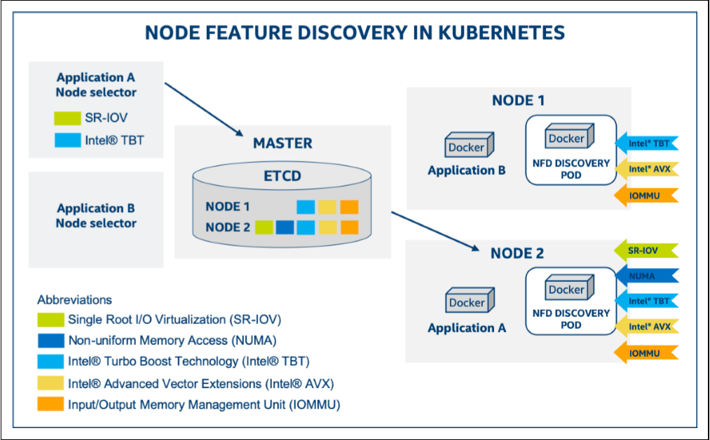

在`Kubernetes`集群中，有效识别节点**硬件特性**并进行自动标记是实现智能资源调度的关键前提。`Node Feature Discovery` (`NFD`)和`GPU Feature Discovery` (`GFD`)正是专为此目的设计的技术组件，它们的核心功能是自动检测集群中各节点的硬件与系统特性，并将这些信息转化为标准化的节点标签(`Node Labels`)。通过这些标签，`Kubernetes`调度器能够精确了解每个节点的能力边界，从而实现基于硬件感知的智能工作负载分配。本文将详细介绍这两种节点标记技术的背景、作用和实现原理，重点阐述它们如何通过自动化的硬件发现和标记机制优化集群资源利用。

## 1. Node Feature Discovery (NFD)

### 1.1 基本介绍



`Node Feature Discovery` (`NFD`)是`Kubernetes`的一个插件，用于自动检测节点的硬件特性和系统配置，并将这些信息以标签(`labels`)的形式添加到`Kubernetes`节点对象上。`NFD`是`Kubernetes SIG` (`Special Interest Group`)下的一个项目，目前已成为云原生计算基金会(`CNCF`)的沙箱项目。

- 官网地址：https://nfd.sigs.k8s.io/get-started/index.html
- 开源仓库：https://github.com/kubernetes-sigs/node-feature-discovery

### 1.2 背景与作用

在传统的`Kubernetes`环境中，管理员通常需要手动为节点添加标签以指示其特性，这不仅繁琐且容易出错，还难以跟上硬件变化。随着异构计算的普及，集群中可能包含各种不同硬件配置的节点，如`CPU`型号、`GPU`数量、特殊指令集支持等。

`NFD`的主要作用包括：

1. **自动发现硬件特性**：无需手动干预，自动检测节点的`CPU`、内存、存储、网络等硬件特性
2. **简化资源管理**：通过标准化的标签系统，简化集群管理和资源规划
3. **优化工作负载调度**：使调度器能够根据应用需求将`Pod`调度到最合适的节点上
4. **支持异构集群**：有效管理包含不同硬件配置的混合集群
5. **提高资源利用率**：通过精确匹配工作负载和硬件特性，提高整体资源利用效率

### 1.3 业务场景示例

为了更直观地理解`NFD`的必要性和实际价值，考虑以下业务场景：

#### 场景：混合计算集群中的机器学习工作负载调度

某金融科技公司拥有一个包含`50`个节点的`Kubernetes`集群，这些节点硬件配置各不相同：

- `20`个节点配备了`NVIDIA V100 GPU`，支持`CUDA 11.0`
- `15`个节点配备了`NVIDIA A100 GPU`，支持`CUDA 11.2`
- `10`个节点配备了`Intel Xeon`处理器，支持`AVX-512`指令集
- `5`个节点配备了`AMD EPYC`处理器，支持`AVX2`指令集

公司需要运行多种机器学习工作负载，包括：

1. **深度学习模型训练**：需要`CUDA 11.2`及以上版本，需要大内存GPU
2. **实时推理服务**：需要`CUDA`支持，但对版本要求不高
3. **数据预处理**：需要`AVX-512`指令集优化
4. **统计分析**：可在普通`CPU`节点运行

**未使用NFD的情况：**

在没有`NFD`的情况下，运维团队需要：

1. 手动调查并记录每个节点的硬件配置
2. 手动为每个节点添加标签，如`gpu=v100`、`gpu=a100`、`cpu=xeon-avx512`等
3. 当硬件升级或更换时，需要手动更新这些标签
4. 为每个工作负载编写复杂的`nodeSelector`或`nodeAffinity`规则

这个过程非常耗时、容易出错，并且难以维护。

**使用NFD的情况：**

部署`NFD`后：

1. `NFD`自动发现并标记所有节点的硬件特性，生成标准化的标签，如：
   ```yaml
   feature.node.kubernetes.io/cpu-model.family: "xeon"
   feature.node.kubernetes.io/cpu-feature.avx512f: "true"
   feature.node.kubernetes.io/pci-10de.present: "true"  # NVIDIA GPU存在
   ```

2. 开发团队可以使用这些标准标签来定义工作负载的调度规则，例如：

   ```yaml
   # 深度学习训练任务
   nodeSelector:
     feature.node.kubernetes.io/pci-10de.present: "true"  # 需要NVIDIA GPU
   nodeAffinity:
     requiredDuringSchedulingIgnoredDuringExecution:
       nodeSelectorTerms:
       - matchExpressions:
         - key: nvidia.com/gpu.compute.major
           operator: gt
           values: ["7"]  # 需要计算能力7.0以上的GPU
   ```

3. 当硬件变更时，`NFD`自动更新标签，无需手动干预

4. 运维团队可以通过查询这些标签快速了解集群的硬件组成：
   ```bash
   kubectl get nodes -o json | jq '.items[] | {name: .metadata.name, labels: .metadata.labels}' | grep feature.node.kubernetes.io
   ```

**效益：**

1. **运维效率提升**：节省了手动标记和维护标签的时间
2. **资源利用率提高**：工作负载能够自动调度到最合适的节点上
3. **减少错误**：避免了手动标记可能导致的错误
4. **灵活性提升**：当添加新节点或升级硬件时，无需额外的配置工作

这个场景展示了`NFD`如何在一个复杂的异构计算环境中自动化硬件发现和标记过程，从而显著提高运维效率和资源利用率。

### 1.4 实现原理

`NFD`由四个主要组件组成：

#### 1.4.1 NFD-Master

`NFD-Master`是负责与`Kubernetes API`通信的守护进程。它接收来自`NFD-Worker`的标签请求，并相应地修改节点对象。通常作为`Deployment`部署在集群中，只需要一个实例。

#### 1.4.2 NFD-Worker

`NFD-Worker`是负责特性检测的守护进程。它在每个节点上运行，检测节点的硬件和软件特性，然后将这些信息传递给`NFD-Master`进行实际的节点标记。通常作为`DaemonSet`部署，确保集群中的每个节点都运行一个实例。

#### 1.4.3 NFD-Topology-Updater

`NFD-Topology-Updater`是负责检查节点上已分配资源的守护进程，用于按区域(如`NUMA`节点)记录可分配给新`Pod`的资源。它创建或更新特定于该节点的`NodeResourceTopology`自定义资源对象。

#### 1.4.4 NFD-GC

`NFD-GC`是负责清理过时的`NodeFeature`和`NodeResourceTopology`对象的守护进程。在集群中通常只需要运行一个实例。

### 1.5 特性发现机制

`NFD`将特性发现分为多个特定领域的特性源：

- **CPU**：检测`CPU`型号、特性(如`AVX`, `AVX2`, `AVX512`)、拓扑等
- **内存**：检测`NUMA`拓扑、大页面支持等
- **存储**：检测本地存储类型、特性等
- **网络**：检测网络设备、特性等
- **PCI设备**：检测`PCI`设备，如`GPU`、网卡等
- **USB设备**：检测`USB`设备
- **系统**：检测操作系统、内核版本等
- **自定义**：基于规则的自定义特性
- **本地**：基于文件的特性

这些特性源负责检测一组特性，然后转换为节点特性标签。特性标签以`feature.node.kubernetes.io/`为前缀，并包含特性源的名称。

### 1.6 NFD支持的标签

以下是`NFD`支持的主要标签类别及其详细说明：

#### 1.6.1 CPU标签

| 标签名称 | 类型 | 描述 | 示例值 |
| --- | --- | --- | --- |
| `cpu-cpuid.<cpuid-flag>` | `boolean` | `CPU`支持特定指令集或功能 | `true` |
| `cpu-cpuid.<cpuid-attribute>` | `string` | `CPU`属性值 | `GenuineIntel` |
| `cpu-hardware_multithreading` | `boolean` | 硬件多线程(如`Intel HTT`)已启用 | `true` |
| `cpu-coprocessor.nx_gzip` | `boolean` | 支持用于`GZIP`的`Nest`加速器(`Power`架构) | `true` |
| `cpu-power.sst_bf.enabled` | `boolean` | `Intel SST-BF`(基础频率)已启用 | `true` |
| `cpu-pstate.status` | `string` | `Intel pstate`驱动程序状态 | `active` |
| `cpu-pstate.turbo` | `boolean` | `Intel pstate`驱动中的`turbo`频率是否启用 | `true` |
| `cpu-pstate.scaling_governor` | `string` | `Intel pstate`缩放调节器 | `performance` |
| `cpu-cstate.enabled` | `boolean` | `intel_idle`驱动中的`cstate`是否已设置 | `true` |
| `cpu-security.sgx.enabled` | `boolean` | `Intel SGX`在`BIOS`中已启用 | `true` |
| `cpu-security.se.enabled` | `boolean` | `IBM Secure Execution for Linux`可用并已启用 | `true` |
| `cpu-security.tdx.enabled` | `boolean` | `Intel TDX`在主机上可用并已启用 | `true` |
| `cpu-security.tdx.protected` | `boolean` | `Intel TDX`用于启动客户节点 | `true` |
| `cpu-security.sev.enabled` | `boolean` | `AMD SEV`在主机上可用并已启用 | `true` |
| `cpu-security.sev.es.enabled` | `boolean` | `AMD SEV-ES`在主机上可用并已启用 | `true` |
| `cpu-security.sev.snp.enabled` | `boolean` | `AMD SEV-SNP`在主机上可用并已启用 | `true` |
| `cpu-model.vendor_id` | `string` | `CPU`厂商`ID` | `GenuineIntel` |
| `cpu-model.family` | `integer` | `CPU`系列 | `6` |
| `cpu-model.id` | `integer` | `CPU`型号编号 | `85` |

**常见的x86 CPUID标志示例：**

| 标志 | 描述 |
| --- | --- |
| `AVX` | 高级向量扩展 |
| `AVX2` | 高级向量扩展2 |
| `AVX512F` | `AVX-512`基础指令集 |
| `AMXBF16` | 高级矩阵扩展，`BFLOAT16`数字的瓦片乘法操作 |
| `AMXINT8` | 高级矩阵扩展，8位整数的瓦片乘法操作 |

#### 1.6.2 内核标签

| 标签名称 | 类型 | 描述 | 示例值 |
| --- | --- | --- | --- |
| `kernel-config.<option>` | `boolean` | 内核配置选项已启用 | `true` |
| `kernel-selinux.enabled` | `boolean` | `Selinux`在节点上已启用 | `true` |
| `kernel-version.full` | `string` | 完整内核版本 | `5.15.0-76-generic` |
| `kernel-version.major` | `string` | 内核版本主要组件 | `5` |
| `kernel-version.minor` | `string` | 内核版本次要组件 | `15` |
| `kernel-version.revision` | `string` | 内核版本修订组件 | `0` |

#### 1.6.3 内存标签

| 标签名称 | 类型 | 描述 | 示例值 |
| --- | --- | --- | --- |
| `memory-numa` | `boolean` | 检测到多个内存节点(`NUMA`架构) | `true` |
| `memory-nv.present` | `boolean` | 存在`NVDIMM`设备 | `true` |
| `memory-nv.dax` | `boolean` | 存在配置为`DAX`模式的`NVDIMM`区域 | `true` |
| `memory-swap.enabled` | `boolean` | 节点上已启用交换空间 | `true` |

#### 1.6.4 网络标签

| 标签名称 | 类型 | 描述 | 示例值 |
| --- | --- | --- | --- |
| `network-sriov.capable` | `boolean` | 存在支持`SR-IOV`的网络接口卡 | `true` |
| `network-sriov.configured` | `boolean` | 已配置`SR-IOV`虚拟功能 | `true` |

#### 1.6.5 PCI设备标签

| 标签名称 | 类型 | 描述 | 示例值 |
| --- | --- | --- | --- |
| `pci-<device label>.present` | `boolean` | 检测到`PCI`设备 | `true` |
| `pci-<device label>.sriov.capable` | `boolean` | 存在支持`SR-IOV`的`PCI`设备 | `true` |

#### 1.6.6 USB设备标签

| 标签名称 | 类型 | 描述 | 示例值 |
| --- | --- | --- | --- |
| `usb-<device label>.present` | `boolean` | 检测到`USB`设备 | `true` |

#### 1.6.7 存储标签

| 标签名称 | 类型 | 描述 | 示例值 |
| --- | --- | --- | --- |
| `storage-nonrotationaldisk` | `boolean` | 节点中存在非旋转磁盘(如`SSD`) | `true` |

#### 1.6.8 系统标签

| 标签名称 | 类型 | 描述 | 示例值 |
| --- | --- | --- | --- |
| `system-os_release.ID` | `string` | 操作系统标识符 | `ubuntu` |
| `system-os_release.VERSION_ID` | `string` | 操作系统版本标识符 | `22.04` |
| `system-os_release.VERSION_ID.major` | `string` | 操作系统版本ID的第一个组件 | `22` |
| `system-os_release.VERSION_ID.minor` | `string` | 操作系统版本ID的第二个组件 | `04` |

#### 1.6.9 自定义标签

| 标签名称 | 类型 | 描述 | 示例值 |
| --- | --- | --- | --- |
| `custom-rdma.capable` | `boolean` | 节点具有支持`RDMA`的网络适配器 | `true` |
| `custom-rdma.enabled` | `boolean` | 节点已加载运行`RDMA`流量所需的模块 | `true` |

### 1.7 标签示例

`NFD`生成的标签示例：

```yaml
feature.node.kubernetes.io/cpu-hardware_multithreading: "true"
feature.node.kubernetes.io/cpu-pstate.turbo: "true"
feature.node.kubernetes.io/kernel-version.full: "5.4.0-90-generic"
feature.node.kubernetes.io/memory-numa: "true"
feature.node.kubernetes.io/network-sriov.capable: "true"
feature.node.kubernetes.io/pci-10de.present: "true"  # NVIDIA GPU存在
feature.node.kubernetes.io/system-os_release.id: "ubuntu"
```

在上面的示例中，`pci-10de.present: "true"` 表示检测到`NVIDIA GPU`存在。这里的`10de`是`NVIDIA`公司在`PCI`设备中的供应商ID（`Vendor ID`）。

每个`PCI`设备都有一个由两部分组成的标识符：
1. 供应商ID（`Vendor ID`）：标识设备制造商
2. 设备ID（`Device ID`）：标识特定型号的设备

`10de`是`NVIDIA`公司在`PCI-SIG`（PCI特别兴趣小组）注册的官方供应商ID，所有`NVIDIA`的`GPU`设备在`PCI`总线上都会使用这个供应商ID。当`NFD`检测到`PCI`总线上有供应商ID为`10de`的设备时，就会生成这个标签，表示系统中存在`NVIDIA`的`GPU`设备。

`NFD`默认使用 `<class>_<vendor>` 的格式来标记`PCI`设备，其中：
- `<class>` 是`PCI`设备类别
- `<vendor>` 是供应商ID

其他常见的`PCI`供应商ID包括：
- `Intel`: `8086`
- `AMD`: `1022`
- `Mellanox/NVIDIA`网络: `15b3`

这种基于供应商ID的标签方式使`Kubernetes`能够精确识别节点上的硬件设备，从而实现更精细的工作负载调度。

### 1.8 监控指标

`NFD`提供了丰富的`Prometheus`监控指标，可用于监控和跟踪其各个组件的运行状态。
这些指标通过标准的`Prometheus接`口暴露，默认情况下在端口`8080`上的`/metrics`路径提供。每个`NFD`组件都有自己的一组监控指标。

参考链接：https://kubernetes-sigs.github.io/node-feature-discovery/v0.17/deployment/metrics.html

#### 1.8.1 NFD-Master监控指标

`NFD-Master`组件暴露以下监控指标，所有指标都使用`nfd_master`前缀：

| 指标名称 | 类型 | 描述 |
| --- | --- | --- |
| `nfd_master_build_info` | `Gauge` | `NFD-Master`的构建版本信息 |
| `nfd_master_node_update_requests_total` | `Counter` | `Master`处理的节点更新请求总数 |
| `nfd_master_node_feature_group_update_requests_total` | `Counter` | `Master`处理的集群特性更新请求总数 |
| `nfd_master_node_updates_total` | `Counter` | `Master`成功更新的节点总数 |
| `nfd_master_node_update_failures_total` | `Counter` | 节点更新失败的次数 |
| `nfd_master_node_labels_rejected_total` | `Counter` | 被`NFD-Master`拒绝的节点标签数量 |
| `nfd_master_node_extendedresources_rejected_total` | `Counter` | 被`NFD-Master`拒绝的节点扩展资源数量 |
| `nfd_master_node_taints_rejected_total` | `Counter` | 被`NFD-Master`拒绝的节点污点数量 |
| `nfd_master_nodefeaturerule_processing_duration_seconds` | `Histogram` | 处理`NodeFeatureRule`对象所需的时间 |
| `nfd_master_nodefeaturerule_processing_errors_total` | `Counter` | `NodeFeatureRule`处理错误的数量 |

#### 1.8.2 NFD-Worker监控指标

`NFD-Worker`组件暴露以下监控指标，所有指标都使用`nfd_worker`前缀：

| 指标名称 | 类型 | 描述 |
| --- | --- | --- |
| `nfd_worker_build_info` | `Gauge` | `NFD-Worker`的构建版本信息 |
| `nfd_worker_feature_discovery_duration_seconds` | `Histogram` | 发现特性所需的时间 |

#### 1.8.3 NFD-Topology-Updater监控指标

`NFD-Topology-Updater`组件暴露以下监控指标，所有指标都使用`nfd_topology_updater`前缀：

| 指标名称 | 类型 | 描述 |
| --- | --- | --- |
| `nfd_topology_updater_build_info` | `Gauge` | `NFD-Topology-Updater`的构建版本信息 |
| `nfd_topology_updater_scan_errors_total` | `Counter` | 扫描`Pod`资源分配时的错误数量 |

#### 1.8.4 NFD-GC监控指标

`NFD-GC`(垃圾回收)组件暴露以下监控指标，所有指标都使用`nfd_gc`前缀：

| 指标名称 | 类型 | 描述 |
| --- | --- | --- |
| `nfd_gc_build_info` | `Gauge` | `NFD-GC`的构建版本信息 |
| `nfd_gc_objects_deleted_total` | `Counter` | 垃圾回收的`NodeFeature`和`NodeResourceTopology`对象数量 |
| `nfd_gc_object_delete_failures_total` | `Counter` | 删除`NodeFeature`和`NodeResourceTopology`对象时的错误数量 |

#### 1.8.5 监控指标的使用

这些监控指标可以集成到`Prometheus`监控系统中，并通过`Grafana`等工具进行可视化展示。以下是一个简单的`Prometheus`配置示例：

```yaml
scrape_configs:
  - job_name: 'nfd'
    kubernetes_sd_configs:
    - role: pod
    relabel_configs:
    - source_labels: [__meta_kubernetes_pod_label_app_kubernetes_io_name]
      action: keep
      regex: node-feature-discovery
    - source_labels: [__address__]
      action: replace
      regex: ([^:]+)(?::\d+)?
      replacement: ${1}:8080
      target_label: __address__
    - source_labels: [__meta_kubernetes_pod_name]
      action: replace
      target_label: pod
```


## 2. GPU Feature Discovery (GFD)

### 2.1 基本介绍

`GPU Feature Discovery` (`GFD`)是`NVIDIA`开发的一个`Kubernetes`插件，专门用于自动发现和标记`NVIDIA GPU`的特性和能力。它是`NFD`的一个扩展，专注于提供更详细的`GPU`相关信息。`GFD`是`NVIDIA GPU Operator`的一个核心组件，但也可以独立部署和使用。

- 开源仓库：https://github.com/NVIDIA/k8s-device-plugin

### 2.2 背景与作用

随着人工智能和高性能计算工作负载在`Kubernetes`集群中的大规模部署，对`GPU`资源的精细化管理需求变得越来越迫切。不同型号和不同代的`GPU`具有各自的特点：

- 不同的计算能力（`Compute Capability`）
- 不同的内存大小和带宽
- 不同的架构特性（如`Tensor Core`、`RT Core`等）
- 不同的驱动和`CUDA`支持
- 不同的`MIG`（`Multi-Instance GPU`）配置能力

这些差异对于工作负载的性能和兼容性有显著影响。例如，某些深度学习模型可能需要特定的`CUDA`计算能力才能高效运行，或者需要足够的`GPU`内存来容纳大型模型。

`GFD`的主要作用包括：

1. **自动发现GPU特性**：自动检测节点上的`NVIDIA GPU`特性，无需手动配置
2. **提供详细的GPU元数据**：提供比`NFD`更详细的`GPU`信息，包括型号、架构、内存大小、计算能力等
3. **支持精确的GPU调度**：使调度器能够根据应用的特定需求选择最合适的`GPU`
4. **优化资源利用率**：通过精确匹配工作负载和`GPU`特性，提高集群资源利用率
5. **支持MIG技术**：对`NVIDIA Multi-Instance GPU` (`MIG`)技术提供特殊支持，实现`GPU`资源的细粒度划分
6. **与NFD无缝集成**：与`NFD`完美配合，扩展其`GPU`特性发现能力

### 2.3 实现原理

#### 2.3.1 架构概述

`GFD`作为`NFD`的插件运行，通过`NFD`的本地特性文件机制与`NFD`集成。它的架构设计专注于`GPU`特性的发现和标记。
`GFD`通常作为`DaemonSet`部署在集群中，只在具有`NVIDIA GPU`的节点上运行。它可以作为`NVIDIA GPU Operator`的一个组件部署，也可以独立部署。

#### 2.3.2 工作流程

`GFD`的工作流程如下：

1. **初始化**：`GFD`容器启动并初始化`NVML`（`NVIDIA Management Library`）
2. **检测GPU设备**：使用`NVML`检测节点上的所有`NVIDIA GPU`设备
3. **收集GPU信息**：对每个检测到的`GPU`，收集详细信息：
   - 产品名称和型号
   - 架构和计算能力
   - 内存大小和带宽
   - 驱动版本和`CUDA`版本
   - `MIG`配置和能力（如果支持）
4. **生成标签**：将收集到的信息转换为`Kubernetes`标签格式，使用`nvidia.com/`前缀
5. **写入特性文件**：将标签写入`NFD`指定的本地特性文件目录（通常为`/etc/kubernetes/node-feature-discovery/features.d/`）
6. **与NFD集成**：`NFD-Worker`读取这些特性文件，并将信息发送给`NFD-Master`
7. **标记节点**：`NFD-Master`将这些标签应用到节点对象上
8. **周期性更新**：`GFD`会定期重新检测`GPU`信息，以响应可能的硬件变化（如`MIG`配置更改）

#### 2.3.3 与NFD的集成

`GFD`与`NFD`的集成是通过`NFD`的本地特性文件机制实现的：

1. `GFD`将发现的`GPU`特性写入一个`JSON`格式的特性文件
2. 该文件位于`NFD`指定的特性文件目录中
3. `NFD-Worker`会自动扫描该目录并读取特性文件
4. 特性信息被发送到`NFD-Master`并应用到节点上

这种集成方式使`GFD`能够专注于`GPU`特性的发现，而将标签管理的职责留给`NFD`，形成了清晰的职责分离。

### 2.4 GFD支持的标签

#### 2.4.1 标签命名规则

`GFD`生成的所有标签都使用`nvidia.com/`前缀，这与`NFD`使用的`feature.node.kubernetes.io/`前缀不同。这种命名方式可以清晰地区分不同来源的标签，并确保标签的唯一性。

| 标签 | 类型 | 说明 | 示例值 |
| --- | --- | --- | --- |
| `nvidia.com/gpu.count` | `integer` | 节点上的`GPU`数量 | `8` |
| `nvidia.com/gpu.present` | `boolean` | 节点上是否存在`NVIDIA GPU` | `true` |
| `nvidia.com/gpu.product` | `string` | `GPU`型号的完整名称 | `NVIDIA-A100-SXM4-40GB` |
| `nvidia.com/gpu.memory` | `integer` | `GPU`内存大小（MiB，单卡） | `40960` |
| `nvidia.com/gpu.family` | `string` | `GPU`架构系列 | `ampere` |
| `nvidia.com/gpu.compute.major` | `integer` | `GPU`计算能力主版本 | `8` |
| `nvidia.com/gpu.compute.minor` | `integer` | `GPU`计算能力次版本 | `0` |
| `nvidia.com/gpu.machine` | `string` | 节点机器型号 | `NVIDIA-DGX-A100` |
| `nvidia.com/gpu.mode` | `string` | `GPU`工作模式（`compute`或`display`） | `compute` |
| `nvidia.com/gpu.replicas` | `integer` | `GPU`副本数量（用于时间切片时会大于1） | `1` |
| `nvidia.com/gpu.clique` | `string` | `GPUFabric`集群`UUID`和群组ID | `7b968a6d-c8aa-45e1-9e07-e1e51be99c31.1` |

**CUDA相关标签**：

| 标签 | 类型 | 说明 | 示例值 |
| --- | --- | --- | --- |
| `nvidia.com/cuda.driver-version.major` | `integer` | `CUDA`驱动主版本 | `550` |
| `nvidia.com/cuda.driver-version.minor` | `integer` | `CUDA`驱动次版本 | `107` |
| `nvidia.com/cuda.driver-version.revision` | `integer` | `CUDA`驱动修订版本 | `02` |
| `nvidia.com/cuda.driver-version.full` | `string` | `CUDA`驱动完整版本 | `550.107.02` |
| `nvidia.com/cuda.runtime-version.major` | `integer` | `CUDA`运行时主版本 | `12` |
| `nvidia.com/cuda.runtime-version.minor` | `integer` | `CUDA`运行时次版本 | `5` |
| `nvidia.com/cuda.runtime-version.full` | `string` | `CUDA`运行时完整版本 | `12.5` |

**废弃的CUDA标签**（向后兼容）：

| 标签 | 类型 | 说明 | 示例值 |
| --- | --- | --- | --- |
| `nvidia.com/cuda.driver.major` | `integer` | （已废弃）`CUDA`驱动主版本 | `550` |
| `nvidia.com/cuda.driver.minor` | `integer` | （已废弃）`CUDA`驱动次版本 | `107` |
| `nvidia.com/cuda.driver.rev` | `integer` | （已废弃）`CUDA`驱动修订版本 | `02` |
| `nvidia.com/cuda.runtime.major` | `integer` | （已废弃）`CUDA`运行时主版本 | `12` |
| `nvidia.com/cuda.runtime.minor` | `integer` | （已废弃）`CUDA`运行时次版本 | `5` |

**特性支持标签**：

| 标签 | 类型 | 说明 | 示例值 |
| --- | --- | --- | --- |
| `nvidia.com/mig.capable` | `boolean` | 是否支持`MIG`（多实例 `GPU`）功能 | `true` |
| `nvidia.com/mps.capable` | `boolean` | 是否支持`MPS`（多进程服务）功能 | `true` |
| `nvidia.com/vgpu.present` | `boolean` | 是否支持`vGPU`功能 | `false` |
| `nvidia.com/gpu.sharing-strategy` | `string` | `GPU`共享策略类型 | `none` |
| `nvidia.com/gfd.timestamp` | `integer` | `GPU`特征发现的时间戳 | `1736224460` |

**MIG相关标签**（当启用`MIG`功能时）：

| 标签 | 类型 | 说明 | 示例值 |
| --- | --- | --- | --- |
| `nvidia.com/mig.strategy` | `string` | 使用的`MIG`策略（`single`或`mixed`） | `single` |
| `nvidia.com/gpu.multiprocessors` | `integer` | `MIG`设备的流处理器数量 | `14` |
| `nvidia.com/gpu.slices.gi` | `integer` | `GPU`实例切片数量 | `1` |
| `nvidia.com/gpu.slices.ci` | `integer` | 计算实例切片数量 | `1` |
| `nvidia.com/gpu.engines.copy` | `integer` | `MIG`设备的`DMA`引擎数量 | `1` |
| `nvidia.com/gpu.engines.decoder` | `integer` | `MIG`设备的解码器数量 | `1` |
| `nvidia.com/gpu.engines.encoder` | `integer` | `MIG`设备的编码器数量 | `1` |
| `nvidia.com/gpu.engines.jpeg` | `integer` | `MIG`设备的`JPEG`引擎数量 | `0` |
| `nvidia.com/gpu.engines.ofa` | `integer` | `MIG`设备的`OFA`引擎数量 | `0` |


#### 2.4.5 标签的使用场景

这些标签可以在多种场景中使用：

1. **精确调度**：根据工作负载的特定需求选择合适的`GPU`
   ```yaml
   nodeSelector:
     nvidia.com/gpu.family: "ampere"
     nvidia.com/gpu.memory: "40960"
   ```

2. **资源限制**：限制工作负载只能运行在特定类型的`GPU`上
   ```yaml
   nodeSelector:
     nvidia.com/gpu.compute.major: "8"
   ```

3. **MIG配置选择**：选择具有特定 `MIG` 配置的节点
   ```yaml
   nodeSelector:
     nvidia.com/mig.capable: "1"
     nvidia.com/gpu.slices.gi.3: "2"
   ```

4. **多媒体处理**：选择具有特定多媒体处理能力的`GPU`
   ```yaml
   nodeSelector:
     nvidia.com/gpu.engines.decoder: "2"
   ```

### 2.5 标签示例

#### 2.5.1 不同型号GPU的标签示例

以下展示了不同型号GPU的`GFD`标签示例，这些标签反映了各自的硬件特性和能力。

##### Tesla V100 GPU标签示例

```yaml
nvidia.com/gpu.count: "2"
nvidia.com/gpu.product: "Tesla-V100-SXM2-16GB"
nvidia.com/gpu.memory: "16384"
nvidia.com/gpu.family: "volta"
nvidia.com/gpu.compute.major: "7"
nvidia.com/gpu.compute.minor: "0"
nvidia.com/gpu.driver.version: "460.32.03"
nvidia.com/gpu.cuda.version: "11.2"
nvidia.com/gpu.arch: "Volta"
nvidia.com/gpu.machine: "DGX-1"
```

##### A100 GPU标签示例（启用MIG）

```yaml
nvidia.com/gpu.count: "1"
nvidia.com/gpu.product: "NVIDIA-A100-SXM4-40GB"
nvidia.com/gpu.memory: "40960"
nvidia.com/gpu.family: "ampere"
nvidia.com/gpu.compute.major: "8"
nvidia.com/gpu.compute.minor: "0"
nvidia.com/gpu.driver.version: "535.104.05"
nvidia.com/gpu.cuda.version: "12.2"
nvidia.com/gpu.arch: "Ampere"
nvidia.com/gpu.machine: "HGX"
nvidia.com/mig.capable: "1"
nvidia.com/mig.strategy: "single"
nvidia.com/gpu.slices.gi: "7"
nvidia.com/gpu.slices.ci: "7"
nvidia.com/gpu.multiprocessors: "108"
nvidia.com/gpu.slices.gi.1: "7"
nvidia.com/gpu.slices.gi.2: "3"
nvidia.com/gpu.slices.gi.3: "2"
nvidia.com/gpu.slices.gi.7: "1"
nvidia.com/gpu.engines.copy: "4"
nvidia.com/gpu.engines.decoder: "5"
nvidia.com/gpu.engines.encoder: "1"
```

##### H100 GPU标签示例

```yaml
nvidia.com/gpu.count: "8"
nvidia.com/gpu.product: "NVIDIA-H100-SXM5-80GB"
nvidia.com/gpu.memory: "81920"
nvidia.com/gpu.family: "hopper"
nvidia.com/gpu.compute.major: "9"
nvidia.com/gpu.compute.minor: "0"
nvidia.com/gpu.driver.version: "535.129.03"
nvidia.com/gpu.cuda.version: "12.2"
nvidia.com/gpu.arch: "Hopper"
nvidia.com/gpu.machine: "HGX-H100"
nvidia.com/mig.capable: "1"
nvidia.com/gpu.multiprocessors: "132"
nvidia.com/gpu.engines.copy: "8"
nvidia.com/gpu.engines.decoder: "8"
nvidia.com/gpu.engines.encoder: "3"
nvidia.com/gpu.engines.jpeg: "2"
nvidia.com/gpu.engines.ofa: "1"
```

#### 2.5.2 如何查看节点标签

可以使用以下命令查看节点上的`GFD`生成的标签：

```bash
# 查看所有节点的GPU相关标签
kubectl get nodes -o json | jq '.items[] | {name: .metadata.name, labels: .metadata.labels | with_entries(select(.key | startswith("nvidia.com")))}'

# 查看特定节点的GPU相关标签
kubectl get node <node-name> -o json | jq '.metadata.labels | with_entries(select(.key | startswith("nvidia.com")))'
```

#### 2.5.3 标签的实际应用

使用这些标签可以实现精确的工作负载调度，例如：

```yaml
# 深度学习训练任务，需要A100或H100 GPU
apiVersion: v1
kind: Pod
metadata:
  name: dl-training
spec:
  containers:
  - name: training
    image: tensorflow/tensorflow:latest-gpu
    resources:
      limits:
        nvidia.com/gpu: 1
  nodeSelector:
    nvidia.com/gpu.family: "ampere"
    nvidia.com/gpu.memory: "81920"
```

```yaml
# 视频编码任务，需要多个编码器引擎
apiVersion: v1
kind: Pod
metadata:
  name: video-encoder
spec:
  containers:
  - name: encoder
    image: nvidia/cuda:12.2.0-runtime-ubuntu22.04
    resources:
      limits:
        nvidia.com/gpu: 1
  nodeSelector:
    nvidia.com/gpu.engines.encoder: "3"
```

## 3. NFD与GFD的协同工作

`NFD`和`GFD`协同工作，为`Kubernetes`提供全面的节点特性信息，特别是在`GPU`资源管理方面：

1. **分层特性发现**：NFD提供基础的节点特性发现，包括检测`GPU`的存在；`GFD`在此基础上提供更详细的`GPU`特性信息
2. **标签命名空间分离**：`NFD`使用`feature.node.kubernetes.io/`前缀，而`GFD`使用`nvidia.com/`前缀，避免冲突
3. **部署协同**：两者通常一起部署，特别是在`NVIDIA GPU Operator`中，它会自动部署和配置这两个组件
4. **调度协同**：调度器可以同时使用`NFD`和`GFD`提供的标签来做出更精确的调度决策


## 4. 参考资料

### 4.1 NFD相关资料
- [Node Feature Discovery 官方文档](https://nfd.sigs.k8s.io/)
- [Node Feature Discovery GitHub 仓库](https://github.com/kubernetes-sigs/node-feature-discovery)
- [NFD 安装指南](https://kubernetes-sigs.github.io/node-feature-discovery/stable/get-started/deployment-and-usage.html)

### 4.2 NVIDIA相关资料
- [GPU Feature Discovery GitHub 仓库](https://github.com/NVIDIA/gpu-feature-discovery)
- [NVIDIA GPU Operator 文档](https://docs.nvidia.com/datacenter/cloud-native/gpu-operator/latest/)
- [NVIDIA Device Plugin GitHub 仓库](https://github.com/NVIDIA/k8s-device-plugin)

### 4.3 Kubernetes官方资料
- [Kubernetes 官方文档 - 调度 GPU](https://kubernetes.io/docs/tasks/manage-gpus/scheduling-gpus/)
- [Kubernetes Device Plugin 机制](https://kubernetes.io/docs/concepts/extend-kubernetes/compute-storage-net/device-plugins/)
