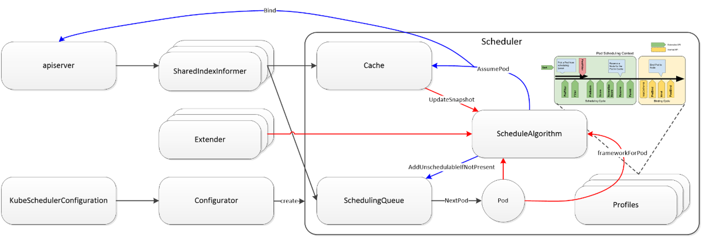

## 基本介绍

[Volcano](https://volcano.sh/zh/docs/) 是一个基于`Kubernetes`的批处理平台，提供了机器学习、深度学习、生物信息学、基因组学及其他大数据应用所需要而`Kubernetes`当前缺失的一系列特性，提供了高性能任务调度引擎、高性能异构芯片管理、高性能任务运行管理等通用计算能力。


### 核心组件

`Volcano`由以下几个核心组件组成，各自承担不同的功能职责：

1. **`Volcano Controller Manager`**：负责管理`Volcano`自定义资源的生命周期，监控和处理`Job`、`Queue`、`PodGroup`等资源的状态变化。

2. **`Volcano Scheduler`**：实现高级调度功能，如`Gang Scheduling`（组调度）、队列调度和优先级调度，通过插件化架构提供灵活的调度策略配置。

3. **`Volcano Admission`**：验证`Volcano`资源对象的合法性，为资源对象设置默认值，实现准入控制，确保提交的作业符合系统策略。

4. **`Volcano MutatingAdmission`**：修改资源对象的配置，如添加标签、注解等，自动注入环境变量和配置信息。

5. **`Volcano Agent`**（可选组件）：在节点上收集资源使用情况和硬件信息，为调度器提供更精确的节点资源信息，支持 GPU、FPGA 等异构资源的管理。

### 组件交互关系

下图展示了`Volcano`各组件之间的交互关系及数据流向：


`Volcano`的各个组件之间通过清晰的职责划分和有效的协作实现了完整的调度系统：

1. **用户提交流程**：用户提交作业→`Admission`验证 →`Controller`处理 →`Scheduler`调度 →`Kubelet`执行

2. **状态监控与管理**：
   -`Controller Manager`监控所有`Volcano`自定义资源的状态变化
   - 根据资源状态变化，触发相应的事件处理
   - 当需要重调度或清理资源时，通知`Scheduler`进行相应操作

3. **调度决策过程**：
   -`Scheduler`根据`Queue`配置和系统状态，为`PodGroup`分配资源
   - 通过插件化架构，实现不同的调度策略和算法
   - 支持`Gang Scheduling`，确保相关联的`Pod`要么全部调度成功，要么全部失败

4. **资源信息收集**：
   -`Agent`(如果启用) 提供节点资源信息，辅助调度决策
   - 特别是对于 GPU、FPGA 等异构资源，提供更精确的资源状态

5. **资源对象之间的关系**：
   -`Job`包含多个`Task`，每个`Task`对应一组相同角色的`Pod`
   -`PodGroup`作为调度的基本单位，表示一组需要同时调度的`Pod`
   -`Queue`容纳多个`PodGroup`，并控制这些`PodGroup`的资源分配和调度策略

这种组件化设计使`Volcano`能够灵活应对不同的工作负载需求，并且可以通过扩展插件来增强系统能力。

## Scheduler

### kubernetes deault scheduler
`kubernetes`当然有默认的pod调度器，但是其并不适应AI作业任务需求。在多机训练任务中，一个AI作业可能需要同时创建上千个甚至上万个pod，而只有当所有pod当创建完成后，AI作业才能开始运行，而如果有几个pod创建失败，已经创建成功的pod就应该退出并释放资源，否则便会产生资源浪费的情况。因此Ai作业的pod调度应该遵循`All or nothing`的理念，即要不全部调度成功，否则应一个也不调度。这便是`Volcano`项目的由来（前身是`kube-batch`项目），接下来便来介绍`Volcano`的调度。



### Volcano Scheduler

`Volcano Scheduler`是负责`Pod`调度的组件，它由一系列`action`和`plugin`组成。`action`定义了调度各环节中需要执行的动作；`plugin`根据不同场景提供了`action`中算法的具体实现细节。`Volcano Scheduler`具有高度的可扩展性，您可以根据需要实现自己的`action`和`plugin`。


`Volcano Scheduler`的工作流程如下：

1.  客户端提交的`Job`被调度器识别到并缓存起来。
2.  周期性开启会话，一个调度周期开始。
3.  将没有被调度的`Job`发送到会话的待调度队列中。
4.  遍历所有的待调度`Job`，按照定义的次序依次执行`enqueue`、`allocate`、`preempt`、`reclaim`、`backfill`等动作，为每个`Job`找到一个最合适的节点。将该`Job`绑定到这个节点。`action`中执行的具体算法逻辑取决于注册的`plugin`中各函数的实现。
5.  关闭本次会话。


### Volcano自定义资源

*  `Pod`组（`PodGroup`）：`Pod`组是`Volcano`自定义资源类型，代表一组强关联`Pod`的集合，主要用于批处理工作负载场景，比如`Tensorflow`中的一组`ps`和`worker`。这主要解决了`Kubernetes`原生调度器中单个`Pod`调度的限制。
*   队列（`Queue`）：容纳一组`PodGroup`的队列，也是该组`PodGroup`获取集群资源的划分依据。它允许用户根据业务需求或优先级，将作业分组到不同的队列中。
*   作业（`Volcano Job`，简称`vcjob`）：`Volcano`自定义的`Job`资源类型，它扩展了`Kubernetes`的`Job`资源。区别于`Kubernetes Job`，`vcjob`提供了更多高级功能，如可指定调度器、支持最小运行`Pod`数、支持`task`、支持生命周期管理、支持指定队列、支持优先级调度等。`Volcano Job`更加适用于机器学习、大数据、科学计算等高性能计算场景。

### Volcano Scheduler使用示例


#### 配置 Deployment 使用 Volcano 控制资源使用

这里举一个示例，限制`Deployment`最多仅能使用 2 核 CPU。

1. 创建队列
   ```yaml
    apiVersion: scheduling.volcano.sh/v1beta1
    kind: Queue
    metadata:
      name: my-node-queue
    spec:
      weight: 1
      reclaimable: false
      capability:
        cpu: 2
   ```
    创建一个仅有 2 核 CPU、并且绑定到节点组`my-node-group`的队列。这里的`weight`表示集群资源划分中所占的相对比重，是软约束;`reclaimable`表示是否允许被回收，由`weight`来决定;`capability`表示队列的资源限制。

2. 创建`Deployment`
   ```yaml
    apiVersion: apps/v1
    kind: Deployment
    metadata:
      name: ubuntu-with-volcano
      labels:
        app: demo
    spec:
      replicas: 1
      selector:
        matchLabels:
          app: demo
      template:
        metadata:
          labels:
            app: demo
        spec:
          schedulerName: volcano
          containers:
            - name: demo
              image: shaowenchen/demo-ubuntu
              resources:
                requests:
                  cpu: 1
   ```
    将`schedulerName`设置为`volcano，表示使用``Volcano`调度器。

3. 查看`Pod`
   ```bash
    $ kubectl get pods -l app=demo
    NAME                                  READY   STATUS    RESTARTS   AGE
    ubuntu-with-volcano-97c94f9fb-bfgrh   1/1     Running   0          6m24s
   ```
4. 扩容`Deployment`
   ```bash
    $ kubectl scale deployment/ubuntu-with-volcano --replicas=3
   ```
    此时，三个 Pod 只有两个处于 Running 状态，因为 Volcano 限制了 Deployment 最多仅能使用 2c CPU。
   ```bash
    $ kubectl get pods -l app=demo

    NAME                                  READY   STATUS    RESTARTS   AGE
    ubuntu-with-volcano-97c94f9fb-25nb7   1/1     Running   0          27s
    ubuntu-with-volcano-97c94f9fb-6fd64   0/1     Pending   0          27s
    ubuntu-with-volcano-97c94f9fb-bfgrh   1/1     Running   0          7m31s
   ```

#### 配置`Job`使用`Volcano`限流并发执行

这里创建一个`Job`并且要求至少 3 个`Pod`一起运行的`Job。`

直接使用`Kubernetes batch/v1`中的`Job`，配置`completions`和`parallelism`，也可以实现这个需求。但`Volcano`提供的`Queue`可以控制资源使用、`Policy`可以控制`Task`的生命周期策略，能更精准控制`Job`的执行。

1. 创建`Job`
   ```yaml
    apiVersion: batch.volcano.sh/v1alpha1
    kind: Job
    metadata:
      name: my-job
    spec:
      minAvailable: 3
      schedulerName: volcano
      queue: default
      policies:
        - event: PodEvicted
          action: RestartJob
      tasks:
        - replicas: 30
          name: demo
          policies:
          - event: TaskCompleted
            action: CompleteJob
          template:
            spec:
              containers:
                - image: ubuntu
                  name: demo
                  command: ["sleep", "5"]
                  resources:
                    requests:
                      cpu: 20
              restartPolicy: Never
    ```
    其中:
    ```yaml
    policies:
      - event: PodEvicted
        action: RestartJob
    ```
    表示如果`Pod`被`Evict`了，就重启`Job`。
    ```yaml
    policies:
      - event: TaskCompleted
        action: CompleteJob
    ```
    表示如果`Task`完成了，就完成`Job`。

    通过`Event`和`Action`，可以控制`Job`的状态和行为。

2. 查看`Pod`创建情况
    ```bash
    $ kubectl get pod

    NAME                            READY   STATUS    RESTARTS   AGE
    my-job-demo-0                   1/1     Running   0          7s
    my-job-demo-1                   1/1     Running   0          7s
    my-job-demo-10                  0/1     Pending   0          7s
    ...
    my-job-demo-2                   1/1     Running   0          7s
    ...
    ```
    由于我设置了`Pod`的`CPU Request`为 20，集群上没有足够的资源，所以 30 个`Pod`每次只能运行 3 个。

    执行完成之后，`Pod`不会被删除而是处于`Completed`状态。由于`Pod`的`ownerReferences`是`Job`，如果删除`Job`，`Pod`也会被删除。


## Volcano 注解

`Volcano`提供了一系列注解（`Annotations`），可以应用于`Pod`或`PodGroup`资源，用于控制调度行为和资源分配。这些注解提供了一种简单而强大的方式来影响`Volcano`的调度决策，而无需修改复杂的配置文件或自定义资源定义。

### 常用注解及其作用

| 注解 | 适用对象 | 作用 | 示例值 |
|------|---------|------|--------|
|`volcano.sh/queue-name`|`Pod, PodGroup`| 指定资源应该被分配到哪个队列 |`"default"`|
|`volcano.sh/preemptable`|`Pod`| 标记`Pod`是否可被抢占 |`"true"`,`"false"`|
|`volcano.sh/task-spec`|`Pod`| 指定`Pod`所属的任务类型 |`"default"`|
|`volcano.sh/num-pods`|`PodGroup`| 指定`PodGroup`中需要的`Pod`数量 |`"5"`|
|`volcano.sh/min-available`|`PodGroup`| 指定`PodGroup`最小可用`Pod`数量 |`"3"`|
|`volcano.sh/priorityClassName`|`PodGroup`| 指定`PodGroup`的优先级类名 |`"high-priority"`|
|`volcano.sh/resource-reservation`|`PodGroup`| 是否为`PodGroup`预留资源 |`"true"`,`"false"`|
|`volcano.sh/job-type`|`PodGroup`| 指定作业类型，影响调度策略 |`"MPI"`,`"TensorFlow"`|

### 注解使用示例

1. **将`Pod`分配到特定队列**

    ```yaml
    apiVersion: v1
    kind: Pod
    metadata:
      name: example-pod
      annotations:
        volcano.sh/queue-name: "high-priority-queue"
    spec:
      schedulerName: volcano
      containers:
      - name: example-container
        image: nginx
    ```

2. **设置`PodGroup`的最小可用数量**

    ```yaml
    apiVersion: scheduling.volcano.sh/v1beta1
    kind: PodGroup
    metadata:
      name: example-podgroup
      annotations:
        volcano.sh/min-available: "3"
    spec:
      minMember: 5
      queue: default
    ```

3. **标记 Pod 为可抢占**

    可抢占（`Preemptable`）是`Volcano`中的一个重要概念，它允许集群在资源紧张时为高优先级任务让出资源。当标记为可抢占时：
    
    - 该`Pod`可能会在运行过程中被终止，以释放资源给更高优先级的任务
    - 适用于容错性高、可以中断的工作负载，如批处理任务、后台分析等
    - 可以提高集群资源利用率，允许低优先级任务在资源空闲时运行，高优先级任务来时自动让出

    ```yaml
    apiVersion: v1
    kind: Pod
    metadata:
      name: preemptable-pod
      annotations:
        volcano.sh/preemptable: "true"
    spec:
      schedulerName: volcano
      containers:
      - name: example-container
        image: nginx
    ```
    
    当集群资源紧张时，调度器会优先抢占标记为`volcano.sh/preemptable: "true"`的`Pod`，而不是随机选择。这使得集群管理员可以明确指定哪些工作负载可以被安全地中断。

### 注解的优势

使用注解控制`Volcano`行为有以下优势：

1. **简单易用**：无需创建复杂的自定义资源，只需添加注解即可
2. **灵活性**：可以针对单个`Pod`或`PodGroup`进行精细控制
3. **兼容性**：与现有`Kubernetes`工作负载控制器（如`Deployment`、`StatefulSet`）良好集成
4. **动态调整**：可以通过更新注解动态调整调度行为，而无需重启组件

通过合理使用这些注解，用户可以更精细地控制`Volcano`的调度行为，满足不同场景下的资源分配和调度需求。


## Queue 资源队列

`Queue`是`Volcano`调度系统中的核心概念，用于管理和分配集群资源。它充当了资源池的角色，允许管理员将集群资源划分给不同的用户组或应用场景。

### Queue 的作用

1. **资源隔离与划分**
   - 将集群资源划分给不同的用户组或业务线
   - 防止一个应用或用户组消耗过多资源影响其他应用

2. **资源配额与限制**
   - 为队列设置资源上限（`capability`）
   - 控制队列可以使用的最大`CPU`、内存、`GPU`等资源量

3. **优先级和权重管理**
   - 通过`weight`属性设置队列的相对重要性
   - 当资源竞争时，根据权重比例分配资源

4. **资源回收策略**
   - 通过`reclaimable`属性控制队列资源是否可被回收（被其他队列借用）
   - 当集群资源紧张时，决定哪些队列的资源可以被抢占

### Queue 配置示例

下面是一个定义三个不同队列的示例，分别用于生产、开发和测试环境：

```yaml
apiVersion: scheduling.volcano.sh/v1beta1
kind: Queue
metadata:
  name: production
spec:
  weight: 10       # 高权重，资源竞争时获得更多资源
  reclaimable: false  # 资源不可被回收
  capability:
    cpu: 100       # 最多使用 100 核 CPU
    memory: 500Gi  # 最多使用 500Gi 内存
    nvidia.com/gpu: 10  # 最多使用 10 个 GPU

---

apiVersion: scheduling.volcano.sh/v1beta1
kind: Queue
metadata:
  name: development
spec:
  weight: 5        # 中等权重
  reclaimable: true   # 资源可被回收
  capability:
    cpu: 50        # 最多使用 50 核 CPU
    memory: 200Gi  # 最多使用 200Gi 内存

---

apiVersion: scheduling.volcano.sh/v1beta1
kind: Queue
metadata:
  name: testing
spec:
  weight: 2        # 低权重
  reclaimable: true   # 资源可被回收
  capability:
    cpu: 20        # 最多使用 20 核 CPU
    memory: 100Gi  # 最多使用 100Gi 内存
```

### 使用 Queue 的方法

1. **在 Pod 中指定队列**

   通过注解指定：
   ```yaml
   metadata:
     annotations:
      volcano.sh/queue-name: "production"
   ```

2. **在 PodGroup 中指定队列**

   直接在`spec`中指定：
   ```yaml
   apiVersion: scheduling.volcano.sh/v1beta1
   kind: PodGroup
   metadata:
     name: ml-training
   spec:
     minMember: 5
     queue: production  # 指定使用 production 队列
   ```

3. **在 Volcano Job 中指定队列**

   ```yaml
   apiVersion: batch.volcano.sh/v1alpha1
   kind: Job
   metadata:
     name: tensorflow-training
   spec:
     minAvailable: 3
     schedulerName: volcano
     queue: production  # 指定使用 production 队列
   ```

### Queue 的实际应用场景

1. **多租户环境**
   - 为不同部门或团队创建独立队列
   - 确保每个部门都有公平的资源分配

2. **优先级划分**
   - 为关键业务创建高权重队列
   - 为非关键任务创建可回收队列

3. **资源限制**
   - 防止单个应用消耗过多集群资源
   - 为不同类型的工作负载设置适当的资源上限

`Queue`机制是`Volcano`实现多租户资源管理和公平调度的关键组件，它使得集群管理员可以更精细地控制资源分配策略，提高集群资源利用率和用户满意度。

## 参考资料
- https://volcano.sh/