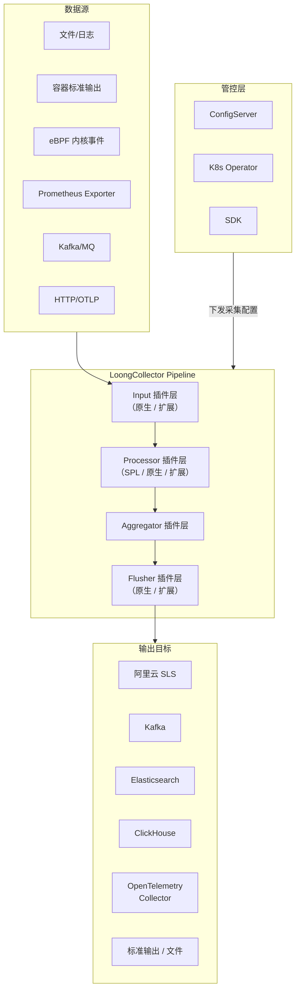

## 什么是 LoongCollector

`LoongCollector`是阿里云可观测团队开源的新一代高性能数据采集器，其前身为`iLogtail`项目。`LoongCollector`在继承`iLogtail`强大日志采集与处理能力的基础上进行了全面升级，从原来单一的日志采集场景扩展为涵盖 **日志（`Logs`）、指标（`Metrics`）、链路（`Traces`）、事件（`Events`）、性能剖析（`Profiles`）** 的统一可观测数据采集与处理平台。

> **项目地址：**[https://github.com/alibaba/loongcollector](https://github.com/alibaba/loongcollector)

品牌名称`LoongCollector`灵感源自东方神话中的"中国龙"（`Loong`）形象，`Logo` 中两个字母`O`如同灵动的双眼。这与`LoongCollector`的设计理念高度契合：龙眼代表全面精准的数据洞察力；龙的灵活身躯象征对多变环境的高度适应性；龙的强大力量象征在高强度负载下卓越的性能与稳定性。

`LoongCollector`是`LoongSuite`（阿里巴巴统一可观测数据采集套件）的核心节点级`Agent`组件。`LoongSuite`还包括：

- [LoongSuite Java Agent](https://github.com/alibaba/loongsuite-java-agent)：为 `Java` 应用提供进程级探针
- [LoongSuite Go Agent](https://github.com/alibaba/loongsuite-go-agent)：为 `Golang` 应用提供编译期插桩
- [LoongSuite Python Agent](https://github.com/alibaba/loongsuite-python-agent)：为 `Python` 应用提供进程级探针

## 核心特性

### 极致性能

`LoongCollector`在性能方面拥有显著优势。根据官方基准测试数据，其吞吐量相比其他主流采集器高出约 **`10倍`**，而资源消耗降低约 **`80%`**。

| 场景 | LoongCollector | Filebeat | Fluentd | Logstash |
|---|---|---|---|---|
| 单行日志最大吞吐 | `546 MB/s` | `36 MB/s` | `38 MB/s` | `9 MB/s` |
| 多行日志最大吞吐 | `238 MB/s` | `24 MB/s` | `22 MB/s` | `6 MB/s` |
| 正则解析最大吞吐 | `68 MB/s` | `19 MB/s` | `12 MB/s` | `不支持` |

在 `10 MB/s` 处理负载下的资源消耗对比：

| 场景 | LoongCollector | Filebeat | Fluentd |
|---|---|---|---|
| 单行（`512B`） | `3.40% CPU / 29 MB RAM` | `12.29% CPU / 47 MB RAM` | `35.80% CPU / 83 MB RAM` |
| 多行（`512B`） | `5.82% CPU / 29 MB RAM` | `28.35% CPU / 46 MB RAM` | `55.99% CPU / 85 MB RAM` |
| 正则（`512B`） | `14.20% CPU / 34 MB RAM` | `37.32% CPU / 46 MB RAM` | `43.90% CPU / 91 MB RAM` |

其性能优势主要来自以下底层设计：

- **内存池零拷贝（Memory Arena）**：共享内存池（`SourceBuffer`）对同一事件组的字符串只存储一份，通过`string_view`引用原始数据段，避免冗余拷贝
- **无锁事件池（Lock-Free Event Pool）**：线程感知的分配策略，同线程直接复用，跨线程使用双缓冲池，彻底消除锁竞争
- **零拷贝序列化**：跳过中间`Protobuf`对象，直接序列化到网络格式输出

### 生产级可靠性

`LoongCollector`源自阿里巴巴**15 年以上**的生产实践：

- 支撑阿里巴巴集团全量业务，包括历年双十一大促
- 阿里云为数万家企业客户提供服务
- 蚂蚁集团金融交易可观测场景验证
- 每日采集数据规模达数百`PB`，部署规模达数千万节点

多租户流水线隔离和自愈网络弹性设计确保了极高稳定性：

- 高低水位反馈队列防止流水线间相互干扰，独立资源分配与自动背压控制
- 基于`AIMD`算法（加法增加、乘法减少）的自适应并发限流，快速故障检测与渐进式恢复
- 优先级感知的轮询调度，保证公平资源分配

### All-in-One 全遥测数据

`LoongCollector`秉承`All-in-One`理念，通过单个`Agent`实现对多种可观测数据类型的统一采集：

- **日志（Logs）**：文本日志、容器标准输出、`Syslog`、`Journal`等
- **指标（Metrics）**：主机监控指标、`Prometheus`抓取、`GPU`指标等
- **链路追踪（Traces）**：通过`OTLP`协议接收链路数据
- **安全事件**：基于`eBPF`的文件安全、网络安全、进程安全事件采集
- **网络可观测**：基于`eBPF`的网络流量监控与`HTTP`协议分析

并深度支持云原生`Kubernetes`场景，基于标准`CRI API`实现无侵入的`K8s`元数据`AutoTagging`（`Namespace`、`Pod`、`Container`、`Labels`等）。

### 可编程数据处理管道

`LoongCollector`通过`SPL引擎`与`多语言Plugin引擎`双引擎构建完善的可编程体系：

| 引擎类型 | 实现语言 | 特点 |
|---|---|---|
| 原生插件 | C++ | 性能最高，资源开销极低，算子较完善 |
| 扩展插件 | Go | 性能较高，开发门槛低，可灵活定制 |
| SPL 引擎 | C++（列式/向量化） | 全面算子能力，管道式设计，无代码处理复杂数据 |

### 灵活配置管理

`LoongCollector`社区设计了统一的`Agent`管控协议，并提供`ConfigServer`服务实现以下能力：

- 以`Agent`组形式对采集`Agent`进行统一管理
- 远程批量下发、修改采集配置
- 监控`Agent`运行状态，汇总告警信息
- 支持`SLS Console`、`SDK`、`K8s Operator`等多种管控入口

## 架构设计

`LoongCollector`的整体架构以 **流水线（Pipeline）** 为核心抽象，每条流水线由一个采集配置文件定义，负责数据的输入、处理、聚合与输出全流程。




`LoongCollector`支持三种核心部署模式：

**Agent 模式（As An Agent）**

以`DaemonSet`或主机进程形式部署在每个节点上，就近采集节点本地的多维可观测数据。充分利用本地计算资源，降低数据传输延迟，随节点动态扩缩容。

**集群模式（As A Service）**

以多副本`Deployment`形式部署，作为中心化数据汇聚与处理服务。接收来自各`Agent`或开源协议（`OTLP`、`Prometheus`等）的数据，执行集中式转换、汇聚与路由。

**轻量流计算模式（As A Stream Consumer）**

与消息队列（如`Kafka`、`Pulsar`）配合，利用消息队列的天然缓冲特性平滑处理数据流。借助`SPL`或多语言`Plugin`引擎实现轻量级实时聚合、过滤与分发。

## 插件体系详解

`LoongCollector`的流水线由以下五类插件组成，各插件均有**原生插件**（C++实现）和**扩展插件**（Go实现）两种形态。

### 输入插件（Input）

负责从各类数据源采集原始数据，是流水线的数据入口。每条流水线当前只允许配置一个输入插件。

**原生输入插件（高性能 C++ 实现）：**

| 插件名 | 说明 |
|---|---|
| `input_file` | 文本日志文件采集，支持多路径、通配符 |
| `input_container_stdio` | 从容器标准输出/标准错误流采集日志 |
| `input_ebpf_file_security` | `eBPF`文件安全事件采集 |
| `input_ebpf_network_observer` | `eBPF`网络可观测数据采集 |
| `input_ebpf_network_security` | `eBPF`网络安全事件采集 |
| `input_ebpf_process_security` | `eBPF`进程安全事件采集 |
| `input_internal_metrics` | 导出`LoongCollector`自身运行指标 |
| `input_internal_alarms` | 导出`LoongCollector`自身告警数据 |

**常用扩展输入插件（Go 实现）：**

| 插件名 | 说明 |
|---|---|
| `service_http_server` | 接收`HTTP/HTTPS/Unix Socket/TCP`请求，支持`SLS`协议和`OTLP`等 |
| `service_kafka` | 从`Kafka`读取数据 |
| `service_otlp` | 通过`HTTP/gRPC`接收`OTLP`数据 |
| `service_journal` | 采集 `Linux systemd Journal`日志 |
| `service_syslog` | 采集`Syslog`数据 |
| `service_canal` | 采集`MySQL Binlog`（通过`Canal`） |
| `metric_system_v2` | 主机监控指标（CPU、内存、磁盘、网络等） |
| `service_gpu_metric` | 采集`NVIDIA GPU`指标 |
| `service_go_profile` | 采集 `Go` 应用`pprof`性能剖析数据 |

### 处理插件（Processor）

对采集到的原始数据进行解析、过滤、转换、富化等操作，可串联多个处理插件构成处理链。

**SPL 处理引擎：**

| 插件名 | 说明 |
|---|---|
| `processor_spl` | 通过`SPL`（类似 `SQL` 的流处理语言）对数据进行灵活处理 |

**常用原生处理插件（C++ 实现）：**

| 插件名 | 说明 |
|---|---|
| `processor_parse_regex_native` | 正则表达式解析，提取新字段 |
| `processor_parse_json_native` | 解析`JSON`格式字段，提取子字段 |
| `processor_parse_delimiter_native` | 分隔符解析，提取字段 |
| `processor_parse_timestamp_native` | 时间字段解析，设置事件`__time__` |
| `processor_filter_regex_native` | 基于正则的事件过滤 |
| `processor_desensitize_native` | 字段内容脱敏处理 |

**常用扩展处理插件（Go 实现）：**

| 插件名 | 说明 |
|---|---|
| `processor_regex` | 正则提取字段（扩展版） |
| `processor_json` | `JSON`格式日志解析 |
| `processor_grok` | `Grok`语法数据处理 |
| `processor_add_fields` | 添加固定字段 |
| `processor_rename` | 重命名字段 |
| `processor_drop` | 丢弃指定字段 |
| `processor_filter_regex` | 正则过滤日志（扩展版） |
| `processor_desensitize` | 敏感数据脱敏 |
| `processor_split_log_regex` | 多行日志切分（如 Java 异常栈） |
| `processor_cloud_meta` | 自动添加云平台元数据信息 |
| `processor_rate_limit` | 日志限速，防止突发流量 |

### 聚合插件（Aggregator）

将多条事件聚合为批次后再发送，每条流水线最多配置一个聚合插件，所有输出插件共享。

| 插件名 | 说明 |
|---|---|
| `aggregator_base` | 基础聚合，对单条日志进行聚合 |
| `aggregator_context` | 按日志来源（文件路径等）进行上下文聚合 |
| `aggregator_content_value_group` | 按指定`Key`的值对数据进行分组聚合 |
| `aggregator_metadata_group` | 按指定`Metadata Keys`对数据进行重新分组聚合 |

### 输出插件（Flusher）

将处理后的数据发送到目标存储或消息系统，每条流水线至少配置一个输出插件。

**原生输出插件（C++ 实现）：**

| 插件名 | 说明 |
|---|---|
| `flusher_sls` | 输出到阿里云`SLS`（日志服务） |
| `flusher_file` | 写入本地文件 |
| `flusher_blackhole` | 丢弃数据（用于测试） |

**扩展输出插件（Go 实现）：**

| 插件名 | 说明 |
|---|---|
| `flusher_stdout` | 输出到标准输出或文件（调试常用） |
| `flusher_kafka_v2` | 输出到`Kafka`（推荐版本） |
| `flusher_elasticsearch` | 输出到`Elasticsearch` |
| `flusher_clickhouse` | 输出到`ClickHouse` |
| `flusher_loki` | 输出到`Loki` |
| `flusher_otlp_log` | 通过`OTLP`协议输出日志 |
| `flusher_http` | 通过`HTTP`输出到自定义后端 |
| `flusher_prometheus` | 通过`Prometheus RemoteWrite`输出指标 |
| `flusher_pulsar` | 输出到`Pulsar` |

### 扩展插件（Extension）

为其他插件提供横切能力，如认证、熔断、编解码等。

| 插件名 | 类型 | 说明 |
|---|---|---|
| `ext_basicauth` | `ClientAuthenticator` | 为`flusher_http`提供`Basic`认证 |
| `ext_request_breaker` | `RequestInterceptor` | 为`flusher_http`提供请求熔断 |
| `ext_groupinfo_filter` | `FlushInterceptor` | 按`GroupInfo`筛选最终提交数据 |
| `ext_default_decoder` | `Decoder` | 内置支持的格式解码器封装 |
| `ext_default_encoder` | `Encoder` | 内置支持的格式编码器封装 |

## 安装与部署

### 直接下载（Linux/macOS）

从官方 Release 下载预编译包：

```bash
# 下载 Linux amd64 版本（请查看 GitHub Releases 获取最新版本号）
wget https://loongcollector-community-edition.oss-cn-shanghai.aliyuncs.com/0.2.0/loongcollector-0.2.0.linux-amd64.tar.gz
tar -xzvf loongcollector-0.2.0.linux-amd64.tar.gz
cd loongcollector-0.2.0
```

### Docker 部署

```bash
# 使用 Docker 运行，挂载宿主机根目录和 /var/run
docker run -d --name loongcollector \
  -v /:/logtail_host:ro \
  -v /var/run:/var/run \
  alibaba/loongcollector:latest
```

### 从源码编译

由于 C++ 编译环境较为复杂，官方推荐通过`Docker`完成编译：

```bash
# 克隆仓库
git clone https://github.com/alibaba/loongcollector.git
cd loongcollector
git submodule update --init

# 编译（需要 Docker 和 Go 1.23+）
make all

# 运行
cd output
nohup ./loongcollector > stdout.log 2> stderr.log &
```

## 采集配置详解

`LoongCollector`的每条流水线对应一个配置文件，支持`YAML`和`JSON`两种格式。配置文件默认存放于`./conf/continuous_pipeline_config/local`目录，支持**热加载**（默认最长 `10` 秒生效）。

**配置文件结构：**

| 字段 | 类型 | 必填 | 默认值 | 说明 |
|---|---|---|---|---|
| `enable` | `bool` | 否 | `true` | 是否启用当前配置 |
| `global` | `object` | 否 | 空 | 全局配置 |
| `global.StructureType` | `string` | 否 | `v1` | 流水线版本（`v1` 或 `v2`） |
| `global.InputIntervalMs` | `int` | 否 | `1000` | `MetricInput`采集间隔（毫秒） |
| `global.EnableTimestampNanosecond` | `bool` | 否 | `false` | 是否启用纳秒级时间戳 |
| `inputs` | `array` | 是 | / | 输入插件列表（目前仅支持 `1` 个） |
| `processors` | `array` | 否 | 空 | 处理插件列表（可多个，按序执行） |
| `aggregators` | `array` | 否 | 空 | 聚合插件列表（最多 `1` 个） |
| `flushers` | `array` | 是 | / | 输出插件列表（至少 `1` 个） |
| `extensions` | `array` | 否 | 空 | 扩展插件列表 |

## 使用示例

### 示例一：采集文件日志并输出到标准输出

最简单的使用场景，将本地日志文件的内容采集并打印到标准输出，适合调试和验证配置：

```yaml
enable: true
inputs:
  - Type: input_file
    FilePaths:
      - /var/log/app/*.log
flushers:
  - Type: flusher_stdout
    OnlyStdout: true
```

启动`LoongCollector`后，向日志文件写入内容：

```bash
echo '{"level":"info","msg":"Hello LoongCollector"}' >> /var/log/app/app.log
```

标准输出将显示采集到的数据（自动附加`__tag__:__path__`和`__time__`等元数据字段）：

```json
{"__tag__:__path__": "/var/log/app/app.log", "content": "{\"level\":\"info\",\"msg\":\"Hello LoongCollector\"}", "__time__": "1733385029"}
```

### 示例二：正则解析日志并提取字段

对采集到的文本日志使用正则表达式进行字段提取，适合结构化 Nginx、Apache 等格式的访问日志：

```yaml
enable: true
inputs:
  - Type: input_file
    FilePaths:
      - /var/log/nginx/access.log
processors:
  - Type: processor_parse_regex_native
    SourceKey: content
    # 匹配格式：127.0.0.1 - - [10/Jan/2024:12:00:00 +0000] "GET /api/v1 200 512"
    Regex: '(\S+)\s+-\s+-\s+\[([^\]]+)\]\s+"(\S+)\s+(\S+)\s+\S+"\s+(\d+)\s+(\d+)'
    Keys:
      - remote_addr
      - time_local
      - method
      - request
      - status
      - body_bytes_sent
flushers:
  - Type: flusher_stdout
    OnlyStdout: true
```

### 示例三：采集 JSON 格式日志并输出到 Kafka

适合微服务应用输出结构化`JSON`日志，并将其转发到`Kafka`消息队列以供下游消费：

```yaml
enable: true
inputs:
  - Type: input_file
    FilePaths:
      - /var/log/app/service.log
processors:
  - Type: processor_parse_json_native
    SourceKey: content
    # 解析成功后，JSON 中的字段会被提取为独立的 key-value
flushers:
  - Type: flusher_kafka_v2
    Brokers:
      - kafka-broker:9092
    Topic: app-logs
    # 若 Kafka 开启了认证，可配置 SASL
    # SASLUsername: user
    # SASLPassword: password
```

### 示例四：采集容器标准输出（Kubernetes 场景）

在`Kubernetes`环境中，通过`input_container_stdio`采集容器标准输出，并自动关联`Pod`、`Namespace`等元数据：

```yaml
enable: true
inputs:
  - Type: input_container_stdio
    # 通过 Label 过滤只采集特定应用的容器日志
    IncludeContainerLabel:
      app: my-service
    # 自动附加 K8s 元数据（Namespace、Pod 名、Container 名等）
    K8sNamespaceRegex: ".*"
flushers:
  - Type: flusher_stdout
    OnlyStdout: true
```

### 示例五：多行日志采集（Java 异常堆栈）

Java 应用的异常堆栈日志往往跨越多行，需要使用`processor_split_log_regex`进行多行合并：

```yaml
enable: true
inputs:
  - Type: input_file
    FilePaths:
      - /var/log/java/application.log
    # 多行模式下，先采集原始多行内容
    Multiline:
      Mode: custom
      StartPattern: '\d{4}-\d{2}-\d{2}'
processors:
  - Type: processor_split_log_regex
    SplitKey: content
    # 以日期开头的行作为每条日志的起始行
    SplitRegex: '\d{4}-\d{2}-\d{2} \d{2}:\d{2}:\d{2}'
flushers:
  - Type: flusher_stdout
    OnlyStdout: true
```

### 示例六：SPL 引擎处理数据

使用`processor_spl`插件通过类`SQL`的`SPL`语法对数据进行灵活的过滤和字段处理：

```yaml
enable: true
inputs:
  - Type: input_file
    FilePaths:
      - /var/log/app/access.log
processors:
  - Type: processor_spl
    # 仅保留 HTTP 状态码 >= 400 的错误请求，并提取 status 字段
    Script: |
      * | parse-regexp content, '(\d{3})$' as status
        | where status >= '400'
        | project-away content
flushers:
  - Type: flusher_stdout
    OnlyStdout: true
```


## 参考资料

- 官方文档：[https://observability.cn/project/loongcollector/readme/](https://observability.cn/project/loongcollector/readme/)
- GitHub 仓库：[https://github.com/alibaba/loongcollector](https://github.com/alibaba/loongcollector)
- 示例配置：[https://github.com/alibaba/loongcollector/tree/main/example_config](https://github.com/alibaba/loongcollector/tree/main/example_config)
