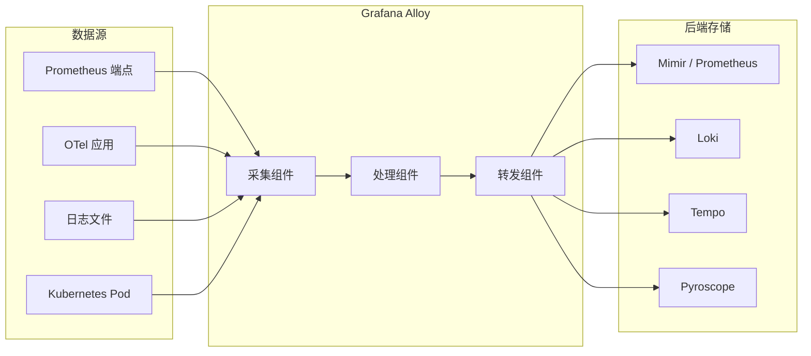

## 项目简介

`Grafana Alloy` 是 `Grafana Labs` 推出的开源遥测数据采集器，是 `OpenTelemetry Collector` 的官方发行版（`distribution`），在原生支持 `OpenTelemetry` 生态的同时内置了完整的 `Prometheus` 数据管道。它能够在单一进程中同时采集、处理并转发四类遥测信号：指标（`metrics`）、日志（`logs`）、链路追踪（`traces`）和持续性能分析（`profiles`）。

项目源码托管于：https://github.com/grafana/alloy

`Alloy` 于 `2024` 年由 `Grafana Agent` 演进而来，吸收了 `Grafana Agent Flow` 模式的组件化流水线理念，并同时兼容来自 `OpenTelemetry Collector` 的大量组件，正式成为 `Grafana` 官方推荐的新一代数据采集器。

## 解决的问题

### 多采集器并存带来的运维复杂度

在实际生产环境中，可观测性需求往往是分阶段演进的：最初可能只需要 `Prometheus` 采集基础设施指标，之后引入 `OpenTelemetry Collector` 处理应用链路，再后来添加 `Promtail` 或 `Filebeat` 采集日志，最终又部署 `Pyroscope Agent` 做性能分析。多套采集器并存意味着：

- 需要学习多种配置语言和运维体系；
- 独立的部署、升级、故障排查流程；
- 额外的内存和 `CPU` 资源消耗；
- 难以统一管理的配置漂移风险。

`Grafana Alloy` 通过将上述所有能力整合到一个采集器中，用一套配置语言（`Alloy` 语法）和一个进程完成过去需要多个工具才能完成的工作，从根本上降低了运维复杂度。

### Prometheus 与 OpenTelemetry 生态之间的鸿沟

`Prometheus` 和 `OpenTelemetry` 是目前最主流的两大可观测性生态，但它们在数据格式、服务发现机制和传输协议上存在差异。`Alloy` 同时支持两者，可以：

- 从 `Prometheus` 端点抓取指标，也可通过 `OTLP` 接收推送过来的指标；
- 在 `Prometheus` 格式与 `OpenTelemetry` 格式之间进行转换；
- 使用 `Prometheus` 的服务发现机制（如 `Kubernetes`、`EC2`、`Consul`）为 `OpenTelemetry` 组件提供目标列表。

## 核心优势

| 特性 | 说明 |
|:---:|---|
| **统一信号类型** | 单进程同时支持 `metrics`、`logs`、`traces`、`profiles` |
| **可编程流水线** | 基于表达式的配置语言，支持条件逻辑、动态引用和内置函数 |
| **`OpenTelemetry`发行版** | 兼容数十个 `OTel Collector` 组件，并扩展了原生组件 |
| **`Kubernetes`原生** | 无需单独 `operator`，直接发现并抓取 `Kubernetes` 资源 |
| **集群与高可用** | 内置基于 `gossip` 协议的集群，支持目标自动分片和故障转移 |
| **模块化复用** | 通过模块（`module`）将流水线封装为可复用自定义组件 |
| **供应商中立** | 可同时向多个后端（`Grafana Cloud`、自建 `Loki`/`Mimir`/`Tempo`、任意 `OTel` 后端）转发数据 |
| **内置调试`UI`** | 可视化组件依赖图、实时检查组件状态和输出 |
| **集中化配置** | 支持通过 `remotecfg` 从远端服务器拉取配置，实现舰队级统一管理 |

## 架构设计

### 整体定位

`Alloy` 部署在数据源与存储后端之间的采集层，承担三个核心职责：**采集**（`collect`）、**处理**（`process`）、**转发**（`forward`）。



### 组件（Component）

`Alloy` 以**组件**为最小构建单元，每个组件执行单一任务。组件通过 **参数（`Arguments`）** 接收配置，通过 **导出值（`Exports`）** 对外暴露运行时数据，其他组件可在参数中直接引用这些导出值，从而形成数据流水线。

内置组件按命名空间分为以下几大类：

| 命名空间 | 代表组件 | 功能说明 |
|---|---|---|
| `prometheus.*` | `prometheus.scrape`、`prometheus.remote_write`、`prometheus.operator.*` | `Prometheus` 指标采集与写入 |
| `otelcol.*` | `otelcol.receiver.otlp`、`otelcol.processor.batch`、`otelcol.exporter.otlp` | `OpenTelemetry` 数据接收、处理与导出 |
| `loki.*` | `loki.source.file`、`loki.process`、`loki.write` | 日志采集、处理与写入 `Loki` |
| `pyroscope.*` | `pyroscope.scrape`、`pyroscope.write` | 持续性能分析数据采集与写入 |
| `discovery.*` | `discovery.kubernetes`、`discovery.ec2`、`discovery.consul` | 服务发现，生成目标列表 |
| `local.*` | `local.file` | 从本地读取文件内容 |
| `remote.*` | `remote.http`、`remote.kubernetes.secret` | 从远端（`HTTP`、`Kubernetes Secret`）读取数据 |
| `mimir.*` | `mimir.rules.kubernetes` | 管理 `Mimir` 告警规则 |
| `beyla.*` | `beyla.ebpf` | 通过 `eBPF` 自动插桩采集应用指标和链路 |

### 组件控制器（Component Controller）

组件控制器是 `Alloy` 的运行时核心，负责配置解析与验证、组件生命周期管理以及组件健康状态上报。控制器根据组件间的引用关系构建**有向无环图（`DAG`）**，以拓扑顺序完成初始化，并在任意组件的导出值发生变化时自动沿依赖链触发级联重评估。当某个组件评估失败时，控制器将其标记为 `Unhealthy`，但不会终止该组件——它将继续以上次成功的参数运行，防止单点故障影响整条流水线。

向进程发送 `SIGHUP` 信号或调用 `/-/reload` 接口可触发配置热加载，控制器会自动增删组件并对所有组件重新评估。

### Alloy 配置语言

`Alloy` 使用自定义的**声明式**配置语言（文件扩展名为 `.alloy`），具备以下语言特性：

- **表达式求值**：属性值可以是字面量、函数调用、组件导出引用或算术表达式；
- **动态配置**：可通过 `sys.env()` 读取环境变量，通过 `local.file` 读取文件，实现运行时动态参数；
- **内置函数**：提供字符串处理、编码/解码、数学计算等标准函数；
- **声明顺序无关**：控制器根据 `DAG` 自动决定评估顺序，配置块的书写顺序不影响执行结果。

基本语法要素：

```alloy
// 单行注释

/*
  多行注释
*/

// 属性（Attribute）：IDENTIFIER = EXPRESSION
log_level = "info"

// 无标签块（Block）
logging {
  level  = "info"
  format = "logfmt"
}

// 带标签块（Labeled Block）：BLOCK_NAME "LABEL" { ... }
prometheus.scrape "app" {
  targets         = [{"__address__" = "localhost:8080"}]
  scrape_interval = "15s"
  forward_to      = [prometheus.remote_write.default.receiver]
}
```

### 模块（Module）

模块是 `Alloy` 的配置复用机制，允许将一组组件封装为可复用的**自定义组件**（`custom component`），并通过 `declare` 关键字声明。自定义组件接受 `argument` 作为输入参数，通过 `export` 对外暴露输出值，接口设计类似于编程语言中的函数。

模块可通过以下方式导入：

| 导入方式 | 说明 |
|---|---|
| `import.file` | 从本地文件系统加载模块 |
| `import.git` | 从 `Git` 仓库加载模块 |
| `import.http` | 通过 `HTTP` 请求加载模块 |
| `import.string` | 从字符串字面量加载模块 |

模块示例——将日志过滤逻辑封装为自定义组件：

```alloy
// helpers.alloy：定义自定义组件 log_filter
declare "log_filter" {
  argument "write_to" {
    optional = false
  }

  loki.process "filter" {
    stage.match {
      selector = `{job!=""} |~ "level=(debug|info)"`
      action   = "drop"
    }
    forward_to = argument.write_to.value
  }

  export "filter_input" {
    value = loki.process.filter.receiver
  }
}
```

```alloy
// main.alloy：导入模块并使用自定义组件
import.file "helpers" {
  filename = "helpers.alloy"
}

loki.source.file "app" {
  targets    = local.file.log_targets.content
  forward_to = [helpers.log_filter.default.filter_input]
}

helpers.log_filter "default" {
  write_to = [loki.write.default.receiver]
}

loki.write "default" {
  endpoint {
    url = "http://loki:3100/loki/api/v1/push"
  }
}
```

### 集群（Clustering）

`Alloy` 内置集群支持，采用**最终一致性**模型，通过 `gossip` 协议在节点间传播成员状态。集群的核心使用场景是**目标自动分片**（`target auto-distribution`）：多个 `Alloy` 节点共同分担抓取目标，通过一致性哈希算法（每节点 `512` 个 `token`）将目标均匀分配到各节点。

当集群发生成员变更（节点加入或离开）时，一致性哈希算法仅重新分配约 `1/N` 的目标，最大程度降低抓取中断。

集群的前提条件：

- 所有节点使用**相同的配置文件**；
- 所有节点可以访问相同的服务发现 `API`；
- 需要在组件中显式启用 `clustering` 块。

集群配置示例：

```alloy
prometheus.scrape "default" {
  targets = discovery.kubernetes.pods.targets

  clustering {
    enabled = true
  }

  forward_to = [prometheus.remote_write.default.receiver]
}
```

启动时通过命令行参数加入集群：

```shell
alloy run config.alloy \
  --cluster.enabled=true \
  --cluster.join-peers=alloy-peer-1:12345,alloy-peer-2:12345
```

### 部署拓扑

`Alloy` 支持三种主要部署模式：

| 部署模式 | 适用场景 | Kubernetes 对应资源 |
|:---:|---|---|
| **集中式采集服务** | 应用遥测数据采集，指标规模达百万级时可水平扩展 | `StatefulSet`（指标场景）或 `Deployment` |
| **主机守护进程** | 节点级指标采集（`node_exporter`）、`Pod` 日志采集 | `DaemonSet` |
| **容器`Sidecar`** | 短生命周期应用、需要与应用共享网络命名空间的场景 | 容器边车 |

## 安装

### Docker

```shell
docker run \
  -v /path/to/config.alloy:/etc/alloy/config.alloy \
  -p 12345:12345 \
  grafana/alloy:latest \
    run \
    --server.http.listen-addr=0.0.0.0:12345 \
    --storage.path=/var/lib/alloy/data \
    /etc/alloy/config.alloy
```

访问 `http://localhost:12345` 可以打开内置调试 `UI`，确认 `Alloy` 正常运行。

### Kubernetes（Helm）

```shell
# 添加 Grafana Helm 仓库
helm repo add grafana https://grafana.github.io/helm-charts
helm repo update

# 创建命名空间
kubectl create namespace alloy

# 安装 Alloy
helm install alloy grafana/alloy --namespace alloy

# 检查 Pod 状态
kubectl get pods --namespace alloy
```

如需自定义配置，可通过 `values.yaml` 覆盖 `alloy.configMap.content` 字段。

### Linux（二进制）

以 `Debian/Ubuntu` 为例：

```shell
# 添加 Grafana APT 仓库
sudo mkdir -p /etc/apt/keyrings/
wget -q -O - https://apt.grafana.com/gpg.key | gpg --dearmor | \
  sudo tee /etc/apt/keyrings/grafana.gpg > /dev/null
echo "deb [signed-by=/etc/apt/keyrings/grafana.gpg] https://apt.grafana.com stable main" | \
  sudo tee /etc/apt/sources.list.d/grafana.list

# 安装
sudo apt-get update
sudo apt-get install alloy

# 启动服务
sudo systemctl enable alloy
sudo systemctl start alloy
```

配置文件路径为 `/etc/alloy/config.alloy`，通过 `systemd` 管理服务进程。

## 配置示例

### 示例一：采集节点指标并推送到 Prometheus

```alloy
// 通过内置 unix exporter 采集主机指标
prometheus.exporter.unix "default" {}

// 抓取 exporter 暴露的指标
prometheus.scrape "unix" {
  targets    = prometheus.exporter.unix.default.targets
  forward_to = [prometheus.remote_write.mimir.receiver]
}

// 推送到远端 Prometheus / Mimir
prometheus.remote_write "mimir" {
  endpoint {
    url = "http://mimir:9009/api/prom/push"
  }
}
```

### 示例二：接收 OpenTelemetry 数据并批量转发

```alloy
// 接收来自应用的 OTLP 数据（gRPC + HTTP）
otelcol.receiver.otlp "ingest" {
  grpc {
    endpoint = "0.0.0.0:4317"
  }
  http {
    endpoint = "0.0.0.0:4318"
  }

  output {
    metrics = [otelcol.processor.batch.default.input]
    logs    = [otelcol.processor.batch.default.input]
    traces  = [otelcol.processor.batch.default.input]
  }
}

// 批量处理，减少后端写入压力
otelcol.processor.batch "default" {
  output {
    metrics = [otelcol.exporter.otlp.backend.input]
    logs    = [otelcol.exporter.otlp.backend.input]
    traces  = [otelcol.exporter.otlp.backend.input]
  }
}

// 导出到 OTel 兼容后端
otelcol.exporter.otlp "backend" {
  client {
    endpoint = "otel-backend:4317"
    tls {
      insecure = true
    }
  }
}
```

### 示例三：采集 Kubernetes Pod 日志并写入 Loki

```alloy
// 发现 Kubernetes 中的 Pod 列表
discovery.kubernetes "pods" {
  role = "pod"
}

// 根据 Pod 信息生成日志采集目标
discovery.relabel "pod_logs" {
  targets = discovery.kubernetes.pods.targets

  rule {
    source_labels = ["__meta_kubernetes_namespace"]
    target_label  = "namespace"
  }
  rule {
    source_labels = ["__meta_kubernetes_pod_name"]
    target_label  = "pod"
  }
  rule {
    source_labels = ["__meta_kubernetes_pod_container_name"]
    target_label  = "container"
  }
  rule {
    source_labels = ["__meta_kubernetes_pod_uid", "__meta_kubernetes_pod_container_name"]
    separator     = "/"
    target_label  = "__path__"
    replacement   = "/var/log/pods/*$1/*.log"
  }
}

// 追踪日志文件
loki.source.file "pod_logs" {
  targets    = discovery.relabel.pod_logs.output
  forward_to = [loki.write.default.receiver]
}

// 写入 Loki
loki.write "default" {
  endpoint {
    url = "http://loki:3100/loki/api/v1/push"
  }
}
```

### 示例四：Kubernetes 集群指标采集（含集群分片）

```alloy
// 发现集群中的所有 Pod
discovery.kubernetes "pods" {
  role = "pod"
}

// 抓取指标，启用集群分片
prometheus.scrape "pods" {
  targets = discovery.kubernetes.pods.targets

  clustering {
    enabled = true
  }

  forward_to = [prometheus.remote_write.mimir.receiver]
}

prometheus.remote_write "mimir" {
  endpoint {
    url = "http://mimir:9009/api/prom/push"
  }
}
```

## 调试与运维

### 内置 UI

`Alloy` 默认在 `12345` 端口提供一个 `Web UI`，可用于：

- 可视化展示所有组件及其依赖关系（`DAG` 图）；
- 实时查看每个组件的当前参数、导出值和健康状态；
- 查看集群成员列表和分片状态（需启用集群）；
- 快速定位配置问题或组件异常。

### 健康状态

组件健康状态分为四种：

| 状态 | 说明 |
|---|---|
| `Unknown` | 组件已创建但尚未启动 |
| `Healthy` | 组件运行正常 |
| `Unhealthy` | 组件遇到错误或异常 |
| `Exited` | 组件已停止运行 |

### 热加载配置

```shell
# 通过 HTTP 接口触发热加载
curl -X POST http://localhost:12345/-/reload

# 或发送 SIGHUP 信号
kill -HUP $(pidof alloy)
```

### 全局日志与追踪配置

```alloy
logging {
  level  = "info"   // debug | info | warn | error
  format = "logfmt" // logfmt | json
}

tracing {
  sampling_fraction = 0.1  // 采样 10% 的自身链路数据
  write_to = [otelcol.exporter.otlp.tempo.input]
}
```

## 与同类工具的对比

| 对比维度 | Grafana Alloy | Prometheus Agent | OpenTelemetry Collector | Promtail |
|---|---|---|---|---|
| 支持信号类型 | `metrics`、`logs`、`traces`、`profiles` | `metrics` | `metrics`、`logs`、`traces` | `logs` |
| 配置语言 | `Alloy` | `YAML` | `YAML` | `YAML` |
| `Prometheus` 原生支持 | 是 | 是 | 有限 | 否 |
| `OTel` 原生支持 | 是 | 否 | 是 | 否 |
| 内置集群 | 是 | 否 | 否（需外部方案） | 否 |
| 内置调试 `UI` | 是 | 否 | 否 | 否 |
| `Kubernetes` 原生发现 | 是 | 是 | 是 | 是 |
| 模块化复用 | 是 | 否 | 否 | 否 |

