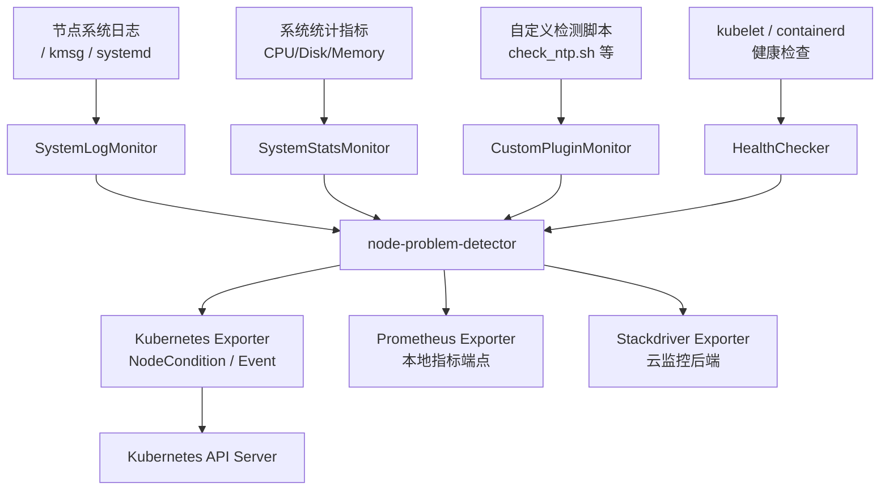

## 什么是 Node Problem Detector

`Node Problem Detector`（简称`NPD`）是 `Kubernetes` 官方维护的节点问题检测守护进程，项目地址为 [https://github.com/kubernetes/node-problem-detector](https://github.com/kubernetes/node-problem-detector)。

在 `Kubernetes` 集群中，节点（`Node`）可能因为各种原因出现故障，常见的问题类型包括：

- **基础设施服务异常**：如`NTP`服务宕机；
- **硬件故障**：坏`CPU`、内存错误、磁盘损坏等；
- **内核问题**：内核死锁、文件系统损坏等；
- **容器运行时异常**：如`containerd`/`docker`无响应；

这些问题在传统 `Kubernetes` 架构中对上层管理组件是**不可见的**，`kube-scheduler`会继续向故障节点调度新的`Pod`，造成业务异常。`Node Problem Detector`的核心目标就是：**将各类节点问题收集并上报给 `Kubernetes API Server`，使上层系统感知节点健康状态**，并与补救系统（`Remedy System`）联动，自动恢复集群健康。

`NPD`以`DaemonSet`方式运行在集群每个节点上，目前已被 `GKE` 和 `AKS` 等主流云厂商默认启用。

## 核心架构

`NPD`的整体架构由两大组件构成：**`Problem Daemon`（问题守护进程）**和**`Exporter`（上报器）**。



### Problem API

`NPD`通过两种方式向 `Kubernetes API Server` 上报问题：

| 类型 | 说明 | 适用场景 |
|---|---|---|
| `NodeCondition` | 持久性条件，写入节点`status.conditions`字段 | 严重的持久性问题，如内核死锁、文件系统只读 |
| `Event` | 临时事件，记录在集群事件列表中 | 短暂的、有限影响的问题，如单次`OOMKilling` |

### Event 与 Node 的关系

`NPD`通过 `Kubernetes Exporter` 写入的`Event`会绑定到当前节点：事件对象的`involvedObject.kind`为`Node`，`involvedObject.name`为节点名。也就是说，`Event`本身是独立的`Kubernetes Event`资源，但它的关联对象是对应的`Node`。

需要注意两点：

| 事项 | 说明 |
|---|---|
| `Event`不是`Node`子资源 | 不能通过`watch node`直接获得节点事件；应`List/Watch Event`资源，再用`fieldSelector`过滤`involvedObject.kind=Node`和`involvedObject.name=<node-name>` |
| `Event`是命名空间资源 | `NPD`可通过`--event-namespace`指定事件写入的命名空间；未指定时，`client-go`事件记录器会将空命名空间事件写入`default`命名空间 |

`Event`适合用于实时告警、问题排查和短期关联分析，不适合作为长期审计或历史报表的数据源。需要长期保存时，应将事件转发到日志系统、事件导出器或监控后端。

### Problem Daemon 类型

| 守护进程类型 | 检测能力 | 禁用编译标签 |
|---|---|---|
| `SystemLogMonitor` | 监控系统日志（`kmsg`/`filelog`），上报内核死锁、文件系统只读、`Kubelet`/`Docker`/`Containerd`频繁重启等 | `disable_system_log_monitor` |
| `SystemStatsMonitor` | 采集`CPU`、磁盘、内存等健康相关系统指标（指标模式，暂不产生`NodeCondition`） | `disable_system_stats_monitor` |
| `CustomPluginMonitor` | 执行用户自定义脚本，灵活检测任意节点问题（如`NTP`、网络连通性等） | `disable_custom_plugin_monitor` |
| `HealthChecker` | 检测`kubelet`和容器运行时（`docker`/`containerd`）健康状态 | — |

## 配置说明

`NPD`的配置文件由上游项目统一维护在 [`kubernetes/node-problem-detector/config`](https://github.com/kubernetes/node-problem-detector/tree/master/config) 目录中。阅读或生产落地时，建议先基于当前使用的`NPD`版本查看该目录下的配置文件，再按需通过`ConfigMap`挂载到容器，并使用对应的启动参数加载。

常用配置文件对应关系如下：

| 监控类型 | 上游配置文件 | 启动参数 |
|---|---|---|
| `SystemLogMonitor` | `kernel-monitor.json`、`kernel-monitor-filelog.json`、`systemd-monitor.json`、`readonly-monitor.json`等 | `--config.system-log-monitor` |
| `SystemStatsMonitor` | `system-stats-monitor.json`、`net-cgroup-system-stats-monitor.json`、`windows-system-stats-monitor.json` | `--config.system-stats-monitor` |
| `CustomPluginMonitor` | `custom-plugin-monitor.json`及`plugin/`目录下的脚本 | `--config.custom-plugin-monitor` |
| `HealthChecker` | `health-checker-kubelet.json`、`health-checker-containerd.json`、`health-checker-docker.json`等 | `--config.custom-plugin-monitor` |

本文后续示例用于解释核心字段含义，生产环境应以所部署版本对应的上游配置为准。

### 如何选择配置文件

部署`NPD`时**不需要配置所有文件**。`config/`目录下的文件是按监控类型、操作系统、日志来源、容器运行时和使用场景拆分的配置集合，只有通过启动参数显式加载的配置文件才会生效。未挂载或未写入启动参数的配置文件不会被`NPD`读取。

选择配置文件时，建议按以下原则裁剪：

| 场景 | 建议配置 | 说明 |
|---|---|---|
| 最小化节点问题检测 | `kernel-monitor.json`、`readonly-monitor.json` | 覆盖常见内核异常、文件系统只读等基础节点问题 |
| 使用`Docker`运行时 | 增加`docker-monitor.json`或对应`filelog`/`counter`配置 | 只在节点实际使用`Docker`时启用 |
| 使用`systemd/journald`日志 | 增加`systemd-monitor.json` | 用于从`journald`中识别`kubelet`、`docker`、`containerd`等服务事件 |
| 需要系统指标 | 增加`system-stats-monitor.json` | 主要暴露`CPU`、磁盘、内存等指标，不直接产生`NodeCondition` |
| 需要自定义检测 | 增加`custom-plugin-monitor.json`和对应脚本 | 适合`NTP`、网络连通性、企业内部依赖等自定义规则 |
| 需要组件健康检查 | 增加`health-checker-kubelet.json`、`health-checker-containerd.json`等 | 以自定义插件方式检查`kubelet`或容器运行时健康 |
| `Windows`节点 | 使用`windows-*`配置 | 仅用于`Windows`节点，不应混入`Linux`节点配置 |

实际部署时通常选择“基础日志规则 + 当前容器运行时规则 + 可选系统指标/自定义插件”即可。不要盲目启用全部配置文件，否则可能带来无效日志扫描、无意义事件、额外资源开销，甚至因为宿主机路径或日志系统不匹配导致监控项不可用。

### 上游配置文件速查

下表列出当前上游`config/`目录中的主要配置文件，方便判断需要新增或修改哪个文件。表中的用途是按默认规则做的摘要，启用前仍应打开所部署`NPD`版本对应的文件，确认`plugin`、`logPath`、脚本路径和宿主机依赖是否与节点环境一致。

| 配置文件 | 类型 | 适用场景 | 加载方式 |
|---|---|---|---|
| `kernel-monitor.json` | `SystemLogMonitor` / `kmsg` | 从`/dev/kmsg`检测内核异常、`OOMKilling`、任务卡死等 | `--config.system-log-monitor` |
| `kernel-monitor-filelog.json` | `SystemLogMonitor` / `filelog` | 从文件日志检测内核异常，适合不直接读`/dev/kmsg`的场景 | `--config.system-log-monitor` |
| `kernel-monitor-counter.json` | `CustomPluginMonitor` | 通过计数方式识别频繁内核异常，如`UnregisterNetDevice` | `--config.custom-plugin-monitor` |
| `readonly-monitor.json` | `SystemLogMonitor` / `kmsg` | 检测文件系统被重新挂载为只读 | `--config.system-log-monitor` |
| `disk-log-message-filelog.json` | `SystemLogMonitor` / `filelog` | 从`/var/log/messages`检测磁盘坏块、不可读扇区等日志 | `--config.system-log-monitor` |
| `systemd-monitor.json` | `SystemLogMonitor` / `journald` | 观察`kubelet`、`docker`、`containerd`等服务启动事件 | `--config.system-log-monitor` |
| `systemd-monitor-counter.json` | `CustomPluginMonitor` | 统计`kubelet`、`docker`、`containerd`频繁重启 | `--config.custom-plugin-monitor` |
| `docker-monitor.json` | `SystemLogMonitor` / `journald` | 检测`Docker`镜像层、`overlay2`、容器启动相关异常 | `--config.system-log-monitor` |
| `docker-monitor-filelog.json` | `SystemLogMonitor` / `filelog` | 从文件日志检测`Docker`异常 | `--config.system-log-monitor` |
| `docker-monitor-counter.json` | `CustomPluginMonitor` | 通过计数方式检测`Docker overlay2`异常 | `--config.custom-plugin-monitor` |
| `abrt-adaptor.json` | `SystemLogMonitor` / `journald` | 接入`ABRT`崩溃通知，识别进程崩溃、`KernelOops`等 | `--config.system-log-monitor` |
| `system-stats-monitor.json` | `SystemStatsMonitor` | 采集`CPU`、磁盘、内存、主机运行时间等指标 | `--config.system-stats-monitor` |
| `net-cgroup-system-stats-monitor.json` | `SystemStatsMonitor` | 采集网络接口收发包、错误、丢包等指标 | `--config.system-stats-monitor` |
| `custom-plugin-monitor.json` | `CustomPluginMonitor` | 示例自定义插件，默认用于`NTP`检测 | `--config.custom-plugin-monitor` |
| `network-problem-monitor.json` | `CustomPluginMonitor` | 通过脚本检测`conntrack`满、`DNS`不可达等网络问题 | `--config.custom-plugin-monitor` |
| `iptables-mode-monitor.json` | `CustomPluginMonitor` | 检测节点`iptables`模式不一致等问题 | `--config.custom-plugin-monitor` |
| `health-checker-kubelet.json` | `CustomPluginMonitor` | 检查`kubelet`健康状态 | `--config.custom-plugin-monitor` |
| `health-checker-containerd.json` | `CustomPluginMonitor` | 检查`containerd`健康状态 | `--config.custom-plugin-monitor` |
| `health-checker-docker.json` | `CustomPluginMonitor` | 检查`Docker`健康状态 | `--config.custom-plugin-monitor` |
| `windows-containerd-monitor-filelog.json` | `SystemLogMonitor` / `filelog` | `Windows`节点检测`containerd`日志异常 | `--config.system-log-monitor` |
| `windows-system-stats-monitor.json` | `SystemStatsMonitor` | `Windows`节点采集系统统计指标 | `--config.system-stats-monitor` |
| `windows-defender-monitor.json` | `CustomPluginMonitor` | `Windows`节点检测`Windows Defender`威胁事件 | `--config.custom-plugin-monitor` |
| `windows-health-checker-kubelet.json` | `CustomPluginMonitor` | `Windows`节点检查`kubelet`健康状态 | `--config.custom-plugin-monitor` |
| `windows-health-checker-containerd.json` | `CustomPluginMonitor` | `Windows`节点检查`containerd`健康状态 | `--config.custom-plugin-monitor` |
| `windows-health-checker-docker.json` | `CustomPluginMonitor` | `Windows`节点检查`Docker`健康状态 | `--config.custom-plugin-monitor` |
| `windows-health-checker-kubeproxy.json` | `CustomPluginMonitor` | `Windows`节点检查`kube-proxy`健康状态 | `--config.custom-plugin-monitor` |

还有一些目录不是直接作为 `monitor` 配置传给`--config.*`，但会被上述配置引用或用于特定导出器：

| 目录/文件 | 作用 | 使用方式 |
|---|---|---|
| `plugin/` | 自定义插件脚本目录，如`check_ntp.sh`、`network_problem.sh`、`dns_problem.sh`、`iptables_mode.sh` | 被`CustomPluginMonitor`配置中的`rules[].path`引用 |
| `guestosconfig/known-modules.json` | 系统统计监控中`osFeature`相关的已知内核模块配置 | 被`system-stats-monitor.json`中的`KnownModulesConfigPath`引用 |
| `exporter/stackdriver-exporter.json` | `Stackdriver Exporter`配置 | 通过`--exporter.stackdriver`加载 |
| `systemd/node-problem-detector-metric-only.service` | 以`systemd`方式运行指标模式`NPD`的服务文件 | 用于主机级`systemd`部署，不是`DaemonSet`中的 monitor 配置 |

### 系统日志监控（SystemLogMonitor）

`SystemLogMonitor`通过读取内核消息或系统日志文件，按照规则进行模式匹配，上报问题。典型配置文件（`kernel-monitor.json`）格式如下：

```json title="kernel-monitor.json"
{
  "plugin": "kmsg",
  "logPath": "/dev/kmsg",
  "lookback": "5m",
  "bufferSize": 10,
  "source": "kernel-monitor",
  "metricsReporting": true,
  "conditions": [
    {
      "type": "KernelDeadlock",
      "reason": "KernelHasNoDeadlock",
      "message": "kernel has no deadlock"
    }
  ],
  "rules": [
    {
      "type": "temporary",
      "reason": "OOMKilling",
      "pattern": "Killed process \\d+ (.+) total-vm:\\d+kB, anon-rss:\\d+kB, file-rss:\\d+kB.*"
    },
    {
      "type": "permanent",
      "condition": "KernelDeadlock",
      "reason": "DockerHung",
      "pattern": "task docker:\\w+ blocked for more than \\w+ seconds\\."
    }
  ]
}
```

核心字段说明：

| 字段 | 说明 |
|---|---|
| `plugin` | 日志读取插件，可选`kmsg`（内核消息设备）或`filelog`（文件日志） |
| `logPath` | 日志文件或设备路径 |
| `lookback` | 启动时回溯检查的时间窗口 |
| `bufferSize` | 日志缓冲区大小（行数） |
| `source` | 事件`source`字段标识 |
| `metricsReporting` | 是否启用`Prometheus`指标上报 |
| `conditions` | 定义节点条件的初始状态（正常时的`reason`和`message`） |
| `rules` | 匹配规则列表，`temporary`触发`Event`，`permanent`触发`NodeCondition` |

`rules`中每条规则的关键字段：

| 字段 | 说明 |
|---|---|
| `type` | `temporary`（临时事件）或`permanent`（持久条件） |
| `reason` | 上报的`reason`标识 |
| `pattern` | 用于匹配日志内容的正则表达式 |
| `condition` | 仅`permanent`类型需要，指向`conditions`中定义的条件类型 |

### 系统统计监控（SystemStatsMonitor）

`SystemStatsMonitor`用于周期性采集节点的`CPU`、磁盘、内存、主机运行时间和系统特性等健康相关指标。它是**指标型监控**，默认不通过`conditions`/`rules`产生`NodeCondition`或`Event`，采集结果主要通过`Prometheus Exporter`或`Stackdriver Exporter`暴露。

典型配置文件（`system-stats-monitor.json`）格式如下：

```json title="system-stats-monitor.json"
{
  "invokeInterval": "60s",
  "cpu": {
    "metricsConfigs": {
      "cpu/load_1m": {
        "displayName": "cpu/load_1m"
      },
      "cpu/load_5m": {
        "displayName": "cpu/load_5m"
      },
      "cpu/usage_time": {
        "displayName": "cpu/usage_time"
      }
    }
  },
  "disk": {
    "includeRootBlk": true,
    "includeAllAttachedBlk": true,
    "lsblkTimeout": "5s",
    "metricsConfigs": {
      "disk/percent_used": {
        "displayName": "disk/percent_used"
      },
      "disk/operation_count": {
        "displayName": "disk/operation_count"
      },
      "disk/io_time": {
        "displayName": "disk/io_time"
      }
    }
  },
  "memory": {
    "metricsConfigs": {
      "memory/bytes_used": {
        "displayName": "memory/bytes_used"
      },
      "memory/percent_used": {
        "displayName": "memory/percent_used"
      }
    }
  },
  "host": {
    "metricsConfigs": {
      "host/uptime": {
        "displayName": "host/uptime"
      }
    }
  }
}
```

核心字段说明：

| 字段 | 说明 |
|---|---|
| `invokeInterval` | 指标采集间隔 |
| `cpu.metricsConfigs` | 启用的`CPU`相关指标，如负载、运行队列、使用时间等 |
| `disk.includeRootBlk` | 是否采集根文件系统所在块设备指标 |
| `disk.includeAllAttachedBlk` | 是否采集所有挂载到节点的块设备指标 |
| `disk.lsblkTimeout` | 执行`lsblk`探测块设备时的超时时间 |
| `disk.metricsConfigs` | 启用的磁盘容量和`I/O`相关指标 |
| `memory.metricsConfigs` | 启用的内存使用相关指标 |
| `host.metricsConfigs` | 启用的主机级指标，如运行时间 |
| `displayName` | 指标展示名称，通常与指标键名保持一致 |

启用该监控时，需要在启动参数中指定配置文件路径：

```bash
--config.system-stats-monitor=/config/system-stats-monitor.json
```

### 自定义插件监控（CustomPluginMonitor）

`CustomPluginMonitor`以指定间隔调用用户脚本，根据脚本退出码判断节点状态。脚本规范如下：

| 退出码 | 含义 |
|---|---|
| `0` | `OK`，节点正常 |
| `1` | `NonOK`，节点存在问题 |
| `2` | `Unknown`，状态未知 |

典型配置文件（`custom-plugin-monitor.json`）示例：

```json title="custom-plugin-monitor.json"
{
  "plugin": "custom",
  "pluginConfig": {
    "invoke_interval": "30s",
    "timeout": "5s",
    "max_output_length": 80,
    "concurrency": 3,
    "enable_message_change_based_condition_update": false
  },
  "source": "ntp-custom-plugin-monitor",
  "metricsReporting": true,
  "conditions": [
    {
      "type": "NTPProblem",
      "reason": "NTPIsUp",
      "message": "ntp service is up"
    }
  ],
  "rules": [
    {
      "type": "temporary",
      "reason": "NTPIsDown",
      "path": "./config/plugin/check_ntp.sh",
      "timeout": "3s"
    },
    {
      "type": "permanent",
      "condition": "NTPProblem",
      "reason": "NTPIsDown",
      "path": "./config/plugin/check_ntp.sh",
      "timeout": "3s"
    }
  ]
}
```

`pluginConfig`字段说明：

| 字段 | 说明 |
|---|---|
| `invoke_interval` | 脚本调用间隔 |
| `timeout` | 单次脚本执行超时时间 |
| `max_output_length` | 脚本输出的最大截取长度（字节） |
| `concurrency` | 并发执行的最大脚本数量 |
| `enable_message_change_based_condition_update` | 是否在消息内容变化时触发条件更新 |

### 健康检查器（HealthChecker）

`HealthChecker`以自定义插件形式实现，专用于检测`kubelet`和容器运行时的存活状态。配置示例（`health-checker-kubelet.json`）：

```json title="health-checker-kubelet.json"
{
  "plugin": "custom",
  "pluginConfig": {
    "invoke_interval": "10s",
    "timeout": "3m",
    "max_output_length": 80,
    "concurrency": 1
  },
  "source": "health-checker",
  "metricsReporting": true,
  "conditions": [
    {
      "type": "KubeletUnhealthy",
      "reason": "KubeletIsHealthy",
      "message": "kubelet on the node is functioning properly"
    }
  ],
  "rules": [
    {
      "type": "permanent",
      "condition": "KubeletUnhealthy",
      "reason": "KubeletUnhealthy",
      "path": "/home/kubernetes/bin/health-checker",
      "args": [
        "--component=kubelet",
        "--enable-repair=true",
        "--cooldown-time=1m",
        "--health-check-timeout=10s"
      ],
      "timeout": "3m"
    }
  ]
}
```

## 部署使用

### 使用 Helm 安装（推荐）

最简便的安装方式是通过`Helm`官方图表：

```bash
helm install --generate-name oci://ghcr.io/deliveryhero/helm-charts/node-problem-detector
```

### 手动部署到 Kubernetes

**步骤一：创建 RBAC 权限**

`NPD`需要权限更新节点状态和发送事件，使用项目自带的`rbac.yaml`：

```bash
kubectl create -f https://raw.githubusercontent.com/kubernetes/node-problem-detector/master/deployment/rbac.yaml
```

`rbac.yaml`会创建`ServiceAccount`并绑定内置的`system:node-problem-detector`集群角色。

**步骤二：创建 ConfigMap**

将检测规则与指标配置文件挂载进容器，通过`ConfigMap`管理：

下面示例是一个`Linux`节点的常用基础配置：启用内核日志监控、只读文件系统监控和系统统计指标监控。它不是全部可用配置文件的集合；如果节点使用特定容器运行时或日志系统，还应按需增加对应配置，例如`docker-monitor.json`、`systemd-monitor.json`或自定义插件配置。

```yaml
apiVersion: v1
kind: ConfigMap
metadata:
  name: node-problem-detector-config
  namespace: kube-system
data:
  kernel-monitor.json: |
    {
      "plugin": "kmsg",
      "logPath": "/dev/kmsg",
      "lookback": "5m",
      "bufferSize": 10,
      "source": "kernel-monitor",
      "conditions": [
        {
          "type": "KernelDeadlock",
          "reason": "KernelHasNoDeadlock",
          "message": "kernel has no deadlock"
        }
      ],
      "rules": [
        {
          "type": "temporary",
          "reason": "OOMKilling",
          "pattern": "Killed process \\d+ (.+) total-vm:\\d+kB, anon-rss:\\d+kB, file-rss:\\d+kB.*"
        },
        {
          "type": "permanent",
          "condition": "KernelDeadlock",
          "reason": "DockerHung",
          "pattern": "task docker:\\w+ blocked for more than \\w+ seconds\\."
        }
      ]
    }
  readonly-monitor.json: |
    {
      "plugin": "kmsg",
      "logPath": "/dev/kmsg",
      "lookback": "5m",
      "bufferSize": 10,
      "source": "readonly-monitor",
      "metricsReporting": true,
      "conditions": [
        {
          "type": "ReadonlyFilesystem",
          "reason": "FilesystemIsNotReadOnly",
          "message": "Filesystem is not read-only"
        }
      ],
      "rules": [
        {
          "type": "permanent",
          "condition": "ReadonlyFilesystem",
          "reason": "FilesystemIsReadOnly",
          "pattern": "Remounting filesystem read-only"
        }
      ]
    }
  system-stats-monitor.json: |
    {
      "invokeInterval": "60s",
      "cpu": {
        "metricsConfigs": {
          "cpu/load_1m": {
            "displayName": "cpu/load_1m"
          },
          "cpu/load_5m": {
            "displayName": "cpu/load_5m"
          },
          "cpu/usage_time": {
            "displayName": "cpu/usage_time"
          }
        }
      },
      "disk": {
        "includeRootBlk": true,
        "includeAllAttachedBlk": true,
        "lsblkTimeout": "5s",
        "metricsConfigs": {
          "disk/percent_used": {
            "displayName": "disk/percent_used"
          },
          "disk/operation_count": {
            "displayName": "disk/operation_count"
          },
          "disk/io_time": {
            "displayName": "disk/io_time"
          }
        }
      },
      "memory": {
        "metricsConfigs": {
          "memory/bytes_used": {
            "displayName": "memory/bytes_used"
          },
          "memory/percent_used": {
            "displayName": "memory/percent_used"
          }
        }
      },
      "host": {
        "metricsConfigs": {
          "host/uptime": {
            "displayName": "host/uptime"
          }
        }
      }
    }
```

```bash
kubectl create -f node-problem-detector-config.yaml
```

**步骤三：部署 DaemonSet**

```yaml
apiVersion: apps/v1
kind: DaemonSet
metadata:
  name: node-problem-detector
  namespace: kube-system
  labels:
    app: node-problem-detector
spec:
  selector:
    matchLabels:
      app: node-problem-detector
  template:
    metadata:
      labels:
        app: node-problem-detector
    spec:
      affinity:
        nodeAffinity:
          requiredDuringSchedulingIgnoredDuringExecution:
            nodeSelectorTerms:
              - matchExpressions:
                  - key: kubernetes.io/os
                    operator: In
                    values:
                      - linux
      serviceAccountName: node-problem-detector
      containers:
        - name: node-problem-detector
          image: registry.k8s.io/node-problem-detector/node-problem-detector:v0.8.19
          command:
            - /node-problem-detector
            - --logtostderr
            - --config.system-log-monitor=/config/kernel-monitor.json,/config/readonly-monitor.json
            - --config.system-stats-monitor=/config/system-stats-monitor.json
          resources:
            limits:
              cpu: 10m
              memory: 80Mi
            requests:
              cpu: 10m
              memory: 80Mi
          securityContext:
            privileged: true
          env:
            - name: NODE_NAME
              valueFrom:
                fieldRef:
                  fieldPath: spec.nodeName
          volumeMounts:
            - name: log
              mountPath: /var/log
              readOnly: true
            - name: kmsg
              mountPath: /dev/kmsg
              readOnly: true
            - name: localtime
              mountPath: /etc/localtime
              readOnly: true
            - name: config
              mountPath: /config
              readOnly: true
      tolerations:
        - effect: NoSchedule
          operator: Exists
        - effect: NoExecute
          operator: Exists
      volumes:
        - name: log
          hostPath:
            path: /var/log/
        - name: kmsg
          hostPath:
            path: /dev/kmsg
        - name: localtime
          hostPath:
            path: /etc/localtime
        - name: config
          configMap:
            name: node-problem-detector-config
            items:
              - key: kernel-monitor.json
                path: kernel-monitor.json
              - key: readonly-monitor.json
                path: readonly-monitor.json
              - key: system-stats-monitor.json
                path: system-stats-monitor.json
```

```bash
kubectl create -f node-problem-detector.yaml
```

### 常用启动参数

| 参数 | 默认值 | 说明 |
|---|---|---|
| `--config.system-log-monitor` | — | 系统日志监控配置文件路径（逗号分隔） |
| `--config.system-stats-monitor` | — | 系统统计监控配置文件路径（逗号分隔） |
| `--config.custom-plugin-monitor` | — | 自定义插件监控配置文件路径（逗号分隔） |
| `--enable-k8s-exporter` | `true` | 是否向 Kubernetes API Server 上报 |
| `--k8s-exporter-write-events` | `true` | 是否向 Kubernetes API Server 写入`Event`对象 |
| `--k8s-exporter-update-node-conditions` | `true` | 是否更新`Node.status.conditions` |
| `--event-namespace` | `""` | `Event`写入的命名空间，未指定时通常落在`default`命名空间 |
| `--prometheus-address` | `127.0.0.1` | `Prometheus`指标监听地址 |
| `--prometheus-port` | `20257` | `Prometheus`指标监听端口，`0`表示禁用 |
| `--port` | `20256` | `NPD`服务监听端口，`0`表示禁用 |
| `--hostname-override` | — | 自定义节点名称（覆盖`NODE_NAME`环境变量） |
| `--logtostderr` | — | 将日志输出到标准错误 |

### 验证效果

部署完成后，可通过以下方式验证`NPD`是否正常工作。

**查看节点条件**

```bash
kubectl describe node <node-name> | grep -A 10 "Conditions:"
```

正常运行时，会看到类似如下的条件：

```
Conditions:
  Type                 Status  ...  Reason                  Message
  ----                 ------  ...  ------                  -------
  KernelDeadlock       False   ...  KernelHasNoDeadlock     kernel has no deadlock
  ReadonlyFilesystem   False   ...  FilesystemIsNotReadOnly Filesystem is not read-only
  ...
```

**手动注入测试事件**

可向内核消息设备写入测试日志，触发`NPD`检测逻辑：

```bash
# 在节点上执行，触发 KernelOops 事件
sudo sh -c "echo 'kernel: BUG: unable to handle kernel NULL pointer dereference at TESTING' >> /dev/kmsg"

# 在管理机上观察该节点关联的事件
kubectl get events -A \
  --field-selector involvedObject.kind=Node,involvedObject.name=<node-name> \
  --watch
```

**通过 Kubernetes API 使用 Event**

`NPD`的`Event`可以通过 `Kubernetes API List/Watch`，但目标资源是`Event`，不是`Node`。如果已通过`--event-namespace`指定事件命名空间，可直接查询该命名空间：

```bash
# List 某个节点关联的 Event
kubectl get --raw "/api/v1/namespaces/<event-namespace>/events?fieldSelector=involvedObject.kind=Node,involvedObject.name=<node-name>"

# Watch 某个节点关联的 Event
kubectl get --raw "/api/v1/namespaces/<event-namespace>/events?watch=1&fieldSelector=involvedObject.kind=Node,involvedObject.name=<node-name>"
```

如果没有显式指定`--event-namespace`，通常可以先从`default`命名空间或全命名空间事件中检索：

```bash
kubectl get events -n default \
  --field-selector involvedObject.kind=Node,involvedObject.name=<node-name>

kubectl get events -A \
  --field-selector involvedObject.kind=Node,involvedObject.name=<node-name>
```

在`client-go`中，可以用`Event`资源建立`ListWatch`：

```go
selector := fields.Set{
    "involvedObject.kind": "Node",
    "involvedObject.name": nodeName,
}.AsSelector().String()

watcher, err := client.CoreV1().Events(eventNamespace).Watch(ctx, metav1.ListOptions{
    FieldSelector: selector,
})
```

**查看 Prometheus 指标**

`NPD`默认在`20257`端口暴露`Prometheus`格式指标（本地访问）：

```bash
# 进入 NPD Pod 查看指标
kubectl exec -n kube-system <npd-pod-name> -- curl http://127.0.0.1:20257/metrics
```

## Event日志化

前面已经介绍了如何通过`kubectl get events`或 `Kubernetes API` 查询`NPD`写入的`Event`。这种方式适合临时排查和验证，但不适合作为长期保存、统一检索和告警分析的数据链路：`Kubernetes Event`有过期时间，事件对象也不是按日志系统的留存和索引模型设计的。

如果需要让日志采集器统一采集`NPD`事件，可以考虑：**让`NPD`继续按原设计写入 `Kubernetes Event`，再由专门的事件采集组件`List/Watch Event`资源，并转换为日志或发送到观测后端**。

可选方案：

| 方案 | 适用场景 | 特点 |
|---|---|---|
| [`Grafana Alloy`](https://github.com/grafana/alloy)：[`loki.source.kubernetes_events`](https://grafana.com/docs/alloy/latest/reference/components/loki/loki.source.kubernetes_events/)、[`loki.echo`](https://grafana.com/docs/alloy/latest/reference/components/loki/loki.echo/) | 已使用`Loki`/`Grafana`日志体系 | 官方组件`loki.source.kubernetes_events`可直接将 `Kubernetes Event` 转成日志，支持`json`格式，生态和维护活跃度优于独立小工具 |
| [`OpenTelemetry Collector Contrib`](https://github.com/open-telemetry/opentelemetry-collector-contrib)：[`k8sobjectsreceiver`](https://github.com/open-telemetry/opentelemetry-collector-contrib/tree/main/receiver/k8sobjectsreceiver) | 已使用`OpenTelemetry`采集体系 | `k8sobjectsreceiver`支持以`watch`模式采集`events`资源，再通过 `logs pipeline` 发送到`OTLP`、`Kafka`、`Elastic`、`Splunk` 等后端 |
| [`kube-eventer`](https://github.com/AliyunContainerService/kube-eventer) | 偏云厂商或需要直接对接 `SLS`、`Kafka`、`Elasticsearch`、`Webhook`、`IM` 告警等 `sink` | 事件转发能力丰富，但更像事件/告警转发器，不是通用日志采集标准组件 |
| [`kubernetes-event-exporter`](https://github.com/mustafaakin/kubernetes-event-exporter) | 需要独立 `Event` 路由和多 `sink` 输出 | 能用，但作为独立 `exporter` 项目，长期选型上通常不如复用 `Alloy/OTel` 这类主流采集器体系 |
