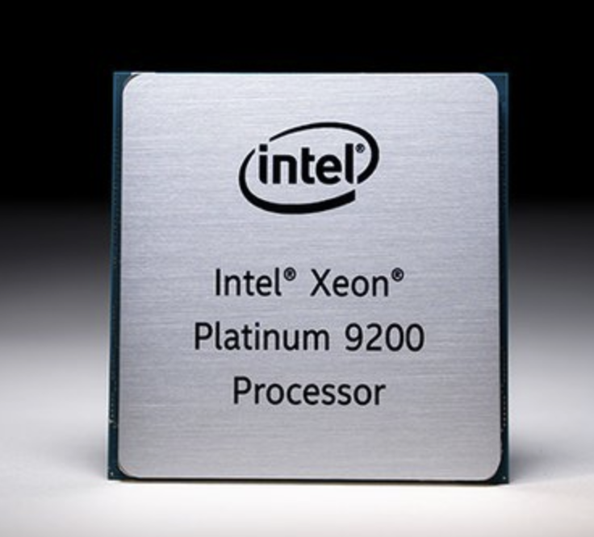
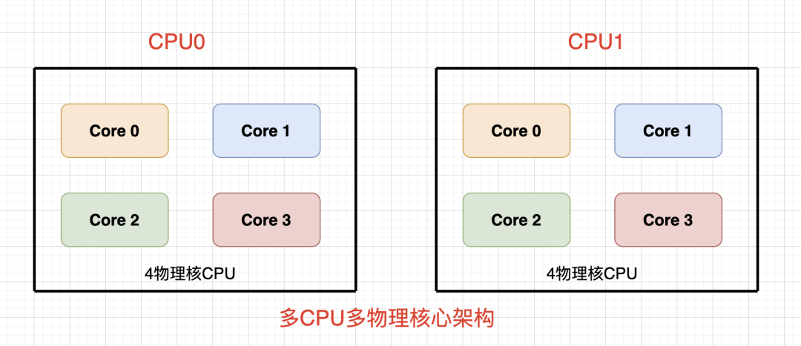
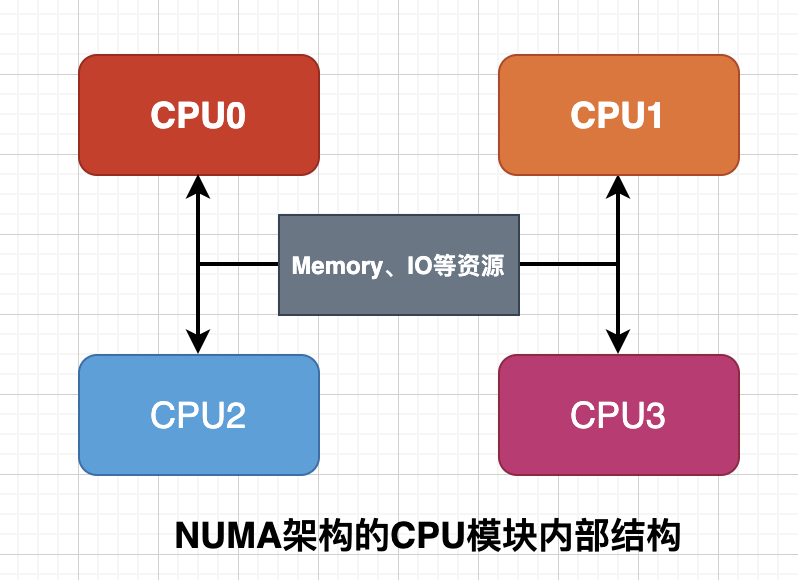
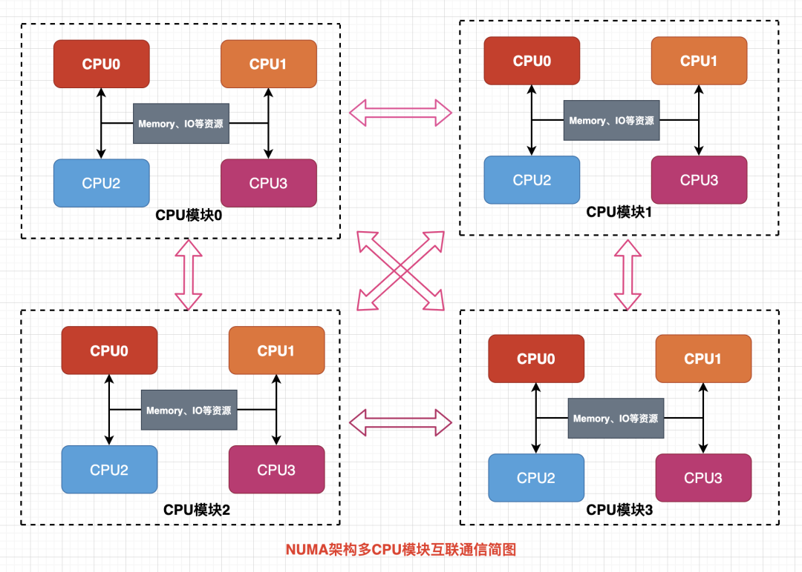

## 引言

在现代计算机系统中，随着应用负载的不断增长，单处理器的性能已经无法满足高性能计算的需求。为了充分利用多个处理器的计算能力，业界发展出了多种多处理器架构。

从系统架构角度来看，商用服务器主要采用三种多处理器架构：对称多处理器结构(`SMP`)、非一致内存访问结构(`NUMA`)和海量并行处理结构(`MPP`)。这三种架构在资源共享方式、扩展性、性能表现等方面各有特点，适用于不同的应用场景。

本文将深入探讨这三种架构的原理、特点及其应用。

## 物理核和逻辑核

说到`CPU`首先想到的可能是这样的：




该系列`CPU`物理封装长宽尺寸为`76.0×72.5`毫米，也是目前`Intel`史上最大的处理器，那`CPU`里面是什么样子呢？

`CPU`内部封装1个或者多个物理核，物理核有独立的各级缓存和电路结构，只有1个物理核心就是单核`CPU`，有多个物理核心就是多核`CPU`。


对于处理器规格一致的服务器来说，总的物理核心数计算方法为：

```
物理核心数=总CPU数*单CPU中物理核心数
```




超线程是`Intel`于`2002`年发布的一种技术，全名为`Hyper-Threading`，简写为`HT`技术，超线程技术最初只是应用于至强系列处理器中，之后陆续应用在奔腾系列中并将技术主流化，业界对于`HT`的评价不一，但是官方并未放弃超线程技术。

简单来说，`HT`技术可使处理器中的1颗物理核，如同2颗物理核那样发挥作用，从而提高了系统的整体性能，但是肯定也不会真的像2颗物理核那样，要不然就违背物理规律了，只是说借助于某些技术将1颗物理核的性能发挥地更好而已。

对于处理器规格一致的服务器来说，总的逻辑核心数计算方法为：

```
开启HT: 逻辑核心数=总CPU数*单CPU中物理核心数*2
未开启HT: 逻辑核心数=物理核心数=总CPU数*单CPU中物理核心数
```


## 多处理器架构

从系统架构来看，目前的商用服务器大体可以分为三类，即对称多处理器结构(`SMP: Symmetric Multi-Processor`)，非一致存储访问结构(`NUMA: Non-Uniform Memory Access`)，以及海量并行处理结构(`MPP: Massive Parallel Processing`)。

对于家用电脑或者一般的服务器来说，`SMP`和`NUMA`应该接触的比较多，`MPP`接触的相对较少。

### 对称多处理器结构(SMP)

`SMP(Symmetric Multi Processing)`，对称多处理系统内有许多紧耦合多处理器，在这样的系统中，所有的CPU共享全部资源，如总线，内存和`I/O`系统等，操作系统或管理数据库的复本只有一个，这种系统有一个最大的特点就是共享所有资源。多个`CPU`之间没有区别，平等地访问内存、外设、一个操作系统。操作系统管理着一个队列，每个处理器依次处理队列中的进程。如果两个处理器同时请求访问一个资源（例如同一段内存地址），由硬件、软件的锁机制去解决资源争用问题。`Access to RAM is serialized; this and cache coherency issues causes performance to lag slightly behind the number of additional processors in the system.`


所谓对称多处理器结构，是指服务器中多个`CPU`对称工作，无主次或从属关系。各`CPU`共享相同的物理内存，每个`CPU`访问内存中的任何地址所需时间是相同的，因此`SMP`也被称为一致存储器访问结构(`UMA ： Uniform Memory Access`)。对`SMP`服务器进行扩展的方式包括增加内存、使用更快的`CPU`、增加`CPU`、扩充`I/O`(槽口数与总线数)以及添加更多的外部设备(通常是磁盘存储)。

`SMP`服务器的主要特征是共享，系统中所有资源(`CPU`、内存、`I/O`等 ) 都是共享的。也正是由于这种特征，导致了`SMP`服务器的主要问题，那就是它的扩展能力非常有限。对于`SMP`服务器而言，每一个共享的环节都可能造成`SMP`服务器扩展时的瓶颈，而最受限制的则是内存。由于每个`CPU`必须通过相同的内存总线访问相同的内存资源，因此随着`CPU`数量的增加，内存访问冲突将迅速增加，最终会造成`CPU`资源的浪费，使`CPU`性能的有效性大大降低。实验证明，`SMP`服务器`CPU`利用率最好的情况是`2`至`4`个`CPU`。


### 非一致存储访问结构(NUMA)


由于`SMP`在扩展能力上的限制，人们开始探究如何进行有效地扩展从而构建大型系统的技术，`NUMA`就是这种努力下的结果之一。利用`NUMA`技术，可以把几十个`CPU`(甚至上百个`CPU`)组合在一个服务器内。



`NUMA`服务器的基本特征是具有多个`CPU`模块，每个`CPU`模块由多个`CPU`(如`4`个)组成，并且具有独立的本地内存、`I/O`槽口(如`PCIE`)等。由于其节点之间可以通过互联模块(如称为`Crossbar Switch`)进行连接和信息交互，因此每个`CPU`可以访问整个系统的内存(这是`NUMA`系统与`MPP`系统的重要差别)。显然，访问本地内存的速度将远远高于访问远地内存(系统内其它节点的内存)的速度，这也是非一致存储访问`NUMA`的由来。由于这个特点，为了更好地发挥系统性能，开发应用程序时需要尽量减少不同`CPU`模块之间的信息交互。



利用`NUMA`技术，可以较好地解决原来`SMP`系统的扩展问题，在一个物理服务器内可以支持上百个`CPU`。比较典型的`NUMA`服务器的例子包括`HP`的`Superdome`、`SUN15K`、`IBMp690`等。

但`NUMA`技术同样有一定缺陷，由于访问远地内存的延时远远超过本地内存，因此当`CPU`数量增加时，系统性能无法线性增加。如`HP`公司发布`Superdome`服务器时，曾公布了它与`HP`其它`UNIX`服务器的相对性能值，结果发现，`64`路`CPU`的`Superdome`(`NUMA`结构)的相对性能值是`20`，而`8`路`N4000`(共享的`SMP`结构)的相对性能值是`6.3`。从这个结果可以看到，`8`倍数量的`CPU`换来的只是`3`倍性能的提升。

### 海量并行处理结构(MPP)

`MPP`(`Massively Parallel Processing`)，大规模并行处理系统，这样的系统是由许多松耦合的处理单元组成的，要注意的是这里指的是处理单元而不是处理器。每个单元内的`CPU`都有自己私有的资源，如总线，内存，硬盘等。在每个单元内都有操作系统和管理数据库的实例复本。这种结构最大的特点在于不共享资源。


和`NUMA`不同，`MPP`提供了另外一种进行系统扩展的方式，它由多个`SMP`服务器通过一定的节点互联网络进行连接，协同工作，完成相同的任务，从用户的角度来看是一个服务器系统。其基本特征是由多个`SMP`服务器(每个`SMP`服务器称节点)通过节点互联网络连接而成，每个节点只访问自己的本地资源(内存、存储等)，是一种完全无共享(`Share Nothing`)结构，因而扩展能力最好，理论上其扩展无限制，目前的技术可实现`512`个节点互联，数千个`CPU`。目前业界对节点互联网络暂无标准，如`NCR`的`Bynet`，`IBM`的`SPSwitch`，它们都采用了不同的内部实现机制。但节点互联网仅供`MPP`服务器内部使用，对用户而言是透明的。


在`MPP`系统中，每个`SMP`节点也可以运行自己的操作系统、数据库等。但和`NUMA`不同的是，它不存在异地内存访问的问题。换言之，每个节点内的`CPU`不能访问另一个节点的内存。节点之间的信息交互是通过节点互联网络实现的，这个过程一般称为数据重分配(`Data Redistribution`) 。

但是`MPP`服务器需要一种复杂的机制来调度和平衡各个节点的负载和并行处理过程。目前一些基于`MPP`技术的服务器往往通过系统级软件(如数据库)来屏蔽这种复杂性。举例来说，`NCR`的`Teradata`就是基于`MPP`技术的一个关系数据库软件，基于此数据库来开发应用时，不管后台服务器由多少个节点组成，开发人员所面对的都是同一个数据库系统，而不需要考虑如何调度其中某几个节点的负载。


## 参考资料

- https://www.eet-china.com/mp/a219644.html
- https://www.cnblogs.com/yubo/archive/2010/04/23/1718810.html