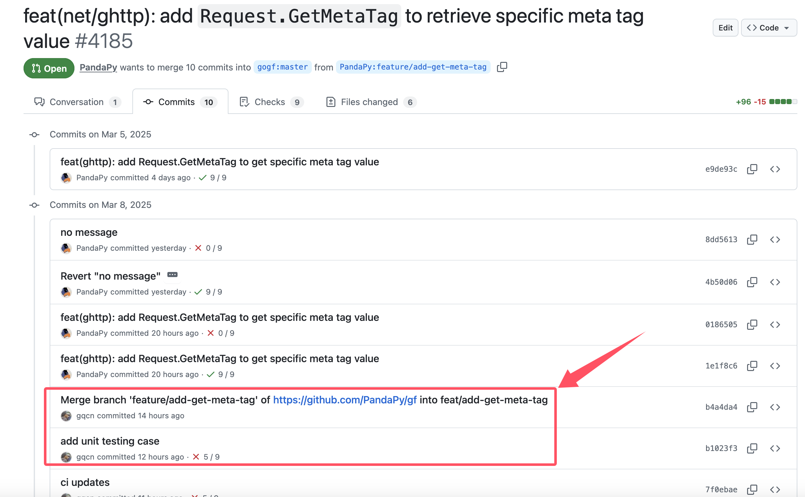

## 背景

在对`PR`做`CodeReview`的时候，有时想帮助贡献者修改一些简单的问题，以提高`PR`流程的效率。
通常来讲，需要自己fork相同的仓库，并基于对方的修改分支创建独立的分支，然后提交`PR`到对方的仓库，这样对方合并完成后，贡献的`PR`内容也会自动得到更新。

但这种流程繁琐很多，我有时在想，能不能直接修改对方`PR`的代码，然后当前`Review`的代码及时得到更新呢？


## 解决方案

最近通过社区小伙伴的提示，发现`github`上还真有这样的功能，其他的代码托管平台我不知道，但`github`这个特性还真是骚。

咱们以这个`PR`为例：https://github.com/gogf/gf/pull/4185 
目标`fork`仓库为 https://github.com/PandaPy/gf 
目标分支为 `feature/add-get-meta-tag`


我在本地基于主分支`master`创建了`feature/add-get-meta-tag`分支，然后
```bash
git pull https://github.com/PandaPy/gf feature/add-get-meta-tag
```
这样就基于他的分支修改内容继续做一些代码上的优化修改。

重点来了，修改完成后，需要通过以下的push方式来提交代码到对方的仓库分支中：
```bash
git push git@github.com:PandaPy/gf feature/add-get-meta-tag
```

:::info
这里的`git push`使用的是`ssh`地址，是因为`github`新版本不再支持`https`的`push`方式。
:::

随后，我们可以在`PR`上看到提交自己提交的修改，并且在对方的`fork`仓库也能看到自己的`commit`。


## 注意事项

1. 如果提交代码后，`PR`上展示的修改比较多，可能是由于你是从主分支开出来的分支，里面包含了最新的代码修改。可能先等等`github`上的`diff`更新，或者将`PR`关闭再重新打开。
2. 如果`PR`合并时使用了`squash merge`或者`rebase merge`，那么你的代码提交`commit`将不会展示在主仓库的`commit`历史中。提交的`commit`将被`merge`成一个`commit`，而展示的`commit`的`contributor`只是提交`PR`的同学。


