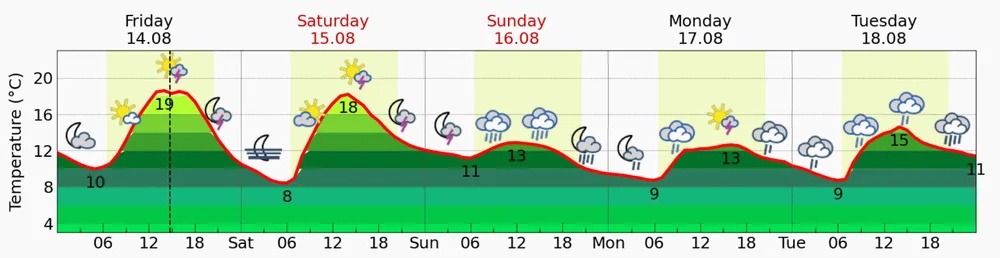
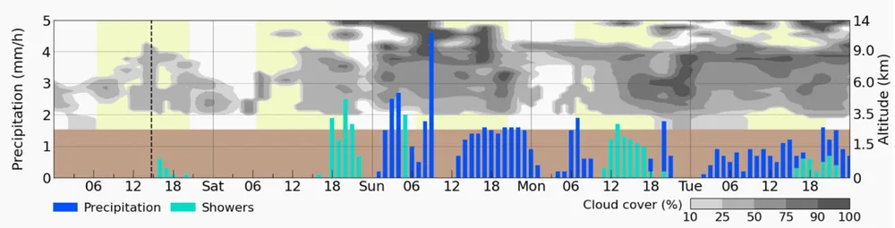
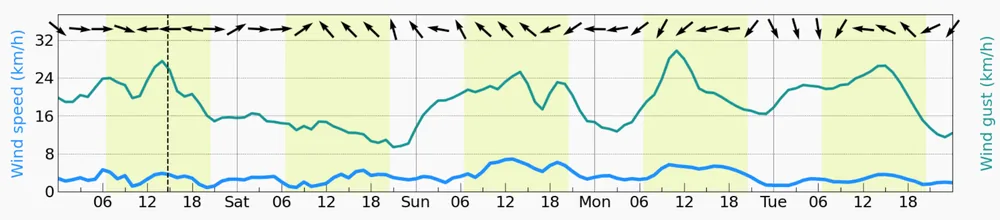
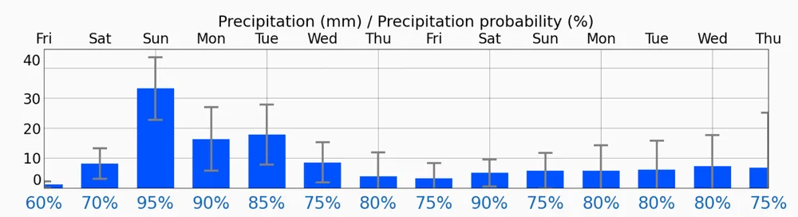

`Meteoblue`是由瑞士气象服务商`meteoblue AG`提供的天气应用，支持通过地名或经纬度查询全球陆地和海上地点，在户外驴友中比较常用。与只显示晴雨和最高、最低温度的普通天气应用相比，它的主要优势是同时提供逐小时气象图、14天趋势、多天气模型对比、卫星与雷达图、动态天气地图、天气预警和离线数据等功能。对于龙门山脉这类海拔变化大、局地天气明显的山区，`Meteogram 5-Day`和`MultiModel`尤其有价值：前者用于查看天气随时间和高度的变化，后者用于观察不同数值模型是否对同一过程达成一致。

:::info 注意事项
`Meteoblue`仍然是数值天气预报产品，不是山顶自动气象站的实况，也不能替代中国气象部门发布的预报、预警和现场判断。[Meteoblue关于预报可信度的说明](https://content.meteoblue.com/en/research-education/specifications/weather-variables/predictability/)特别提示，涉及登山等人身风险活动时，预报可信度只能辅助决策，不能代替专业的现场气象评估。
:::

## 主要功能和特点

| 功能 | 主要内容 | 户外用途 |
| :---: | --- | --- |
| **地点搜索** | 支持地名和经纬度，显示位置与海拔 | 尽量选择山顶、垭口或营地，而不是只看山脚城镇 |
| **`5 天`气象图** | 逐小时温度、天气图标、云层、降水、风向、平均风和阵风 | 安排出发、登顶和下撤时间 |
| **`14 天`气象图** | 每日温度范围、日降水量、降水概率和预报可信度 | 判断中期趋势，不宜直接制定小时级行程 |
| **`MultiModel`** | 并列展示多个模型的温度、降水、天气图标、风和湿度 | 识别模型分歧和预报不确定性 |
| **地图与实况** | 雷达、卫星、动态天气图和天气预警 | 临近出发时确认降水位置和发展趋势 |
| **离线数据** | 缓存已查看的天气数据 | 山区无网络时查看最后一次已同步的预报 |


## 查询地点时先核对海拔

以彭州九峰山（祖师殿）为例，在应用中搜索九峰山后，不能只核对地点名称，还要核对经纬度和海拔。示例截图的位置为`31.34°N、103.85°E`，标注海拔`3119 m asl`，其中`asl`表示高于平均海平面的高度。

山区预报最常见的误用，是把山脚、景区入口或同名地点的预报当成山顶预报。根据[Meteoblue对5天气象图地形高度的说明](https://content.meteoblue.com/en/private-customers/website-help/forecast/meteograms/5-days/)，天气模型会把真实地形离散为网格：截图顶部的`3119 m`是所选地点海拔，云图中的棕色带则代表模型网格的平均地形高度，两者并非同一个概念。`MultiModel`左侧还会显示各模型采用的网格海拔，例如截图中的`ARPEGE-25`为`3096 m`、`IFS-20`为`2964 m`、`IFS-HRES`为`3141 m`。不同模型的网格海拔不同，是温度、风和降水预测出现差异的原因之一。

## 5天天气图


[Meteoblue的5天气象图说明](https://content.meteoblue.com/en/private-customers/website-help/forecast/meteograms/5-days/)将该视图分为三个上下对齐的图表，横轴都是当地时间。淡黄色背景表示白天，白色背景表示夜间；竖向虚线是截图生成时刻。所有曲线和柱状图都要沿同一条时间轴上下对照，不能只看单个图标。

### 界面内容介绍

#### 温度和天气图标



最上方红线是逐小时气温，红线下方的数字是每日高、低温。示例中，祖师殿附近预报温度大致在`8～19℃`之间，周日白天升温很弱，同时出现持续降雨图标。对户外活动而言，这不只是“凉快”：降雨、湿衣和风会明显增加失温风险，体感不能仅用气温判断。

天气图标每`6`小时概括一次最可能的天气状况。图标反映一个时间段，不是图标所在瞬间；[Meteoblue天气图标说明](https://content.meteoblue.com/en/research-education/specifications/standards/symbols-and-pictograms/)指出，图标由区域云量与所选地点的降水、风、温度等信息综合生成。因此，图标适合快速浏览，精细判断仍要看下方的降水柱、云层和风。

#### 降水和云层



中间图表叠加了两类信息：

- 左轴是降水，示例单位为`mm/h`。深蓝柱表示**总降水量**，浅蓝绿色柱表示**阵性降水**。[Meteoblue降水变量说明](https://content.meteoblue.com/en/research-education/specifications/weather-variables/precipitation/)将阵性降水定义为包含对流性和地形性降水，这类降水通常比大范围层状降水更零散、局地差异更大。
- 右轴是海拔高度，**灰度表示各高度层的云量**，颜色由浅到深对应约`10%～100%`云量。按照[Meteoblue云量说明](https://content.meteoblue.com/en/research-education/specifications/weather-variables/clouds/)，云量表示某一高度层被云覆盖的比例，不是能见度，也不是降雨强度。
- 棕色带表示模型网格的平均地形高度，不是九峰山的真实山体剖面。山区网格平均海拔可能明显低于山顶，因此不能把棕色带上沿当成祖师殿海拔。

图中周六傍晚以后降水逐渐增多，周日有连续深蓝柱，单小时峰值约`4～5 mm/h`；周一、周二仍有多段降水。与此同时，祖师殿所处的约`3.1 km`高度附近有较多中深灰云层。合理结论是“持续湿滑、进入云层和能见度下降的风险较高”，而不是断言每个时段都会按柱高在祖师殿实测到同样雨量。

#### 风向、平均风和阵风



最下方图表中，**浅蓝线是平均风速，深绿色线是阵风**，单位均为`km/h`。根据[Meteoblue风变量说明](https://content.meteoblue.com/en/research-education/specifications/weather-variables/wind/)，平均风通常是前一模型时段内的平均值，阵风代表短时间可能出现的最大风速；黑色箭头的箭头尖指向空气流去的方向，这一点与“北风表示风从北方吹来”的气象命名方式相反。

示例中的平均风约为`1～7 km/h`，阵风约为`10～30 km/h`。山脊安全应优先关注阵风，而不是只看平均风。模型给出的通常是距地面`10 m`的网格风；祖师殿附近的山脊、垭口、迎风坡和林线以上区域可能因地形加速而与网格值不同，背风林地则可能更弱。

### 降雨量怎样按标准理解


#### 先分清小时强度和累计雨量

按照[Meteoblue对降水量单位的说明](https://content.meteoblue.com/en/research-education/specifications/weather-variables/precipitation/)，**`1 mm(millimetre)`降水等于每平方米地面接收`1 L`水**。数值本身必须和统计时段一起读：

- `5天`图的`mm/h`表示对应小时的平均降水强度，用于识别降水集中在哪些小时。
- `MultiModel`中的降水柱表示前`1`小时累计量，用于比较不同模型对小时雨量的预测。
- `14天`图中的柱高表示一天的累计降水量，可以直接与`24`小时降水等级比较。

| 视图 | 图中数据 | 主要用途 | 能否直接套用累计等级 |
| --- | --- | --- | --- |
| `5天` | 小时强度`mm/h` | 判断峰值强度和降水时段 | 不能，需先按目标时段累计 |
| `MultiModel` | 前1小时累计量 | 比较模型预测和一致性 | 不能，需先累加多个小时 |
| `14天` | 每日累计量`mm` | 判断全天雨量及其范围 | 可以使用`24`小时等级 |

时段累计降水量可按下面的关系计算：

```text
时段降水量（mm）≈ 平均降水强度（mm/h）× 持续时间（h）
```

例如，`4 mm/h`持续`30`分钟，理论累计量约为`2 mm`；持续`2`小时，理论累计量约为`8 mm`。实际天气中的强度会随时间变化，因此计算较长时段累计量时，应分别累加每个小时的数据，不能假定峰值强度持续整个时段。


[国家标准`GB/T 28592-2012《降水量等级》`](https://openstd.samr.gov.cn/bzgk/gb/newGbInfo?hcno=B4A00E4ABCF80F8C6A048C1D0121A97D)按固定时段内的累计降雨量划分等级。常用的`12`小时和`24`小时等级如下：

| 等级 | 12小时降雨量 | 24小时降雨量 |
| :---: | --- | --- |
| **小雨** | `0.1～4.9 mm` | `0.1～9.9 mm` |
| **中雨** | `5.0～14.9 mm` | `10.0～24.9 mm` |
| **大雨** | `15.0～29.9 mm` | `25.0～49.9 mm` |
| **暴雨** | `30.0～69.9 mm` | `50.0～99.9 mm` |
| **大暴雨** | `70.0～139.9 mm` | `100.0～249.9 mm` |
| **特大暴雨** | `≥140.0 mm` | `≥250.0 mm` |

示例`5天`图中，周日最高降水柱约为`4～5 mm/h`，表示峰值小时的预测平均强度约为每小时`4～5 mm`。如果这一强度持续完整一小时，对应每平方米约接收`4～5 L`水。这个峰值不能直接判定该`12`小时或全天属于小雨、中雨或大雨；只有得到完整`12`小时或`24`小时累计量后，才能查表确定相应等级。

若需要从`5天`图估算`12`小时等级，应累加目标时段内连续`12`个小时的预测降水量；判断`24`小时等级时，则应累加完整`24`小时，或直接参考`14天`图的日累计量。手工读图只能得到近似值，对流性和地形性阵雨还存在明显空间差异，模型网格平均雨量不等于路线每一处都会出现相同雨量。




#### 降水概率不等于降水量

降水概率回答“这个时段或区域出现可测降水的可能性”，降水量回答“如果出现，预计下多少”。二者不能互换：

- `90%`概率配合`1 mm`，表示小量降水很可能出现；
- `30%`概率配合较高的可能雨量，表示命中地点不确定，但一旦命中仍可能出现强降水；
- 山地对流中，邻近网格之间的实际雨量可能相差很大。

因此，户外判断至少要同时看降水概率、柱高、误差范围、阵性降水类型和模型一致性。

### 风速怎样按标准理解


根据[Meteoblue风速单位和蒲福风级说明](https://content.meteoblue.com/en/research-education/specifications/weather-variables/wind/)，应用可以显示`km/h`、`m/s`、节或蒲福风级，换算关系为`1 m/s = 3.6 km/h`。`Meteoblue`公开的蒲福风级表包含`0～12`级，下面按风速由低到高完整列出；为避免表格过宽，拆成两段展示。[国家标准信息公共服务平台](https://openstd.samr.gov.cn/bzgk/gb/newGbInfo?hcno=BD0C47493F5ABA08B24176BF8A81218A)显示，国内现行对应标准为`GB/T 28591-2012《风力等级》`；本文解读`Meteoblue`界面时，以应用官方公布的区间为准，不将不同体系的扩展等级直接混用。

| 风力 | 风速（`m/s`） | 风速（`km/h`） |
| :---: | --- | --- |
| **`0`级** | `0.0～0.2 m/s` | `<1 km/h` |
| **`1`级** | `0.3～1.5 m/s` | `1～5 km/h` |
| **`2`级** | `1.6～3.3 m/s` | `6～11 km/h` |
| **`3`级** | `3.4～5.4 m/s` | `12～19 km/h` |
| **`4`级** | `5.5～7.9 m/s` | `20～28 km/h` |
| **`5`级** | `8.0～10.7 m/s` | `29～38 km/h` |
| **`6`级** | `10.8～13.8 m/s` | `39～49 km/h` |
| **`7`级** | `13.9～17.1 m/s` | `50～61 km/h` |
| **`8`级** | `17.2～20.7 m/s` | `62～74 km/h` |
| **`9`级** | `20.8～24.4 m/s` | `75～88 km/h` |
| **`10`级** | `24.5～28.4 m/s` | `89～102 km/h` |
| **`11`级** | `28.5～32.6 m/s` | `103～117 km/h` |
| **`12`级** | `32.7～36.9 m/s` | `118～133 km/h` |


#### 截图中的风怎样判断

按数值范围换算，截图中的平均风主要处于`0～2`级量级，阵风峰值接近`5`级下限。这里说“量级”而不是直接给阵风定级，是因为蒲福风级通常对应持续平均风，而阵风是短时最大值。即使平均风很小，接近`30 km/h`的阵风在湿滑山脊、崖边或使用雨披时仍会明显影响平衡。

没有一条适用于所有徒步者和所有地形的统一“几级风必须下撤”阈值。路线暴露程度、人员负重、降雨、低温、雷电和可用下撤点必须一起评估；若当地气象部门发布大风或雷电预警，应以预警和现场条件为准。

## 14天天气图


按照[Meteoblue的14天天气图说明](https://content.meteoblue.com/en/private-customers/website-help/14-day-weather/)，该视图用于观察天气过程和不确定性的变化，不适合把第`10`天某个图标理解成精确行程预报。

### 预报可信度

日期下方的`Predictability`是整天、多个天气变量综合后的预报可信度，不是降雨概率。[Meteoblue预报可信度说明](https://content.meteoblue.com/en/research-education/specifications/weather-variables/predictability/)给出的解释是：

| 可信度 | 官方含义 |
| :---: | --- |
| `80%～100%` | 预报可靠，变化可能性很小 |
| `60%～80%` | 较可靠，不太可能变化 |
| `40%～60%` | 存在不确定性，预报可能变化 |
| `20%～40%` | 较不确定，很可能变化 |
| `0%～20%` | 不确定，极可能变化 |

示例中`14`天的可信度只有`40%～55%`，全部落在“可能变化”这一档。即使前几天图标连续显示雷阵雨，也应把它理解为潮湿、对流活跃的风险信号，而不是已经确定的逐日结果。预报时效越长，山地局地细节通常越不可靠。

### 温度范围和降水范围

温度图中的粗线表示最可能的发展，色带表示不同集合预报成员给出的可能范围。色带越宽，温度不确定性越大。

降水图中的蓝柱是最可能的日累计量，黑色误差线表示模型给出的可能范围，底部百分数是降水概率。以`8 月16日`为例，柱高约`32 mm`，按`24`小时标准落在“大雨”量级；但误差范围约为`23～41 mm`，横跨“中雨”和“大雨”，同时当天综合可信度约`50%`。准确表述应是：“出现降水的概率很高，日累计存在达到大雨量级的可能，但雨量等级仍不确定。”

截图中`8 月16日`的`95%`是降水概率，不代表“雨量预测有`95%`准确率”，也不代表一天有`95%`的时间下雨。

## 多模型天气图


[Meteoblue的MultiModel说明](https://content.meteoblue.com/en/private-customers/website-help/forecast/multimodel/)指出，`MultiModel`把不同数值模型的原始预测并列展示，目的不是给出一个更精确的单点结果，而是让用户看见可能的发展分支。

### 温度曲线

每条彩色线代表一个模型，黑色虚线是各模型平均值。曲线聚拢表示模型对温度变化较一致，曲线明显分散表示不确定性增大。山区还要同时看左侧的模型网格海拔：不同模型采用的网格海拔不一致，会直接影响温度曲线。因而不能简单认为最高或最低的某条线就是“山顶真实温度上限或下限”。

### 降水柱和模型一致性

降水柱表示前`1`小时累计量，颜色越深表示预测有降水的模型越多，即模型一致性越高。示例中周一、周二有较高的青色柱，但不少时段颜色偏浅，含义是“部分模型给出较大雨量，但模型一致性不高”。这类信号不能忽略：它不证明强降水必然发生，却说明存在需要持续跟踪的较高影响情景。

### 各模型天气图标

下方每一行对应一个模型。若大部分模型在相近时段都出现降雨或雷暴图标，可信度相对更高；若晴、阴、雨图标混杂，具体发生时间和地点仍不稳定。示例中多个模型对周日至周二存在降水有一定共识，但对降水强度、开始时间和间歇差异明显，这与`14 天`图只有`40%～55%`的综合可信度相互印证。


