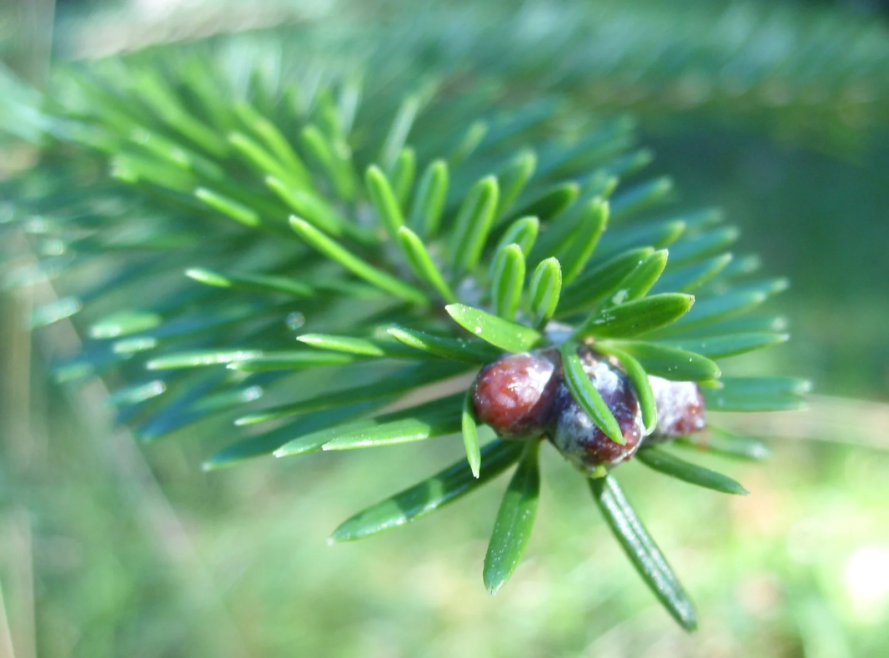
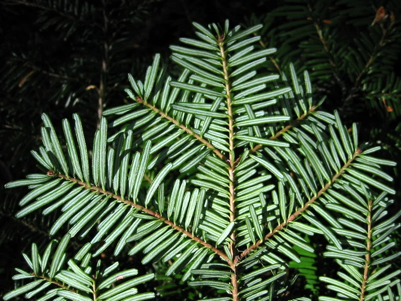
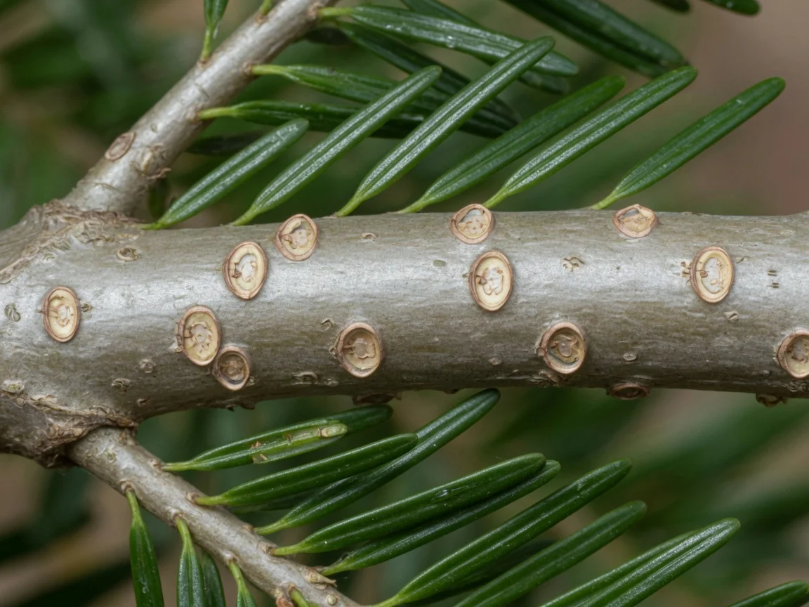
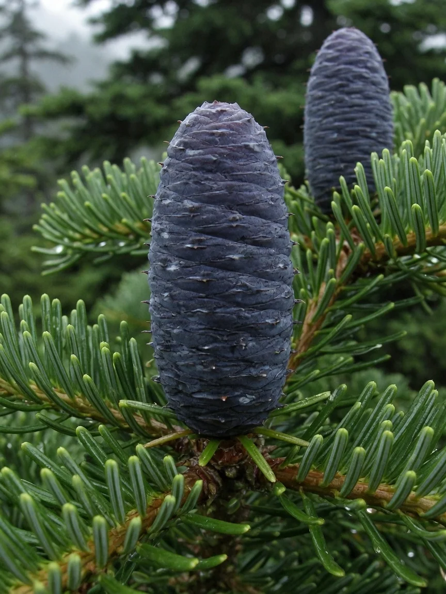
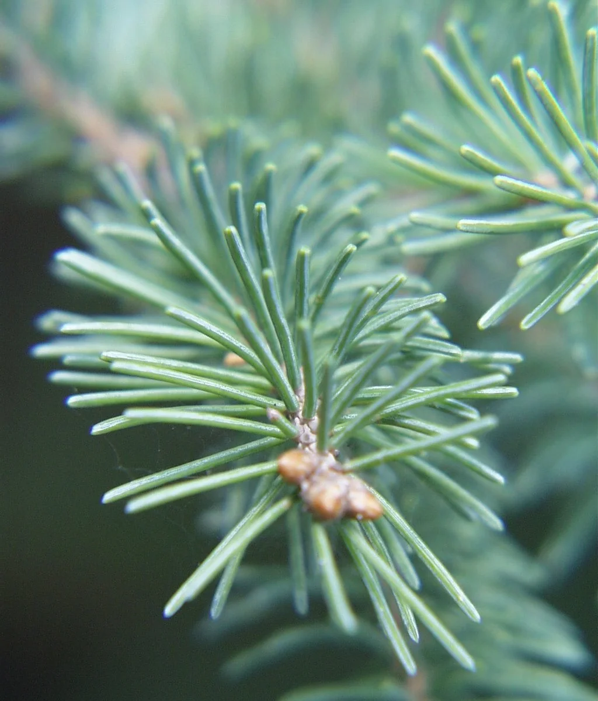
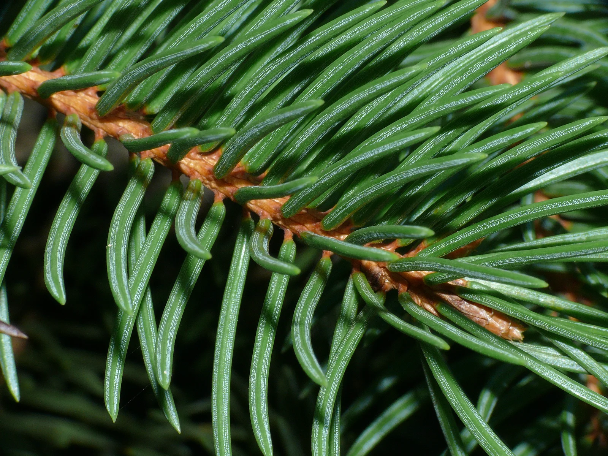
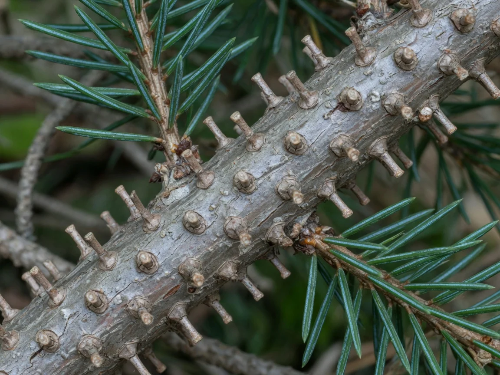
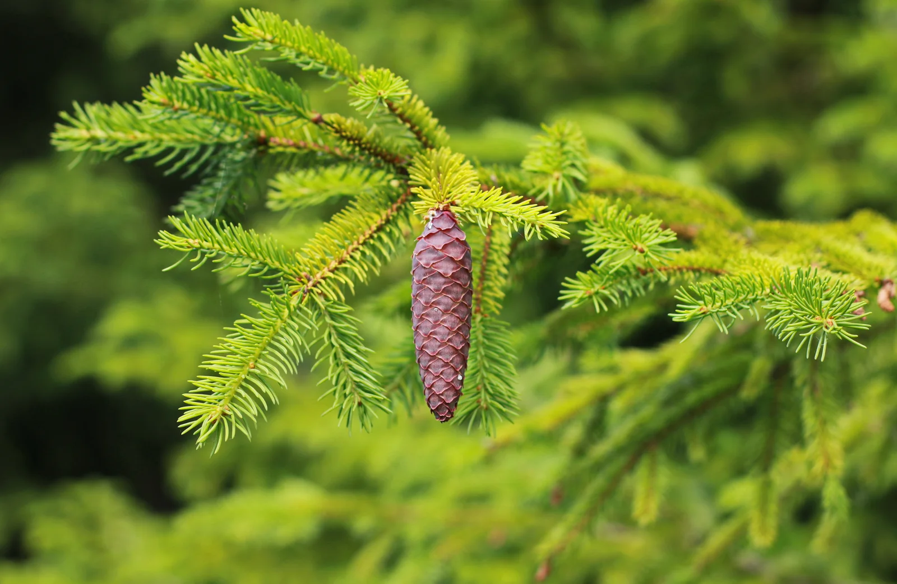

九峰山高差很大，火焰峰、白虎峰刚过`3300`米，仙人峰、黄龙峰已经四千五上下。不管走哪一座，只要进到大约`2800～3500`米，林相都差不多：阔叶树退下去，剩下又直又暗的针叶树，林下潮，苔藓厚，雾一起来，十几米外就糊成一团。地方介绍把这一层写成冷杉、云杉组成的针叶林。名字很近，远看也像，不少人会把它们和山下的杉木当成一类。

它们其实都是**松科**：冷杉属`Abies`、云杉属`Picea`。杉木是杉科`Cunninghamia`，多在中低山造林地，和这层暗针叶林不是一回事。

:::info 保护区里的记录
这一带在白水河国家级自然保护区和大熊猫国家公园范围内。已发表的群落调查把高海拔建群种记为**岷江冷杉**（`Abies fargesii var. faxoniana`），并记录了铁杉林，没有单独列出云杉林群系。地方介绍仍常并称“冷杉、云杉”。
:::

## 林层海拔

彭州西北的山，是龙门山脉中段向四川盆地跌下来的前缘。九峰从火焰峰、白虎峰的三千三百多米，到仙人峰、黄龙峰的四千五百米上下，都坐落在同一套垂直带里。从湔江河谷到太子城一带，高差超过`4000`米，植被随海拔换成好几层。不同材料划带的数字会差一两百米，这在山地里很正常，坡向、沟谷和人为干扰都会把界线拧歪。对照地方介绍和白水河保护区的调查，九座山可以共用下面这张带谱：

| 大约海拔 | 植被带 | 常见树木 |
| :---: | :---: | --- |
| `4000`米以上 | 流石滩、常年积雪 | 乔木基本消失 |
| `3500`米以上 | 高山灌丛、草甸 | 杜鹃等灌丛 |
| `2500～3500`米 | 亚高山暗针叶林 | 冷杉为主，可混生云杉 |
| `2200～2500`米 | 针阔混交林 | 铁杉、桦、槭等 |
| `1500～2200`米 | 落叶阔叶林、常绿与落叶混交林 | 桦、槭及常绿阔叶树 |
| `1500`米以下 | 常绿阔叶林 | 樟、楠、壳斗科等 |

刘士华等`2008`年在白水河保护区东南坡的样方调查写得很具体：乔木种类从海拔`1400`米附近的十来种，到林线附近只剩两种；在`2800～2900`米，因为出现比较单纯的冷杉群落，乔木层均匀度会突然下降。陈旭等`2020`年按《四川植被》的系统整理保护区群落，把**冷杉林**列为高海拔代表性类型，分布大约`3000～4000`米，郁闭度约`0.6～0.7`，林下常有杜鹃，并混有花楸、高山柳等。地方融媒体介绍则把`2800～3500`米概括为冷杉、云杉针叶林，`3500`米以上转为高山灌丛草甸。

这条带不是某条进山路独有的，而是九座山在同一高度上共有的一层。阴坡、沟谷里的冷杉往往比阳坡更整齐；脊上风大，树会被削矮、变疏，再往上交给杜鹃和草甸。同一海拔段的优势乔木都换成了这层暗针叶林，但疏密会随坡向和风力变化。树冠变暗、空气变潮、脚下苔藓变厚，往往比手表上的数字更先告诉你：已经离开中山阔叶林了。

## 冷杉与云杉

### 冷杉

冷杉是九座山这一层最常见的大树。树干通直，树冠尖塔形，侧枝一层层平展。识别时抓住这几条：

- **针叶**：扁平、薄、软，捏一把不扎手；下面有两道白霜一样的气孔带，常排成两列。
- **球果**：**直立朝上**长在枝头，像短蜡烛。成熟后种鳞在树上碎掉，地上几乎捡不到完整的冷杉球果，枝头往往只剩一根果轴。
- **小枝**：落叶后留下圆形浅坑，摸起来比较平，没有凸起的疙瘩。
- **小苗**：耐荫。密林腐殖土上常常成片冒出来，九峰山这一层林下小苗以冷杉为主。

白水河保护区把这层冷杉林的建群种记为岷江冷杉（`Abies fargesii var. faxoniana`）。它是中国特有种，主产甘肃南部和四川，大约`2700～3900`米，喜欢阴湿坡，林下常有杜鹃和箭竹。高达约`40`米。它没有被列入`2021`年《国家重点保护野生植物名录》，但所在林分仍受保护区和大熊猫国家公园约束，不能攀折、剥皮。

岷江冷杉的针叶扁平、较软，先端钝或有凹缺；冬芽卵圆形，树脂多。

冷杉针叶排成两列，翻过来能看见两道白霜状气孔带。图为太平洋银杉（`Abies amabilis`）叶背，这一特征与岷江冷杉相同。

叶子掉了以后，冷杉小枝上留下圆形浅坑，枝面比较平，没有木钉。图为按冷杉属叶痕形态绘制。

冷杉球果朝上，成熟前常呈深紫、蓝黑，苞鳞往往只露出尖头。

### 云杉

云杉远看也是尖塔形，和冷杉很容易混。九峰山这一层仍以冷杉为主，云杉多半混在林里，公开调查没有把它写成单独的大片群系。和冷杉对上看，常用这几条：

- **针叶**：横切面四棱，先端尖，围着小枝转一圈，像洗瓶刷；捏一把会扎手。
- **球果**：**全部向下垂挂**。成熟后整颗掉到地上，种鳞不碎。登山路上捡到的完整、较大的“松果”，多半是云杉。
- **小枝**：每片叶坐在一个凸起的木钉状**叶枕**上，叶子掉了疙瘩还在，摸起来粗糙扎手。
- **小苗**：针叶短硬、向外扎开。云杉比冷杉更喜光，密林腐殖土上不如冷杉小苗多，林窗、路边、塌方处更容易见到。

少数云杉叶子也会偏扁，所以不能只靠“扎不扎手”，还要看小枝上有没有叶枕、球果朝哪边。

云杉针叶较硬、先端尖，围着小枝转一圈。

针叶横切面近四棱，气孔线分布在各个面上；叶基坐在隆起的叶枕上。

叶子掉了，凸起的叶枕还在，摸起来粗糙扎手。图为按云杉属叶枕形态绘制。

云杉球果下垂，成熟后整颗掉落。

### 二者的区分

远看几乎没用，要靠近小枝，也可以看脚下有没有完整球果、林下有没有成片小苗：

| 看哪里 | 冷杉（岷江冷杉） | 云杉 |
| :---: | --- | --- |
| **针叶** | 扁平薄软，不扎手；下面两道白霜气孔带 | 四棱、先端尖，捏一圈扎手 |
| **球果** | 直立朝上；成熟后在树上碎掉，地上捡不到完整果 | 全部下垂；整颗掉地上 |
| **小枝** | 光滑，落叶后是圆形浅坑，没有疙瘩 | 留有凸起叶枕，摸起来粗糙扎手 |
| **小苗** | 密林腐殖土上常成片出现 | 针叶短硬、向外扎开；密林里少，林窗、路边、塌方处更多 |
| **口诀** | 扁、软、朝上、林下苗多 | 棱、扎、朝下、疙瘩枝 |

先摸小枝，再看球果方向。路上若捡到完整、个头不小的球果，优先想云杉——冷杉的果在树上就散了。

把两张小枝特写放到一起看：冷杉是圆形浅坑，云杉是木钉疙瘩。

冷杉：枝面平，圆形叶痕。

云杉：枝面糙，叶枕凸起。

> 再往下走一段，还可能碰到**铁杉**：叶子也扁，也有白带，球果也下垂，但通常明显更小。铁杉多在针阔混交那一层，海拔通常低于冷杉纯林。到了`2800`米以上，优先按冷杉、云杉来认。

## 对户外的参考价值

九峰山这层林子位于自然保护区和大熊猫国家公园范围内，活立木、枯倒木、苔藓和林下竹类都不是可以随意动的资源。

### 它是最清楚的海拔路标之一

从阔叶林走进这片青黑色针叶林，通常意味着已经进入亚高山带。九座山走到这一高度，都会碰到这类林子。刘士华等的调查说明，到`2800`米附近乔木种类已经很少，冷杉可以单独成林。把植被带和海拔、坡度放在一起看，比单独盯着手表更稳：手表在深谷和密林里会跳，林相一般不会突然骗人。

### 它决定了这一段的体感和风险

暗针叶林的林冠密、湿度高，雾和低云很容易停在里面。地面苔藓厚、腐殖质松，鞋子长期是湿的。气温不一定低到让人害怕，但**风寒加上湿衣**，失温来得很快。九座山的山脊都常是风口，从林内刚钻出来时温差更明显。这一层的山径两侧苔藓往往很厚，走起来软，实际是把水含在脚下。

对行程的影响很具体：

- 这段路看起来不陡，耗时却常被湿滑和能见度吃掉。
- 树干颜色接近，雾里辨方向困难，容易原地打转。
- 林下箭竹、杜鹃会把路迹盖住，不能默认“顺着最明显的槽走就是路”。
- 夏季林内蚊虫、秋季落叶覆盖的腐木，都会让脚步变沉。

山脊上的单株针叶树常被风削得很瘦。它们挡风有限，倒是说明：一出林缘，保护就没了。九座山走到林线附近，都会碰到这种从密林突然换成灌丛、裸岩的过渡。

### 林冠可以挡风挡雨，但不是安全屋

密林能减弱降水直接打在身上的力量，也能挡住一部分风。紧急情况下，靠大树的背风侧、岩窝外侧的林缘，比站在裸脊上更有利于稳住体温。但冷杉、云杉林里同时有三类危险，不能当成天然营地：

1. **枯立木和风倒木**。亚高山针叶树浅根、树冠重，雨雪和风之后，枯树会突然折断。帐篷不要支在枯立木、倾斜大树和已经悬空的倒木下方。
2. **积雪压枝**。冬季、早春，枝上积雪会成块砸下来。白天化、夜里冻，断枝不看季节。
3. **地面排水差**。厚苔藓看起来平整，下雨后会变成海绵。营地要选微高、有薄土或碎石、能看出水流方向的位置，而不是“林子最平的那块”。

### 它是水源涵养林，也提示水在哪里

川西亚高山冷杉、云杉林长期被当作长江上游的水源涵养林来保护。树冠截留雨雾，苔藓和腐殖质把水慢慢放进土壤，再补给山溪。彭州的母亲河湔江是沱江上源之一，九座山这一侧的森林，作用首先是稳住坡面和径流，不是提供木材。

对徒步补水，有两点比较符合现场：

- 林线附近、阴坡沟槽、倒木下方渗出的小水线，往往比宽阔的干沟更靠得住。水量可以很小，但比在脊上找水现实。
- 苔藓地里的积水不能直接当饮用水。它经过腐殖质，看起来清，仍需过滤或煮开。保护区内也不应挖苔藓“挤水”。

### 它是动物的房子，人只是路过

冷杉林下的箭竹，是大熊猫季节性活动的食物和隐蔽条件；林冠层和中层，也是川金丝猴等物种会利用的空间。彭州官方介绍，大熊猫国家公园彭州片区在第四次大熊猫调查中记录有野生个体，保护区还记录金丝猴、扭角羚等。户外能做的，不是“寻找熊猫”，而是：

- 在竹林、兽径上降低嗓门，不追、不围、不投喂。
- 食物密封，残食带走。针叶林里的啮齿类和小型食肉动物对气味很敏感。
- 夜宿听到附近有踩枯枝的声音，先判断距离，不要用头灯去扫。
- 不采集球果、树皮、树脂和苔藓。对动物来说，这些是栖息地的一部分；对识别来说，拍照比采样本够用。

### 生火、取材和“野外技能”在这里不适用

冷杉、云杉的树脂含量高，**干燥枯枝**在求生教材里常被写成好火种。这只说明材料的燃烧性质，不说明九座山上允许用。白水河是国家级自然保护区，大熊猫国家公园对野外用火、毁林和采集有明确管制。活树、活枝、树皮上的树脂泡都不能动；即便是枯枝，在保护区里也不应被理解成可以自由取用。

真正有用的准备是：防风防雨的衣物、备用保暖层、头灯和导航、以及把“这段林子会很湿”写进行程，而不是指望进山后靠针叶树解决燃料和庇护。

### 摄影和观察

暗针叶林的光比很大，雾、丁达尔光、树上的挂苔、林下金黄或翠绿的苔藓，都是九座山中高海拔最稳定的画面。观察时可以先翻叶子背面：先看叶痕，再看气孔带，有球果再看方向。

## 保护边界

九座山`2800～3500`米这层林子，首先是水源涵养和野生动物的栖息地。需要记住的边界很短：

- 这里是自然保护区和大熊猫国家公园，不是可以“靠山吃山”的柴场。
- 岷江冷杉虽未单列进`2021`年国家重点保护野生植物名录，林分仍受保护区法规约束。
- 识别用眼睛和照片，不用刀、锯和剥皮。
- 不在林内用火，不在枯立木下过夜，不把苔藓地毯当成可以开挖的地面。

这片林子长得很慢，补起来也很难。

## 参考资料

- 傅立国、李楠、R. R. Mill，《中国植物志》英文版`Flora of China`第`4`卷，[冷杉属](http://www.efloras.org/florataxon.aspx?flora_id=2&taxon_id=10037)、[岷江冷杉](http://www.efloras.org/florataxon.aspx?flora_id=2&taxon_id=210000007)。
- [植物智：岷江冷杉](https://www.iplant.cn/info/Abies%20fargesii%20var.%20faxoniana)。
- 陈旭、刘可倚、彭科、谢大军，`2020`，《四川白水河国家级自然保护区植物群落分布和优势种》，《四川林业科技》。冷杉林记为`Form. Abies faxoniana`。
- 刘士华、高信芬、涂卫国、方志强、胡大明、李兴贵，`2008`，《彭州白水河国家级自然保护区植物群落α多样性的海拔梯度变化》。
- 彭州市融媒体中心相关介绍，将彭州山地`2800～3500`米概括为冷杉、云杉针叶林。
- 国家林业和草原局、农业农村部，`2021`年《国家重点保护野生植物名录》。
