走三口锅路线，快到牛坪前后，海拔大约`2500～3000`米。针阔混交林开始把位置让给更暗的针叶林，路边阴湿、腐殖质厚，常能看见一种齐膝高的草本：一根不分支的茎，叶子互生，卵形到椭圆形，平行脉很清楚。没开花时，不少人会把它和黄精看成一类。当地也把早春嫩芽叫偏头菜、山糜子。

植物志里，真正叫**鹿药**的是天门冬科舞鹤草属的一种。九峰山这一带至少还有近缘种。路边俗称“鹿药”，更稳妥的理解是**舞鹤草属**。

:::info 保护区里的记录
这一带在白水河国家级自然保护区和大熊猫国家公园范围内。陈旭等`2020`年的群落调查，在海拔`2000～2500`米的槭树林草本层把鹿药记为**管花鹿药**，同一层还记了黄精（卷叶黄精）；在`3000～3500`米的铁杉林草本层记了紫花鹿药。活株、根状茎都不是可以随便挖的资源。
:::

## 识别鹿药

鹿药的几大特征：叶子互生、花在茎顶、浆果熟时红到红褐、根状茎横走、须根较多。开花以后最容易一次看准。

### 植株和叶子

多年生。根状茎横走，多少圆柱状，有时有膨大的结节，粗大约`6～10`毫米，须根多。茎高大约`30～60`厘米，中部以上或仅上部有粗伏毛。叶`4～9`枚，有短柄；叶片卵状椭圆形、椭圆形或长圆形，长约`6～15`厘米、宽约`3～7`厘米，先端短渐尖，两面疏生粗毛或近无毛，平行脉明显。

这些数字取自鹿药的植物志记载。管花鹿药更高一些，可达`50～80`厘米，叶子也更大。没开花时，两者在路边都是“一根茎、互生阔叶”，不要靠株高硬分。

三口锅路边已经拍到的开花植株，茎上部有毛，叶子卵状椭圆形、脉纹清楚，和鹿药的记载相符：

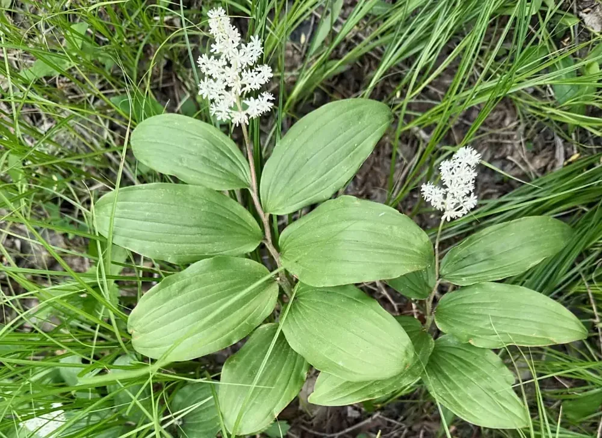

茎顶一丛小白花，叶子互生、有短柄。这是舞鹤草属在九峰山路边最常见的样子。

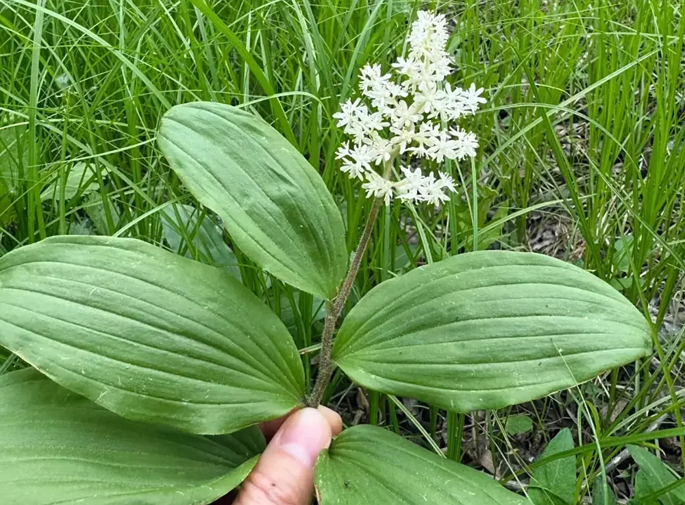

花序轴和花梗有毛；花被片开展，不是从叶腋垂下来的筒状花。

植物志里更典型的鹿药，圆锥花序分枝较疏，单朵花像小星星：

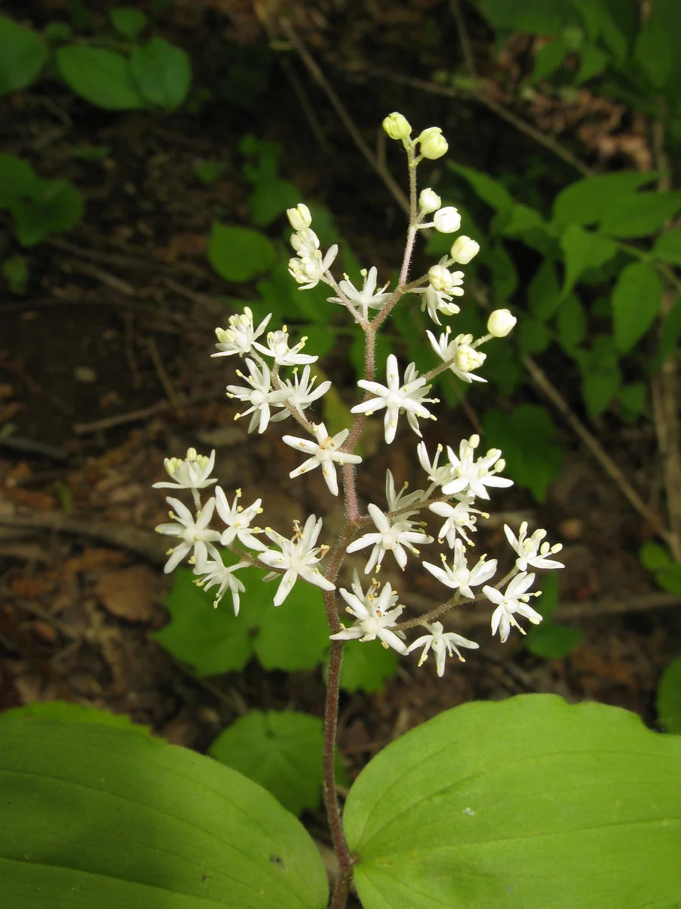

花被片`6`枚，分离或仅基部稍合生，长约`3`毫米，白色。花序轴被毛。图为植物志所记的鹿药。

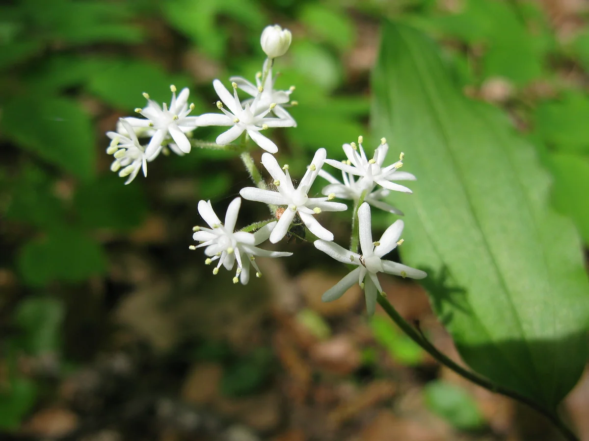

六枚花被片开展，雄蕊花药小。这和黄精属挂在叶腋下的筒状花完全不是一类。

### 花期和果期

植物志记鹿药花期`5～6`月，果期`8～9`月；管花鹿药花期`5～6`月，果期`8～10`月。高海拔路边往往会偏晚一些，具体要看当年积雪和坡向，不能把平原或低山的物候直接套到牛坪。

浆果近球形，仍聚在茎顶。植物志记熟时**红色**，直径约`5～6`毫米，种子`1～2`颗；管花鹿药的果稍大，约`7～9`毫米。三口锅路边完全成熟的果偏**红褐色**，比刚转色时更深。秋季叶子开始黄、焦边，顶上那一串果反而更显眼。

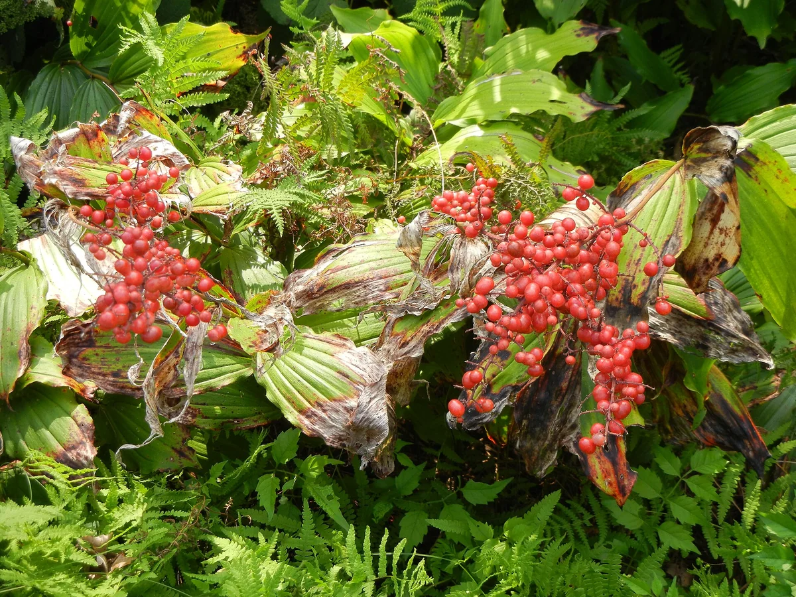

浆果长在茎顶、熟时红到红褐，这一特征与中国的鹿药、管花鹿药相同；黄精属的果则挂在叶腋，颜色也常是蓝黑或紫红。味道和能不能大量吃，见下文。

### 早春的芽

雪化以后，地面先冒出带鞘的嫩芽，断面发白，叶子还包在芽里。东北林区把这个阶段的鹿药叫山糜子，川西路边叫**偏头菜**的。此时最难认，也最容易和外形相近的林下草本、以及有毒的藜芦属搞混。

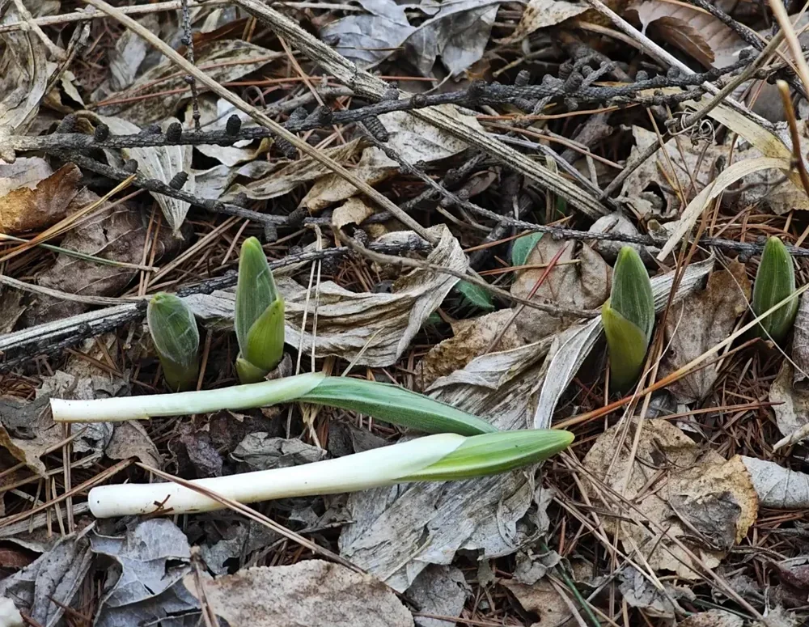

芽鞘包着未展开的叶子，地下仍连着横走的根状茎。图中是识别用的形态，不是建议在保护区内采割。这个阶段不要凭“像笋、像葱”来决定能不能吃。

根状茎本身是识别材料，不是路上的补给：

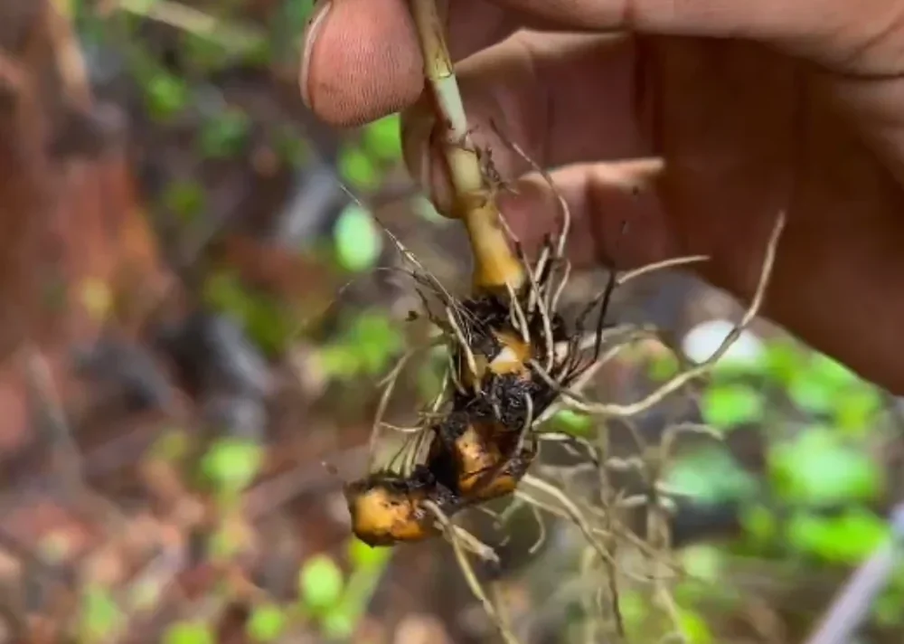

根状茎圆柱状或略呈念珠状，须根多。看形态用眼睛即可，保护区内不要把根挖出来。

## 能不能吃

先把边界说清楚：三口锅近牛坪这一段在白水河国家级自然保护区和大熊猫国家公园里，**嫩芽、红果、根状茎都不能采**。下面写的是它在别的地方怎么被当成野菜、哪些部位有记载、哪些没有，不是沿途的补给清单。

### 传统当菜的是早春嫩芽

有记载、能核对的食用部位，主要是**刚出土的嫩芽、嫩茎叶**。东北林区叫山糜子，川西路边叫偏头菜。吉林省林业部门介绍蛟河一带的山糜子，写明`4`月至`5`月采嫩苗；通化师范学院周繇教授也说，长白山把幼苗焯水、过凉后，蘸酱、炒食、做汤或做馅。滇西北的民族植物学调查，把管花鹿药等几种舞鹤草属的嫩茎叶记为野菜。本站野菜笔记里的[偏头菜](/life/wild-vegetable-smilacina-japonica)，记的就是三口锅路边这一类植物的嫩芽。

叶子完全展开、植株已经齐膝高以后，做野菜的人一般不再取。老叶纤维多、苦味重，不是常规食用部位。花一般也不吃。成熟浆果另说，见下一小节。

常见做法很简单：洗净，沸水焯一下，过凉，再凉拌、清炒、做汤或蘸酱。吉林的材料写“沸水伸一下”，周繇写开水烫后用凉水泡，说的都是去掉生涩，不是当生食沙拉吃。

口感没有实验室标准，只有实地记录。本站野菜笔记写三口锅的偏头菜：生吃生脆，甜中微苦，隐约有点黄瓜味；焯水后苦味下去，偏甜、清香。这是同一条路上的经验，不能当成人人都一样，更不能当成“没焯也能随便吃”。

### 成熟浆果很甜，但不可大量食用

秋季茎顶那一串浆果很显眼，直径大约`5～6`毫米。植物志只记形态：近球形，熟时红色，里面`1～2`颗种子。野菜材料和民族植物学名录几乎只写嫩芽、嫩茎叶，**没有把浆果列为常规食物**。

味道这边有实地记录。本人在三口锅一带尝过完全成熟的果：颜色偏红褐色，**很甜**。但不等于可以当水果、一把一把吃。目前没有食用量、也没有长期大量吃的依据；药食同源名单里同样没有鹿药的果。网上另有“酸涩、不好吃”的说法，和三口锅这次品尝对不上，来源也杂，本文不以那些说法为准，也不据此鼓励采食。

九峰山这一层，果用来认它就够了。保护区内不要采摘。即便在允许采集的地方，也只宜偶尔尝几颗完全成熟的，不要大量吃。

### 根状茎是药材，不是菜

《中华本草》把鹿药的药用部位写成根及根茎，煎汤或浸酒，那是民间药记载。国家公布的既是食品又是药品的中药名单里，有玉竹，**没有鹿药**。本草里写甘苦温、无毒，说的是入药的根茎，不是浆果当零食，也不是挖回来当粮。

挖根等于把整株拿走。保护区内本来就不允许；在允许采集的地方，也不该把药当菜、把根当干粮。

## 和黄精的区别

这是路上最常见的误会。两者都是林下多年生草本，都有肉质根状茎，叶子都有平行脉，没开花时远看确实像一类。李时珍在《本草纲目》里已经写过：胡洽居士把鹿药列为鹿所食的解毒之草之一，“或云即是葳蕤，理亦近之”。葳蕤就是后来的**玉竹**。古人也觉得它们近。

近，不等于能当同一种用。

### 先分清“黄精”这三个字

《中国药典》里的药材黄精，法定来源只有三种：滇黄精、黄精、多花黄精。按药材形状习称大黄精、鸡头黄精、姜形黄精。功能写的是补气养阴、健脾、润肺、益肾。

鹿药不在这一项里。《中华本草》把鹿药记为民间药，基原是鹿药和管花鹿药的根及根茎，功效写补肾壮阳、活血祛瘀、祛风止痛。这是本草和民间记载，不是药典品种，也不能据此在山上自采自用。

白水河保护区调查里的“黄精”，指的是**卷叶黄精**。植物志记它产四川，海拔`2000～4000`米，根状茎在部分地区也作黄精用；但有本草考证指出，卷叶黄精等味苦的种类不宜当作正品黄精。

九峰山调查记的卷叶黄精，叶子和鹿药差别更大：叶通常`3～6`枚**轮生**，条形至条状披针形，先端常拳卷或成钩。花从叶腋垂下，淡紫色。展开以后并不难分。

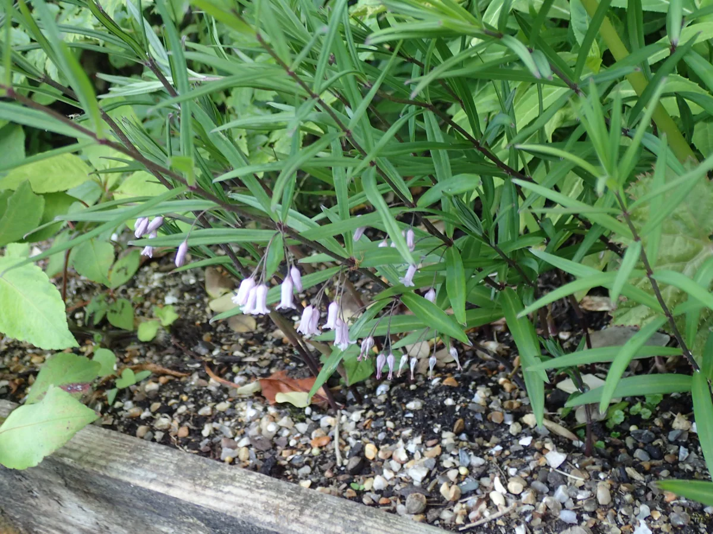

图为栽培的卷叶黄精。叶轮生、条形，花从叶腋成对着生、俯垂。这和鹿药的互生卵状叶、顶生白花不是一类。

没开花时，优先看叶子是不是轮生、是不是条形而先端拳卷：若是，先想卷叶黄精，不要叫鹿药。叶子互生、卵状椭圆形，又还没开花，才需要往下看玉竹。

### 对照表

| 看哪里 | 鹿药（舞鹤草属） | 黄精属 |
| :---: | --- | --- |
| **花的位置** | 茎顶 | 叶腋下垂 |
| **花的样子** | 小；鹿药花被片开展，管花鹿药成筒但仍在茎顶 | 筒状，像小铃铛 |
| **叶子** | 互生，卵形到椭圆形 | 互生、对生或轮生，因种而异；卷叶黄精为轮生条形叶 |
| **成熟浆果** | 茎顶，红到红褐 | 多蓝黑或紫红，挂在叶腋 |
| **中药地位** | 民间药，不是药典黄精 | 药典仅滇黄精、黄精、多花黄精 |

## 和玉竹的区别

真正容易认错的，是**玉竹**。它也是黄精属，叶子也互生、也是椭圆形，没开花时和鹿药远看几乎一类。李时珍把鹿药附在葳蕤后面，说的就是这件事。葳蕤后来就叫玉竹。

玉竹是《中国药典》单列的药材，功能写养阴润燥、生津止渴，和黄精不是同一个药名。鹿药也不在玉竹项下。路上要分的，是活株，不是药店里的饮片。

植物志未把四川列入玉竹的分布。下面的图是形态对照，不能拿来指认九峰山路边的每一株；要认的是这几条野外能用的差别。

### 先看花长在哪里

这是最硬的一条。鹿药的花挤在**茎顶**，一小丛；玉竹的花从**每片叶子下面**垂下来，顺着茎排成一串铃铛。

鹿药：花序长在茎的尽头，叶子互生，花不从叶腋垂下。

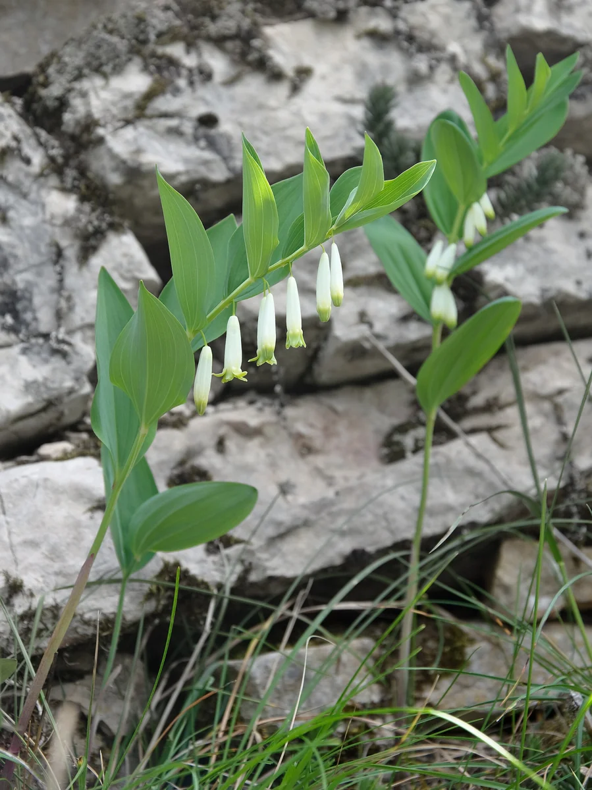

玉竹：茎常向一边倾斜，叶子互生、近无柄；筒状花挂在叶子下方。图为形态对照。

把茎侧过来看，差别更清楚：玉竹每一档叶子下面都可以有花，鹿药的叶子下面是空的。

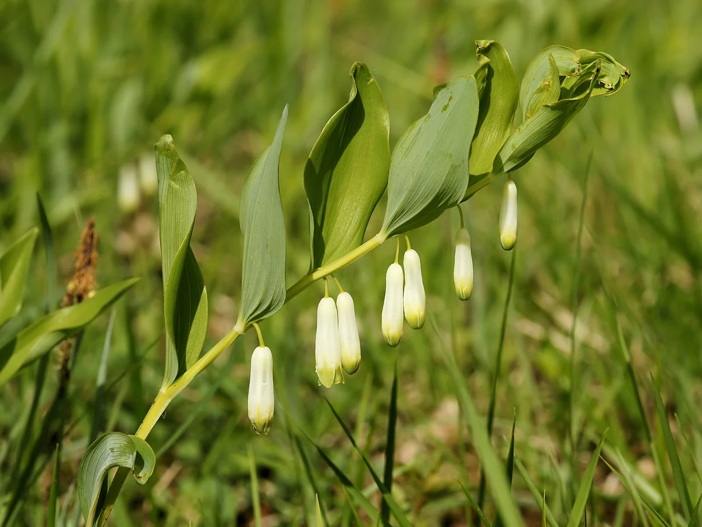

玉竹的花沿茎着生，一朵或两三朵从叶腋垂下，不会聚成茎顶那一丛。

### 再看花的样子

鹿药的花小，花被片开展，像小星星，长约`3`毫米。玉竹的花是筒状，黄绿至白色，全长约`1.3～2`厘米，先端六裂，俯垂。

鹿药：花被片分开、朝外展，花序轴常有毛。

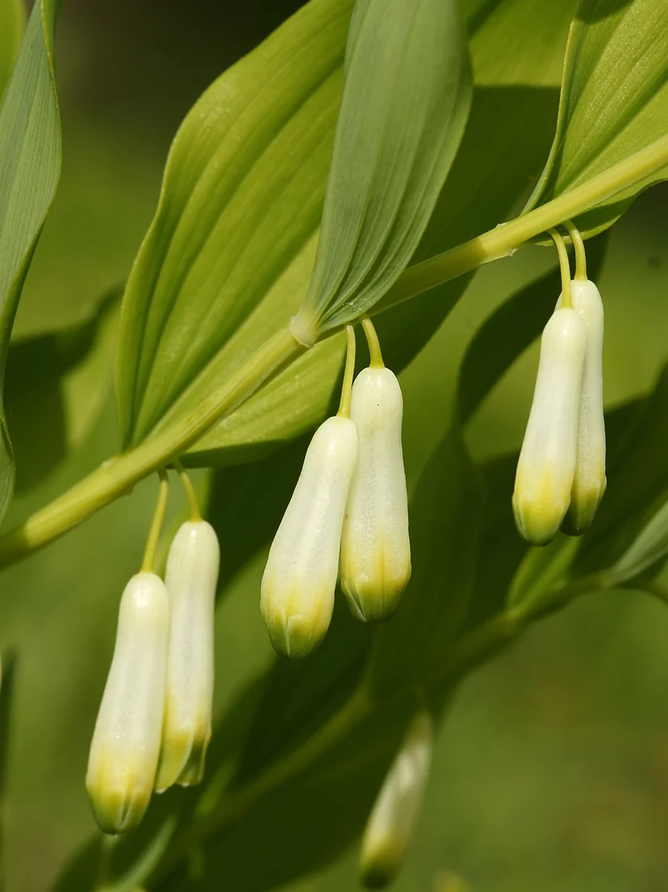

玉竹：花被合成长筒，像小铃铛，挂在叶腋。植物志记花`1～4`朵一簇，总花梗长约`1～1.5`厘米。

管花鹿药的花也是筒，但筒仍然长在**茎顶**的花序上，不是从叶子下面垂下来。看见筒状花，先问位置，再问形状。

### 茎和叶子

没开花时，这两条比挖根有用：

- **茎**：鹿药中部以上或仅上部常有粗伏毛；玉竹茎光滑无毛，有棱，常弓着向一边斜。
- **叶子**：鹿药一般`4～9`枚，有短柄；玉竹一般`7～12`枚，近无柄，叶背常带一层灰白。

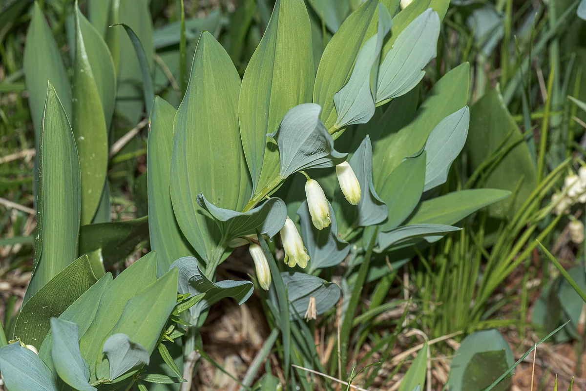

玉竹叶子下面偏灰白，花仍挂在叶子下方。鹿药的叶子两面更近绿色，并且有短柄。

### 果的颜色和位置

秋季更好认。鹿药的浆果成熟后红到红褐，仍聚在茎顶。玉竹的浆果成熟后**蓝黑色**，挂在叶腋，里面种子也更多，植物志记约`7～9`颗。

鹿药一类：果在茎顶成串，熟时红。

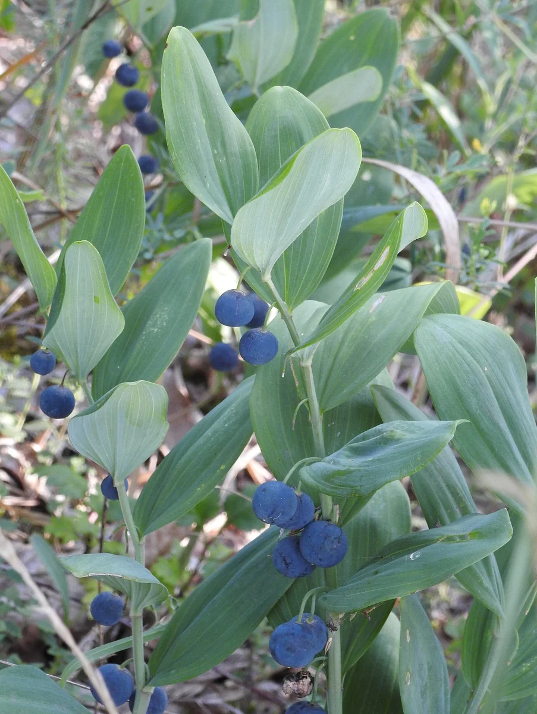

玉竹：果挂在叶子下面，熟时蓝黑。位置和颜色都和鹿药对不上。

### 对照表

| 看哪里 | 鹿药 | 玉竹 |
| :---: | --- | --- |
| **花的位置** | 茎顶一丛 | 叶腋下垂，沿茎成串 |
| **花的样子** | 小，花被片开展 | 筒状铃铛，长约`1.3～2`厘米 |
| **茎** | 上部常有毛 | 光滑有棱，常向一边倾斜 |
| **叶子** | `4～9`枚，有短柄 | `7～12`枚，近无柄，叶背常灰白 |
| **成熟浆果** | 茎顶，红到红褐 | 叶腋，蓝黑色 |
| **药材** | 民间药，不是药典玉竹 | 药典单列，养阴润燥 |

开花以后，先看花在不在茎顶，一般不会认错。没开花，就摸茎上有没有毛、叶子有没有短柄、叶背灰不灰。两样都对不上，就只说到“互生阔叶的林下草本”，等花开再定。不要靠挖根来分。

## 春芽不要和藜芦混

东北林区采山糜子，一直有把藜芦幼苗当鹿药的记录。通化师范学院周繇教授接受采访时说，山糜子（鹿药）和当地俗称鹿莲的藜芦，早春出土时很像；藜芦全草有毒，误食会引起呕吐、心率紊乱，严重时可危及生命。他给的区分是：鹿药叶背无光泽、灰绿色，地下有横走根状茎；藜芦叶面有皱褶，地下多为向下的直根。

这是长白山的经验，不能原样当成九峰山的检索表。但原理用得上。藜芦属含甾体生物碱，全株有毒，根更毒。香港毒物咨询的临床材料把藜芦碱的作用写得很具体：影响钠离子通道，严重时可出现心动过缓、低血压和传导阻滞。四川疾控也多次提醒，省内有误食藜芦中毒的报告。

九峰山`2500～3000`米这一层，和毛叶藜芦的分布是重叠的。植物志记毛叶藜芦生于林下、高山草甸，海拔`2600～4000`米，产四川等地。路上若只看“宽叶子、平行脉、刚出土”，确实可能看走眼。

开花以后，藜芦是大型圆锥花序，花多而密，和鹿药茎顶那一小丛白花完全不是一个量级。没开花时，看叶子是不是强烈褶皱、是不是成丛从基部抽出，比看“像不像菜”可靠。

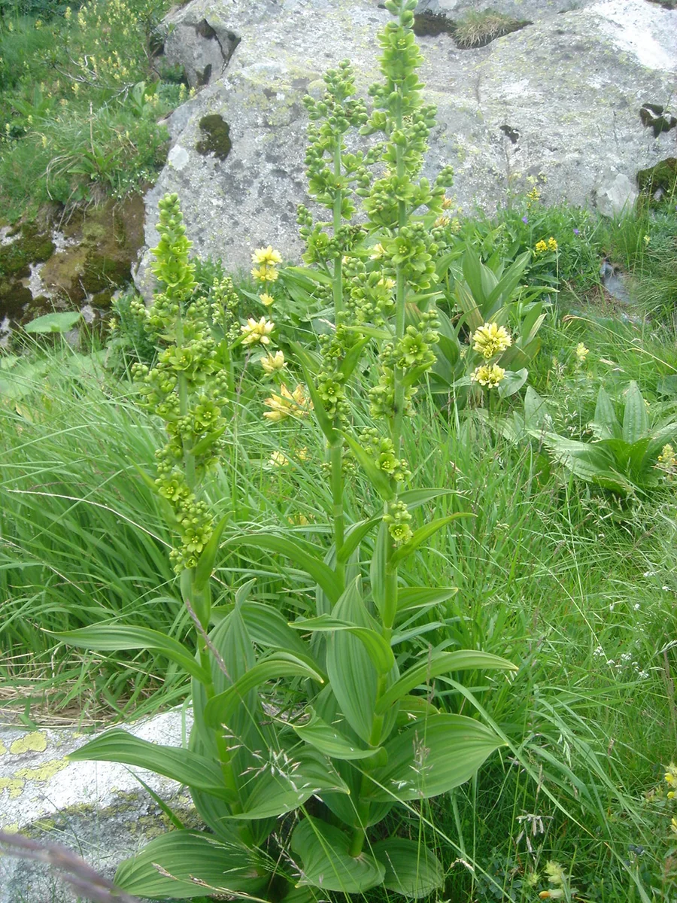

图为白藜芦。叶基生或茎生、叶面褶皱，花序高大、花密集。九峰山高海拔的毛叶藜芦同属，幼株阶段最容易和鹿药、黄精的春芽一起被误认。

没有十足把握，就不要把林下这类宽叶草本的嫩芽当菜。保护区内本来也不该采。

## 参考资料

- 陈心启、河野昭一，《中国植物志》英文修订版第`24`卷，[舞鹤草属](http://www.efloras.org/florataxon.aspx?flora_id=2&taxon_id=119474)、[鹿药](http://www.efloras.org/florataxon.aspx?flora_id=2&taxon_id=240001460)、[管花鹿药](http://www.efloras.org/florataxon.aspx?flora_id=2&taxon_id=240001459)、[紫花鹿药](http://www.efloras.org/florataxon.aspx?flora_id=2&taxon_id=240001464)。
- 汪发缵、唐进，《中国植物志》第`15`卷，鹿药、管花鹿药、卷叶黄精、玉竹。
- [玉竹](http://www.efloras.org/florataxon.aspx?flora_id=2&taxon_id=200027862)、卷叶黄精，见《中国植物志》英文修订版第`24`卷。
- 陈旭、刘可倚、彭科、谢大军，`2020`，《四川白水河国家级自然保护区植物群落分布和优势种》，《四川林业科技》。槭树林草本层记管花鹿药、卷叶黄精；铁杉林记紫花鹿药。
- 国家药典委员会，《中华人民共和国药典》一部，黄精项：滇黄精、黄精或多花黄精的干燥根茎。
- 国家中医药管理局《中华本草》，鹿药：百合科植物鹿药及管花鹿药的根茎及根。
- 李时珍，《本草纲目》，鹿药条。时珍曰：胡洽居士言鹿食九种解毒之草，此其一也。或云即是葳蕤，理亦近之。
- 国家林业和草原局、农业农村部，`2021`年《国家重点保护野生植物名录》。
- 孟英、杨永平、韦克勒，`2006`，[横断山区舞鹤草属植物的保护状况](https://ethnobotanyjournal.org/index.php/era/article/view/112)。滇西北多种舞鹤草属被记录为野菜。
- 张玲玲等，`2016`，《民族生物学与民族医学杂志》，纳西族旱季食用植物名录含管花鹿药、高大鹿药、抱茎鹿药。
- 香港医院管理局毒物咨询，[藜芦属植物毒性概述](https://www3.ha.org.hk/toxicplant/hk/veratrum_schindleri.html)。
