七八月走九峰山，阔叶林还没完全交给冷杉的那一段，路边最惹眼的往往不是花，而是一串串浆果：有的红得发亮，有的黄得像杏，有的熟透了变成紫黑。枝条上常挂着倒钩刺，一伸手就知道这不是草莓地里那种贴地的果。

它们多半是蔷薇科**悬钩子属**。这个属在中国有两百种上下，西南山地又是种类最集中的地方之一。果是许多小核果挤在花托上的**聚合果**，多浆，熟时红、黄或黑。路边常统称“覆盆子”“泡儿”，听着亲切，和植物志、药典里的名字对不上号。

:::info 保护区里的记录
这一带在白水河国家级自然保护区和大熊猫国家公园范围内。陈旭等`2020`年的群落调查，在较低海拔的野核桃林灌木层把**光滑高粱泡**、**川莓**记为优势种；再往上的铁杉林灌木层只写到了悬钩子属，没有写到种。活株、果实都不是可以随便采的资源。
:::

## 菰帽悬钩子

菰帽悬钩子是中国特有种。植物志记攀援灌木，高`1～3`米；小枝幼时紫红色，无毛，被白粉，疏生皮刺；羽状复叶常`5～7`枚小叶，边缘粗重锯齿。花期`6～7`月，果期`8～9`月。产河南、陕西、甘肃、四川等地，生海拔`1400～2800`米的沟谷边、路旁疏林或山谷阴处密林下。九峰山进山路的海拔和生境都落在这个区间里。

认它，优先看果，不要只看“红”。植物志写得很具体：聚合果卵球形，直径`0.8～1.2`厘米，**红色，密被灰白色绒毛**，花柱宿存。果面那层灰白不是发霉，是绒毛；名字里的“菰帽”，指的就是果顶宿存花柱连着绒毛、看起来像扣了一顶小帽子。萼片在果期常反折。小枝紫红、带白粉、刺不密。

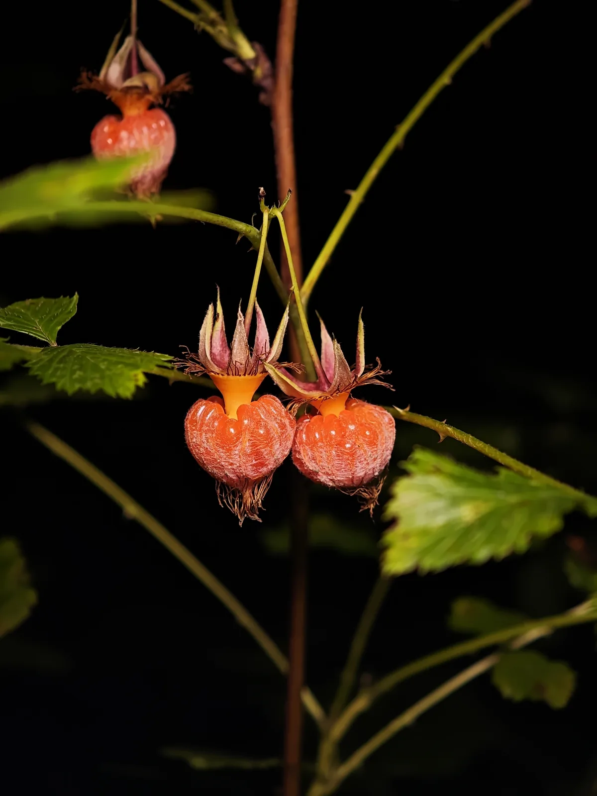

近看才能看清绒毛。不要把这层灰白当成坏果；也正是这一条，把它和果面近乎无毛的种类分开。萼片常带紫红，果期花柱还在。

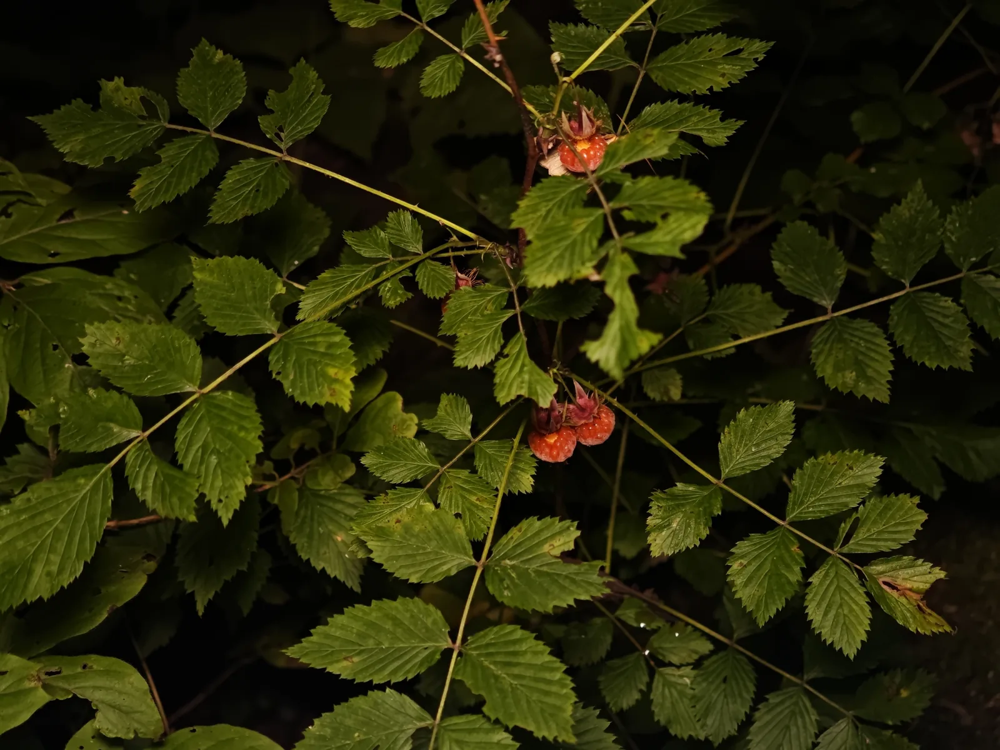

小叶常`5～7`枚。果挂在叶下，颜色橙红到红。

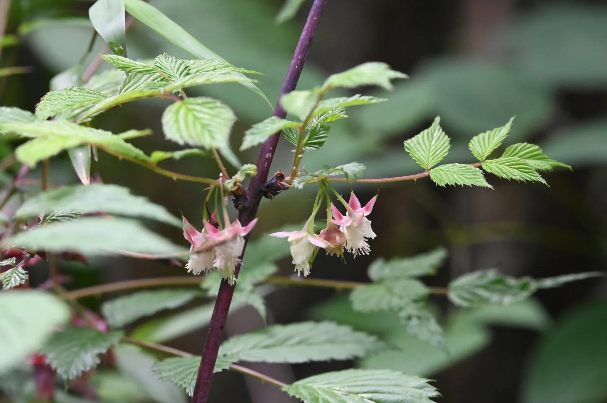

小枝紫红、疏生皮刺，和植物志写的相符。

同属里还有假帽莓，植物志记它产四川，海拔`2100～3200`米，果也红、也密被灰白长绒毛，但果更大，直径`1.3～2`厘米，小枝有柔毛。

## 秀丽莓

秀丽莓也是中国特有种。灌木高`1～3`米；枝紫褐或暗褐色，无毛，疏生皮刺。最容易一次看准的是叶子和果形：羽状复叶有小叶`7～11`枚，小叶片卵形或卵状披针形，通常越往叶轴上部越大；聚合果**长圆形**，稀椭圆形，长`1.5～2.5`厘米、直径`1～1.2`厘米，红色，幼时有疏柔毛，老时无毛。花期`4～5`月，果期`7～8`月。产山西、陕西、甘肃、河南、湖北、四川、青海，生山麓、沟边或山谷丛林，海拔`1000～3700`米。

果明显比菰帽悬钩子“长一截”，像拉长了的树莓，不像圆帽子。小叶又多，数一下往往超过五枚。植物志写明**果实可食**。

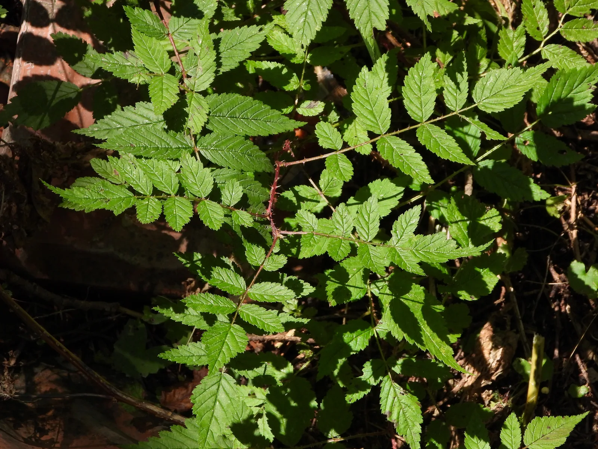

小叶常`7～11`枚，越往叶轴上部往往越大。数小叶比只看果色更稳。

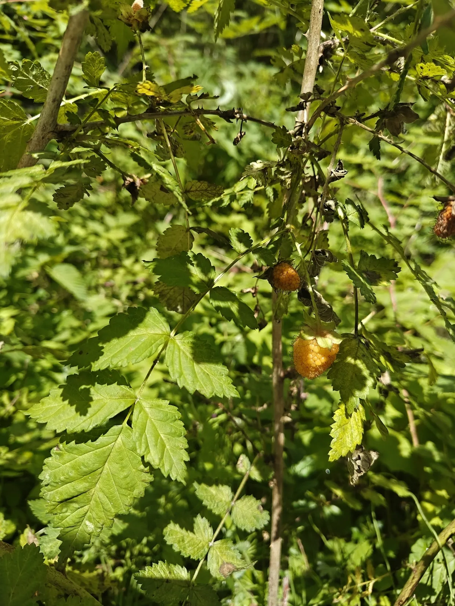

聚合果下垂，熟透前常偏橙黄，熟后转红、略呈长圆。叶子仍是一串小叶。

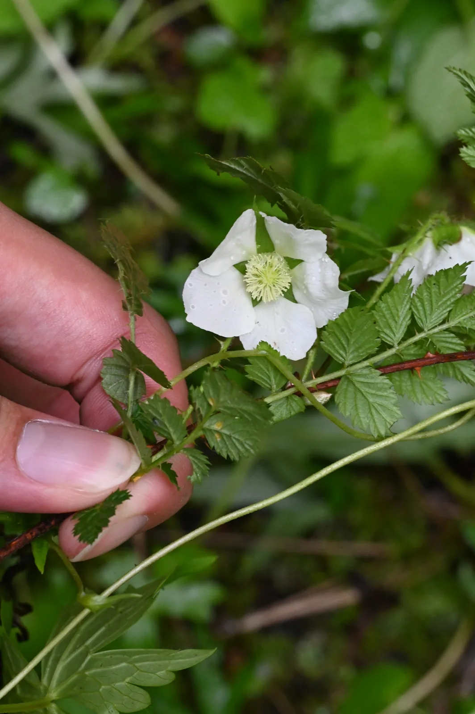

花直径可达`3～4`厘米，白色。花期也能靠“小叶很多”认它。

## 针刺悬钩子

针刺悬钩子分布很广，植物志记灌木可到`3`米，海拔`600～3900`米，四川在内。羽状复叶常有小叶`5～7`枚，稀`3`或`9`枚；聚合果红色、近球形，直径`1～1.5`厘米。名字里的“针刺”，指枝和花萼外面那些细、较直的刺，不是弯钩皮刺。刺的疏密变化很大，有的类型几乎无刺，还常和腺毛的有无缠在一起。单凭一张果的照片很难和近缘种切开，本文不展开细写。

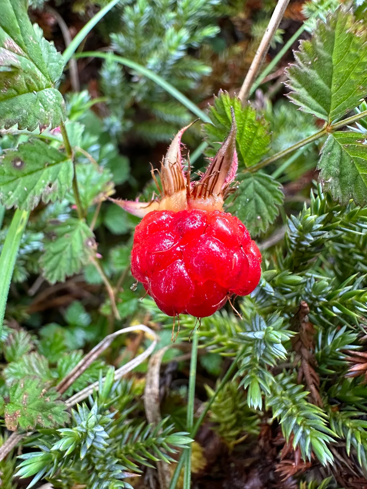

果近球形，熟时鲜红，直径大约一厘米。许多小核果挤在花托上，果面近乎无毛或只有疏柔毛，没有菰帽悬钩子那种灰白绒毛。萼片长渐尖，果期常仍直立。

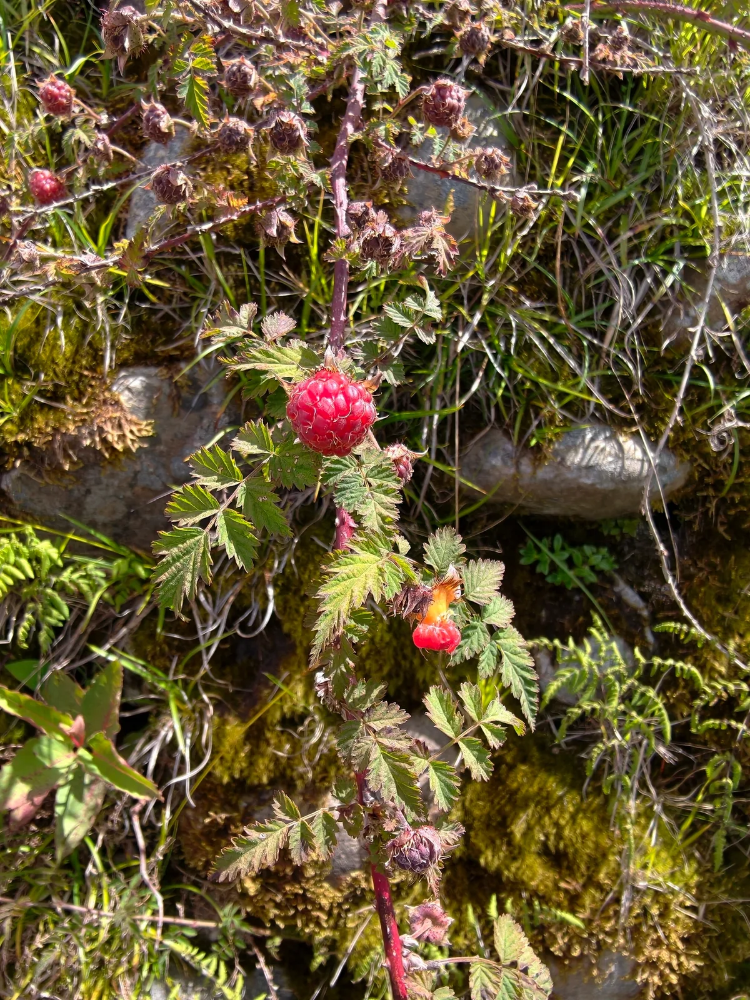

果挂在枝上，不像秀丽莓那样明显拉长。路上若果红、近圆，又对不上菰帽悬钩子那层灰白绒毛，先停在这一层。

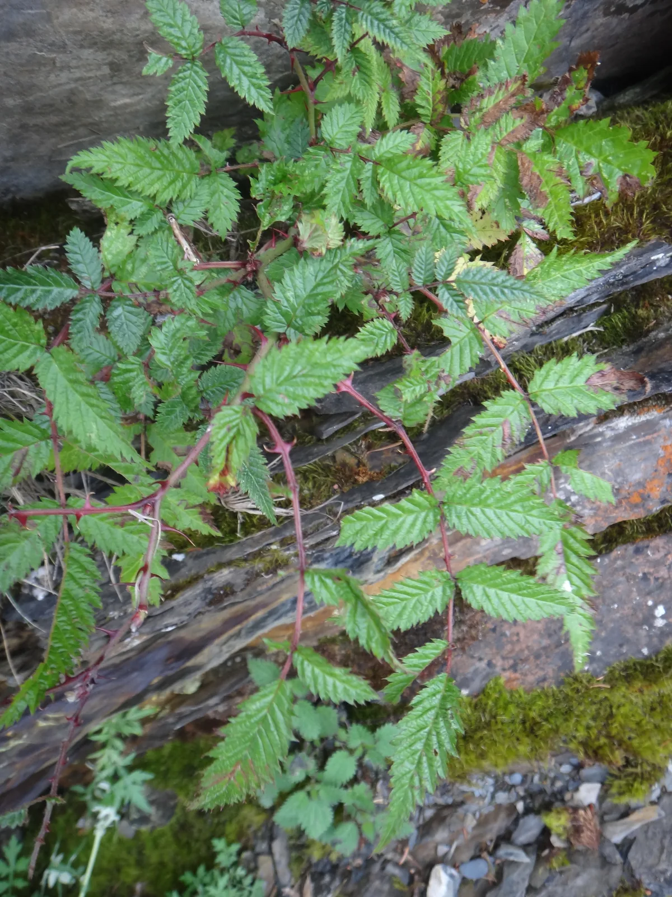

小叶常`5～7`枚，卵形到卵状披针形，边缘重锯齿；顶生小叶往往更长、有时浅裂。叶柄和枝上的刺细而较直。

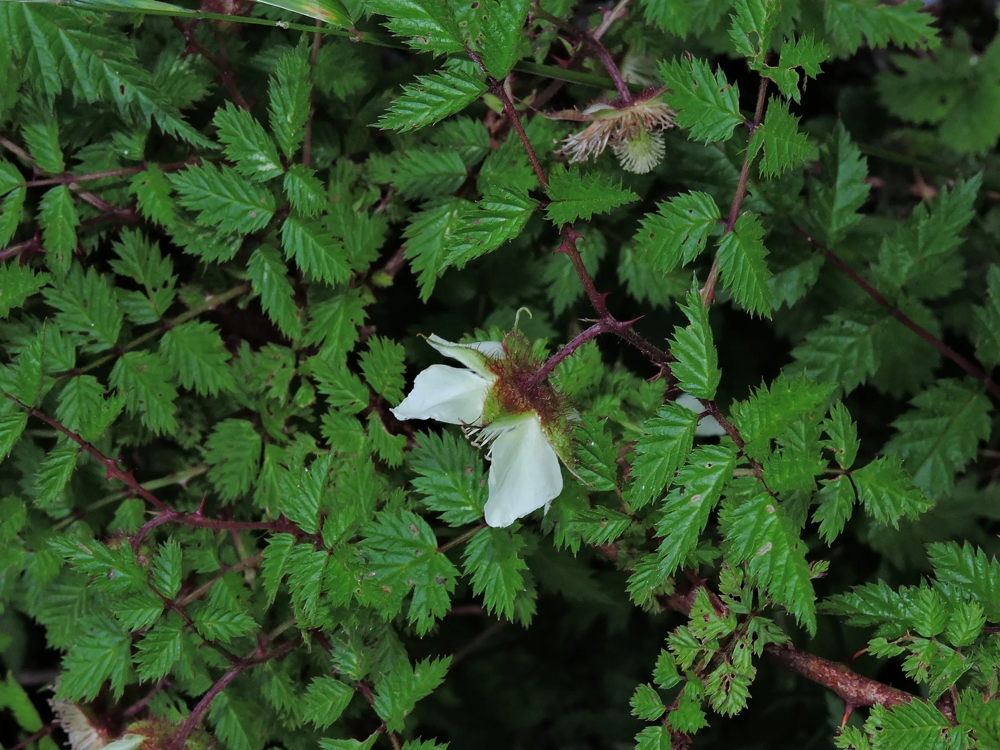

花白色，花瓣常比萼片短。萼外面针刺密的时候，这一条最有识别性。

## 黄果悬钩子

黄果熟透仍是桔黄或橙黄，不会再转到大红或紫黑。路上要把它和“还没熟的红果”分开：后者果硬、酸、萼片鲜绿；前者果软、色匀。

黄果悬钩子是中国特有种。它和路边那些爬得很高的灌木不像：低矮半灌木，高只有`15～50`厘米；根状茎匍匐；地上茎草质，疏生较长的直立针刺。小叶`3`枚，有时`5`枚，长圆形或椭圆状披针形。聚合果扁球形，直径`1～1.2`厘米，**桔黄色**，无毛。花期`5～6`月，果期`8`月。产陕西、甘肃、安徽、四川、云南，生山坡路旁、林缘、林中或山沟石砾滩地，海拔`600～3200`米。

认它先看株高和刺：齐膝甚至更矮，针刺细长、较直，不像高灌木上那些弯钩。果是扁圆的桔黄，不是长圆形的红。植物志写明果实可鲜食，也可制酱、酿酒；并记幼株供药用。

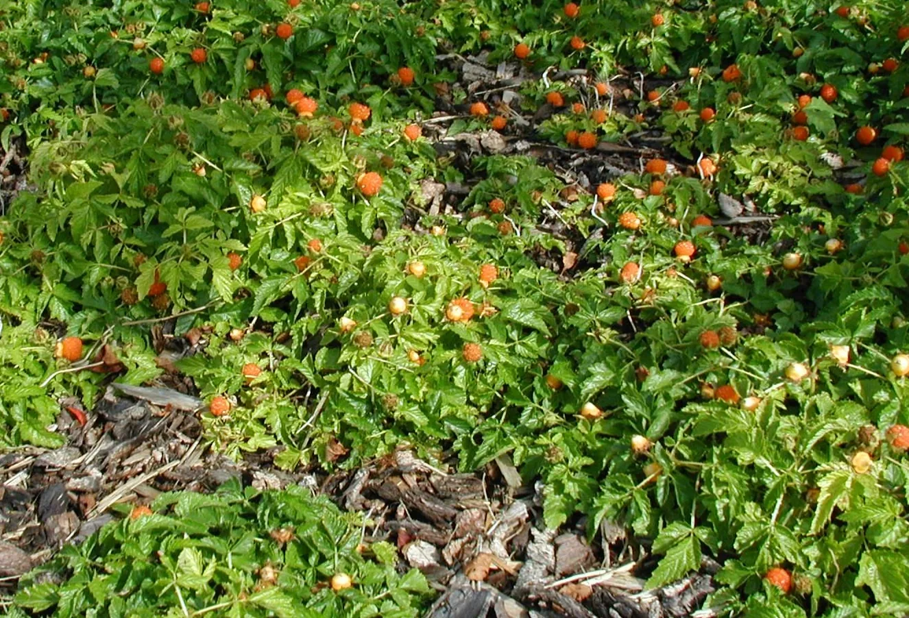

植株矮，几乎贴着地面成片。果桔黄到橙黄，不会再转到大红或紫黑。

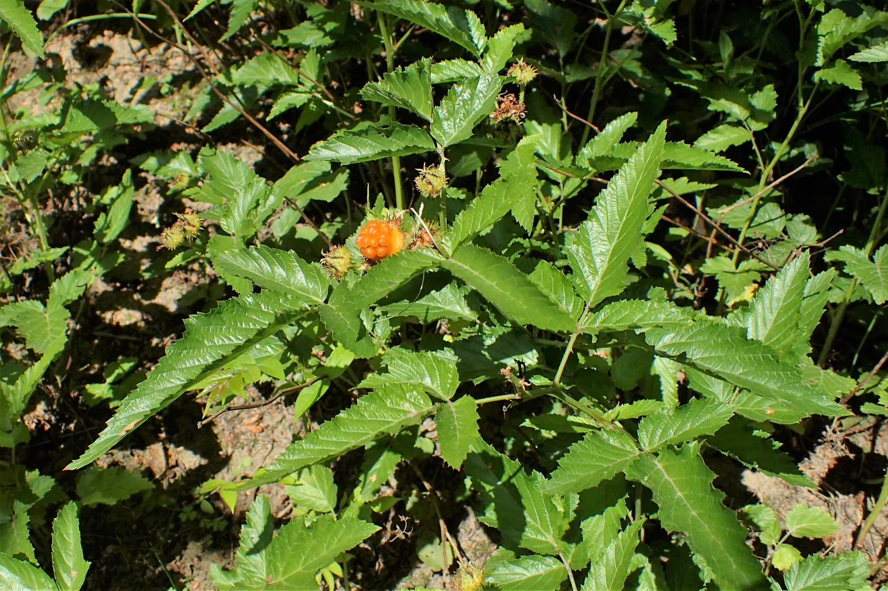

小叶`3`枚，有时`5`枚，长圆形到披针形。果扁圆、近无毛。茎上的细长针刺是认它的第二条。

## 光滑高粱泡

高粱泡是藤状半落叶灌木，可到`3`米。它和前面几种最大的差别是**单叶**：叶片宽卵形，基部心形，边缘`3～5`裂或呈波状，不是一串小叶。花序是顶生圆锥花序，果小、近球形，直径约`6～8`毫米。花期`7～8`月，果期`9～11`月，在悬钩子属里算晚的。原变种熟时红色。

保护区调查记的是变种**光滑高粱泡**。植物志记小枝和叶两面均无毛或仅叶上面沿脉稍有柔毛，花序近无毛；植物智把它和原变种的区别写为果熟时**黄或橙黄色**。产陕西、甘肃、湖北、江西、四川、云南、贵州，生山坡、多石砾山沟或林缘，海拔`200～2500`米。陈旭等把它记在白水河野核桃林的灌木层，海拔低于三口锅近牛坪那一段。

果序像小穗，许多小果挤在一起，所以叫高粱泡。叶子是单叶、常三裂，不要看成复叶。果小，文献里对原变种的味道写过**偏酸**，不能当成果大味甜的树莓。

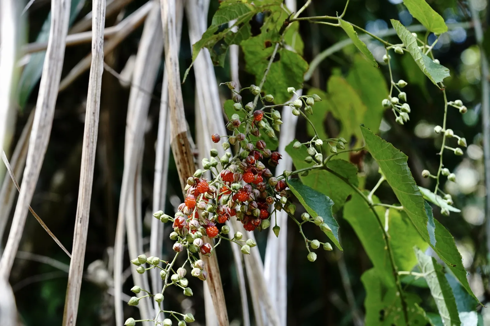

果序长、小果多，像一小穗高粱。图为原变种，熟时偏红；保护区记的光滑高粱泡果熟时黄到橙黄，果序形态相同。

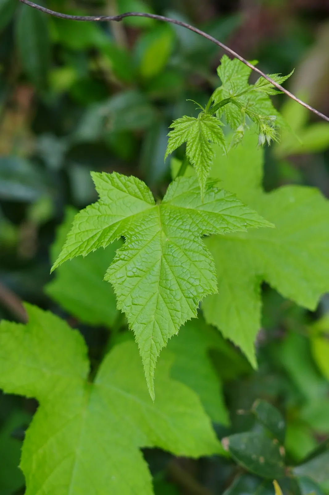

单叶、三裂、基部心形。这一条把它和羽状复叶的种类一次分开。

## 喜阴悬钩子

喜阴悬钩子是攀援灌木，高`1～4`米。小叶常`3`枚，稀`5`枚；顶生小叶宽菱状卵形或椭圆状卵形，边缘常羽状分裂；**叶背密被灰白色绒毛**。聚合果扁球形，直径`6～8`毫米，**紫黑色**，无毛。花期`4～5`月，果期`7～8`月。产河南、陕西、甘肃、湖北、台湾、四川、贵州、云南、西藏，生山坡、山谷林下潮湿处或沟边，海拔可达`3600`米。

翻叶子背面：灰白绒毛这一层，是路上最好用的特征。果很小，扁圆，熟透才是紫黑；半熟时偏红，不要当成另一种红果。植物志没有单独写这一条“果实可食”，但属的总述把多种悬钩子的果放在可食范围内。西南山地的植物学随笔里，有人把它记为吃得最多的一种，说甜度中等、胜在量大。

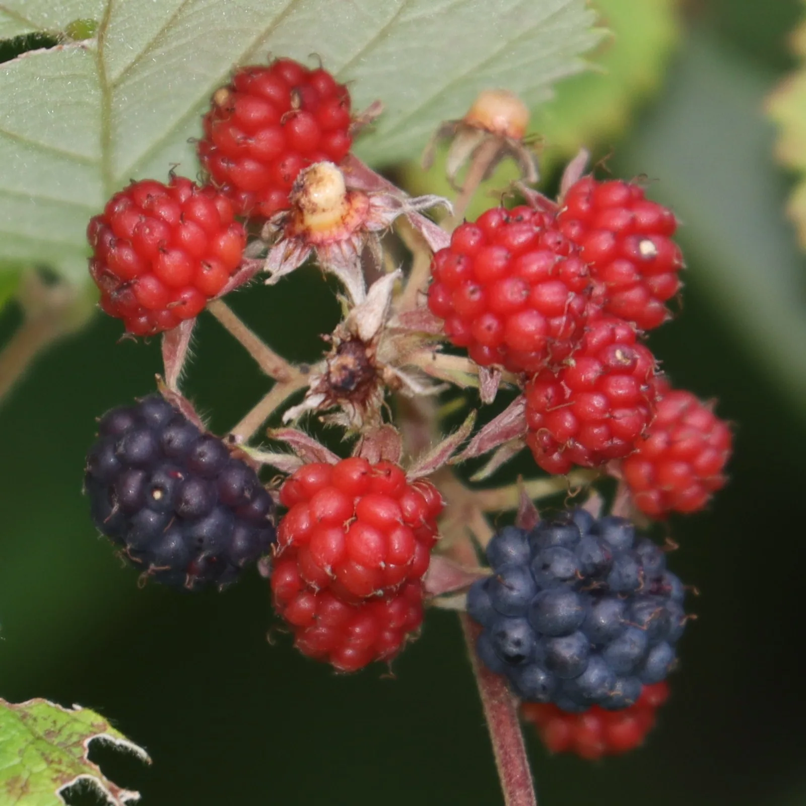

半熟偏红，熟透才是紫黑。只看“红的”会认错阶段。果很小，扁圆。

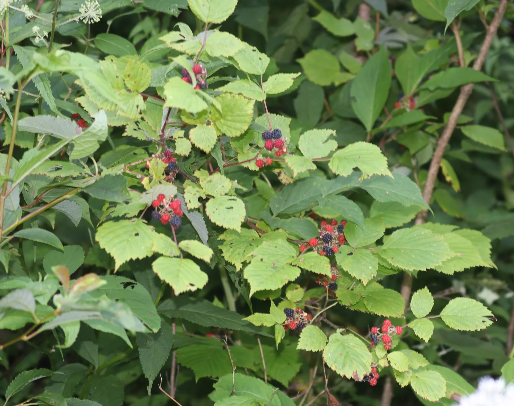

攀援灌木，果序短，红果和黑果常同时挂着。

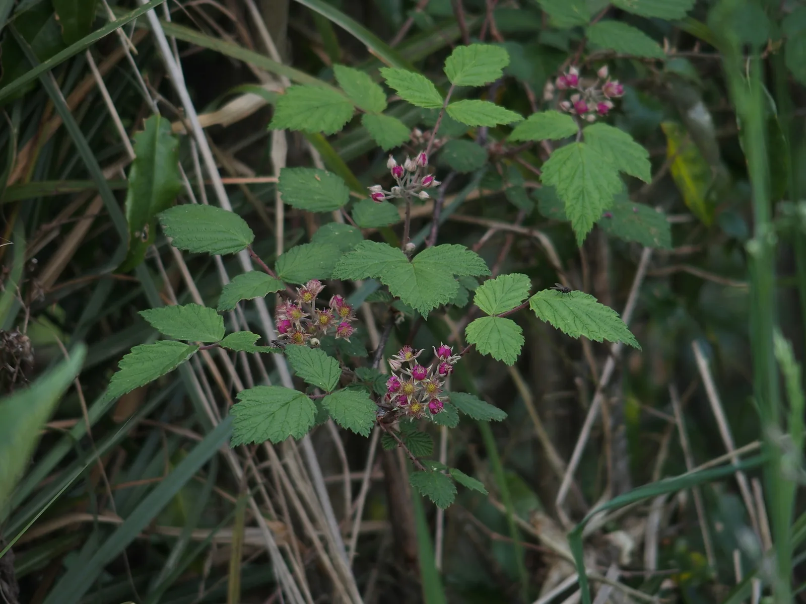

小叶常`3`枚。植物志还写叶背密被灰白绒毛，路上把叶子翻过来看最稳。

## 川莓

川莓是落叶灌木，高`2～5`米。和前面几种都不一样：**枝无刺**，幼时密被淡黄色绒毛状柔毛；**单叶**，近圆形或宽卵形，直径`7～15`厘米，边缘`5～7`浅裂，像缩小的枫叶，叶背常密被灰白绒毛。花紫红色。聚合果半球形，直径约`1`厘米，**黑色**，无毛，常包藏在宿萼里。花期`7～8`月，果期`9～10`月。产广西、贵州、湖北、湖南、四川、云南，生山坡、路旁、林缘或灌丛，海拔`500～3000`米。植物志还写：**在砍伐迹地上常形成茂密、难以穿过的灌丛**。

无刺、枫叶状单叶、黑果包在萼里，三条叠在一起，认错的机会不大。陈旭等在白水河野核桃林灌木层记了它。

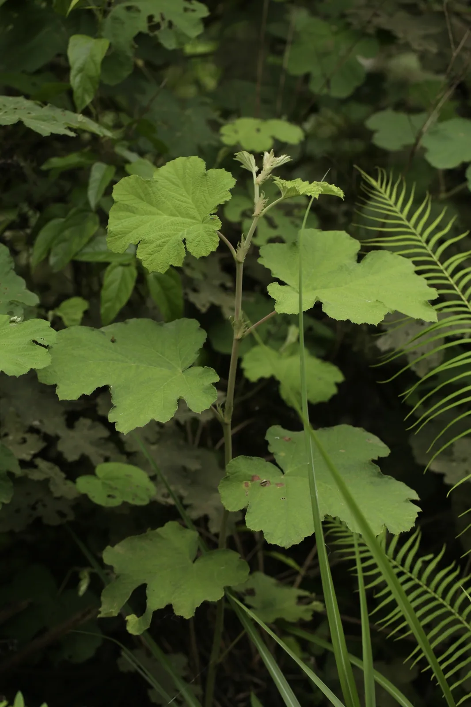

叶子近圆形，`5～7`浅裂，像缩小的枫叶。这和羽状复叶的种类完全不是一类。枝上没有皮刺，幼枝常带一层绒毛。

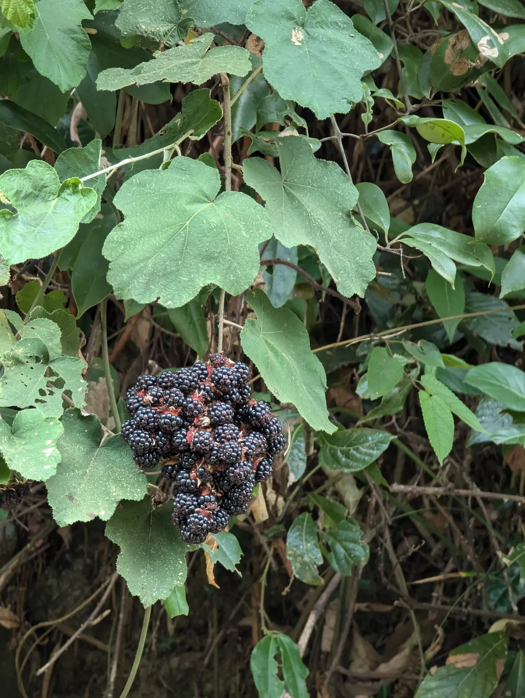

果是聚合果，黑色。叶子仍是掌状浅裂的单叶。

