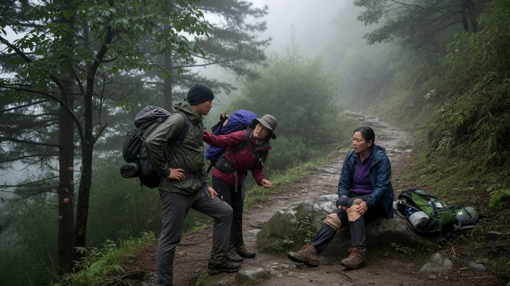
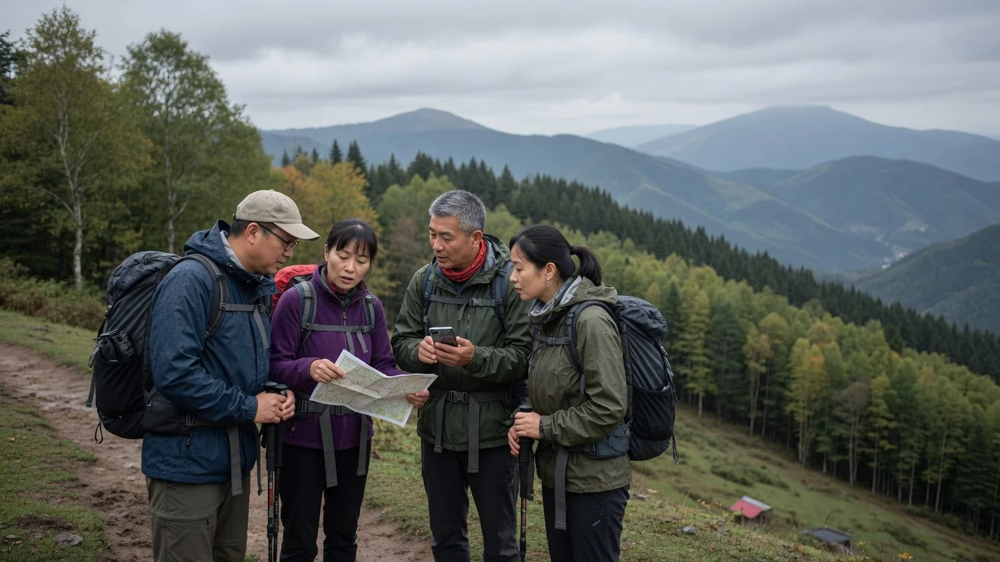
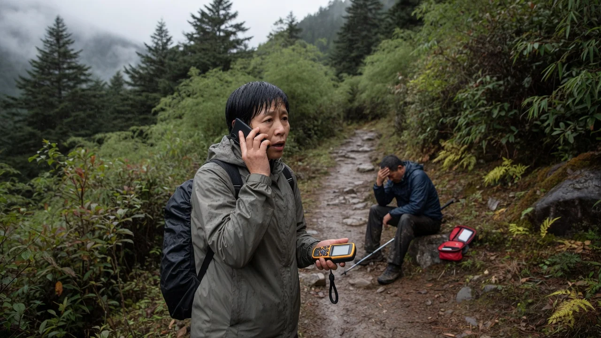
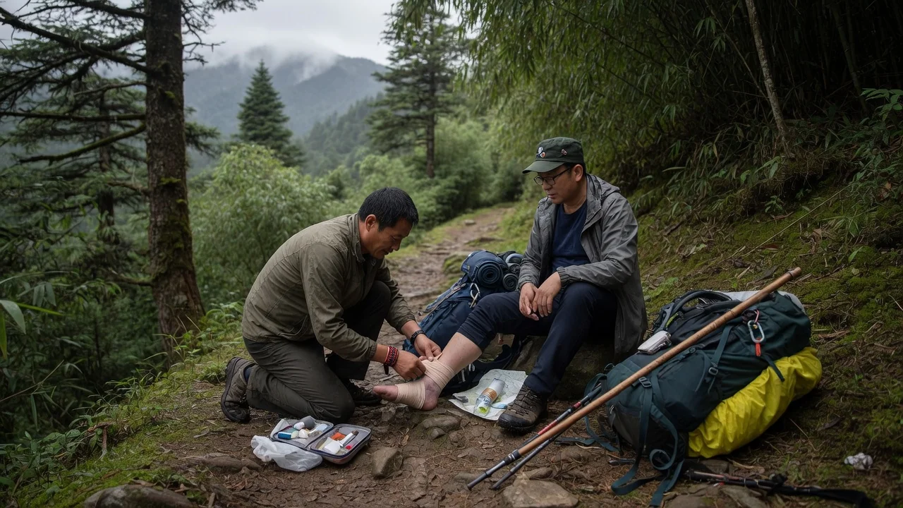
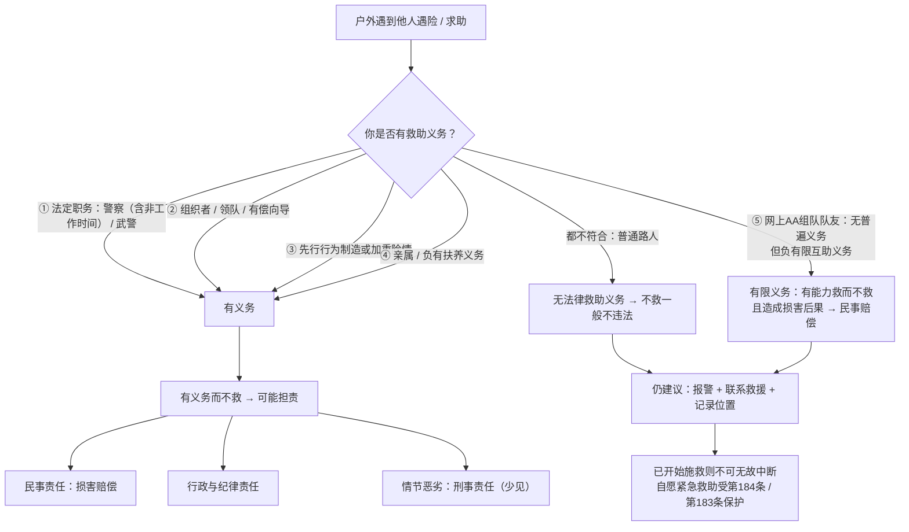

> 在山上遇到有人摔伤、失温、迷路，如果没出手帮忙，会不会摊上法律责任？
>
> 先说结论：**作为普通路人，不救一般不违法；但如果你是领队、是组织者、是把别人带进险境的人，或者你是警察、武警——不救就可能违法。**

这个问题的关键不在"该不该帮"，而在法律上你**有没有救助义务**。义务决定责任，也决定"违法"二字能不能落到你头上。

:::info 先说清楚
本文是面向户外人的法律科普，依据现行法律和已公开的裁判、报道整理。具体案件怎么判，以法院查明的事实为准，不能替代个案法律意见。
:::

山路上最常见的场面：有人坐在路边起不来。法律先问的不是"你心够不够善"，而是"你有没有必须伸手的义务"。

## 中国没有"见危不救罪"

很多人以为见死不救会被判刑，这其实是影视剧和国外法律留下的印象。德国《刑法典》第323c条、法国《刑法典》第223-6条，都把能救而不救规定为犯罪——当然也以"对本人或第三人没有显著危险"为限度。**中国现行法律没有设置这一罪名**：刑法分则里找不到"见危不救"；2026年1月1日起施行的新《治安管理处罚法》，也没有对无特定义务的普通人见危不救设罚则。刑法里和"不救"相关的条款，针对的是负有解救、救护职责的人，或者交通肇事后逃逸的肇事者，不是一般路人。

与户外场景最相关的，是《民法典》第1005条：

> 自然人的生命权、身体权、健康权受到侵害或者处于其他危难情形的，**负有法定救助义务**的组织或者个人应当及时施救。

注意它的措辞：负有"**法定救助义务**"的人应当施救。反过来说，法律默认普通公民对陌生人**没有普遍的救助义务**——义务必须有来源，不能凭空产生。所以面对素不相识的驴友遇险，普通路人选择不施救，法律上一般不构成违法。

## 判断核心：你的"救助义务"从哪来

"违不违法"的分水岭，就是有没有救助义务。义务主要有四类来源。沾上其中一类，不救就可能担责——多数是民事赔偿，严重的才可能落到行政处分甚至刑事责任：

| 义务来源 | 典型场景 | 不救可能面临什么 |
| :---: | --- | --- |
| **法定职务** | 警察、武警遇到公民处于危难 | 纪律、行政责任，严重的可涉渎职 |
| **组织者 / 领队** | 活动发起人、有偿向导、商业领队 | 民事赔偿（安全保障义务） |
| **先行行为** | 你带路、邀约、操作引发或加重险情 | 民事赔偿；极端情况下才可能涉刑 |
| **亲属扶养** | 配偶、父母子女等负有扶养义务的人 | 遗弃罪（《刑法》第261条） |

### 情形一：法定职务，有义务必须救

法律对**部分职业**规定了明确的救助义务。

**人民警察。**《人民警察法》第21条："人民警察遇到公民人身、财产安全受到侵犯或者处于其他危难情形，应当立即救助。"同法第19条还写明：人民警察在**非工作时间**，遇有其职责范围内的紧急情况，应当履行职责。公民在山里处于危难，通常会被认为属于这一范围。

**人民武装警察。**《人民武装警察法》第28条：人民武装警察遇有公民的人身财产安全受到侵犯或者处于其他危难情形，应当及时救助。和警察法不同的是，武警法**没有**"非工作时间遇紧急情况应当履职"的专条，休假中的武警是否一律等同在岗，条文本身没有写死。

警察、武警在职务范围内不履行救助，轻则纪律处分、行政责任，重则可能构成玩忽职守等渎职犯罪。这是职务义务，不是"愿不愿意帮忙"。

**医师要分开看，不能和警察混为一谈。**《医师法》第27条第1款：对需要紧急救治的患者，医师应当采取紧急措施进行诊治，**不得拒绝急救处置**——这主要约束**执业活动**。同条第3款写的是另一层意思：国家**鼓励**医师积极参与公共交通工具等公共场所急救服务；医师因自愿实施急救造成受助人损害的，不承担民事责任。也就是说，出门徒步的医生，法律是**鼓励你救、并给你免责**，而不是像警察那样写成"应当立即救助"。拒绝急救处置，发生在执业中，才可能按该法第55条给予行政处罚。

**船长、船员的义务在海上，不在山路上。**《海商法》第183条（2025年修订后条文未改，自2026年5月1日起施行）：船长在不严重危及本船和船上人员安全的情况下，有义务尽力救助海上人命。《海上交通安全法》等也有类似规定。这是海上人命救助规则，不能直接拿来要求山路上的人必须施救。

### 情形二：组织者、领队、有偿向导

这是户外场景下最容易踩中的一类——**只要你在这个队伍里被认定为"组织者"**。

《民法典》第1198条规定，宾馆、商场、体育场馆等经营场所、公共场所的经营者、管理者，以及**群众性活动的组织者**，未尽到安全保障义务造成他人损害的，应当承担侵权责任。第1176条第2款把话说得更直白：文体活动中，**组织者的责任仍按安全保障义务来认**——参与者自甘风险，不等于组织者可以免责。

如果走的是旅游经营，《旅游法》第81条还要求旅游经营者在突发事件或旅游安全事故发生后，立即采取必要的救助和处置措施；第82条则赋予旅游者请求旅游经营者、当地政府和相关机构及时救助的权利。AA自发活动通常不构成旅游合同，但不能据此认为发起人什么义务都没有。

落实到户外：

- **商业带队**（有偿向导、俱乐部领队）：对队员负有合同加安全保障的双重义务，队员遇险必须救助，否则承担赔偿责任；
- **AA制自发组织**：组织者对队员同样负有一定程度的安全保障义务，只是法院在认定时会结合活动是否营利、风险告知是否充分、事后是否施救，标准比商业组织低——但这不等于没有义务；
- **行前义务**：组织者的义务不止"事发后施救"，还包括行前风险评估、告知、装备要求、应急预案。这些没做到位，事后同样可能被追责。

一个常见的误区是"AA制＝责任全免"。AA制分摊的是费用，**分摊不掉法定的安全保障义务**。

:::info 自甘风险挡不住组织者
《民法典》第1176条保护的是"其他参加者"：队友在正常活动中把你碰伤，一般不赔，除非对方故意或有重大过失。但第2款写得很清楚——活动组织者仍适用安全保障义务。参与者愿意冒险，不等于组织者可以当甩手掌柜。
:::

### 延伸：网上相约组队，队员之间有义务吗

网上发帖、AA制、没有商业组织的队伍，可能是户外人最常见的组队方式。**队员之间是否存在必须救助的义务？**结论要分两层看。

微信群里凑起来的队伍，看起来大家都是"普通队员"。法律上，发起人和跟队的人，义务并不一样。

**第一，普通队员之间没有"普遍的法定救助义务"。**法律没有给"队友"这个身份设定义务。第1176条的自甘风险规则，保护的是因其他参加者的**行为**受到损害的情形——比如正常行进中的碰撞、落石砸到后方队员。这意味着，队友一般不会因为"带你进了山"就替你承担全部赔偿责任。

**第二，但队员之间可能存在"有限互助义务"。**司法实践和律师分析的主流口径是：共同进入危险环境本身可能构成一种"先行行为"，组队又形成"**特殊信赖关系**"，队友之间**负有一定限度的救助义务**——有能力救而不救、且造成损害后果的，要承担相应的民事责任。律师实务给出的边界很形象："**不苛求无边界救助，不纵容有责任却漠视。**"

这里要特别分清两种身份：

| 身份 | 义务 | 不履行的后果 |
| --- | --- | --- |
| 发起人 / 领队 | 安全保障义务（《民法典》第1198条）；非营利活动限于合理限度 | 按过错比例赔偿，已见从免责到百分之十几不等 |
| 普通队员 | 无普遍法定救助义务，但可能负有限互助义务 | 有能力救而不救、造成损害后果的，承担相应民事责任 |

比例不是定律，要看过错大小、是否营利、告知和救助做得如何。几则公开报道的案子，能把边界看清楚：

- **组织者担责。**河南南阳宛城区法院：李某在微信群发"野山一日游"，每人收费60元，称强度不高、老少皆宜，参与者张某坠落身亡。法院认定李某作为组织者未充分警示风险、未采取必要保障措施，酌定承担**15%**，赔偿13万余元，判决已生效。山东临沂小虎山案中，活动有收费和赠品，被认定具有一定经营性，组织者未具体提示落石风险，同样酌定**15%**。
- **组织者轻责。**山东聊城：徐某组织AA制登山，63岁的刘某擅自离队去爬计划外的陡峭山头坠亡。组织者行前有年龄和健康要求、提示不得擅自离队，并为队员买了保险，事后及时报警救援；法院仍认定存在安全保障瑕疵，酌定承担**5%**，赔偿约4.7万元。
- **组织者免责。** 江苏溧阳法院：组织者行前在群里写清线路、强度、装备，并提示"户外活动自甘风险"，活动中安排领队和收队，事发后联系119、蓝天救援队并送医。法院认定已尽合理限度内的义务，**驳回索赔**。
- **队员之间。**2013年温州苍南莒溪大峡谷案：未成年人随队穿越后失踪死亡。终审维持责任划分、撤销一审的连带责任——父母（监护）承担75%；最后与孩子在一起的同行者承担**13%**（法院按临时照管来认）；发起人8%；另两名走水路的队员各2%；另两名无责。责任大小和"距离危险最近的人"、是否形成临时照管直接相关。这是未成年人案件，**不能简单套到成年队友身上**。公开报道对孩子年龄写法不一，裁判说理用的是十二周岁。

另外有两个容易忽略的点：

- **你已开始施救。** 普通人一旦出手，就进入无因管理（《民法典》第981条），中断管理对受益人不利的，无正当理由不得中断——救了一半丢下不管，反而可能担责。正当理由包括：自己也陷入危险、已经无力继续、专业救援已经接手。如果你本来就是组织者，中途抛弃更不是"无因管理"的问题，而是没履行安全保障义务。
- **免责声明挡不住责任。**《民法典》第506条：造成对方人身损害的免责条款无效。AA活动群里的"免责协议"既不能免除组织者的安全保障义务，也不能免除你有能力救而不救的责任。它最多能证明你做过风险告知。

:::tip 网上组队的底线操作
哪怕只是普通队员，也请至少做到：**报警 / 联系救援 / 呼叫后方并记录位置**。这三个动作成本极低，却是"有责任却漠视"与"尽了义务"之间的分界线。
:::

### 情形三：你的行为制造了险情（先行行为）

"先行行为"是刑法和民法都认可的救助义务来源：**危险是你造成的，你就得负责救助**。

户外场景很典型：

- 你主动给陌生人指了一条不熟的路、带他翻了一个垭口，结果对方在险段遇险；
- 你和同伴结伴进山，中途因为你的判断失误（走错路、超时强行翻垭口）让队友陷入危险；
- 你操作绳索、器械不当，导致同伴受伤。

这些情况下，你的行为与对方的险情之间有因果关系，法律就要求你采取必要的救助措施——至少是呼救、联系救援、不抛弃。因先行行为而不作为，首先面临的是民事赔偿责任。情节极其严重、能够证明你负有作为义务却故意或过失地不作为、并造成死亡等后果的，理论上可能构成过失致人死亡等犯罪。需要说清楚的是：**户外队友纠纷进入刑事程序的极为少见**，绝大多数止于民事赔偿，不要把"可能赔钱"理解成"一定坐牢"。

### 情形四：亲属与扶养义务

如果遇险的是你的配偶、子女、父母，或者你依法负有扶养义务的人，救助义务来自家庭法领域。

《刑法》第261条：对于年老、年幼、患病或者其他没有独立生活能力的人，**负有扶养义务而拒绝扶养，情节恶劣的**，处五年以下有期徒刑、拘役或者管制。这就是遗弃罪。主体是**负有扶养义务的人**，实践中主要是家庭成员。

户外场景下，把失温、没有独立生活能力的家人丢在山上不管，一旦"情节恶劣"（如造成重伤、死亡），就不再只是道德问题，而是刑事犯罪。

**普通队友、临时同伴一般不构成遗弃罪。** 队友之间的不救助，走的是前面说的民事路径（安全保障义务、先行行为、有限互助），不要把遗弃罪直接套到"没独立行动能力的同伴"头上。

### 普通路人：不违法，但别只算"法律账"

如果你四项都不沾——不是法定职务、不是组织者、险情不是你造成的、对方也不是你的亲属——那么见危不救**一般不构成违法**。这是法律留给个人的自由空间，也是"好人条款"存在的原因：法律强制不能过度，鼓励要靠激励而不是惩罚。

但"不违法"不等于"该这么做"。法理学上有一句经典表述：**法律只是约束了人类道德的最低标准**。它划出的是"做了就要被追责"的红线，从不承诺"做了才算对"——法律管不到的地方，正是道德和良心发挥作用的地方。所以"不违法"只是说明你没有跌破底线，并不代表你已经尽到了一个同行者、一个户外人应尽的本分。作为户外人，遇到有人遇险，有几个**零成本或低成本的动作**，是底线之上的应有之义：

:::tip 普通路人的最低动作清单
- **报警**：第一时间拨打救援电话（110 / 119 / 当地救援队），讲清地点、人数、伤情、路况；
- **联系救援与后方**：有信号就发救援信息，没信号就记下坐标和撤离路线，出山后立即报告；
- **记录**：拍下现场位置特征、时间、对方体貌与装备，为后续救援提供信息；
- **评估自身能力**：有把握、不危及自身安全时再施救；没有把握，守在安全距离外等待救援，同样是很有价值的帮助。
:::

报位置、报伤情、把专业救援叫进来，往往比自己硬抬更管用。这也是普通路人最不容易做错的一步。

如果当地已经启动应急救援，个人应当服从人民政府、村（居）民委员会或所属单位的指挥，配合应急处置（《突发事件应对法》第79条）。这是配合公权力，不是要求你对陌生人负普遍救助义务。

这里特别提醒：**施救不等于必须"舍身"**。连船长的海上救助，法律都写了"不严重危及本船和船上人员安全"的限度。对普通人，更没有要求以命换命。先保证自己能活着回来，才是对所有人负责。

## 施救者的法律保护：好人法不是空话

很多人不救，是怕"救了反被讹"。这一点，法律已经给了明确的保护：

- **《民法典》第184条（好人条款）**：因自愿实施紧急救助行为造成受助人损害的，**救助人不承担民事责任**。条文本身**没有**"重大过失除外"的但书。立法审议时，草案一度写过重大过失仍要适当担责，后来被删掉，目的就是让人敢救、少权衡。心肺复苏按断肋骨、紧急转运造成二次伤害，只要属于自愿实施的紧急救助，依法不赔。以伤害为目的的假装救助，本来就不是"紧急救助"，谈不上免责。
- **《民法典》第183条**：因保护他人民事权益使自己受到损害的，由侵权人承担责任，受益人可以给予适当补偿；没有侵权人、侵权人逃逸或者无力承担的，受害人请求补偿的，受益人应当给予适当补偿。救人受伤甚至牺牲，本人或家属有权依法求偿。
- **《民法典》第981条（无因管理）**：普通人没有法定或约定义务、为避免他人损失而管起来的，应当采取有利于受益人的方法；**中断管理对受益人不利的，无正当理由不得中断**。认真救、救到底，法律全程保护你；救一半跑路，保护就可能反过来变成责任。

医师在公共场所自愿急救，还有《医师法》第27条第3款的专门免责，和好人条款是同一方向。

包扎、保暖、把人转移到安全位置，都是紧急救助。法律要挡的是讹诈，不是要求你必须做得专业。

:::warning 注意救助的"度"
好人条款保护的是"自愿实施紧急救助"。它不保护故意伤害，也不保护"救一半跑路"。救助的边界是：尽力而为、不无故中断、不因你的行为明显扩大伤害。自身安全仍是前提。
:::

## 判断路径

把上面的分析压成一张流程图，遇到事情可以快速对照：

## 户外建议

:::tip 给户外人的几条建议
- **组队时明确分工**：谁领队、谁收尾、谁负责通讯。责任边界清晰，出事时既保护队员，也是保护自己；
- **行前做好风险确认**：商业队必须做风险告知，AA队也建议口头或文字确认路线、装备、下撤点；写了"自甘风险"不等于组织者免责，但能证明你提示过；
- **判断先行行为**：给陌生人指路、带路之前想清楚——你的建议可能成为对方的"救命稻草"，也可能成为你的"担责证据"；
- **手机里存救援电话**：当地救援队、110、119、景区救援电话，出发前确认沿途覆盖；
- **报警是第一优先级**：任何情况下，先让专业救援力量知道现场，比自己盲目施救更有用；
- **不要怕"被讹"**：好人条款把"自愿紧急救助不担责"写进了法律；见义勇为补偿机制也给受伤的施救者留了后路。
:::

## 结语

回到开头的问题：**普通路人见危不救，一般不违法**——这是中国法律目前的边界，也是很多人会误读的地方。但边界之外还有几件事要想清楚：如果你是领队、是组织者、是让朋友陷入险境的人、是警察或武警，义务就已经在你身上了；医师在执业中不得拒救，非执业时法律鼓励你救，并给你免责；而你一旦决定出手，法律也会用好人条款和无因管理规则保护认真救到底的人。

法律划出的是底线，底线之上，还有户外人之间互相拉一把的传统。**该报的警一定要报，该伸的手，也别犹豫。**

## 参考资料

**法律条文**

- 《中华人民共和国民法典》第1005条（法定救助义务）：[最高人民检察院转载全文](https://www.spp.gov.cn/spp/ssmfdyflvdtpgz/202008/t20200831_478416.shtml)
- 《中华人民共和国民法典》第183条、第184条（见义勇为补偿、自愿紧急救助免责）：[中国人大网释义](http://www.npc.gov.cn/c2/c30834/202009/t20200916_307600.html)
- 《中华人民共和国民法典》第506条（造成对方人身损害的免责条款无效）、第981条（无因管理不得无故中断）、第1176条（自甘风险）、第1198条（安全保障义务）
- 《中华人民共和国刑法》第261条（遗弃罪）；相关"不救"条款针对特定职责主体或肇事后逃逸，不是普通路人
- 《中华人民共和国治安管理处罚法》（2025年修订，2026年1月1日起施行）：无普通公民见危不救罚则
- 《中华人民共和国人民警察法》第19条、第21条（非工作时间履职、立即救助）：[公安部网站](https://www.mps.gov.cn/n6935718/n6936579/c9304473/content.html)
- 《中华人民共和国人民武装警察法》第28条（及时救助）
- 《中华人民共和国医师法》第27条（执业中不得拒绝急救；鼓励公共场所自愿急救并免责）：[中国人大网](http://www.npc.gov.cn/npc/c2/c30834/202108/t20210820_313049.html)
- 《中华人民共和国海商法》第183条（船长尽力救助海上人命；2025年修订，2026年5月1日起施行）
- 《中华人民共和国旅游法》第81条、第82条（旅游经营者救助义务、旅游者救助请求权）：[中国人大网](http://www.npc.gov.cn/zgrdw/huiyi/lfzt/lyflfzt/2013-04/26/content_1793537.htm)
- 《中华人民共和国突发事件应对法》第79条（个人配合应急处置，2024年修订）

**立法说明与比较法**

- 中国人大网：《"典"范丨民法典"好人条款"背后的故事》（审议中删除重大过失但书）：[原文](http://www.npc.gov.cn/npc/c2/c30834/202103/t20210304_310299.html)
- 德国《刑法典》第323c条（Unterlassene Hilfeleistung，见危不救）、法国《刑法典》第223-6条（non-assistance à personne en danger，怠于救助）

**裁判与报道**

- 河南南阳宛城区人民法院：AA制自助游组织者未尽安全保障义务，承担15%赔偿责任（约13万元，判决生效）：[南阳市中级人民法院转载《人民法院报》](https://nyzy.hncourt.gov.cn/public/detail.php?id=34671)
- 山东临沂小虎山案：活动具有一定经营性，组织者未充分提示落石风险，酌定15%：[澎湃新闻](https://m.thepaper.cn/newsDetail_forward_25516562)
- 山东聊城：AA制登山，参与者擅自离队坠亡，组织者担责5%、赔偿46994.73元：[澎湃新闻 / 红星新闻](https://www.thepaper.cn/newsDetail_forward_32962704)
- 江苏溧阳市人民法院：组织者尽到风险提示、现场保障和应急救助，驳回索赔：[法院官网](https://jslyfy.gov.cn/index.php?m=content&c=index&a=show&catid=30&id=24998)
- 温州苍南莒溪大峡谷案终审：最后同行者13%、发起人8%、两名队员各2%、两名无责：[苍南县人民政府转载](https://www.cncn.gov.cn/art/2015/1/9/art_1255449_3611843.html)
- 法治网 / 光明网：《徒步遇险，"旅游搭子"跑路违法吗？》（"不苛求无边界救助，不纵容有责任却漠视"）：[光明网](https://m.gmw.cn/2025-10/11/content_1304180739.htm)
- 澎湃新闻：《户外徒步：免责协议≠免责金牌》：[原文](https://m.thepaper.cn/newsDetail_forward_33851675)
