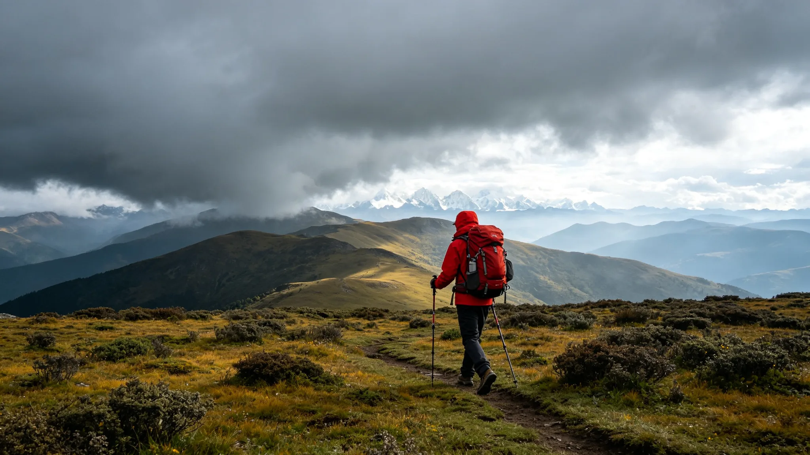
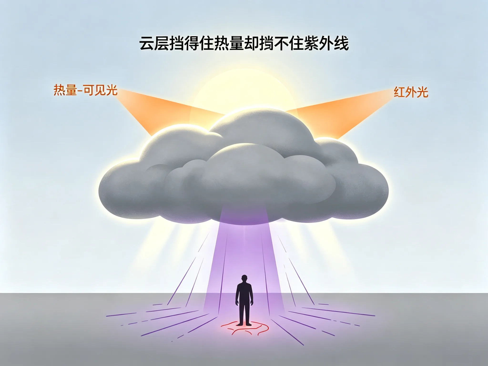
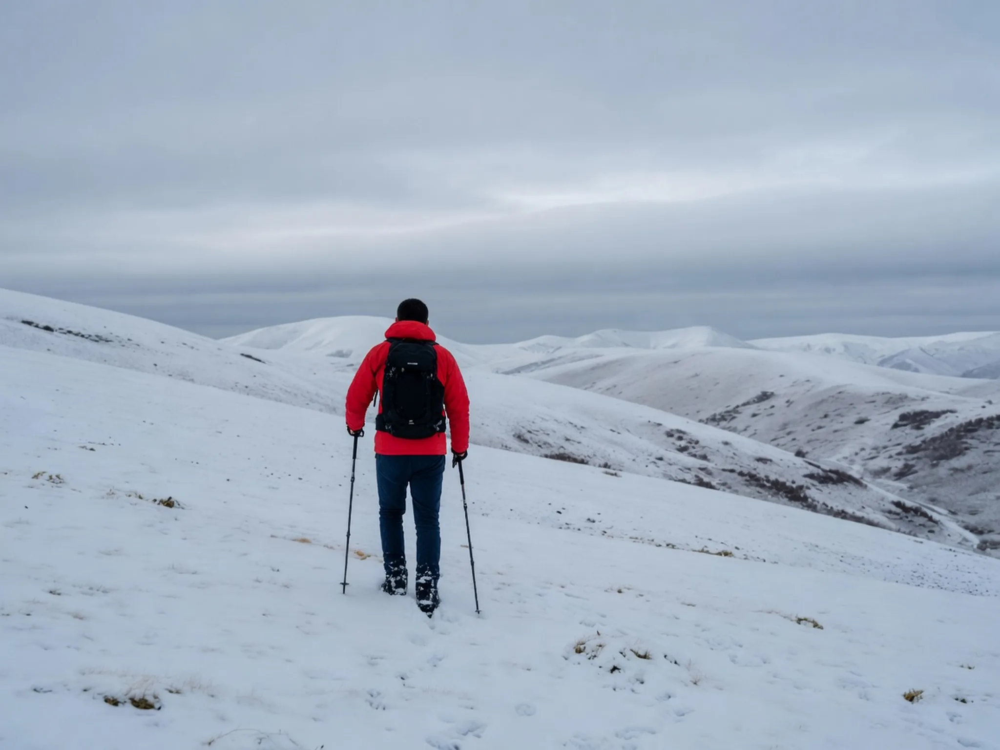
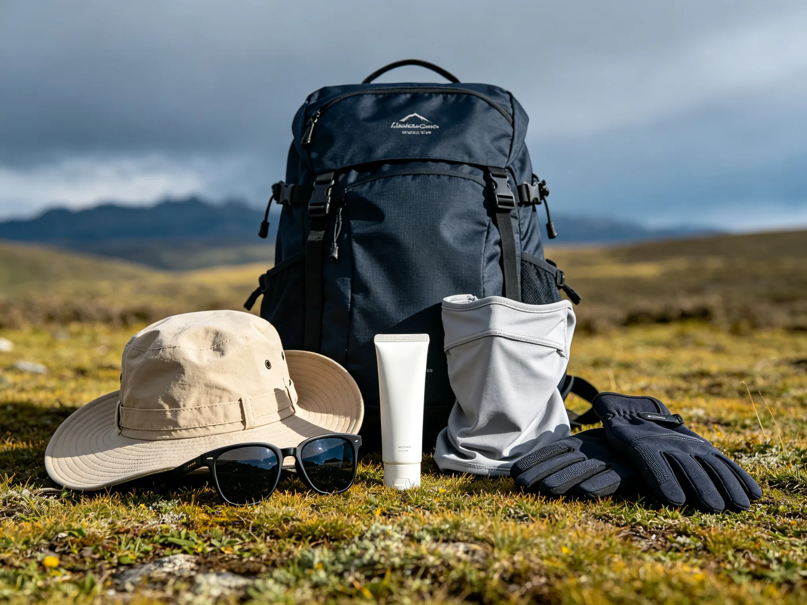

> 阴天凉快，太阳连影子都照不出来，怎么会晒伤？
>
> 但很多常上高原的户外人攒着同一条经验：**阴天反而更容易被悄无声息地晒伤、晒脱皮；晴天虽然当时觉得晒，回来后皮肤受创却不严重。**

这不是错觉，也不是个例。晒伤与否，看的是**紫外线剂量**，而不是体感温度。云层挡得住热量，却挡不住紫外线；阴天又恰好让人放松防护、延长暴露——几个机制叠在一起，就造出了这个"防晒陷阱"。

阴沉天光的川西草甸山脊。体感凉快，不代表紫外线下班了。

## 云层挡热，不挡紫外线

很多人以为"云厚＝紫外弱"。云确实挡紫外线，但挡得远没有想象的多。

美国环保署（EPA）用于紫外线指数预报的"云因子"给出了这样一组基准数字：

| 天空状况 | 紫外线透过率（以晴空为基准） |
| --- | --- |
| 晴空无云 | 约`100%` |
| 散云 | 约`89%` |
| 碎云 | 约`73%` |
| 全阴天 | 约`31%` |

也就是说，就算云量`100%`的纯阴天，仍有大约**三成**紫外线穿透到地面。世界卫生组织和气象研究机构给出的近似区间也类似：厚云/阴天约`30%～80%`，多云约`60%～80%`。

更重要的是，阴天剩下来的主要是哪部分紫外线：

| 波段 | 主要作用 | 全阴天下剩余量 |
| --- | --- | --- |
| **UVA**（长波） | 晒黑、光老化，穿透力极强 | `60%～80%` |
| **UVB**（中波） | 晒红、晒伤、脱皮 | `30%～50%` |

到达地面的紫外线里，UVA约占`95%`。云层对紫外线的阻挡，对能量强、波长短的UVB更有效，而穿透力最强的UVA几乎畅行无阻——它正是造成深层光老化的主力。

橙色光线（热量与可见光）被云层拦下，紫色光线（紫外线）直接穿透。示意插画。

:::info 为什么体感凉快？
云层挡掉的，主要是可见光和红外线，也就是"亮度"和"热量"。所以阴天体感凉快、不刺眼，但这恰恰和紫外线强度是两回事。**凉快不等于安全。**
:::

## 阴天真正的危险：零防护 + 超长暴露

把晴天和阴天放在一起对比，就会看到"阴天更严重"的结构性原因：

| 维度 | 晴天 | 阴天 |
| --- | --- | --- |
| 体感 | 热、晒，立刻想躲 | 凉快、无感，待得住 |
| 防护行为 | 主动防晒、找阴凉、缩短暴露 | 常不涂防晒、不遮、长时间暴露 |
| 紫外线 | 强度大，但暴露时间短 | 强度弱，但暴露时间成倍拉长 |
| 总剂量 | 可控 | 在无感中默默累积 |

晴天不是没紫外线，而是**热感逼着你做了防护**；阴天则是"剂量不高，但架不住你一直不设防"。很多晒伤事故，剂量不是输在强度上，而是输在时长上。

## 晒伤是"延迟播报"的

还有一个让"阴天陷阱"更难察觉的因素：晒伤的反应是延迟的。

紫外线红斑（红肿、刺痛）一般在暴露后`2～6`小时才开始出现，`18～24`小时达到高峰，之后才进入脱皮阶段。所以：

- 晴天"当时觉得晒"，那是**热感**，不等于已经严重受伤；
- 阴天"当时没感觉"，也不代表没受伤——剂量已经在皮肤里攒够，只是还没"播报"；
- 常常是当晚或第二天一早，红肿、刺痛、脱皮才一次性爆发。

这也解释了为什么"阴天回来发现晒脱皮"那么令人意外：不是晒得太狠没有前兆，而是**前兆迟到了整整一晚**。

## 高原：把陷阱放大的三个开关

同样的天气，高原把以上所有机制都放大了。

**第一，海拔加成。** 世界卫生组织估算，海拔每升高`1000`米，紫外线强度约增加`10%～12%`。以成都（约`500`米）和川西常见营地（约`3500`米）对比，紫外线强度大约就是平原的**3倍**。

**第二，大气稀薄，漫射增强。** 高海拔空气对紫外线的吸收、散射能力显著下降；阴天时紫外线里"漫射光"（从四面八方打过来的散射成分）占比更大。换句话说，高原阴天"没有太阳"也照样有大量紫外线从侧面、从头顶打到你，躲都躲不开。

**第三，地表反射。** 新雪对紫外线的反射率高达`80%～95%`。雪线以上徒步，头顶直射加脚下反射，等于双重照射；即便阴天，反射分量依然存在。

晴空下的雪坡反光明亮。新雪的紫外线反射率可达`80%～95%`，头顶与脚下双重照射。

:::warning 云层增强效应
多云、碎云天还有一个反直觉的现象：阳光被云侧反射后，与直射光叠加，地面紫外线瞬时强度**可以比晴天还高约25%**。户外人最严重的晒伤，常常发生在"不太晒、太阳若隐若现"的多云天。
:::

## 高原阴天防晒清单

判断要不要防晒，只有一个可靠标准：**UV指数**，不是天空颜色，也不是体感。UV指数`≥3`就需要防护；而高原晴天的UV指数动辄`11+`（极端级别），阴天也常常在`8`以上——这已经是"浅肤色暴露十几分钟即可晒伤"的水平。

:::tip 实操清单
- **看UV指数，不看天气**：出发前查当地紫外线指数预报，阴天、多云天一样查。
- **广谱防晒霜打底**：SPF`30+`、PA`+++`（或标注广谱Broad Spectrum），出门前`15～30`分钟涂够量（面部约一枚硬币大小）。
- **定时补涂**：出汗、蹭擦、雪地反光环境下，`2`小时左右补一次；高海拔徒步频率只增不减。
- **硬防晒别省**：宽檐帽、防晒面罩、墨镜是主力，防晒霜只是补充。雪线以上建议加防UV面罩。
- **眼睛同样受伤害**：阴天也要戴墨镜。雪地阴天是雪盲的高发场景，因为眼睛同样被反射的紫外线累积伤害。
- **判断要保守**：高原阴天＝"三成以上UV＋零防护＋超长暴露＋延迟反应"，把它当成比晴天更危险的日子来对待。
:::

宽檐帽、墨镜、防晒面罩、防晒霜——阴天同样用得上的基础配置。

## 结语

"阴天更容易被悄无声息地晒脱皮"不是伪科学，而是**云层选择性遮挡、体感欺骗、防护归零、反应延迟、高原放大**几个机制叠加的必然结果。

下次上高原，哪怕天阴沉得像要下雨，防晒流程也一步都不要省。回来最恨的不是雨，是那层悄悄脱下来的皮。

---

### 参考来源

- 美国环保署（EPA）云因子数据（经 uvi.today 整理引用）：[Does UV Go Through Clouds, Windows, and Water?](https://uvi.today/en/blog/does-uv-go-through-clouds-windows-water)
- 科普中国（WHO与气象研究机构数据）：[阴天紫外线透过率近似值](https://cloud.kepuchina.cn/h5/detail?id=7481507872507973632)
- 澎湃新闻：《阴天不用防晒？UVA正偷偷啃你的脸》[https://m.thepaper.cn/newsDetail_forward_33641619](https://m.thepaper.cn/newsDetail_forward_33641619)
- 人民网健康：《没有太阳也会被晒伤？专家提醒警惕"云层增强效应"》[http://health.people.cn/n1/2022/0904/c14739-32518897.html](http://health.people.cn/n1/2022/0904/c14739-32518897.html)
- 中国新闻网：《阴天不用防晒？涂防晒必须卸妆？皮肤科医生提醒》[http://www.chinanews.com.cn/jk/2026/04-30/10613886.shtml](http://www.chinanews.com.cn/jk/2026/04-30/10613886.shtml)
- 央视新闻：《高原避暑怎么玩才安全？》（世界卫生组织海拔估算）[https://content-static.cctvnews.cctv.com/snow-book/index.html?channelId=1119&item_id=8199155264903214662](https://content-static.cctvnews.cctv.com/snow-book/index.html?channelId=1119&item_id=8199155264903214662)
- DIH LABS：《UV index on cloudy days》（云层增强效应实测）[https://dih-labs.com/sun-day/en/uv-index-on-cloudy-days.html](https://dih-labs.com/sun-day/en/uv-index-on-cloudy-days.html)
- UV-Blocker：《Can You Get Sunburn on a Cloudy Day?》[https://uv-blocker.com/blogs/sun-protection/can-you-get-sunburn-on-a-cloudy-day](https://uv-blocker.com/blogs/sun-protection/can-you-get-sunburn-on-a-cloudy-day)
