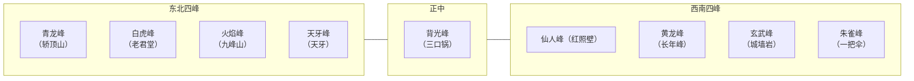

彭州西北的高山，属于龙门山脉中段。这一组山里，真正被清嘉庆《彭县志》按方位列出名字的，是九座：青龙、朱雀、火焰、天牙、背光、仙人、黄龙、元武、白虎。后人又用轿顶山、老君堂、三口锅、一把伞这类山形土名来指认其中几座。朱雀峰、白虎峰扣在哪一座山上，本文按驴友通行称呼，不以彭县志为准。

## 九峰总表

下表峰名取自嘉庆志所列九峰；轿顶山、老君堂、三口锅、一把伞等为通行俗称，海拔为地方史志转述数字。朱雀峰与白虎峰的对应见下方提示。

:::info 提示：朱雀峰、白虎峰不以彭县志为准
嘉庆《彭县志》按方位把朱雀峰列在东北、白虎峰列在西南。后来的地方史志转述，多据此把东北那座（俗称老君堂，海拔`4280`米）叫朱雀峰，把西南那座（俗称一把伞，海拔`3354`米）叫白虎峰。

本文以驴友通行称呼为准：**一把伞是朱雀峰，老君堂是白虎峰**，不以彭县志这套对应为准。两座山的位置、海拔和俗称不变，变的只是四象峰名扣在哪一座上。读志书、官方简介和穿越记录时，应先看俗称和方位，不要只认“朱雀”“白虎”四个字。
:::

| 峰名 | 俗称 | 海拔 | 方位 |
| :---: | :---: | :---: | :---: |
| **青龙峰** | - | `3970` | 东北 |
| **白虎峰** | 老君堂 | `4280` | 东北 |
| **火焰峰** | 九峰山 | `3315` | 东北 |
| **天牙峰** | - | `3922` | 东北 |
| **背光峰** | 三口锅 | `4069` | 正中 |
| **仙人峰** | 红照壁 | `4507` | 西南 |
| **黄龙峰** | 长年峰 | `4550` | 西南 |
| **玄武峰** | 城墙岩 | `4086` | 西南 |
| **朱雀峰** | 一把伞 | `3354` | 西南 |

九峰方位概览：

## 九峰概述

### 青龙峰

**青龙峰**是嘉庆志东北四峰的第一座，俗称**轿顶山**，海拔`3970`米。轿顶这个名字，来自山顶平阔、远看像轿顶。光绪山川志在天呀峰北、中书台池东、黄龙坪一带也记有轿顶山，位置仍在东北峰群、偏什邡一侧。把光绪志里的轿顶山地名，和嘉庆志里的青龙峰放到一起读，比单独相信某一份旅游简介更稳妥。

青龙峰不是大众金顶线。它在东北峰群里，山体落差大，山脊长，和火焰峰不是同一条常规朝山路。

### 白虎峰

**白虎峰**在东北峰群，俗称**老君堂**，海拔`4280`米。清志没有展开这座峰上是否还有完整的道教建筑，因此本文只采用俗称，不把“遗址规模、始建年代”写成已核实内容。

嘉庆志把东北这座写作朱雀峰。地方史志转述也常把老君堂叫朱雀峰。本文按驴友称呼，老君堂是白虎峰，不以彭县志这套对应为准。

### 火焰峰

**火焰峰**是理解“九峰山”这个名字最关键的一座。嘉庆志把它放在东北四峰里。光绪志写得更具体：狮首东北曰火焰峰，为五峰之一，距县北九十七里八分；峰前有雷音寺；左肩齿齿向东而下，即俗所专称为九峰者。因此火焰峰俗称**九峰山**，也就是狭义上的九峰山，海拔`3315`米。

大众徒步说的金顶，指的就是火焰峰上雷音寺一带的登顶点。常见行程从红房子、吊桥、祖师殿、观音岩、南天门到雷音寺。金顶不是九峰之外的第十座山，也不是太子城。把“去九峰山”理解成“走火焰峰金顶线”，在口头传统里能说通，但写峰名时应标明：这是狭义用法。

光绪志还写，火焰峰“高才得玉垒八分之七，而东视蓥华如在山半”。这和彭州民间顺口溜“天台不算高，蓥华半中腰；蓥华不算高，九峰半中腰”是同一观察：从盆地一侧望去，九峰明显高于天台、蓥华，却仍低于它背后的太子城（玉垒）。清人用的是目测和相对高低，不能拿“八分之七”去反推现代海拔。

火焰峰也是九峰里转述海拔最低的一座。它成为常规登顶点，靠的是旧朝山道、寺庙链和相对可接近，不是因为它最高。

### 天牙峰

**天牙峰**列在东北四峰之末，俗称**天牙**，海拔`3922`米。嘉庆志作天牙，光绪志作**天呀峰**，并写它与火焰峰“南北相际”，山东为长河，北面靠近什邡属中书台。峰名本身已经在说形状：峰脊尖锐，远看像一枚长牙。俗称只是口头省略了“峰”字，并不是另一座山。

光绪志在天牙、火焰两峰之间还拟名过一座“冢山”，并提到长坪、白果坪、香樟坪。这些是火焰峰南侧的附属地名，不应塞进九峰名单里充数。

### 背光峰

嘉庆志只给正中列了一座：**背光峰**，俗称**三口锅**，海拔`4069`米。这个俗称在驴友圈里出现频率很高，得名于山顶一带三处凹陷、像锅底的地形。它处在九峰正中，和东北、西南两组高峰的分界位置相符。

三口锅在彭州户外记录里常作为采药、野菜和穿脊的地理参照，不等于它已经像火焰峰金顶那样形成稳定的大众朝山道。正中主峰海拔超过四千米，天气、积雪和迷路风险都和金顶线不是一个量级。

### 仙人峰

**仙人峰**是嘉庆志西南四峰的第一座，俗称**红照壁**，海拔`4507`米，九峰里仅次于黄龙峰。光绪志把它写在太子城之南五里：距县北一百五里，高七里二分，无草木，有乾龙池，并有银厂沟。

光绪志把仙人峰的乾龙池，和《华阳国志》“开明决玉垒山以除水害”联到一起，并说“玉垒”是五峰的总名。这是吕调阳一系的考证意见，用来解释山名和水系，还不是经过现代考古坐实的开明氏工程遗址。读到“开明决玉垒”时，应把它当成光绪志的解释，而不是把仙人峰直接写成古蜀水利现场。

红照壁这个俗称，来自西南一带大片赤红、像照壁一样的岩壁。

### 黄龙峰

**黄龙峰**在仙人峰东南，俗称**长年峰**，海拔`4550`米，是九峰中最高的一座。光绪志写“又东南五里曰黄龙峰”，山东为大金河。

旅游简介常把“长年峰”直接写进九峰名单，同时漏掉“黄龙峰”。正确读法是：黄龙峰是嘉庆志里的官方峰名，长年峰是后来通行的俗称。长年峰不能从九峰里单列出来，再把黄龙峰删掉。

九峰最高不等于彭州最高。彭州境内更高的是太子城。光绪志已写太子城“百里外望之高与仙人峰并，实则过之”。

### 玄武峰

嘉庆志作**元武峰**，今作**玄武峰**，俗称**城墙岩**，海拔`4086`米。俗称来自崖壁绵延、远看像一段城墙。方位在西南组，和东北的火焰峰、青龙峰不是一座山。

这个俗称最需要防混。光绪山川志在丹景山附近另有一处“城墙岩”：五显冈“右下为城墙岩，左下夹丹景山北之丹溪”。丹景山在县西北四十里上下，是中低山景区；玄武峰的城墙岩在西南高峰一侧。同名并不意味着同一地点。看到“城墙岩”三个字，应先问是九峰里的玄武峰，还是丹景山一带的岩壁地名。

### 朱雀峰

**朱雀峰**在西南一侧，俗称**一把伞**，海拔`3354`米。一把伞得名于孤峰顶部散开、像伞盖的形状。它和火焰峰海拔接近，但一组在西南，一组在东北，中间隔着背光峰和更高的西南主脊。

驴友口头里的“一把伞就是朱雀”“朱雀峰三峰”，指的就是这一组西南山头。嘉庆志把朱雀峰写在东北、白虎峰写在西南，地方史志据此把老君堂叫朱雀、一把伞叫白虎。本文以驴友称呼为准，不以彭县志这套对应为准。一把伞有时被拆成几个相邻山头，海拔数字也会差十几米，它们仍是同一组西南山头，不是东北那座老君堂。

## 参考资料

- 清嘉庆《彭县志》卷五山川“九峰山”条，识典古籍：[https://www.shidianguji.com/book/CADAL11200298/chapter/1l24547lgz6li](https://www.shidianguji.com/book/CADAL11200298/chapter/1l24547lgz6li)
- 清嘉庆《彭县志》同条另一份识典古籍整理本：[https://www.shidianguji.com/book/7501947754210394163/chapter/1ll67xb2z5zwg](https://www.shidianguji.com/book/7501947754210394163/chapter/1ll67xb2z5zwg)
- 清光绪《重修彭县志》卷第一山川相关条目，识典古籍：[https://www.shidianguji.com/book/CADAL11200288/chapter/1l37qgnklsi7n](https://www.shidianguji.com/book/CADAL11200288/chapter/1l37qgnklsi7n)
- 四川省情网对九峰的整理转述：[https://www.scdfz.org.cn/whzh/slzc1/content_202239](https://www.scdfz.org.cn/whzh/slzc1/content_202239)
- 庄永红《一次说清！彭州的山与水》，彭州市融媒体中心转载：[https://www.163.com/dy/article/L49NJTQD05509Y9P.html](https://www.163.com/dy/article/L49NJTQD05509Y9P.html)
- 庄永红《在彭州，遥望雪山》（火焰峰转述海拔曾作`3251`米，可与上条对照）：[https://www.163.com/dy/article/K8F5HIVJ05509Y9P.html](https://www.163.com/dy/article/K8F5HIVJ05509Y9P.html)
- 中国地质调查局西安地质调查中心《四川龙门山国家地质公园》：[http://www.xian.cgs.gov.cn/kpzs/dzly/202512/t20251222_846883.html](http://www.xian.cgs.gov.cn/kpzs/dzly/202512/t20251222_846883.html)
- 宗性《临济宗天台九峰派源流考述》，成都文殊院空林资源库（寺庙年代与嘉庆志总括的对照）：[http://www.konglin.net/klzyk/zxfszz/12093.html](http://www.konglin.net/klzyk/zxfszz/12093.html)
