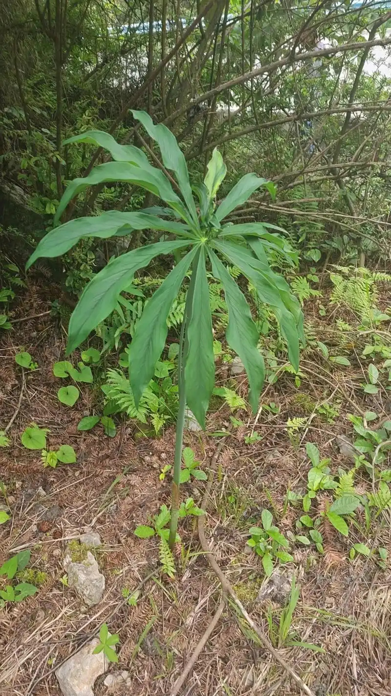
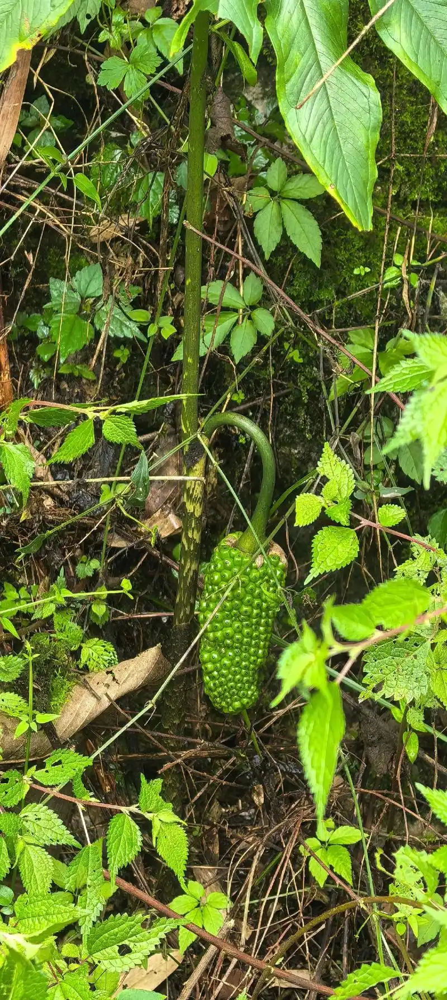
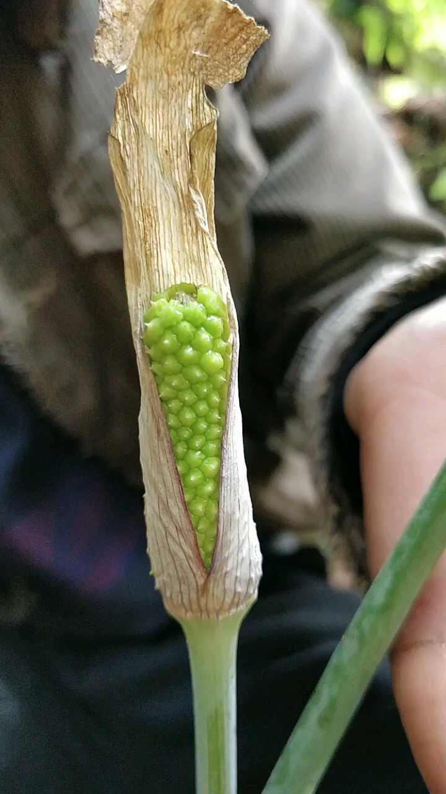

# 一把伞南星

"一把伞南星" 因其独特的叶片形态而得名：植株通常具有一枚鸟足状复叶，小叶7-20片呈放射状排列，形似撑开的雨伞，故名"一把伞"。"南星"是天南星科植物的通称，因其块茎入药功效显著而得名。该植物形态优美，但全株有毒，需谨慎识别和使用。

注意：

- 一把伞南星全株**有毒**，尤其是块茎毒性较强，含有刺激性的草酸钙针晶和生物碱。
- 误食可引起口腔、咽喉灼痛、肿胀，严重者可导致窒息，需立即就医。
- 药用必须经过严格炮制以降低毒性，切勿生用或自行采食。
- 野外遇到时应避免直接接触，特别是汁液部分。

## 学名

一把伞南星 (Arisaema erubescens (Wall.) Schott)

## 别名

蛇包谷、独脚莲、独叶一枝花、七叶一把伞、天南星

## 所属科目

天南星科天南星属

## 采收季节

秋季9-10月或春季3-4月采收，以秋季采收块茎药效最佳

## 生长海拔

1000-3000 米

## 生长环境

喜阴湿环境，常生于山地林下、沟谷阴湿处、竹林下或灌木丛中，要求土壤疏松肥沃、富含腐殖质

## 常见地点

成都彭州三口锅有很多野生。

## 药用部位

块茎（干燥块茎入药，需炮制后使用）

## 药用价值

**性味归经**: 苦、辛，温；**有毒**。**归肺、肝、脾经**。

**主要功效**:
- 燥湿化痰：用于顽痰咳嗽、痰多气喘
- 祛风止痉：治疗中风痰壅、口眼歪斜、癫痫惊风
- 消肿散结：用于痈肿疔毒、瘰疬痰核
- 解毒杀虫：外用治疗蛇虫咬伤、疥癣

**适应症**:
- 顽固性咳嗽、痰多气喘
- 中风痰壅、半身不遂
- 癫痫、惊风抽搐
- 破伤风、面神经麻痹
- 痈肿疔毒、瘰疬结核
- 毒蛇咬伤（外用）

## 药用方式

**内服**：（需遵医嘱，严禁自行用药，本品有毒）
- 煎汤: 炮制品3-9克（**生品禁用**）
- 研末: 炮制品每次1-3克，入丸散服
- 配伍使用: 常与半夏、贝母等配伍以减毒增效

**外用**：（需谨慎操作，避免接触黏膜）
- 研末调敷患处治疗痈肿疔毒
- 鲜品捣烂外敷治疗毒蛇咬伤（紧急情况）
- 煎水外洗治疗疥癣（稀释后使用）

**重要提示**:
一把伞南星有毒，生品毒性极强，严禁内服生品。必须经过炮制（如胆南星、制南星）后方可入药。以上药用方式仅供参考，不可替代专业医疗建议。如有疾病或不适，请咨询专业中医师或医疗机构，切勿自行诊断和用药。

## 炮制方式

**采收加工**:
1. 秋季采挖块茎，去除须根和外皮
2. 洗净后不可直接晒干（生品毒性大）
3. 必须经过炮制处理

**炮制方法**:
- **姜制南星**: 用生姜汁浸泡后晒干，反复多次，降低毒性
- **胆南星**: 用牛胆汁或猪胆汁浸泡发酵，制成胆南星，毒性最小，化痰效果最好
- **矾制南星**: 用白矾水浸泡后晒干，降低毒性
- **法半夏法**: 用生石灰水浸泡，换水多次，去除毒性

**保存方式**:
- 炮制品密封保存于阴凉干燥处，可保存1-2年
- 避免受潮，防止霉变
- 必须明确标注"有毒"，单独存放
- 远离食品和儿童接触范围

## 注意事项

**禁忌人群**:
- 孕妇禁用
- 阴虚燥咳者禁用
- 儿童慎用
- 体质虚弱者慎用

**用药注意**:
- 本品有毒，严禁使用生品内服
- 必须经过炮制后在医师指导下使用
- 不可过量，不可长期服用
- 服药期间如出现口舌麻木、恶心呕吐等症状应立即停药就医
- 不宜与乌头类药物同用（配伍禁忌）

**采挖注意**:
- 采挖时必须戴手套，避免直接接触
- 不要让汁液接触皮肤和黏膜
- 采挖后彻底清洗双手
- 不要在不确定的情况下采挖食用
- 教育儿童远离此类植物

**中毒处理**:
- 误食后立即催吐，用清水或米醋漱口
- 口服蛋清、牛奶、米汤等保护胃黏膜
- 可服用生姜汁、甘草水解毒
- 立即就医，进行专业救治
- 严重者需洗胃、输液等对症治疗

## 参考资料

- 百度百科: https://baike.baidu.com/item/一把伞南星

## 相关图片

