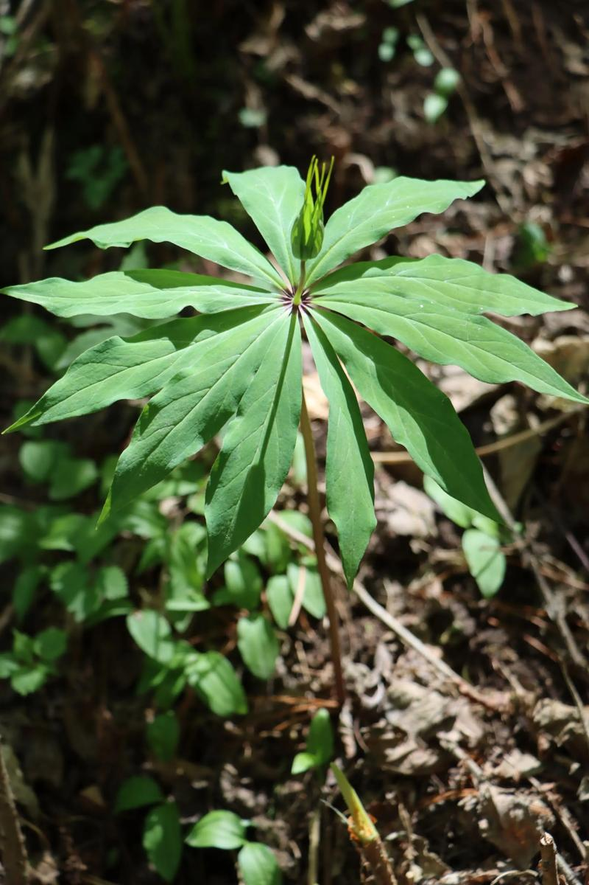
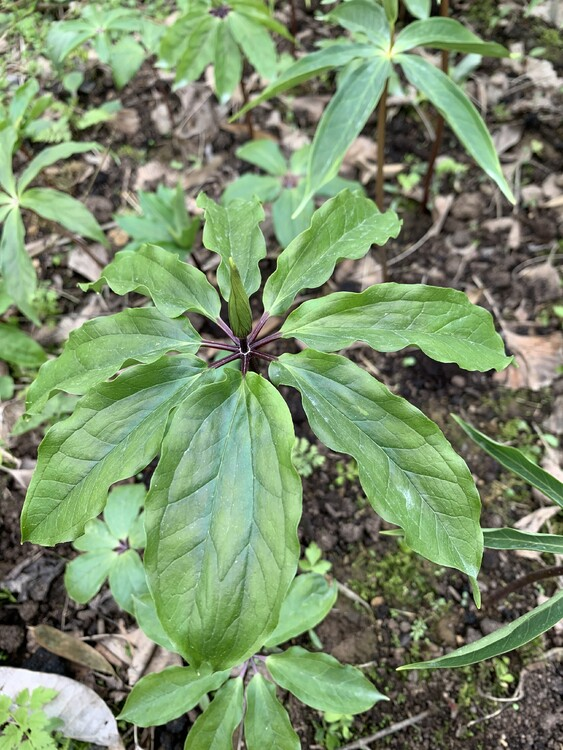
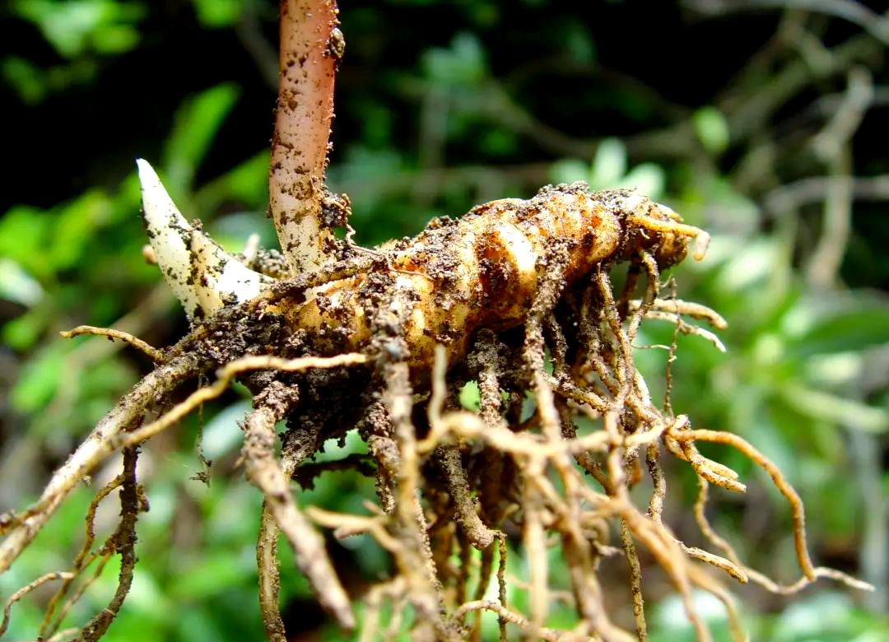

# 七叶一枝花

"七叶一枝花" 因其典型形态特征而得名：植株通常有7片轮生叶（实际5-10片不等），茎顶开一朵花，形态独特如 "众星捧月"。古人以 "七叶" 描述轮生叶片，"一枝花" 形容茎顶单花，生动体现其植物特征。又名 "重楼"，因叶片层层叠叠如楼阁；"蚤休" 取其能治虫咬之意。

注意：

- 野生七叶一枝花是**国家二级重点保护野生植物**，该类别收录于 2021 年发布的《国家重点保护野生植物名录》中。
- 它成为保护植物主要源于两方面原因：
  - 一是药用价值突出，其根茎是多种中成药的核心原料，市场需求大，导致野生植株长期被过度采挖；
  - 二是它的生长繁殖能力弱，野生状态下靠种子繁殖，从萌发到开花结果需 5 - 6 年的营养生长期，再生速度远赶不上采挖速度，野生种群数量持续锐减。
- 目前市面上用于药用的七叶一枝花，大多是人工栽培的产物，规模化的林下栽培技术也在逐步发展，以此缓解市场需求与野生资源保护之间的矛盾。

## 学名

七叶一枝花 (Paris polyphylla Smith var. chinensis (Franch.) Hara)

## 别名

重楼、蚤休、草河车、金线重楼、七叶莲、铁灯台、白甘遂、金盘托荔枝

## 所属科目

百合科重楼属

## 采收季节

秋季9-10月采收，此时根茎药效成分含量最高

## 生长海拔

600-3200 米

## 生长环境

喜阴凉湿润环境，常生于山地林下、沟谷阴湿处、竹林下或灌木丛中，要求土壤疏松肥沃、排水良好

## 常见地点

成都彭州三口锅有很多野生。

## 药用部位

根茎（干燥根茎入药）

## 药用价值

**性味归经**: 苦，微寒；有小毒。**归肝经**。

**主要功效**:
- 清热解毒：用于痈肿疔疮、咽喉肿痛、毒蛇咬伤
- 消肿止痛：治疗跌打损伤、外伤出血
- 凉肝定惊：用于小儿高热惊风、癫痫抽搐
- 息风止痉：治疗破伤风、惊风抽搐

**适应症**:
- 痈肿疔疮、疮疡肿毒
- 咽喉肿痛、扁桃体炎
- 毒蛇咬伤、虫兽咬伤
- 跌打损伤、外伤出血
- 小儿惊风、高热抽搐
- 流行性腮腺炎、乳腺炎

## 药用方式

**内服**：（需遵医嘱，避免自行用药，本品有小毒）
- 煎汤: 干品3-9克（不宜过量）
- 研末: 每次1-3克，温水送服
- 泡酒: 根茎30克泡白酒500ml，浸泡30天后饮用，每次10-15ml

**外用**：（相对安全，可自行操作）
- 研末调敷患处治疗疮疡肿毒
- 鲜品捣烂外敷治疗毒蛇咬伤
- 煎水外洗治疗皮肤湿疹

**重要提示**:
七叶一枝花有小毒，内服需严格控制用量。以上药用方式仅供参考，不可替代专业医疗建议。如有疾病或不适，请咨询专业中医师或医疗机构，切勿自行诊断和用药。

## 炮制方式

**采收加工**:
1. 秋季采挖根茎，去除须根和泥土
2. 洗净后切成厚片（3-5mm）
3. 晒干或低温烘干（不超过50℃）
4. 密封保存于阴凉干燥处

**炮制方法**:
- **生用**: 直接切片晒干，清热解毒力强，多用于外治
- **醋炙**: 用米醋拌匀后炒干，降低毒性，增强止痛作用
- **酒炙**: 用黄酒拌匀后炒干，增强活血散瘀功效

**保存方式**:
- 干燥存储: 密封保存于阴凉干燥处，可保存2-3年
- 避免受潮: 防止霉变和虫蛀
- 定期检查: 发现变质及时处理
- 注意标识: 因有小毒，需明确标注，避免误用

## 注意事项

**禁忌人群**:
- 孕妇禁用
- 体质虚弱者慎用
- 阴虚无实热者不宜使用
- 儿童用药需严格遵医嘱

**用药注意**:
- 本品有小毒，不可过量使用
- 过量可能出现恶心、呕吐、头晕等中毒症状
- 不宜长期连续服用
- 服药期间忌食辛辣刺激性食物
- 用药期间如出现不适应立即停药就医

**采挖注意**:
- 七叶一枝花为野生珍稀药材，严禁过度采挖
- 采挖时应保留部分植株，保护野生资源
- 注意识别，避免与其他有毒植物混淆
- 避免在自然保护区内采挖
- 建议使用人工栽培品

**中毒处理**:
- 轻度中毒：立即停药，多饮温开水，服用绿豆汤解毒
- 重度中毒：立即就医，进行催吐、洗胃等处理

## 参考资料

- 百度百科: https://baike.baidu.com/item/七叶一枝花

## 相关图片

