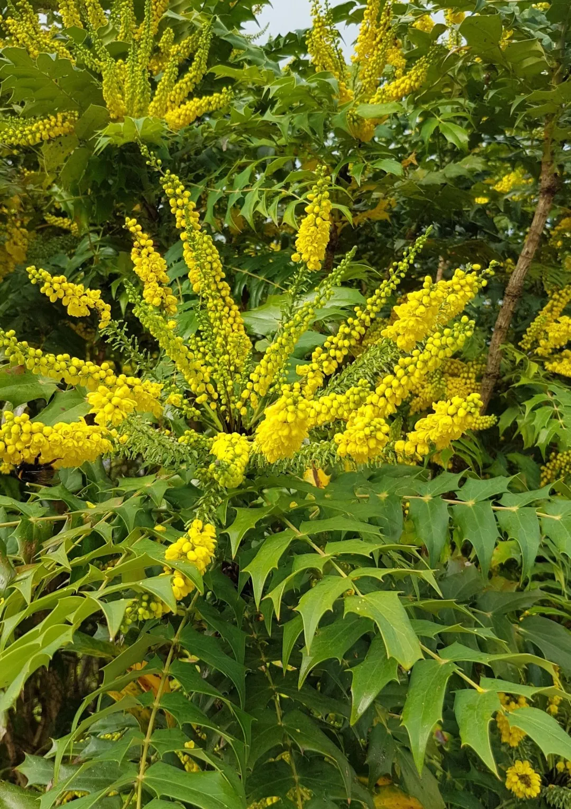
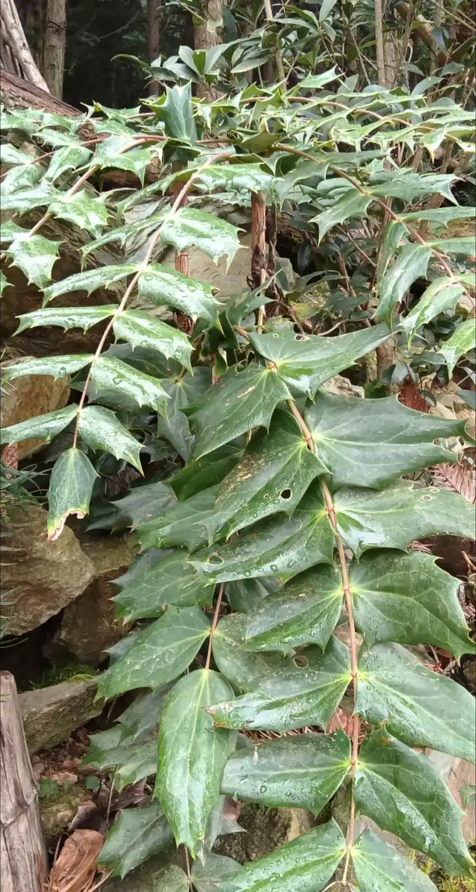
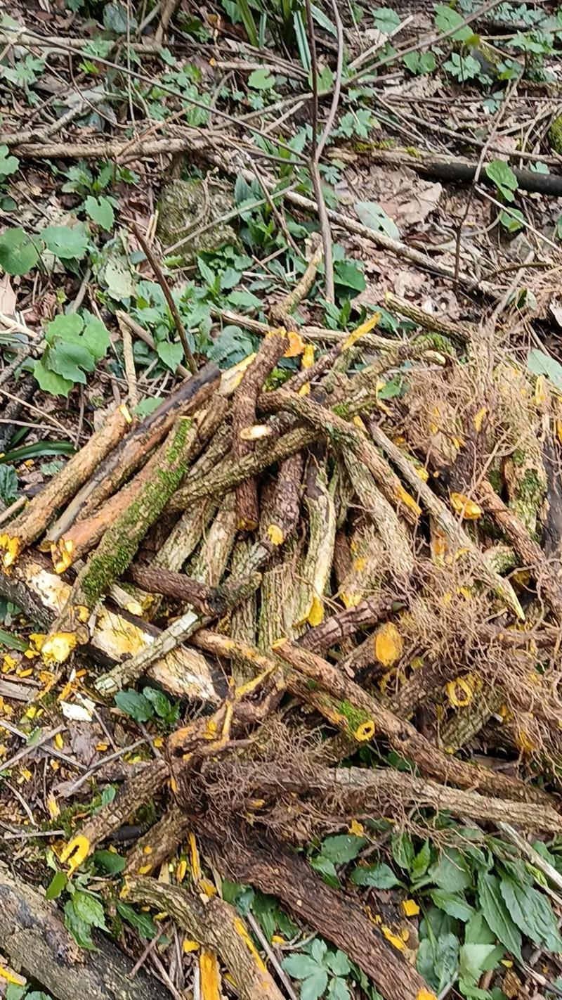

# 十大功劳

“十大功劳” 是小檗科植物的统称，常见有阔叶十大功劳、狭叶十大功劳等品种，名字均因药用功效而来。古人命名时注重 “直观体现价值”，用 “十大” 突出功效全面，用 “功劳” 强调药用实用性，并非特指恰好十种功效（“十” 为虚数，表 “多”）。因功效全面且常用，被赞 “功劳显著”，故得名 “十大功劳”。

## 学名

十大功劳 (Mahonia fortunei)

## 别名

功劳木、土黄柏、黄天竹、刺黄柏、猫儿刺、老鼠刺、八角刺

## 所属科目

小檗科十大功劳属

## 采收季节

全年均可采收，以秋季采收为佳，此时药效成分含量最高

## 生长海拔

200-2000 米

## 生长环境

喜温暖湿润气候，耐阴，常生于山坡林下、灌木丛中、路旁或溪边阴湿处，对土壤要求不严

## 常见地点

成都周边彭州山区较常见。

## 药用部位

根、茎、叶（以根和茎入药为主）

## 药用价值

**性味归经**: 苦、寒，归肝、胃、大肠经

**主要功效**:
- 清热解毒：用于热毒疮疡、咽喉肿痛
- 燥湿止泻：治疗湿热泄泻、痢疾
- 清肝明目：改善目赤肿痛、视物模糊
- 退虚热：用于骨蒸劳热、盗汗

**适应症**:
- 急性肠炎、细菌性痢疾
- 黄疸型肝炎、胆囊炎
- 肺结核、肺炎
- 目赤肿痛、结膜炎
- 疮疡肿毒、湿疹皮炎

## 药用方式

**内服**：（需遵医嘱，避免自行用药）
- 煎汤: 干品6-15克，鲜品15-30克
- 泡酒: 根茎50克泡白酒500ml，浸泡15天后饮用
- 研末: 每次3-6克，温水送服

**外用**：（相对安全，可自行操作）
- 煎水洗患处治疗湿疹、疮疡
- 捣烂敷患处消肿止痛
- 煎汤熏洗治疗痔疮

**重要提示**:
以上药用方式仅供参考，不可替代专业医疗建议。如有疾病或不适，请咨询专业中医师或医疗机构，切勿自行诊断和用药。

## 炮制方式

**采收加工**:
1. 秋季采挖根茎，去除泥土和须根
2. 切成片或段，厚度3-5mm
3. 晒干或低温烘干（不超过60℃）
4. 密封保存于阴凉干燥处

**炮制方法**:
- **生用**: 直接切片晒干，清热解毒力强
- **酒炙**: 用黄酒拌匀后炒干，增强活血通络作用
- **盐炙**: 用盐水拌匀后炒干，引药入肾，增强退虚热作用

**保存方式**:
- 干燥存储: 密封保存于阴凉干燥处，可保存2-3年
- 避免受潮: 防止霉变和虫蛀
- 定期检查: 发现变质及时处理

## 注意事项

**禁忌人群**:
- 脾胃虚寒者慎用
- 孕妇禁用
- 体质虚弱、久病体虚者不宜长期服用

**用药注意**:
- 不宜过量使用，过量可能导致腹泻
- 服药期间忌食辛辣刺激性食物
- 不宜与温补类药物同服
- 长期服用应在医师指导下进行

**采摘注意**:
- 注意识别，避免与其他带刺灌木混淆
- 采摘时小心叶片边缘的刺
- 避免在污染区域采集
- 不要过度采挖，保护野生资源

## 参考资料

- 百度百科: https://baike.baidu.com/item/十大功劳
- 中国植物志: http://www.iplant.cn/info/Mahonia%20fortunei

## 相关图片

