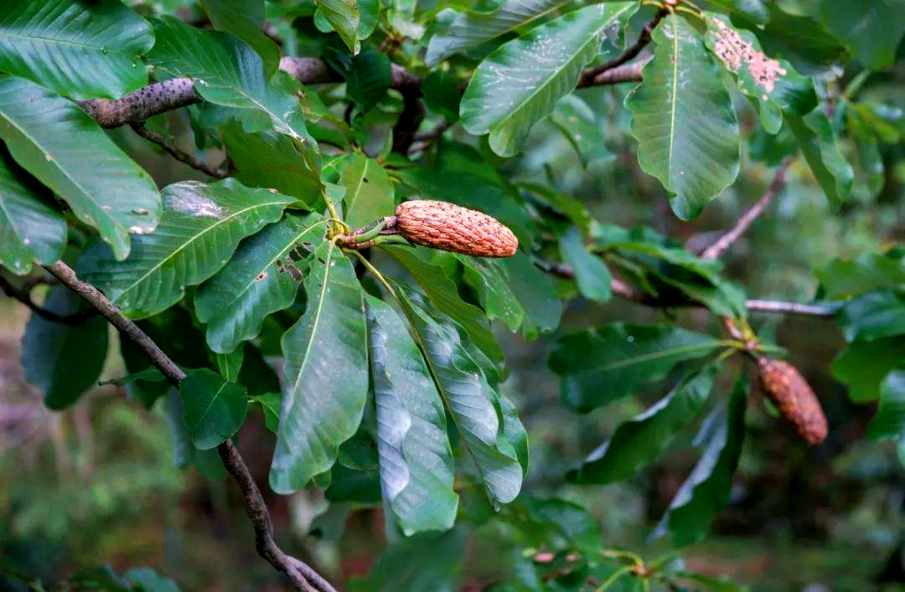
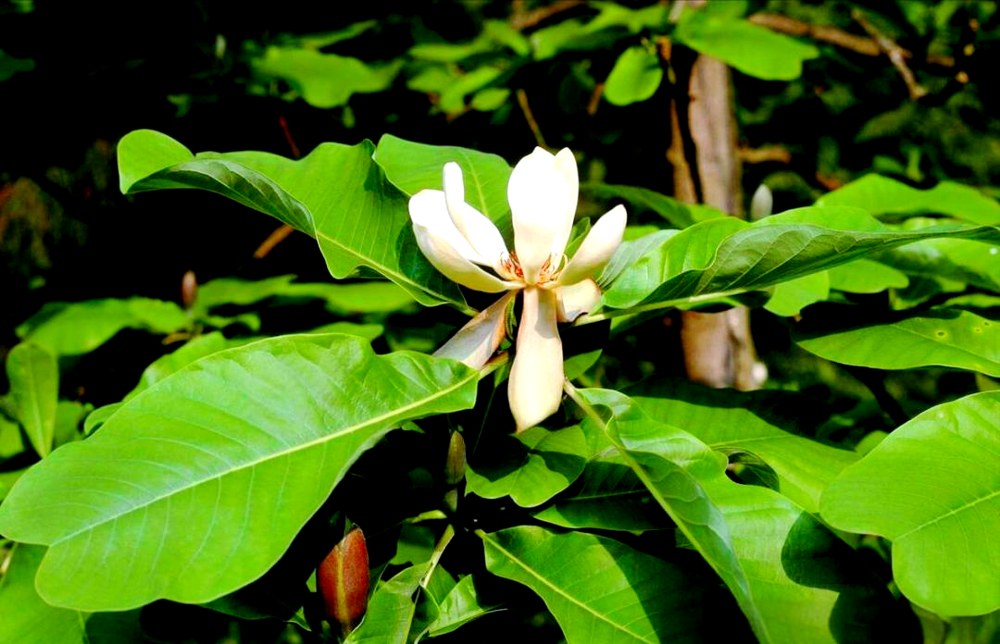
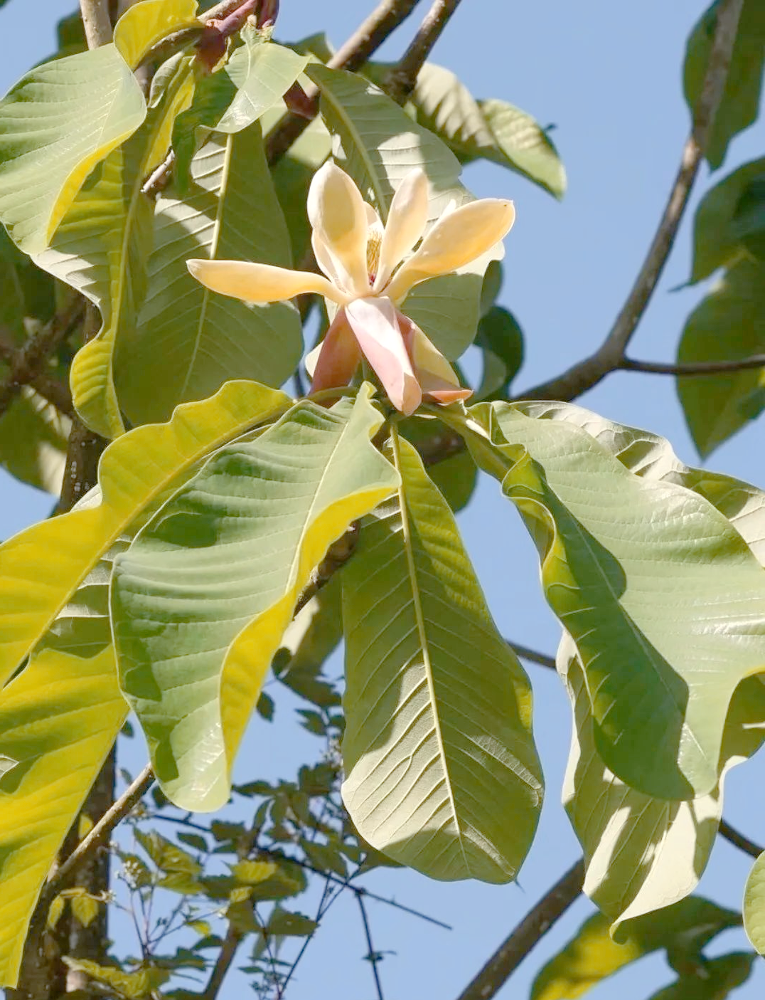

# 厚朴

"厚朴" 之名源于其树皮特征：树皮厚实且质地朴实无华，故名"厚朴"。《本草纲目》记载："其皮厚而色紫，故名厚朴。"该植物是我国传统名贵中药材，以树皮入药，具有行气化湿、温中止痛的功效。厚朴树形高大优美，既是重要药材，也是优良的观赏和用材树种。

注意：
- 野生厚朴是**国家二级重点保护野生植物**。这一保护等级在 1999 年首次纳入相关名录，2021 年更新的《国家重点保护野生植物名录》中也继续将其列为二级保护植物。
- 野生厚朴之所以被重点保护，是因为它生长速度缓慢，且过去长期遭受人为过度采伐，导致野生种群急剧减少，如今仅零星分布在部分深山区域。不过目前人工育苗造林技术已较为成熟，市面上药用和相关应用的厚朴多为人工栽培品种，以此缓解对野生种群的依赖。

## 学名

厚朴 (Magnolia officinalis Rehd. et Wils.)

## 别名

川朴、紫油厚朴、温朴、烈朴、赤朴、厚皮

## 所属科目

木兰科木兰属

## 采收季节

春季4-6月或秋季8-10月采收树皮，以春末夏初采收为佳，此时树皮易剥离且药效成分含量高

## 生长海拔

300-1500 米

## 生长环境

喜温暖湿润气候，喜光但幼树耐阴，常生于山地阔叶林中，要求土壤深厚肥沃、排水良好的酸性或微酸性土壤

## 常见地点

四川、湖北、湖南等地山区较为常见，四川产的"川朴"品质最佳。成都彭州山区常见种植。

## 药用部位

树皮、根皮、花、种子（以干燥树皮入药为主）

## 药用价值

**性味归经**: 苦、辛，温。**归脾、胃、肺、大肠经**。

**主要功效**:
- 行气化湿：用于湿阻中焦、脘腹胀满
- 温中止痛：治疗脾胃虚寒、腹痛腹泻
- 降逆平喘：用于痰饮咳喘、胸闷气短
- 消积导滞：治疗食积气滞、便秘腹胀

**适应症**:
- 湿阻中焦、脘腹胀满
- 食积气滞、腹胀便秘
- 痰饮咳喘、胸闷气短
- 脾胃虚寒、腹痛腹泻
- 梅核气、咽喉异物感

## 药用方式

**内服**：（需遵医嘱，避免自行用药）
- 煎汤: 干品3-10克
- 研末: 每次1-3克，温水送服
- 入丸散: 常与其他药物配伍使用

**外用**：（较少使用）
- 研末调敷治疗疮疡肿毒

**重要提示**:
以上药用方式仅供参考，不可替代专业医疗建议。如有疾病或不适，请咨询专业中医师或医疗机构，切勿自行诊断和用药。

## 炮制方式

**采收加工**:
1. 春末夏初或秋季剥取树皮
2. 刮去粗皮，晒至半干
3. 卷成筒状或双卷状，继续晒干
4. 切成丝或块，密封保存

**炮制方法**:
- **生用**: 直接切丝晒干，行气化湿力强
- **姜炙**: 用生姜汁拌匀后炒干，增强温中止呕作用，减少对胃的刺激
- **麸炒**: 用麦麸炒至微黄，缓和药性，增强健脾作用

**保存方式**:
- 干燥存储: 密封保存于阴凉干燥处，可保存2-3年
- 避免受潮: 防止霉变和虫蛀
- 定期检查: 发现变质及时处理
- 以紫褐色、内表面紫棕色、油性大、香气浓者为佳

## 注意事项

**禁忌人群**:
- 孕妇慎用
- 阴虚津亏者不宜使用
- 气虚者慎用

**用药注意**:
- 不宜过量使用
- 服药期间忌食生冷油腻食物
- 不宜与辛热燥烈药物同用
- 长期服用应在医师指导下进行

**采收注意**:
- 厚朴为国家二级保护植物，野生资源稀少
- 严禁乱砍滥伐，保护野生资源
- 采收时应采用环剥法，不可整株砍伐
- 建议使用人工栽培品
- 采收后应及时补种，促进资源再生

**配伍应用**:
- 配苍术、陈皮: 增强燥湿健脾功效（平胃散）
- 配枳实、大黄: 治疗腹胀便秘（厚朴三物汤）
- 配半夏、茯苓: 治疗痰饮咳喘
- 配木香、槟榔: 治疗食积气滞

## 参考资料

- 百度百科: https://baike.baidu.com/item/厚朴
- 中国植物志: http://www.iplant.cn/info/Magnolia%20officinalis

## 相关图片

