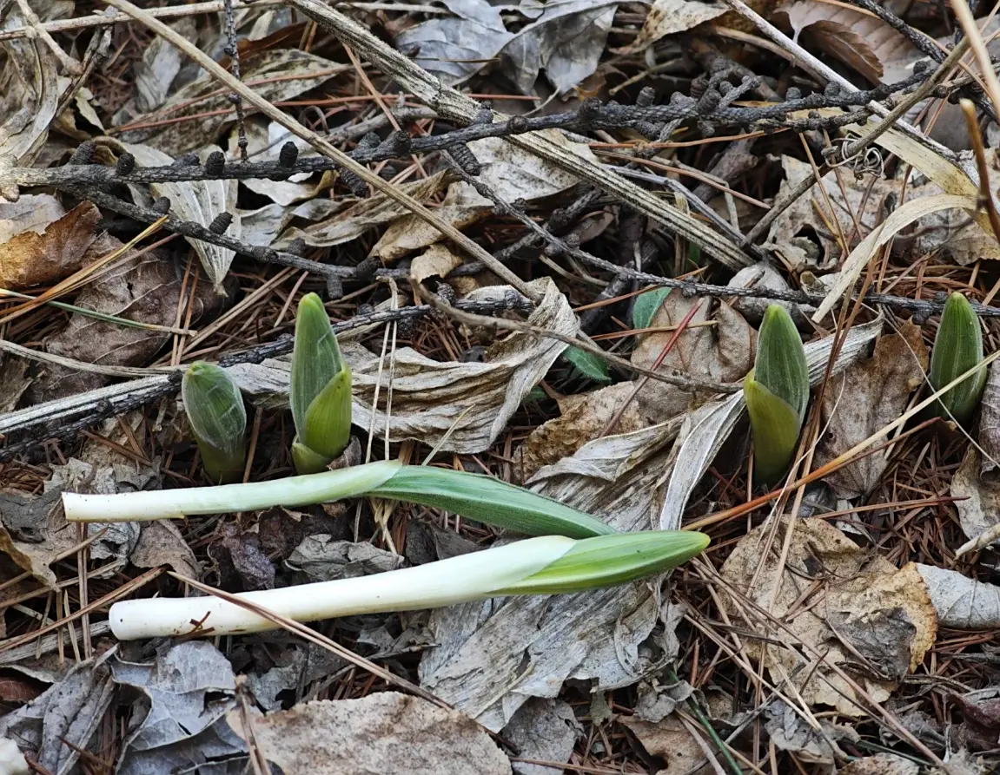
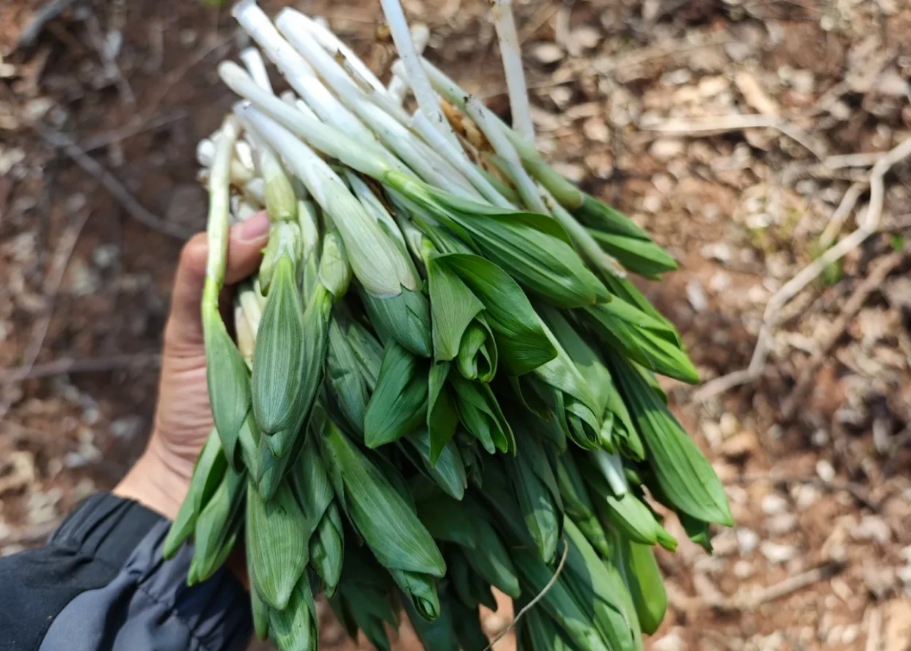
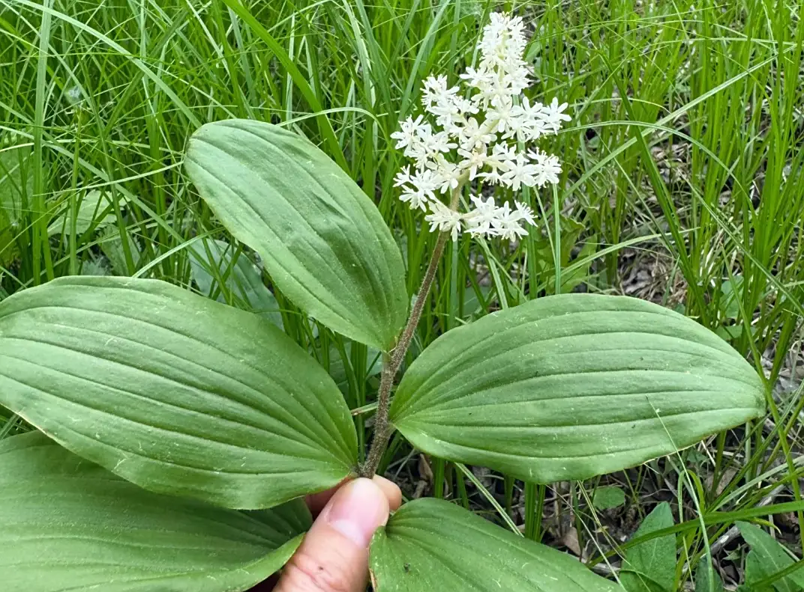
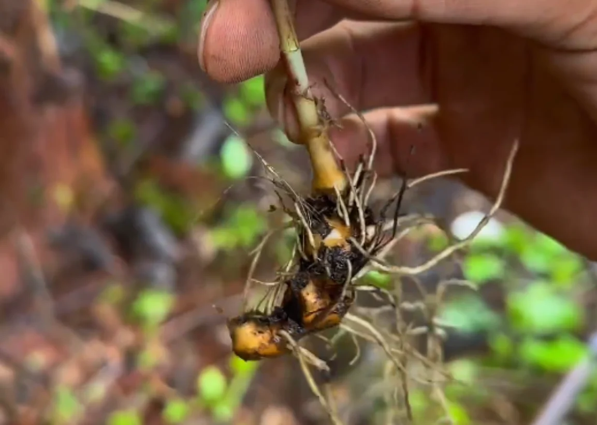

# 偏头菜

## 学名

鹿药 (Maianthemum japonicum)

## 别名

山糜子、竹叶菜、偏头七、盘龙七、螃蟹七、白窝儿七、狮子七

## 所属科目

天门冬科舞鹤草属（原百合科鹿药属）

## 采摘季节

春季 3-5 月，以早春嫩芽最佳，此时口感最嫩，甜味最浓

## 生长海拔

900-1950 米

## 生长环境

喜阴湿环境，常生于林下荫湿处、山坡阴处及岩缝中，要求土壤湿润、富含腐殖质

## 常见地点

成都三口锅山上比较常见。

## 食用部位

嫩芽、嫩叶

## 食用方式

采摘嫩芽，焯水去除苦味后可凉拌、清炒、做汤。生吃口感生脆，甜中微苦，隐约有点黄瓜味。焯水后甜丝丝的，清香爽口。偏头菜炒鸡蛋、凉拌偏头菜、偏头菜豆腐汤都是经典做法

## 药用价值

性味甘、苦，温，**归肝、脾、肾经**。

具有祛风止痛、活血消肿、补气益肾、祛风除湿、活血调经的功效，对风湿骨痛、神经性头痛、偏头痛、跌打损伤、乳腺炎、痈疖肿毒、月经不调、阳痿等有辅助治疗作用

## 药用方式

内服煎汤，干品 6-15 克（2-3 钱），或浸酒；外用适量捣烂敷患处，或烫热熨患部

**重要提示**：
1. 以上药用方式仅供参考，不可替代专业医疗建议。如有疾病或不适，请咨询专业中医师或医疗机构，切勿自行诊断和用药
2. **采摘警告**：鹿药与有毒植物藜芦长得很像，且生境一致，两者经常混杂生长。藜芦全株有剧毒，误食可致命。非专业人士请勿自行采摘，务必在有经验的人指导下进行识别

## 存储方式

- 冷藏存储: 洗净沥干后用保鲜袋装好，冷藏可保存 3-5 天
- 冷冻存储: 焯水 1-2 分钟后挤干水分，分袋冷冻，可保存 3-6 个月
- 晒干存储: 洗净焯水后晾晒至全干，密封保存，可保存 1 年以上，泡发后食用或入药

## 注意事项

1. **识别警告**：偏头菜（鹿药）与有毒植物藜芦外形相似，生长环境一致，常混杂生长。藜芦全株剧毒，误食可致命。非专业人士切勿自行采摘
2. 食用前必须焯水，去除苦味和草酸
3. 采摘时只取嫩芽，老叶口感差且苦味重
4. 孕妇、儿童慎食
5. 首次食用建议少量尝试，观察是否有过敏反应
6. 作为药用时，必须在专业中医师指导下使用

## 参考资料

- 百度百科: https://baike.baidu.com/item/鹿药
- 中国植物志: https://www.iplant.cn/info/Maianthemum%20japonicum
- 中医世家: http://www.zysj.com.cn/zhongyaocai/luyao/index.html

## 相关菜谱

### 1. 凉拌偏头菜

**食材**：

- 偏头菜嫩芽 300克
- 蒜末、香油、生抽、醋、盐、白糖、辣椒油

**做法**：

1. 偏头菜嫩芽洗净，沸水焯水 1-2 分钟，去除苦味
2. 捞出过凉水，挤干水分，装盘
3. 加入蒜末、生抽、醋、盐、白糖、香油、辣椒油拌匀
4. 静置 5-10 分钟入味即可

**特点**：
清爽开胃，甜中微苦，口感生脆，适合春季食用

---

### 2. 偏头菜炒鸡蛋

**食材**：

- 偏头菜嫩芽 200克
- 鸡蛋 3个
- 盐、食用油适量

**做法**：

1. 偏头菜嫩芽洗净，焯水 1 分钟，挤干水分，切碎
2. 鸡蛋打散，加入切好的偏头菜和少许盐，搅拌均匀
3. 热锅凉油，倒入蛋液，中小火炒至凝固
4. 翻炒均匀，出锅装盘

**特点**：
清香爽口，鸡蛋嫩滑，营养丰富

---

### 3. 偏头菜豆腐汤

**食材**：

- 偏头菜嫩芽 150克
- 嫩豆腐 1块
- 姜丝、盐、香油、胡椒粉适量

**做法**：

1. 偏头菜嫩芽洗净焯水，切段；豆腐切小块
2. 锅中加水烧开，放入姜丝和豆腐块，煮 3 分钟
3. 加入偏头菜，煮 1-2 分钟
4. 加盐、胡椒粉调味，淋香油即可

**特点**：
汤鲜味美，清淡爽口，春季养生佳品

---

### 4. 清炒偏头菜

**食材**：

- 偏头菜嫩芽 250克
- 蒜片、盐、食用油适量

**做法**：

1. 偏头菜嫩芽洗净，焯水 1 分钟，挤干水分
2. 热锅加油，炒香蒜片
3. 倒入偏头菜快速翻炒 2-3 分钟
4. 加盐调味即可

**特点**：
简单快手，保留原味，清香甜脆

---

### 5. 偏头菜炒肉丝

**食材**：

- 偏头菜嫩芽 200克
- 猪肉丝 150克
- 姜丝、蒜片、盐、生抽、料酒、淀粉

**做法**：

1. 猪肉丝用料酒、生抽、淀粉腌制 10 分钟
2. 偏头菜嫩芽洗净焯水，挤干水分，切段
3. 热锅加油，炒熟肉丝，盛出备用
4. 锅中留底油，炒香姜丝、蒜片
5. 加入偏头菜快速翻炒 2 分钟
6. 倒入肉丝，加盐调味，翻炒均匀即可

**特点**：
肉嫩菜香，营养均衡

---

### 6. 偏头菜火锅

**食材**：

- 偏头菜嫩芽 300克
- 火锅底料、各种涮菜

**做法**：

1. 偏头菜嫩芽洗净，无需焯水
2. 火锅煮开后，将偏头菜放入涮烫 1-2 分钟
3. 捞出蘸料食用

**特点**：
鲜嫩爽口，甜味浓郁，火锅的绝佳配菜

## 相关图片

