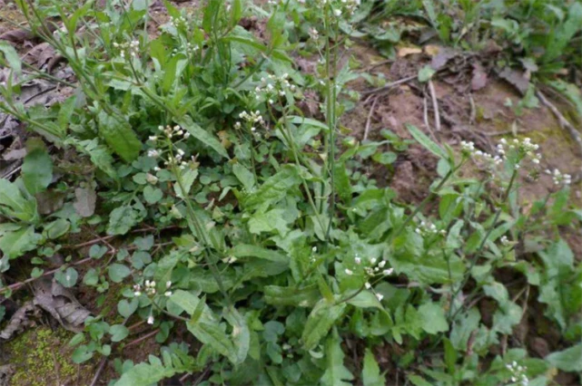
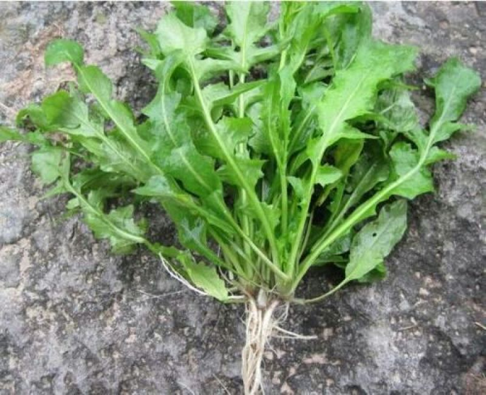

# 荠菜

## 学名

荠（jì）

## 别名

护生草、地菜、田儿菜、地米菜、菱闸菜、净肠草、枕头草

## 所属科目

十字花科荠属

## 采摘季节

春季 2-4 月，以早春最佳，此时嫩叶最鲜美

## 生长海拔

50-3000 米

## 生长环境

喜温和气候，阳光充足、土壤不太干燥处均可生长，常见于田边地头、路旁、荒地、山坡草地

## 常见地点

成都平原及周边低山区的田边、路旁、荒地普遍分布

## 食用部位

嫩茎叶

## 食用方式

可凉拌、清炒、做汤、包饺子、包馄饨、炒年糕，焯水后口感更佳，能去除草酸。荠菜炒鸡蛋、荠菜豆腐汤、荠菜馅饺子都是经典做法

## 药用价值

性味甘、平，**归肝、脾、肺经**。

具有凉血止血、清热利尿、健脾明目的功效，对吐血、便血、崩漏、目赤肿痛、高血压等有辅助治疗作用

## 药用方式

内服煎汤，鲜品 30-60 克，干品 10-15 克；外用捣烂敷患处可止血消肿

**重要提示**：
以上药用方式仅供参考，不可替代专业医疗建议。如有疾病或不适，请咨询专业中医师或医疗机构，切勿自行诊断和用药

## 存储方式

- 冷冻存储: 焯水 1-2 分钟后挤干水分，分袋冷冻，可保存 6-8 个月
- 晒干存储: 洗净焯水后晾晒至全干，密封保存，可保存 1 年以上
- 腌制存储: 洗净沥干后加盐腌制，可做成荠菜咸菜，保存 2-3 个月

## 注意事项

体质虚寒者不宜多食；采摘时注意与有毒的辣蒿区分，荠菜叶片边缘有锯齿，辣蒿叶片较细长；食用前需焯水去除草酸；有光敏性皮炎病史者不宜食用

## 参考资料

- 百度百科: https://baike.baidu.com/item/%E8%8D%A0%E8%8F%9C
- 维基百科: https://zh.wikipedia.org/wiki/%E8%8D%A0%E8%8F%9C
- 中国植物志: http://www.iplant.cn/info/%E8%8D%A0

## 相关菜谱

### 1. 荠菜炒鸡蛋

**食材**：

- 荠菜 200克
- 鸡蛋 3个
- 盐、食用油适量

**做法**：

1. 荠菜洗净，沸水焯水1-2分钟，捞出挤干水分，切碎
2. 鸡蛋打散，加入切碎的荠菜和少许盐，搅拌均匀
3. 热锅凉油，倒入蛋液，中小火炒至凝固即可

**特点**：
清香嫩滑，营养丰富

---

### 2. 荠菜豆腐汤

**食材**：

- 荠菜 150克
- 嫩豆腐 1块
- 姜丝、盐、香油适量

**做法**：

1. 荠菜洗净焯水，切段；豆腐切小块
2. 锅中加水烧开，放入姜丝和豆腐块，煮3分钟
3. 加入荠菜，煮1分钟
4. 加盐调味，淋香油即可

**特点**：
清淡鲜美，清热利尿

---

### 3. 荠菜馅饺子

**食材**：

- 荠菜 500克
- 猪肉馅 300克
- 饺子皮适量
- 姜末、盐、酱油、香油、料酒

**做法**：

1. 荠菜洗净焯水，挤干水分，切碎
2. 猪肉馅加姜末、盐、酱油、料酒、香油搅拌均匀
3. 加入荠菜碎拌匀成馅
4. 包成饺子，煮熟即可

**特点**：
鲜香多汁，春季时令美味

---

### 4. 凉拌荠菜

**食材**：

- 荠菜 250克
- 蒜末、香油、生抽、醋、盐、白糖少许

**做法**：

1. 荠菜洗净，沸水焯水2分钟，捞出过凉水
2. 挤干水分，切段装盘
3. 加入蒜末、生抽、醋、盐、白糖、香油拌匀
4. 静置5分钟入味即可

**特点**：
清爽开胃，保留原味

---

### 5. 荠菜炒年糕

**食材**：

- 荠菜 150克
- 年糕 300克
- 胡萝卜丝、盐、生抽适量

**做法**：

1. 荠菜洗净焯水，切段；年糕切片
2. 热锅加油，炒香胡萝卜丝
3. 加入年糕片翻炒，加少许水焖软
4. 加入荠菜段、盐、生抽快速翻炒均匀即可

**特点**：
软糯鲜香，江南特色

---

### 6. 荠菜馄饨

**食材**：

- 荠菜 400克
- 猪肉馅 200克
- 馄饨皮适量
- 紫菜、虾皮、香油、盐

**做法**：

1. 荠菜焯水切碎，与肉馅、盐、香油拌匀
2. 包成馄饨
3. 碗中放紫菜、虾皮、盐、香油
4. 煮熟馄饨，连汤倒入碗中即可

**特点**：
鲜美滑嫩，汤鲜味美

## 相关图片

