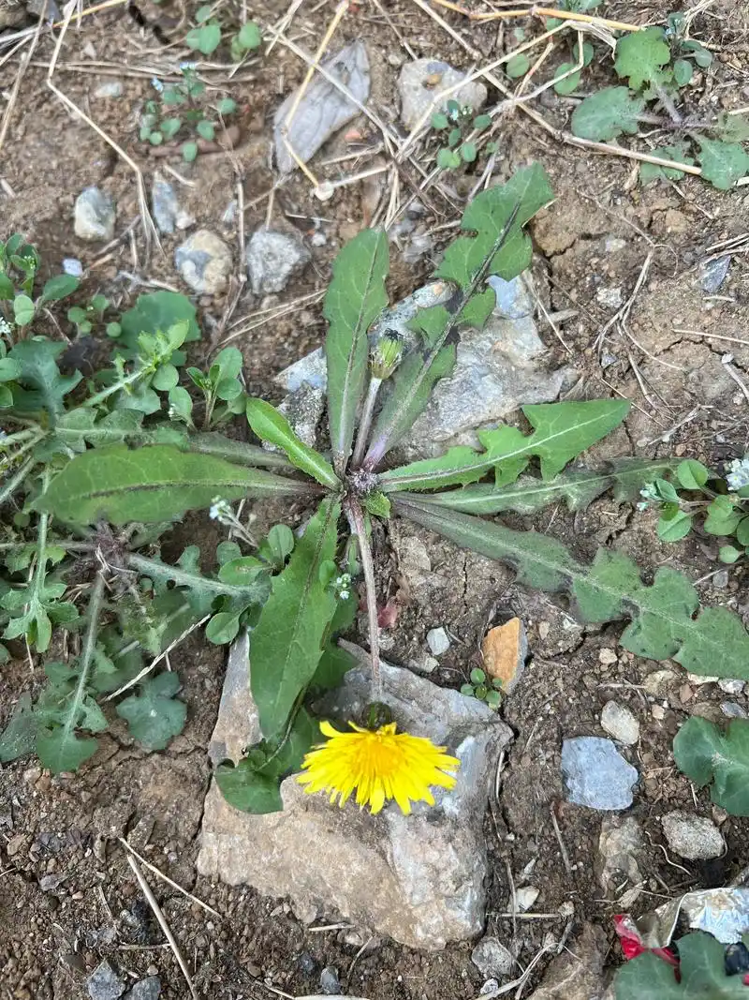
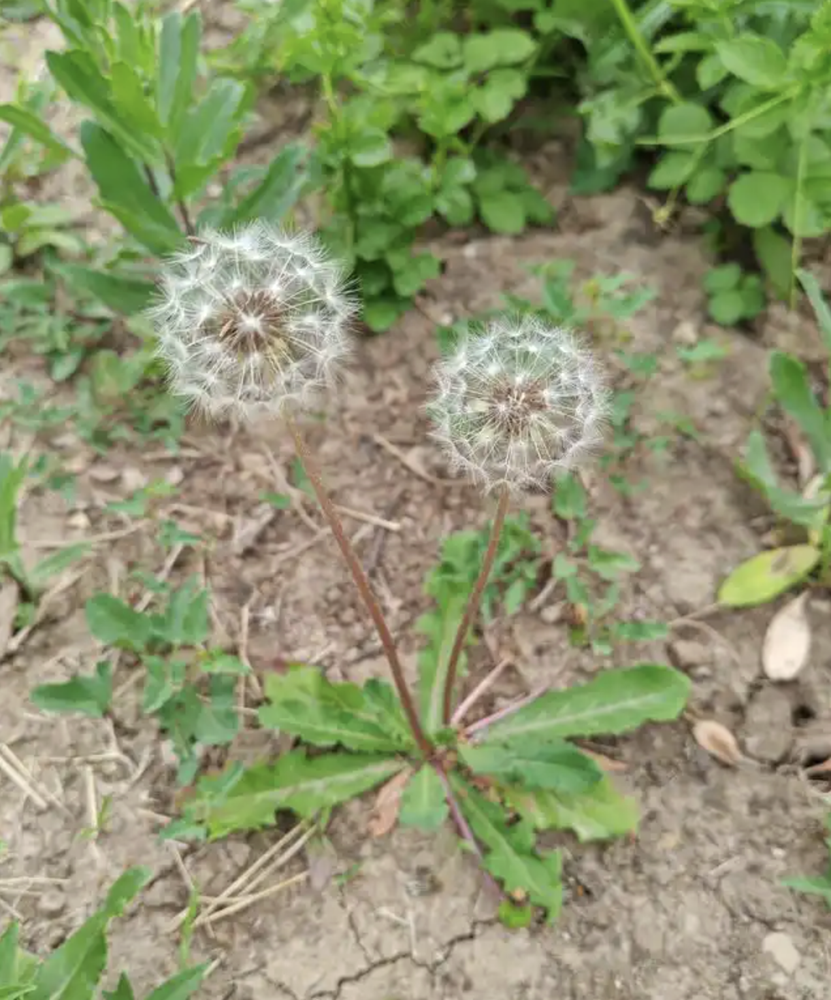

# 蒲公英

## 学名
蒲公英

## 别名
婆婆丁、黄花地丁、黄花苗、奶汁草

## 所属科目
菊科蒲公英属

## 采摘季节
春季 3-5 月和秋季 9-10 月，以早春嫩叶最佳

## 生长海拔
50-4000 米

## 生长环境
适应性极强，喜温暖湿润气候，生于山坡草地、路旁、田野、河岸沙地，稍潮湿的盐碱地或原野上均可生长

## 常见地点
成都平原及周边山区路旁、草地、田野普遍分布

## 食用部位
嫩叶、花、根

## 食用方式
嫩叶可凉拌（不用焯水，直接加调料拌匀）、炒食、做汤、蘸酱；花可油炸或做汤；根可晒干泡茶。也可与绿茶、甘草、蜂蜜一起泡茶饮用

## 药用价值

性味苦、甘、寒，**归肝、胃经**。

具有清热解毒、消肿散结、利尿通淋的功效，对急性乳腺炎、淋巴腺炎、疔疮肿毒、急性结膜炎、感冒发热、胃炎、肝炎、胆囊炎、尿路感染等有辅助治疗作用，素有"疮家之最"的美称

## 药用方式
内服煎汤，干品 10-30 克，鲜品 30-60 克；外用捣烂敷患处治疗疔疮肿毒；根晒干泡茶可清肝利胆

**重要提示**：

以上药用方式仅供参考，不可替代专业医疗建议。如有疾病或不适，请咨询专业中医师或医疗机构，切勿自行诊断和用药

## 存储方式
- 冷冻存储: 洗净后直接分袋冷冻，可保存 3-4 个月
- 晒干泡茶: 洗净后自然晾干或烘干，密封保存，可保存 1 年以上
- 腌制存储: 洗净后加盐腌制 2-3 天，可保存 1-2 个月

## 注意事项
脾胃虚寒、阳虚外寒者不宜服用；用量不宜过大，过量可致轻度腹泻；采摘时注意识别，蒲公英叶片呈羽状深裂，有白色乳汁；避免在污染区域采摘

## 参考资料
- 百度百科: https://baike.baidu.com/item/%E8%92%B2%E5%85%AC%E8%8B%B1
- 维基百科: https://zh.wikipedia.org/wiki/%E8%92%B2%E5%85%AC%E8%8B%B1
- 中国植物志: http://www.iplant.cn/info/%E8%92%B2%E5%85%AC%E8%8B%B1

## 相关菜谱

### 凉拌蒲公英

**食材**：
- 蒲公英嫩叶 200克
- 蒜末、香油、生抽、醋、盐适量

**做法**：
1. 蒲公英洗净，直接加调料拌匀（不需焯水）
2. 加入蒜末、生抽、醋、盐、香油
3. 拌匀后静置5分钟入味即可

**特点**：
清爽微苦，清热解毒

---

### 蒲公英茶

**食材**：
- 蒲公英根或叶 适量
- 绿茶、甘草、蜂蜜（可选）

**做法**：
1. 蒲公英根洗净晒干
2. 与绿茶、甘草一起泡茶
3. 可加蜂蜜调味

**特点**：
清肝利胆，消炎解毒

---

### 蒲公英炒鸡蛋

**食材**：
- 蒲公英嫩叶 150克
- 鸡蛋 3个
- 盐、食用油适量

**做法**：
1. 蒲公英洗净切碎
2. 鸡蛋打散，加入蒲公英和盐拌匀
3. 热锅凉油，倒入蛋液炒至凝固

**特点**：
营养丰富，清热明目

## 相关图片

