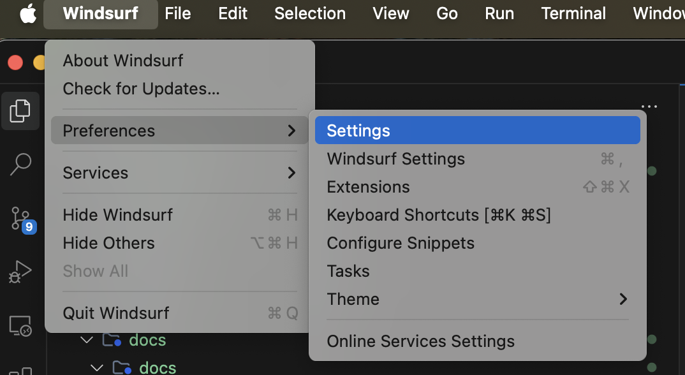
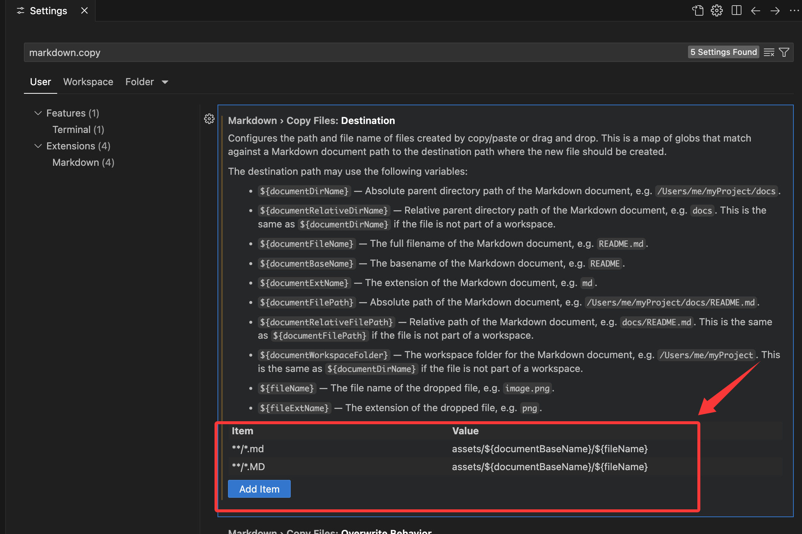

`VSCode`或者任何基于`VSCode`的编辑器，如`Windsurf`、`Cursor`等，设置将截图粘贴到`Markdown`文件时，自动将图片文件保存到指定的`Markdown`截图文件存放路径。

1. 打开`Settings`
    

2. 输入`markdown.copy`, 找到 `Markdown> Copy Files:Destination`
3. 新增项:
    - Key为: `**/*.md`, Value为目标路径：`assets/${documentBaseName}/${fileName}`
    - Key为: `**/*.MD`, Value为目标路径：`assets/${documentBaseName}/${fileName}`
    
