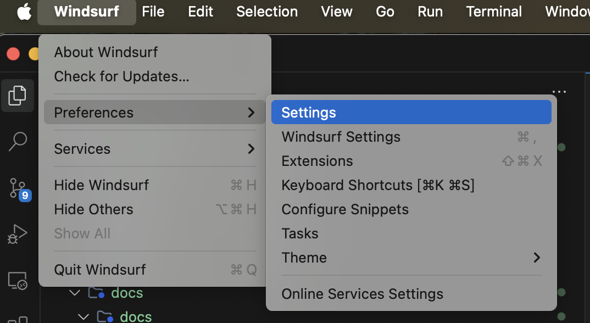
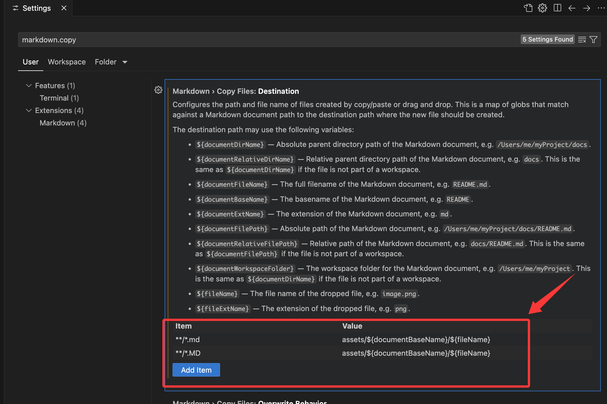

1. 打开`Settings`
    

2. 输入`markdown.copy`, 找到 `Markdown> Copy Files:Destination`
3. 新增项,:
    - Key为: `**/*.md`, value为目标路径：`assets/${documentBaseName}/${fileName}`
    - Key为: `**/*.MD`, value为目标路径：`assets/${documentBaseName}/${fileName}`
    
