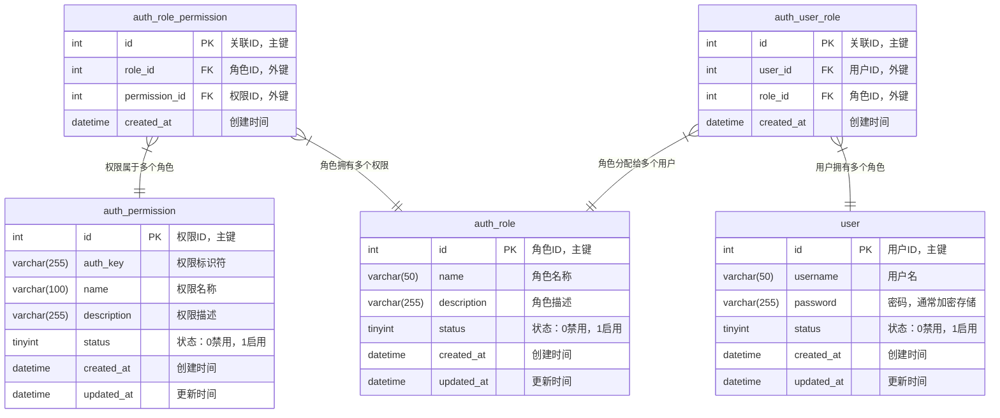

## 引言

在Web应用开发中，权限认证是保障系统安全的重要环节。一个设计良好的权限认证系统能够有效控制用户对资源的访问，防止未授权操作，同时保持代码的简洁和可维护性。本文将详细介绍如何在`GoFrame`框架中设计和实现一个高效的权限认证系统，不依赖复杂的第三方组件，而是利用`GoFrame`自身强大的功能特性。

## 1. 权限认证模块设计

### 1.1 数据表结构设计

设计一个简洁而功能完备的权限认证模块，首先需要规划好数据表结构。以下是我们的核心表设计：

#### 权限表（`auth_permission`）

| 字段名 | 类型 | 说明 |
| ------ | ------ | ------ |
| `id` | `int` | 主键 |
| `auth_key` | `varchar(255)` | 权限标识，例如`GET:/user/{id}`或`custom:permission_name` |
| `name` | `varchar(100)` | 权限名称 |
| `description` | `varchar(255)` | 权限描述 |
| `status` | `tinyint` | 状态：`0`=禁用，`1`=启用 |
| `created_at` | `datetime` | 创建时间 |
| `updated_at` | `datetime` | 更新时间 |

#### 角色表（`auth_role`）  

| 字段名 | 类型 | 说明 |
| ------ | ------ | ------ |
| `id` | `int` | 主键 |
| `name` | `varchar(50)` | 角色名称 |
| `description` | `varchar(255)` | 角色描述 |
| `status` | `tinyint` | 状态：`0`=禁用，`1`=启用 |
| `created_at` | `datetime` | 创建时间 |
| `updated_at` | `datetime` | 更新时间 |

#### 角色-权限关联表（`auth_role_permission`）

| 字段名 | 类型 | 说明 |
| ------ | ------ | ------ |
| `id` | `int` | 主键 |
| `role_id` | `int` | 角色ID |
| `permission_id` | `int` | 权限ID |
| `created_at` | `datetime` | 创建时间 |

#### 用户-角色关联表（`auth_user_role`）

| 字段名 | 类型 | 说明 |
| ------ | ------ | ------ |
| `id` | `int` | 主键 |
| `user_id` | `int` | 用户ID |
| `role_id` | `int` | 角色ID |
| `created_at` | `datetime` | 创建时间 |

这种设计有以下几个优点：

1. 通过`auth_key`字段统一管理**接口权限**和**自定义权限**，接口权限格式为`HTTP方法:/路由路径`，自定义权限格式为`custom:权限名称`。
2. 采用`RBAC`（基于角色的访问控制）模型，用户通过角色关联到权限，便于权限管理。
3. 表结构简洁，易于理解和维护。

#### 数据表关联关系图

以下是权限认证模块的数据表关联关系图，直观展示了各表之间的关系：



从图中可以看出，用户（`user`）通过用户角色关联表（`auth_user_role`）与角色（`auth_role`）关联，角色通过角色权限关联表（`auth_role_permission`）与权限（`auth_permission`）关联。这种多对多的关系设计使得权限管理更加灵活，一个用户可以拥有多个角色，一个角色可以拥有多个权限。

### 1.2 权限认证模块核心功能

权限认证模块需要提供以下核心功能：

1. **权限验证**：检查用户是否拥有特定权限
2. **权限管理**：添加、修改、删除权限
3. **角色管理**：添加、修改、删除角色，以及角色与权限的关联
4. **用户角色**：管理用户与角色的关联

## 2. 利用路由信息增强权限管理

`GoFrame`框架提供了丰富的路由信息获取方式，这为我们实现灵活的权限认证提供了强大支持。


在`GoFrame`中，我们可以通过`GetServeHandler`方法获取当前请求的路由处理函数，并从中获取路由信息：

```go
func (m *MiddlewareAuth) authMiddleware(r *ghttp.Request) {
    var (
        handler = r.GetServeHandler()         // 获取当前路由处理函数
        route   = handler.Handler.Router.Uri  // 当前请求路由
        method  = r.Method                    // 当前请求方法
    )

    // 进行权限验证...
}
```

其中，`GetServeHandler`方法获取到的路由函数的定义如下：

```go
type HandlerItemParsed struct {
    Handler *HandlerItem      // 路由函数管理对象
    Values  map[string]string // 当前请求的路由参数
}
```

这种方式的优势在于：

1. 可以获取到路由注册时的原始路由信息，而不是请求时的实际路径
2. 支持路由参数模式匹配，如`/user/{id}`而不是`/user/1`
3. 便于实现统一的权限管理，因为权限表中存储的是路由模式而非实际请求路径

## 3. 通过中间件实现权限认证

`GoFrame`的中间件机制为实现权限认证提供了理想的切入点。
我们可以创建一个权限认证中间件，在请求处理前进行权限验证。

### 3.1 权限认证中间件实现

```go
type MiddlewareAuth struct {
    db *gdb.DB // 数据库操作对象
}

func NewMiddlewareAuth() *MiddlewareAuth {
    return &MiddlewareAuth{
        db: g.DB(),
    }
}

func (m *MiddlewareAuth) Auth(r *ghttp.Request) {
    // 获取当前用户ID（假设已经通过JWT、Session等方式认证）
    userId := r.GetCtxVar("userId").Int()
    if userId == 0 {
        r.Response.WriteJson(ghttp.DefaultHandlerResponse{
            Code:    errcode.Unauthorized.Code(),
            Message: errcode.Unauthorized.Message(),
        })
        return
    }
    
    var (
        handler = r.GetServeHandler()         // 获取当前路由处理函数
        route   = handler.Handler.Router.Uri  // 默认使用实际请求路径
        method  = r.Method                    // 默认使用实际请求方法
    )
    
    // 查询用户是否有接口权限
    hasPermission, err := m.checkUserApiPermission(userId, route, method)
    if err != nil {
        r.Response.WriteJson(ghttp.DefaultHandlerResponse{
            Code:    errcode.ServerError.Code(),
            Message: errcode.ServerError.Message(),
        })
        return
    }
    
    if !hasPermission {
        r.Response.WriteJson(ghttp.DefaultHandlerResponse{
            Code:    errcode.PermissionDenied.Code(),
            Message: errcode.PermissionDenied.Message(),
        })
        return
    }
    
    r.Middleware.Next()
}

// 检查用户是否拥有指定接口权限
func (m *MiddlewareAuth) checkUserApiPermission(userId int, route, method string) (bool, error) {
    authKey := fmt.Sprintf("%s:%s", strings.ToLower(method), route)
    return m.db.Model("auth_permission p").
        Fields("1").
        LeftJoin("auth_role_permission rp", "p.id=rp.permission_id").
        LeftJoin("auth_user_role ur", "rp.role_id=ur.role_id").
        Where("ur.user_id", userId).
        Where("p.auth_key", authKey).
        Where("p.status", 1).
        Exist()
}
```

> 通常权限认证会封装到独立的业务模块中，如`auth`模块，而这里的中间件只是调用`auth`模块中的方法来实现接口权限认证。为简化示例，这里直接在中间件中实现权限认证逻辑。


### 3.2 注册中间件

在`GoFrame`应用中注册权限认证中间件：

```go
func main() {
    s := g.Server()
    
    // 创建权限认证中间件
    authMiddleware := NewMiddlewareAuth()
    
    // 全局中间件
    s.Use(ghttp.MiddlewareHandlerResponse)

    // 需要权限认证的路由组
    s.Group("/api", func(group *ghttp.RouterGroup) {
        // 添加JWT认证中间件（假设已实现）
        group.Middleware(JWTAuth)
        // 添加权限认证中间件
        group.Middleware(authMiddleware.Auth)
        
        // 注册控制器
        group.Bind(
            controller.User,
            controller.Order,
            // 其他控制器...
        )
    })

    // 启动服务
    s.Run()
}
```

## 4. 后台权限设置与路由展示

在权限管理系统中，一个常见的需求是在后台展示所有已注册的路由，便于管理员设置角色权限。`GoFrame`提供了便捷的方法来获取所有注册的路由信息，极大简化了权限管理的复杂度。

### 4.1 使用`GetRoutes`获取完整路由列表

`GoFrame`的`HTTP Server`提供了`GetRoutes`方法，可以获取所有已注册的路由信息。这些信息可以在后台权限设置页面展示，便于管理员为角色分配权限。

`GoFrame`的`GetRoutes`方法返回的是`[]RouterItem`类型的数据，其中`RouterItem`的结构包含以下字段：

| 字段名称 | 类型 | 说明 |
| --- | --- | --- |
| `Handler` | `*HandlerItem` | 路由函数 |
| `Server` | `string` | 服务器名称 |
| `Address` | `string` | 监听地址 |
| `Domain` | `string` | 绑定的域名 |
| `Type` | `HandlerType` | 路由处理类型（`middleware`、`hook`等） |
| `Middleware` | `string` | 绑定的中间件 |
| `Method` | `string` | HTTP请求方法（`GET`、`POST`等） |
| `Route` | `string` | 路由`URI`路径（例如：`/api/v1/user/{id}`） |
| `Priority` | `int` | 优先级（内部使用，用于路由优先级覆盖） |
| `IsServiceHandler` | `bool` | 是否为服务处理函数 |

在实际应用中，我们通常会关注以下几个关键字段：

- `Method`: HTTP请求方法，如`GET`、`POST`、`PUT`、`DELETE`等
- `Route`: 路由路径，如`/api/v1/user/{id}`
- `Domain`: 域名信息，如果有多域名部署时非常有用
- `Type`: 路由类型，可以区分`middleware`、`hook`、`handler`等
- `IsServiceHandler`: 是否为服务处理函数，通常我们只关注值为`true`的路由

这些信息可以帮助我们在后台权限设置页面展示更加详细的路由信息，便于管理员理解和设置权限。在实际开发中，我们可以根据需要将这些信息转换为前端易于展示的格式。

### 4.2 获取路由分组与描述信息

在展示路由列表的时候，我们通常还需要获取到路由的分组信息和描述信息，用于更友好的界面展示和路由管理。这些扩展的路由信息，我们可以从接口定义的元数据中获取。

#### 接口元数据的定义

`GoFrame`支持在`API`输入结构体中通过`g.Meta`标签定义元数据，例如：

```go
type GetUserReq struct {
    g.Meta `path:"/user/{id}" tags:"User" method:"get" summary:"Get user list with basic info."`
    Id   int `dc:"User ID"`
}
```

在这个结构体中，`g.Meta`标签包含了路由路径、HTTP方法、API标签和摘要等元数据信息。这些元数据可以在路由注册时被`GoFrame`框架使用，也可以在权限认证中被利用。在接口定义的元数据中，我们着重关注两个元数据：`tags`字段用于标识接口分组，`summary`字段用于描述接口的功能。更多的元数据介绍请参考开发文档相关章节。

#### 获取分组与描述信息

在`GoFrame`中，我们可以通过`HandlerItem`的`GetMetaTag`方法获取接口定义的元数据信息。以下是一个完整的示例，展示如何获取路由列表并包含元数据信息：

```go
func (c *Controller) GetRoutesWithMeta(ctx context.Context, req *GetRoutesWithMetaReq) (*GetRoutesWithMetaRes, error) {
    // 获取所有路由信息
    var routes = r.Server.GetRoutes() 
    // 处理路由信息，转换为前端易于展示的格式
    for _, route := range routes {
        // 跳过一些特殊路由，如中间件、钩子函数等
        if !route.IsServiceHandler {
            continue
        }
        // 获取路由的元数据信息
        var (
            tags    = route.Handler.GetMetaTag("tags")    // 标签/分组
            summary = route.Handler.GetMetaTag("summary") // 简要描述
        )
        // 组织返回数据结构...
    }
    // 返回结果...
}
```

这样，我们就可以获取到每个路由的分组和描述信息，在前端展示时可以按照分组进行组织，并显示更加友好的描述信息。

### 4.3 权限设置流程

在后台权限管理中，我们可以实现以下流程来设置角色权限：

1. **展示路由列表**：使用`GetRoutes`方法获取所有路由，并在后台页面展示
2. **权限选择**：管理员可以为角色选择需要的权限（对应的路由列表）
3. **权限保存**：将选择的权限保存到数据库中

## 5. 自定义权限的实现

除了接口权限外，我们的设计还支持自定义权限，这对于一些特殊的业务逻辑非常有用。

### 5.1 自定义权限的定义和使用

自定义权限的`auth_key`格式为"custom:permission_name"，例如"custom:manage_users"、"custom:export_data"等。

在业务代码中，可以这样验证自定义权限：

```go
func (s *userService) ExportUserData(ctx context.Context, userId int) (string, error) {
    // 验证用户是否有导出数据的权限
    hasPermission, err := s.authService.CheckUserPermission(ctx, userId, "custom:export_data")
    if err != nil {
        return "", err
    }
    if !hasPermission {
        return "", gerror.New("没有导出数据的权限")
    }
    
    // 执行导出逻辑...
    return "导出的数据路径", nil
}
```

### 5.2 权限验证服务

为了方便在业务代码中验证权限，我们可以实现一个权限验证服务：

```go
type AuthService struct {
    db *gdb.DB
}

func NewAuthService() *AuthService {
    return &AuthService{
        db: g.DB(),
    }
}

// 检查用户是否拥有指定权限
func (s *AuthService) CheckUserPermission(ctx context.Context, userId int, authKey string) (bool, error) {
    var count int
    err := s.db.Model("auth_permission p").Fields("1").
        LeftJoin("auth_role_permission rp", "p.id=rp.permission_id").
        LeftJoin("auth_user_role ur", "rp.role_id=ur.role_id").
        Where("ur.user_id=?", userId).
        Where("p.auth_key=?", authKey).
        Where("p.status=?", 1).
        Count(&count)
    
    return count > 0, err
}
```

## 6. 实战案例与最佳实践

### 6.1 实战案例：用户管理系统

以下是一个用户管理系统的权限设计示例：

**角色设计**

1. 超级管理员：拥有所有权限
2. 用户管理员：管理普通用户
3. 内容管理员：管理内容和评论
4. 普通用户：基本操作权限

**权限设计**

接口权限：
- GET:/user/list - 查看用户列表
- POST:/user/create - 创建用户
- PUT:/user/{id} - 更新用户信息
- DELETE:/user/{id} - 删除用户
- GET:/content/list - 查看内容列表
- POST:/content/create - 创建内容
- PUT:/content/{id} - 更新内容
- DELETE:/content/{id} - 删除内容

自定义权限：
- custom:manage_users - 管理用户的高级权限
- custom:manage_content - 管理内容的高级权限
- custom:export_data - 导出数据权限

**角色-权限关联**

1. 超级管理员：所有权限
2. 用户管理员：GET:/user/list, POST:/user/create, PUT:/user/{id}, DELETE:/user/{id}, custom:manage_users
3. 内容管理员：GET:/content/list, POST:/content/create, PUT:/content/{id}, DELETE:/content/{id}, custom:manage_content
4. 普通用户：GET:/user/list, GET:/content/list

### 6.2 最佳实践

1. **权限粒度控制**：根据实际业务需求设计合适的权限粒度，过细会增加管理难度，过粗则无法满足精细化控制需求。

2. **权限缓存**：对于频繁访问的权限信息，可以使用缓存提高性能：

```go
func (s *AuthService) CheckUserPermission(ctx context.Context, userId int, authKey string) (bool, error) {
    // 缓存键
    cacheKey := fmt.Sprintf("user:permission:%d:%s", userId, authKey)
    
    // 尝试从缓存获取
    if v := gcache.Get(cacheKey); v != nil {
        return v.Bool(), nil
    }
    
    // 从数据库查询
    var count int
    err := s.db.Model("auth_permission p").Fields("1").
        LeftJoin("auth_role_permission rp", "p.id=rp.permission_id").
        LeftJoin("auth_user_role ur", "rp.role_id=ur.role_id").
        Where("ur.user_id=?", userId).
        Where("p.auth_key=?", authKey).
        Where("p.status=?", 1).
        Count(&count)
    
    if err != nil {
        return false, err
    }
    
    // 缓存结果（设置过期时间为10分钟）
    gcache.Set(cacheKey, count > 0, 10*60*1000)
    
    return count > 0, nil
}
```

3. **权限预加载**：用户登录后，可以一次性加载该用户的所有权限到缓存，减少数据库查询：

```go
func (s *AuthService) LoadUserPermissions(ctx context.Context, userId int) error {
    // 查询用户所有权限
    var permissions []string
    err := s.db.Model("auth_permission p").Fields("p.auth_key").
        LeftJoin("auth_role_permission rp", "p.id=rp.permission_id").
        LeftJoin("auth_user_role ur", "rp.role_id=ur.role_id").
        Where("ur.user_id=?", userId).
        Where("p.status=?", 1).
        Scan(&permissions)
    
    if err != nil {
        return err
    }
    
    // 缓存用户权限集合
    cacheKey := fmt.Sprintf("user:permissions:%d", userId)
    gcache.Set(cacheKey, permissions, 30*60*1000) // 30分钟过期
    
    return nil
}
```

4. **权限更新策略**：当权限发生变更时，及时清除相关缓存：

```go
func (s *AuthService) ClearUserPermissionCache(userId int) {
    // 清除用户权限集合缓存
    cacheKey := fmt.Sprintf("user:permissions:%d", userId)
    gcache.Remove(cacheKey)
    
    // 也可以使用模式匹配清除所有相关缓存
    pattern := fmt.Sprintf("user:permission:%d:*", userId)
    // 假设有实现模式匹配的缓存清除方法
    gcache.RemovePattern(pattern)
}
```

5. **路由权限自动更新**：在开发环境中，可以启用自动更新权限表功能；在生产环境中，可以考虑手动确认后再更新，避免误操作。

## 7. 总结

本文介绍了如何在GoFrame框架中设计和实现一个高效的权限认证系统。通过合理的数据表设计、利用GoFrame的元数据功能、中间件机制和Plugin接口，我们实现了一个功能完备且易于维护的权限认证模块。

该权限认证系统具有以下特点：

1. 支持接口权限和自定义权限的统一管理
2. 基于RBAC模型，实现用户、角色、权限的灵活关联
3. 利用GoFrame的元数据功能，实现自动化的权限验证
4. 通过中间件机制，在请求处理前进行权限验证
5. 通过Plugin接口，实现权限表的自动更新

在实际应用中，可以根据业务需求进一步扩展和优化该权限认证系统，如添加权限组、实现更复杂的权限规则、优化缓存策略等。

希望本文能对你在GoFrame框架中实现权限认证有所帮助！
