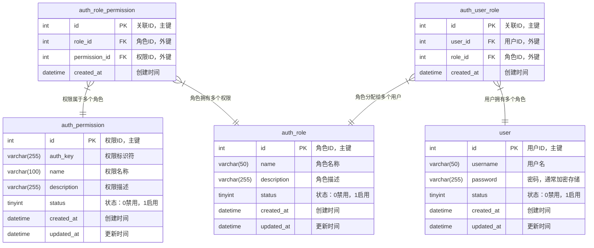

## 1. 引言

在`Web`应用开发中，权限认证是保障系统安全的重要环节。一个设计良好的权限认证系统能够有效控制用户对资源的访问，防止未授权操作，同时保持代码的简洁和可维护性。随着应用规模的扩大和业务复杂度的提升，权限管理变得越来越重要且具有挑战性。

本文将详细介绍如何在`GoFrame`框架中设计和实现一个高效的权限认证系统，不依赖复杂的第三方组件，而是利用`GoFrame`自身强大的功能特性，如中间件机制、元数据功能。通过本文的学习，你将能够掌握权限认证的核心概念并学会如何在实际项目中应用这些技术。

## 2. 使用中间件实现鉴权

在开始设计具体的权限认证模块之前，我们先来介绍如何使用统一的中间件来实现鉴权。中间件是`GoFrame`框架中的一个强大特性，它允许我们在请求处理的不同阶段插入自定义逻辑，非常适合实现权限验证这类横切关注点的功能。通过中间件实现鉴权是一种更加灵活和可维护的方式，能够有效分离认证逻辑和业务逻辑。

### 2.1 传统的权限鉴权方式

在传统的`Web`应用开发中，权限鉴权通常通过将接口划分到不同的路由组中来实现，每个路由组应用不同的中间件来处理权限验证。例如：

```go
func main() {
    s := g.Server()
    
    // 公开接口，无需鉴权
    s.Group("/public", func(group *ghttp.RouterGroup) {
        group.Bind(
            controller.Login,
            controller.Register,
            // 其他公开接口...
        )
    })
    
    // 需要用户登录的接口
    s.Group("/api", func(group *ghttp.RouterGroup) {
        // 添加JWT认证中间件
        group.Middleware(middleware.JWTAuth)
        group.Bind(
            controller.User,
            controller.Order,
            // 其他需要登录的接口...
        )
    })
    
    // 需要管理员权限的接口
    s.Group("/admin", func(group *ghttp.RouterGroup) {
        // 添加JWT认证中间件
        group.Middleware(middleware.JWTAuth)
        // 添加管理员权限验证中间件
        group.Middleware(middleware.AdminAuth)
        group.Bind(
            controller.Admin,
            controller.System,
            // 其他管理员接口...
        )
    })
    
    s.Run()
}
```

这种方式存在以下问题：

1. **路由维护复杂**：当接口数量增多时，需要仔细考虑每个接口应该放在哪个路由组中。
2. **权限等级不灵活**：当需要为某些接口设置特殊权限时，可能需要创建新的路由组。
3. **维护成本高**：当接口权限需要调整时，可能需要在不同的路由组之间移动接口。
4. **代码重复**：不同的路由组可能需要重复定义类似的中间件逻辑。

### 2.2 基于元数据的权限鉴权

`GoFrame`提供了强大的接口元数据管理功能，可以大大提高接口维护效率，降低接口维护成本，特别是在接口数量较多的项目中。

元数据管理的主要优势包括：

1. **集中化管理**：所有接口的元数据在一个地方定义，便于维护和管理。
2. **接口文档自动生成**：基于元数据可以自动生成API文档。
3. **权限管理灵活**：可以在元数据中定义权限相关的信息，实现灵活的权限控制。

#### 2.2.1 `GoFrame`中的接口元数据管理

在`GoFrame`中，可以使用`g.Meta`标签来定义接口的元数据。例如：

```go
type LoginReq struct {
    g.Meta `path:"/login" method:"post" summary:"用户登录" tags:"Auth" noAuth:"true"`
    Username string `v:"required#请输入用户名" dc:"用户名"`
    Password string `v:"required#请输入密码" dc:"密码"`
}

type GetUserProfileReq struct {
    g.Meta `path:"/user/profile" method:"get" summary:"获取用户信息" tags:"User"`
    // 无需参数，从上下文中获取用户id
}

type AdminOperationReq struct {
    g.Meta `path:"/admin/operation" method:"post" summary:"管理员操作" tags:"Admin" role:"admin"`
    OperationType string `v:"required#请选择操作类型" dc:"操作类型"`
    // 其他参数...
}
```

在上面的例子中，我们在元数据中定义了两个与权限相关的字段：

- `noAuth:"true"`：表示该接口不需要进行权限验证。
- `role:"admin"`：表示该接口需要管理员角色才能访问。

#### 2.2.2 统一中间件实现权限鉴权

有了元数据的支持，我们可以实现一个统一的中间件来处理所有接口的权限鉴权：

```go
func AuthMiddleware(r *ghttp.Request) {
    // 获取当前路由处理函数
    handler := r.GetServeHandler()
    
    // 检查是否有noAuth元数据，如果有且值为true，则跳过验证
    noAuth := handler.GetMetaTag("noAuth")
    if noAuth == "true" {
        r.Middleware.Next()
        return
    }
    
    // 获取当前用户信息（从上下文或JWT、Session等中获取）
    userId := r.GetCtxVar("userId").Int()
    if userId == 0 {
        r.Response.WriteJson(ghttp.DefaultHandlerResponse{
            Code:    errcode.Unauthorized.Code(),
            Message: errcode.Unauthorized.Message(),
        })
        return
    }
    
    // 检查是否需要特定角色
    requiredRole := handler.GetMetaTag("role")
    if requiredRole != "" {
        // 检查用户是否有该角色
        hasRole, err := checkUserRole(userId, requiredRole)
        if err != nil || !hasRole {
            r.Response.WriteJson(ghttp.DefaultHandlerResponse{
                Code:    errcode.Forbidden.Code(),
                Message: errcode.Forbidden.Message(),
            })
            return
        }
    }

    // 其他权限验证逻辑...

    // 权限验证通过，继续处理请求
    r.Middleware.Next()
}

// 在主函数中注册全局中间件
func main() {
    s := g.Server()
    
    // 注册全局中间件，处理所有请求
    s.Use(AuthMiddleware)
    
    // 注册所有接口，不需要按权限分组
    s.Group("/api", func(group *ghttp.RouterGroup) {
        group.Bind(
            controller.Login,  // 包含无需验证的登录接口
            controller.User,   // 包含普通用户接口
            controller.Admin,  // 包含管理员接口
            // 其他接口...
        )
    })
    
    s.Run()
}
```

这种基于元数据的统一中间件方式有以下优点：

1. **简化路由管理**：所有接口可以注册在同一个路由组中，无需按权限分组。
2. **权限灵活配置**：权限控制直接在接口定义处配置，便于维护和理解。
3. **降低维护成本**：当需要调整接口权限时，只需修改元数据，无需移动接口位置。
4. **代码复用**：所有权限验证逻辑集中在一个中间件中，避免了代码重复。
5. **扩展性强**：可以轻松扩展新的权限控制策略，只需在中间件中添加相应的处理逻辑。

这种基于元数据的权限鉴权方式特别适合接口数量较多、权限控制需求较复杂的项目，可以显著提高开发效率和代码可维护性。


## 3. 权限认证系统实战

在上述章节中，我们探讨了基于元数据的统一中间件方式，这种方式在简单场景下非常有效。然而，在实际的企业级应用中，权限管理需求往往更加复杂和多样化。通过接口元数据硬编码的方式配置角色和权限信息存在以下局限性：

1. **灵活性不足**：当权限规则需要动态调整时，必须修改代码并重新部署应用。
2. **扩展性受限**：随着角色和权限数量的增加，元数据配置会变得冗长且难以维护。
3. **无法满足复杂业务需求**：大型系统中的权限控制通常需要基于用户属性、时间段、操作对象等多维度进行判断。
4. **缺乏权限管理界面**：管理员无法通过界面动态调整权限配置，必须依赖开发人员修改代码。
5. **审计和追踪困难**：难以记录和追踪权限变更历史，这在合规性要求严格的系统中尤为重要。

因此，在复杂的企业级应用中，我们需要设计一个独立的、基于数据库的权限认证模块。这种方式可以实现权限的动态配置、精细化控制和完整的审计追踪，满足企业级应用的安全需求。

接下来，我们将详细介绍如何设计和实现这样一个完善的权限认证模块，包括数据表设计、核心功能实现以及与`GoFrame`框架的集成方式。

### 3.1 数据表结构设计

设计一个完善的权限认证模块的第一步是规划合理的数据表结构。我们将采用基于角色的访问控制（RBAC）模型，这是一种广泛使用的权限管理模型，它将用户、角色和权限三者分离，通过角色将用户与权限关联起来。

以下是我们设计的核心数据表结构：

#### 3.1.1 权限表（`auth_permission`）

| 字段名 | 类型 | 说明 |
| ------ | ------ | ------ |
| `id` | `int` | 主键 |
| `auth_key` | `varchar(255)` | 权限标识，例如`get:/user/{id}`或`custom:permission_name` |
| `name` | `varchar(100)` | 权限名称 |
| `description` | `varchar(255)` | 权限描述 |
| `status` | `tinyint` | 状态：`0`=禁用，`1`=启用 |
| `created_at` | `datetime` | 创建时间 |
| `updated_at` | `datetime` | 更新时间 |

#### 3.1.2 角色表（`auth_role`）  

| 字段名 | 类型 | 说明 |
| ------ | ------ | ------ |
| `id` | `int` | 主键 |
| `name` | `varchar(50)` | 角色名称 |
| `description` | `varchar(255)` | 角色描述 |
| `status` | `tinyint` | 状态：`0`=禁用，`1`=启用 |
| `created_at` | `datetime` | 创建时间 |
| `updated_at` | `datetime` | 更新时间 |

#### 3.1.3 角色-权限关联表（`auth_role_permission`）

| 字段名 | 类型 | 说明 |
| ------ | ------ | ------ |
| `id` | `int` | 主键 |
| `role_id` | `int` | 角色ID |
| `permission_id` | `int` | 权限ID |
| `created_at` | `datetime` | 创建时间 |

#### 3.1.4 用户-角色关联表（`auth_user_role`）

| 字段名 | 类型 | 说明 |
| ------ | ------ | ------ |
| `id` | `int` | 主键 |
| `user_id` | `int` | 用户ID |
| `role_id` | `int` | 角色ID |
| `created_at` | `datetime` | 创建时间 |

这种设计有以下几个优点：

1. 通过`auth_key`字段统一管理**接口权限**和**自定义权限**，接口权限格式为`HTTP方法:/路由路径`，自定义权限格式为`custom:权限名称`。
2. 采用`RBAC`（基于角色的访问控制）模型，用户通过角色关联到权限，便于权限管理。
3. 表结构简洁，易于理解和维护。

#### 3.1.5 数据表关联关系图

以下是权限认证模块的数据表关联关系图，直观展示了各表之间的关系：



从图中可以看出，用户（`user`）通过用户角色关联表（`auth_user_role`）与角色（`auth_role`）关联，角色通过角色权限关联表（`auth_role_permission`）与权限（`auth_permission`）关联。这种多对多的关系设计使得权限管理更加灵活，一个用户可以拥有多个角色，一个角色可以拥有多个权限。

有了这些数据表作为基础，我们就可以构建一个功能完善的权限认证系统。接下来，我们将详细讲解这个权限认证模块的核心功能及其实现方式。

### 3.2 权限认证模块核心功能

基于上述数据表结构，我们的权限认证模块需要提供以下核心功能：

1. **权限验证**：检查用户是否拥有特定权限，这是整个模块的核心功能
2. **权限管理**：添加、修改、删除权限，包括接口权限和自定义权限
3. **角色管理**：添加、修改、删除角色，以及角色与权限的关联
4. **用户角色管理**：管理用户与角色的关联，实现用户权限的动态分配

### 3.3 利用路由信息增强权限管理

在实现权限验证功能时，我们需要知道当前请求的路由信息，以便与数据库中存储的权限进行匹配。幸运的是，`GoFrame`框架提供了丰富的路由信息获取方式，这为我们实现灵活的权限认证提供了强大支持。

在`GoFrame`中，我们可以通过`GetServeHandler`方法获取当前请求的路由处理函数，并从中获取路由信息：

```go
func (m *AuthMiddleware) Auth(r *ghttp.Request) {
    var (
        handler = r.GetServeHandler()         // 获取当前路由处理函数
        route   = handler.Handler.Router.Uri  // 当前请求路由
        method  = r.Method                    // 当前请求方法
    )

    // 进行权限验证...
}
```

其中，`GetServeHandler`方法获取到的路由函数的定义如下：

```go
type HandlerItemParsed struct {
    Handler *HandlerItem      // 路由函数管理对象
    Values  map[string]string // 当前请求的路由参数
}
```

这种方式的优势在于：

1. 可以获取到路由注册时的原始路由信息，而不是请求时的实际路径
2. 支持路由参数模式匹配，如`/user/{id}`而不是`/user/1`
3. 便于实现统一的权限管理，因为权限表中存储的是路由模式而非实际请求路径

### 3.4 通过中间件实现权限认证

`GoFrame`的中间件机制为实现权限认证提供了理想的切入点。
我们可以创建一个权限认证中间件，在请求处理前进行权限验证。

#### 3.4.1 权限验证服务

为了方便在业务代码中验证权限，我们需要实现一个独立的权限验证服务。这个服务将封装权限查询的底层逻辑，为业务模块提供简洁的权限检查接口：

```go
// 检查用户是否拥有指定接口权限
func (s *AuthService) CheckUserApiPermission(ctx context.Context, userId int, route, method string) (bool, error) {
    return s.CheckUserPermission(ctx, userId, fmt.Sprintf("%s:%s", strings.ToLower(method), route))
}

// 检查用户是否拥有指定权限
func (s *AuthService) CheckUserPermission(ctx context.Context, userId int, authKey string) (bool, error) {
    return s.db.Model("auth_permission p").Fields("1").
        LeftJoin("auth_role_permission rp", "p.id=rp.permission_id").
        LeftJoin("auth_user_role ur", "rp.role_id=ur.role_id").
        Where("ur.user_id=?", userId).
        Where("p.auth_key=?", authKey).
        Where("p.status=?", 1).
        Exist()
}
```

#### 3.4.2 权限认证中间件实现

```go
func (m *AuthMiddleware) Auth(r *ghttp.Request) {
    // 获取当前用户ID（假设已经通过JWT、Session等方式认证）
    userId := r.GetCtxVar("userId").Int()
    if userId == 0 {
        r.Response.WriteJson(ghttp.DefaultHandlerResponse{
            Code:    errcode.Unauthorized.Code(),
            Message: errcode.Unauthorized.Message(),
        })
        return
    }
    
    var (
        handler = r.GetServeHandler()         // 获取当前路由处理函数
        route   = handler.Handler.Router.Uri  // 默认使用实际请求路径
        method  = r.Method                    // 默认使用实际请求方法
    )
    
    // 查询用户是否有接口权限
    hasPermission, err := m.authService.CheckUserApiPermission(userId, route, method)
    if err != nil {
        r.Response.WriteJson(ghttp.DefaultHandlerResponse{
            Code:    errcode.ServerError.Code(),
            Message: errcode.ServerError.Message(),
        })
        return
    }
    
    if !hasPermission {
        r.Response.WriteJson(ghttp.DefaultHandlerResponse{
            Code:    errcode.PermissionDenied.Code(),
            Message: errcode.PermissionDenied.Message(),
        })
        return
    }
    
    // 权限验证通过，继续处理请求
    r.Middleware.Next()
}
```

#### 3.4.3 注册权限认证中间件

在`GoFrame`应用中注册权限认证中间件：

```go
func main() {
    s := g.Server()
    
    // 创建权限认证中间件
    authMiddleware := NewAuthMiddleware()
    
    // 全局中间件
    s.Use(ghttp.MiddlewareHandlerResponse)

    // 需要权限认证的路由组
    s.Group("/api", func(group *ghttp.RouterGroup) {
        // 添加JWT认证中间件（假设已实现）
        group.Middleware(JWTAuth)
        // 添加权限认证中间件
        group.Middleware(authMiddleware.Auth)
        
        // 注册控制器
        group.Bind(
            controller.User,
            controller.Order,
            // 其他控制器...
        )
    })

    // 启动服务
    s.Run()
}
```

通过上述中间件实现，我们已经完成了权限认证的基本功能。然而，要构建一个完整的权限管理系统，我们还需要一个后台管理界面，允许管理员动态配置角色和权限。

### 3.5 后台权限设置与路由展示

在权限管理系统中，一个关键的功能是在后台展示所有已注册的路由，便于管理员为不同角色设置相应的权限。这一功能的实现往往比较复杂，因为需要获取所有路由信息并将其以用户友好的方式展示出来。幸运的是，`GoFrame`提供了便捷的方法来获取所有注册的路由信息，极大简化了这一过程。

#### 3.5.1 使用`GetRoutes`获取完整路由列表

`GoFrame`的`HTTP Server`提供了`GetRoutes`方法，可以获取所有已注册的路由信息。这些信息可以在后台权限设置页面展示，便于管理员为角色分配权限。

`GoFrame`的`GetRoutes`方法返回的是`[]RouterItem`类型的数据，其中`RouterItem`的结构包含以下字段：

| 字段名称 | 类型 | 说明 |
| --- | --- | --- |
| `Handler` | `*HandlerItem` | 路由函数 |
| `Server` | `string` | 服务器名称 |
| `Address` | `string` | 监听地址 |
| `Domain` | `string` | 绑定的域名 |
| `Type` | `HandlerType` | 路由处理类型（`middleware`、`hook`等） |
| `Middleware` | `string` | 绑定的中间件 |
| `Method` | `string` | HTTP请求方法（`GET`、`POST`等） |
| `Route` | `string` | 路由`URI`路径（例如：`/api/v1/user/{id}`） |
| `IsServiceHandler` | `bool` | 是否为服务处理函数 |

在实际应用中，我们通常会关注以下几个关键字段：

- `Method`: HTTP请求方法，如`GET`、`POST`、`PUT`、`DELETE`等
- `Route`: 路由路径，如`/api/v1/user/{id}`
- `IsServiceHandler`: 是否为服务处理函数，通常我们只关注值为`true`的路由

这些信息可以帮助我们在后台权限设置页面展示更加详细的路由信息，便于管理员理解和设置权限。在实际开发中，我们可以根据需要将这些信息转换为前端易于展示的格式。

#### 3.5.2 获取路由分组与描述信息

在展示路由列表的时候，我们通常还需要获取到路由的分组信息和描述信息，用于更友好的界面展示和路由管理。这些扩展的路由信息，我们可以从接口定义的元数据中获取。

#### 3.5.3 接口元数据的定义

`GoFrame`支持在`API`输入结构体中通过`g.Meta`标签定义元数据，例如：

```go
type GetUserReq struct {
    g.Meta `path:"/user/{id}" tags:"User" method:"get" summary:"Get user list with basic info."`
    Id   int `dc:"User ID"`
}
```

在这个结构体中，`g.Meta`标签包含了路由路径、`HTTP`方法、`API`标签和摘要等元数据信息。这些元数据可以在路由注册时被`GoFrame`框架使用，也可以在权限认证中被利用。在接口定义的元数据中，我们着重关注两个元数据：
- `tags`字段用于标识接口分组。
- `summary`字段用于描述接口的功能。

更多的元数据介绍请参考开发文档相关章节。

#### 3.5.4 获取分组与描述信息

在`GoFrame`中，我们可以通过`HandlerItem`的`GetMetaTag`方法获取接口定义的元数据信息。以下是一段示例代码，展示如何获取路由列表并包含元数据信息：

```go
func (c *Controller) GetRoutesWithMeta(ctx context.Context, req *GetRoutesWithMetaReq) (*GetRoutesWithMetaRes, error) {
    // 获取所有路由信息
    var routes = r.Server.GetRoutes() 
    // 处理路由信息，转换为前端易于展示的格式
    for _, route := range routes {
        // 跳过一些特殊路由，如中间件、钩子函数等
        if !route.IsServiceHandler {
            continue
        }
        // 获取路由的元数据信息
        var (
            tags    = route.Handler.GetMetaTag("tags")    // 标签/分组
            summary = route.Handler.GetMetaTag("summary") // 简要描述
        )
        // 组织返回数据结构...
    }
    // 返回结果...
}
```

这样，我们就可以获取到每个路由的分组和描述信息，在前端展示时可以按照分组进行组织，并显示更加友好的描述信息。

#### 3.5.5 权限设置流程

在后台权限管理中，我们可以实现以下流程来设置角色权限：

1. **展示路由列表**：使用`GetRoutes`方法获取所有路由，并在后台页面展示
2. **权限选择**：管理员可以为角色选择需要的权限（对应的路由列表）
3. **权限保存**：将选择的权限保存到数据库中

### 3.6 自定义权限的实现

在前面的章节中，我们主要讨论了基于路由的接口权限控制。然而，在实际应用中，权限控制并不仅限于路由访问。我们常常需要控制用户对特定功能或操作的权限，例如导出数据、管理用户、审核内容等。这些权限与具体的`API`路由不直接对应，需要单独定义和管理。

因此，除了接口权限外，我们的设计还支持自定义权限，这对于实现精细化的权限控制非常有用。

#### 3.6.1 自定义权限的定义和使用

为了区分接口权限和自定义权限，我们在权限标识上采用不同的命名规则。自定义权限的`auth_key`格式为`custom:permission_name`，例如`custom:manage_users`、`custom:export_data`等。这种命名方式便于在权限表中区分不同类型的权限。

在业务代码中，可以这样验证自定义权限：

```go
func (s *userService) ExportUserData(ctx context.Context, userId int) (string, error) {
    // 验证用户是否有导出数据的权限
    hasPermission, err := s.authService.CheckUserPermission(ctx, userId, "custom:export_data")
    if err != nil {
        return "", err
    }
    if !hasPermission {
        return "", gerror.New("没有导出数据的权限")
    }
    
    // 执行导出逻辑...
    return "导出的数据路径", nil
}
```


## 6. 一些最佳实践建议

### 6.1 权限粒度控制

根据实际业务需求设计合适的权限粒度，过细会增加管理难度，过粗则无法满足精细化控制需求。

### 6.2 使用权限缓存

对于频繁访问的权限信息，可以使用缓存提高性能：

```go
func (s *AuthService) CheckUserPermission(ctx context.Context, userId int, authKey string) (bool, error) {
    // 使用ORM缓存功能查询
    var (
        cacheKey  = fmt.Sprintf("user_perm_%d_%s", userId, authKey)
        authModel = s.db.Model("auth_permission p").Fields("1").
                    LeftJoin("auth_role_permission rp", "p.id=rp.permission_id").
                    LeftJoin("auth_user_role ur", "rp.role_id=ur.role_id").
                    Where("ur.user_id=?", userId).
                    Where("p.auth_key=?", authKey).
                    Where("p.status=?", 1).
                    Cache(gdb.CacheOption{
                        Duration: 10 * time.Minute, // 缓存时间10分钟
                        Name:     cacheKey,         // 缓存键名称
                        Force:    false,            // 非强制使用缓存，如果缓存不存在则从数据库查询
                    })
    )
    return authModel.Exist()
}
```

### 6.3 权限预加载

用户登录后，可以一次性加载该用户的所有权限到缓存，减少数据库查询。根据缓存过期的策略设计，缓存可以选择`GoFrame`提供的两种组件来实现：
- `gmap`库实现：线程安全，适合在内存中长期存储缓存数据，不过期，或自行定期清理。
- `gcache`库实现：线程安全，适合在内存中短期存储缓存数据，可以设置过期时间。

以下是使用`gcache`组件实现权限缓存的示例代码：

```go
// 加载用户权限到缓存
func (s *AuthService) LoadUserPermissions(ctx context.Context, userId int) error {
    // 查询用户所有权限
    perms, err := s.db.Model("auth_permission p").Fields("p.auth_key").
        LeftJoin("auth_role_permission rp", "p.id=rp.permission_id").
        LeftJoin("auth_user_role ur", "rp.role_id=ur.role_id").
        Where("ur.user_id=?", userId).
        Where("p.status=?", 1).
        Array()
    if err != nil {
        return err
    }
    
    // 将权限列表转换为map，提高检索效率
    permMap := make(map[string]bool)
    for _, perm := range perms {
        permMap[perm.String()] = true
    }
    
    // s.permCache为gcache.Cache对象
    // 将权限map存入缓存，设置30分钟过期时间
    s.permCache.Set(fmt.Sprintf("perm:%d", userId), permMap, 30*time.Minute)
    return nil
}

// 使用缓存检查用户权限
func (s *AuthService) CheckUserPermissionFast(ctx context.Context, userId int, authKey string) (bool, error) {
    // 缓存键
    cacheKey := fmt.Sprintf("perm:%d", userId)
    
    // 尝试从缓存获取用户权限map
    if v := s.permCache.Get(cacheKey); v != nil {
        if permMap, ok := v.(map[string]bool); ok {
            // 直接从权限map中检查，时间复杂度O(1)
            return permMap[authKey], nil
        }
    }
    
    // 缓存不存在，先加载权限
    if err := s.LoadUserPermissions(ctx, userId); err != nil {
        return false, err
    }
    
    // 重新从缓存获取
    if v := s.permCache.Get(cacheKey); v != nil {
        if permMap, ok := v.(map[string]bool); ok {
            return permMap[authKey], nil
        }
    }
    
    // 如果还是不存在，回退到数据库查询
    return s.CheckUserPermission(ctx, userId, authKey)
}
```

### 6.4 权限更新策略

当权限发生变更时，及时清除相关缓存，这种方式适合使用分布式的的缓存管理服务，例如`Redis`。

```go
// 清除用户权限缓存
func (s *AuthService) ClearUserPermissionCache(userId int) {
    // 其中s.permCache为gcache.Cache对象，使用Redis缓存适配
    cacheKey := fmt.Sprintf("perm:%d", userId)
    s.permCache.Remove(cacheKey)
}
```

### 6.5 路由权限自动更新

在开发环境中，可以启用自动更新权限表功能；在生产环境中，可以考虑手动确认后再更新，避免误操作。

