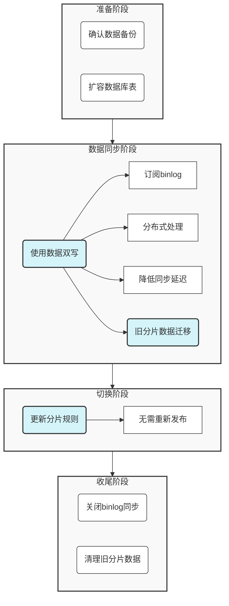

## 前言

随着业务规模的不断扩大，单一数据库的性能瓶颈日益凸显。当数据量达到一定规模，单表数据量过大或单库负载过高时，数据库的读写性能会显著下降，甚至可能导致系统不可用。分库分表技术作为解决这一问题的有效手段，已成为大型系统架构中不可或缺的一部分。

本文从电商系统业务实战场景出发，以`GoFrame`框架和`MySQL`数据库为例，详细介绍针对业务数据库分库分表的设计思路和具体实现方法，帮助开发者轻松应对大数据量挑战。

## 分库分表的业务场景

### 什么是分库分表？

分库分表是指按照某种规则，将数据库中的一张表分散到不同的数据库或多张表中，以解决单库单表数据量过大带来的性能问题。

- **分库**：将数据分散到不同的数据库实例中，主要解决数据库连接资源有限、单机磁盘空间有限、单机计算能力有限等问题。
- **分表**：将数据分散到同一个数据库的多张表中，主要解决单表数据量过大导致的查询效率低下问题。

### 适用场景

分库分表技术适用于以下业务场景：

1. **用户系统**：大型互联网应用的用户数据，可按用户ID进行分片，将用户数据分散到多个库表中。
2. **订单系统**：电商平台的订单数据，可按订单ID或时间维度分片，应对高并发订单处理。
3. **日志系统**：系统日志、操作日志等数据量巨大且增长迅速的场景，通常按时间维度分片。
4. **社交媒体**：社交平台的用户关系、内容数据，可按用户ID或内容ID分片。
5. **物联网应用**：海量设备产生的数据，可按设备ID或时间分片。

### 分库分表的必要性

1. **性能提升**：通过减少单表数据量，降低索引深度，提高查询效率；分散数据库压力，提高并发处理能力。
2. **突破限制**：突破单机数据库在存储容量、连接数、计算能力等方面的限制。
3. **高可用性**：分库可以实现数据库级别的故障隔离，提高系统整体可用性。
4. **扩展性**：随着业务增长，可以通过增加数据库节点或表的方式实现水平扩展。
5. **便于维护**：可以按照分片单独进行备份、恢复和归档操作，简化数据库维护工作。

## 电商订单系统案例

下面我们以一个电商订单系统为例，详细介绍如何使用`GoFrame`框架实现分库分表。

### 业务需求分析

假设我们的电商平台每天产生大量订单数据，随着业务增长，单表已无法承载，需要进行分库分表设计。

**订单表结构**：
- 订单ID：唯一标识
- 用户ID：下单用户
- 订单金额：订单总金额
- 订单状态：订单当前状态
- 创建时间：订单创建时间
- 更新时间：订单更新时间

**业务特点**：
- 订单数据量大且增长迅速
- 查询多基于订单ID和用户ID
- 历史订单查询频率较低，但需要长期保存
- 系统需要支持快速扩容

### 分库分表方案设计

基于业务特点，我们采用以下分库分表策略：

1. **分库策略**：**按用户ID取模分库**，将不同用户的订单分散到不同的数据库实例中
2. **分表策略**：**按订单创建时间按月分表**，便于历史数据归档和查询优化

**分库分表结构**：
- 分库：`db_0, db_1`（按用户ID取模）
- 分表：`order_202501, order_202502, ...`（按月份命名）

### 技术实现

#### 1. 数据库准备

首先，需要提前创建分库和相应的表结构：

```sql
-- 创建分库
CREATE DATABASE IF NOT EXISTS `db_0`;
CREATE DATABASE IF NOT EXISTS `db_1`;

-- 在每个分库中创建按月分表（以2025年1月和2月为例）
USE `db_0`;
CREATE TABLE `order_202501` (
  `order_id` varchar(32) NOT NULL COMMENT '订单ID',
  `user_id` int(11) NOT NULL COMMENT '用户ID',
  `amount` decimal(10,2) NOT NULL COMMENT '订单金额',
  `status` tinyint(4) NOT NULL COMMENT '订单状态',
  `create_time` datetime NOT NULL COMMENT '创建时间',
  `update_time` datetime NOT NULL COMMENT '更新时间',
  PRIMARY KEY (`order_id`),
  KEY `idx_user_id` (`user_id`),
  KEY `idx_create_time` (`create_time`)
) ENGINE=InnoDB DEFAULT CHARSET=utf8mb4 COMMENT='2025年1月订单表';

CREATE TABLE `order_202502` (
  `order_id` varchar(32) NOT NULL COMMENT '订单ID',
  `user_id` int(11) NOT NULL COMMENT '用户ID',
  `amount` decimal(10,2) NOT NULL COMMENT '订单金额',
  `status` tinyint(4) NOT NULL COMMENT '订单状态',
  `create_time` datetime NOT NULL COMMENT '创建时间',
  `update_time` datetime NOT NULL COMMENT '更新时间',
  PRIMARY KEY (`order_id`),
  KEY `idx_user_id` (`user_id`),
  KEY `idx_create_time` (`create_time`)
) ENGINE=InnoDB DEFAULT CHARSET=utf8mb4 COMMENT='2025年2月订单表';

-- 同样在db_1中创建相同结构的表
USE `db_1`;
CREATE TABLE `order_202501` (
  -- 与db_0中的表结构相同
);

CREATE TABLE `order_202502` (
  -- 与db_0中的表结构相同
);
```

#### 2. 数据库配置

在`config.yaml`中配置多数据库连接：

```yaml
database:
  default:
    link: "mysql:root:password@tcp(127.0.0.1:3306)/default"
    debug: true
  db_0:
    link: "mysql:root:password@tcp(127.0.0.1:3306)/db_0"
    debug: true
  db_1:
    link: "mysql:root:password@tcp(127.0.0.1:3306)/db_1"
    debug: true
```

#### 3. 自定义分库分表规则

我们需要实现自定义的分库分表规则，支持 **按用户ID分库** 和 **按时间分表**：

```go
// ShardingValue 分片值
type ShardingValue struct {
    UserId     int64       
    CreateTime time.Time
}

// OrderShardingRule 订单分片规则
type OrderShardingRule struct {
    SchemaCount int64 // 分库数量
}

// 实现ShardingRule接口中的SchemaName方法
func (r *OrderShardingRule) SchemaName(
    ctx context.Context, config gdb.ShardingSchemaConfig, value any,
) (string, error) {
    if r.SchemaCount <= 0 {
        return "", gerror.New("schema count should be greater than 0")
    }
    // 获取用户ID
    sv, ok := value.(ShardingValue)
    if !ok {
        return "", gerror.New("invalid sharding value")
    }
    userId := sv.UserId
    if userId <= 0 {
        return "", gerror.New("invalid user_id for sharding")
    }
    // 按用户ID取模确定分库
    schemaIndex := userId % int64(r.SchemaCount)
    return fmt.Sprintf("%s%d", config.Prefix, schemaIndex), nil
}

// 实现ShardingRule接口中的TableName方法
func (r *OrderShardingRule) TableName(
    ctx context.Context, config gdb.ShardingTableConfig, value any,
) (string, error) {
    // 获取订单创建时间
    sv, ok := value.(ShardingValue)
    if !ok {
        return "", gerror.New("invalid sharding value")
    }
    createTime := sv.CreateTime
    if createTime.IsZero() {
        return "", gerror.New("invalid create_time for sharding")
    }
    // 按月份确定分表
    tableName := fmt.Sprintf(
        "%s%d%02d", config.Prefix, createTime.Year(), createTime.Month(),
    )
    return tableName, nil
}
```

#### 4. 订单模型定义

订单模型关联订单数据表结构，用于操作数据表。

```go
// Order 订单模型
type Order struct {
    OrderId    string      `json:"order_id"    dc:"订单ID"`
    UserId     int64       `json:"user_id"     dc:"用户ID"`
    Amount     float64     `json:"amount"      dc:"订单金额"`
    Status     int         `json:"status"      dc:"订单状态"`
    CreateTime time.Time   `json:"create_time" dc:"创建时间"`
    UpdateTime time.Time   `json:"update_time" dc:"更新时间"`
}
```

#### 5. 订单服务实现

订单服务的核心逻辑，为了简化示例，这里只列举了几个关键方法的代码实现。

```go
func NewOrderService() *OrderService {
    orderModel := g.DB().Model("order")
    shardingConfig := gdb.ShardingConfig{
        // 分库配置
        Schema: gdb.ShardingSchemaConfig{
            Enable: true,  // 启用分库
            Prefix: "db_", // 分库前缀
            Rule:   &sharding.OrderShardingRule{SchemaCount: 2}, // 分库规则
        },
        // 分表配置
        Table: gdb.ShardingTableConfig{
            Enable: true,     // 启用分表
            Prefix: "order_", // 分表前缀
            Rule:   &sharding.OrderShardingRule{SchemaCount: 2}, // 分表规则
        },
    }
    return &OrderService{
        orderModel: orderModel.Sharding(shardingConfig),
    }
}

// CreateOrder 创建订单
func (s *OrderService) CreateOrder(ctx context.Context, userId int64, amount float64) (string, error) {
    // 生成订单ID，分库分表后不能使用自增id
    orderId := grand.S()
    
    // 创建订单对象
    now := gtime.Now()
    order := model.Order{
        OrderId:    orderId,
        UserId:     userId,
        Amount:     amount,
        Status:     StatusPending, // 常量表示待支付
        CreateTime: now,
        UpdateTime: now,
    }

    // 创建分库分表模型
    model := s.orderModel.ShardingValue(ShardingValue{
        UserId:     order.UserId,
        CreateTime: order.CreateTime,
    })

    // 插入订单数据
    if _, err := model.Data(order).Insert(); err != nil {
        return "", err
    }

    return orderId, nil
}

// GetOrderById 根据订单ID查询订单
func (s *OrderService) GetOrderById(ctx context.Context, orderId string, userId int64, createTime time.Time) (*model.Order, error) {
    // 创建分库分表模型
    model := s.orderModel.ShardingValue(ShardingValue{
        UserId:     userId,
        CreateTime: createTime,
    })

    // 查询订单
    var order model.Order
    err := model.Where("order_id", orderId).Scan(&order)
    if err != nil {
        return nil, err
    }

    return &order, nil
}

// 其他订单相关方法...
```

#### 6. 订单接口实现

```go
// CreateReq 创建订单请求参数
type CreateReq struct {
    UserId int64   `v:"required|min:1#用户ID不能为空|用户ID必须大于0"`
    Amount float64 `v:"required|min:0.01#订单金额不能为空|订单金额必须大于0"`
}

// CreateRes 创建订单返回结果
type CreateRes struct {
    OrderId string `json:"orderId"`
}

// CreateOrder 创建订单
func (c *OrderController) CreateOrder(ctx context.Context, req *CreateReq) (res *CreateRes, err error) {
    orderId, err := c.orderService.CreateOrder(ctx, req.UserId, req.Amount)
    if err != nil {
        return nil, err
    }
    return &CreateRes{OrderId: orderId}, nil
}

// GetReq 获取订单详情请求参数
type GetReq struct {
    OrderId    string `v:"required#订单ID不能为空"`
    UserId     int64  `v:"required|min:1#用户ID不能为空|用户ID必须大于0"`
    CreateTime string `v:"required#创建时间不能为空"`
}

// GetRes 获取订单详情返回结果
type GetRes struct {
    *model.Order // 嵌入订单实体
}

// GetOrder 获取订单详情
func (c *OrderController) GetOrder(ctx context.Context, req *GetReq) (res *GetRes, err error) {
    order, err := c.orderService.GetOrderById(ctx, req.OrderId, req.UserId, req.CreateTime)
    if err != nil {
        return nil, err
    }

    return &GetRes{Order: order}, nil
}

// 其他API接口实现...
```

### 数据扩容

如果分库分表后，随着业务规模的增长，当前的数据库设计已经无法满足需求，还需要进行数据扩容，怎么做？

为了数据扩容操作对业务的影响降到最低，可以参考以下操作步骤，个人建议、仅作参考：

1. **确认数据备份**：保证现有数据至少有一份存档。比如冷备数据。
2. **扩容数据库表**：以当前业务场景为例，由于数据表本来就是按照日期滚动分表的，我们需要进一步扩容数据库。预估业务增长速度，进而评估扩容后的数据库表数量。
3. **使用数据双写**：在扩容期间，新写入的数据同时写入新旧分片。
    - 具体方式可以通过订阅旧分片的`binlog`，实现异步将数据按照新的分片规则重新散列。
    - 订阅程序需要分布式处理，提高`binlog`处理效率，降低同步延迟可能带来的业务影响。
    - 这种方案非常适合读多写少的业务场景。
4. **旧分片数据迁移**：将历史数据从旧分片迁移到新分片（不删除旧分片数据）。如果一开始使用了一致性哈希的设计，那么这里受影响的分片将只有一部分。
5. **更新分片规则**：更新分片规则，程序将使用到新的分片进行数据读写。分片规则中的核心参数如分片数通常可以通过配置来管理，这样无需重新编译发布程序服务。
6. **关闭数据同步**：关闭`binlog`同步，让程序按照新的分片规则自动维护数据读写。
7. **清理旧分片数据**：在确认新分片规则下数据完整后，可以安全地清理旧分片规则所映射的分片数据。

下图展示了数据扩容的完整流程：



图中展示了分库分表扩容的四个主要阶段：准备阶段、数据同步阶段、切换阶段和收尾阶段。其中：

- 浅灰色背景的方块表示主要阶段
- 浅蓝色背景的节点表示关键操作（数据双写、数据迁移和更新分片规则）
- 白色背景的节点表示具体的执行步骤

数据同步和切换是最关键的环节，需要特别注意。


## 分库分表实现中的关键点

### 1. 主键设计

在分库分表环境中，主键设计是一个核心问题：

- **避免使用自增ID**：不同分片的自增ID会产生冲突，导致主键重复
- **全局唯一ID**：应使用全局唯一ID生成策略，如：
  - **UUID**：全局唯一但无序，索引效率较低
  - **雪花算法(Snowflake)**：Twitter开源的分布式ID生成器，能保证全局唯一且有序
  - **号段模式**：预先分配一段ID区间，用完再申请新区间
  - **Redis自增**：利用Redis的原子操作生成全局递增ID

在我们的示例中，订单ID采用了字符串类型，当然也可以使用雪花算法等方案生成全局唯一ID。

### 2. 分片键选择

分片键的选择直接影响分库分表的效果和性能：

- **选择高频查询条件**：分片键应该是查询中经常使用的字段，以减少跨分片查询。
- **数据分布均匀**：分片键的值应该分布均匀，避免数据倾斜。
- **不易变更**：分片键一旦确定，变更成本很高，应选择不易变更的字段。

在我们的案例中，**用户ID作为分库键，创建时间作为分表键**，这样既能保证查询效率，又能实现数据均匀分布。

### 3. 跨分片查询处理

跨分片查询是分库分表实现中的难点，主要有以下处理方法：

- **避免跨分片查询**：通过合理设计分片策略，尽量避免跨分片查询。
- **分片聚合**：对多个分片的查询结果在应用层进行聚合处理。

在我们的案例中，通过要求数据库操作时必须提供用户ID和创建时间，避免了跨分片查询的问题。

### 4. 索引设计

分库分表环境下的索引设计需要特别注意：

- **分片键索引**：分片键必须建立索引，以提高路由效率。
- **冗余索引控制**：过多的索引会影响写入性能，应控制索引数量。

### 5. SQL兼容性

分库分表环境下，某些SQL操作会受到限制：

- **JOIN操作受限**：跨分片JOIN操作性能较差，应尽量避免。
- **排序和分页**：跨分片排序和分页需要在应用层处理。
- **聚合函数**：避免在业务中涉及COUNT、SUM等跨多分片的聚合函数设计和使用。
- **事务范围**：单个事务应尽量限制在同一个分片内。

### 6. 动态扩容

随着业务规模增长，分库分表系统需要支持动态扩容能力，以应对不断增长的数据量：

- **一致性哈希算法**：使用一致性哈希算法进行分片，当增加新节点时，只需要迁移部分数据，而不是全量重新分片。

- **平滑迁移策略**：实现在线数据迁移，不影响系统正常运行。常见策略包括：
  - **双写模式**：在迁移期间，新写入的数据同时写入新旧分片。
  - **归档迁移**：先迁移历史数据，再处理增量数据。
  - **分批迁移**：将数据分批次迁移，降低单次迁移对系统的影响。

- **动态路由规则**：支持在不重启系统的情况下动态更新路由规则，实现平滑切换。

- **容量规划**：提前规划分片容量，预留足够的扩展空间，避免频繁扩容。

> 在`GoFrame`中，可以通过配置文件和分片规则的动态加载来支持动态扩容。例如，当需要增加新的分库时，可以在配置中添加新的数据源，并更新分片规则中的分库数量。


## 最佳实践

基于上述分析和实践经验，总结以下分库分表的最佳实践：

1. **提前规划**：在系统设计初期就考虑分库分表方案，避免后期改造成本过高。
2. **合理选择分片键**：分片键应具备查询高频、分布均匀、不易变更的特点。
3. **全局唯一ID**：使用雪花算法等方案生成全局唯一ID，替代自增主键。
4. **避免跨分片操作**：业务设计应尽量避免跨分片查询、排序和事务。
5. **冗余适当数据**：适当冗余关联数据，减少跨分片JOIN操作。
6. **应用层聚合**：复杂查询在应用层进行结果聚合和处理。
7. **异步处理**：非实时性要求的操作采用异步处理机制。
8. **容量规划**：提前规划扩容策略，预留足够的扩展空间。
9. **监控与告警**：建立完善的监控系统，及时发现分片异常、资源紧张等问题。

## 总结

本文通过电商订单系统的案例，详细介绍了使用`GoFrame`实现`MySQL`数据库分库分表的完整解决方案。分库分表作为应对大数据量挑战的有效手段，能够显著提升系统性能和可扩展性。

在实际应用中，应根据业务特点和数据特性，选择合适的分片策略，并妥善处理跨分片查询、分布式事务等问题。`GoFrame`框架提供的分库分表功能，简化了实现过程，使开发者能够更加专注于业务逻辑的实现。

随着业务的发展，可能需要进一步优化分库分表方案，如引入分布式ID生成器、增加缓存层、实现动态扩容等，以满足不断增长的业务需求。

## 参考资料

1. `GoFrame`官方文档：[ORM分库分表](https://goframe.org/docs/core/gdb-sharding)
2. 数据库分库分表原理与实践
3. 大型互联网应用数据库架构设计与优化
